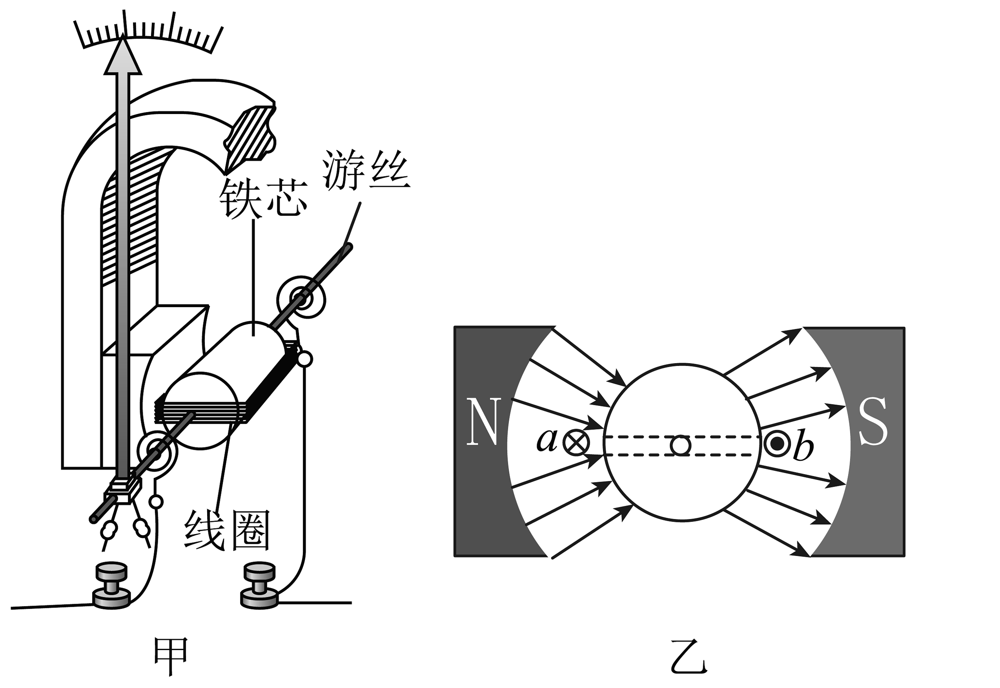

# 万用表表头的工作原理

## 一、指针式万用表概述

指针式万用表（Analog Multimeter）的核心是一个**磁电系电流计**（Galvanometer），俗称**表头**。表头本质上是一个高灵敏度电流检测装置——当微小电流流过其内部线圈时，指针即产生偏转，偏转角度与电流大小成正比。

在万用表中，表头通过外接不同的**分流电阻**和**分压电阻**扩展成多量程的电流表、电压表、欧姆表。但无论哪种测量功能，最终驱动指针偏转的都是流过表头动圈的微弱直流电流（通常为 50 μA 或 100 μA 满偏）。

本仿真项目聚焦表头本身，展示其内部结构、物理原理和动态响应过程。

---

## 二、表头的物理结构

| 部件 | 作用 | 仿真渲染中的表现 |
|------|------|------------------|
| **永磁体**（N/S 极） | 在气隙中产生恒定径向磁场 | 左右两侧的蓝色（N）/红色（S）磁钢块 |
| **软磁铁心** | 使气隙磁场均匀、径向分布 | 磁路中央的圆柱体 |
| **动圈**（线圈绕在铝框上） | 通电后在磁场中受安培力产生转矩 | 气隙中的矩形框（带多匝导线示意） |
| **游丝**（螺旋弹簧） | 产生与偏转角度成正比的弹性反力矩 | 轴心上方的螺旋线，随偏转扭紧/松 |
| **指针** | 将角位移放大并指示在刻度盘上 | 从轴心向上伸展的细长指针 |
| **阻尼系统**（铝框 + 阻尼片） | 抑制指针振荡，使其快速稳定在读数位置 | 矩形铝框（感应电流阻尼） |
| **调零旋钮** | 改变游丝外端固定点角度，补偿零位偏移 | 底部的可旋转圆盘，带红色指示线 |



### 2.1 永磁体与气隙磁场

N/S 极靴之间形成一个圆柱形气隙，气隙中央放置软磁铁心。这种结构使得气隙中的磁力线呈**径向均匀分布**——即磁感应强度 B 处处大小相等、方向始终指向圆心（或背离圆心）。这是保证刻度线性的关键。

### 2.2 动圈

动圈由细铜线绕制在铝质矩形骨架上，可绕中心轴在气隙中自由旋转。当被测电流 I 流过线圈时，线圈的垂直边在磁场中受到安培力：

```
F = N · B · I · L
```

其中 N 为匝数，B 为磁感应强度，L 为有效边长度。

两个垂直边受力方向相反（因电流方向相反），形成一对力偶，产生电磁转矩：

```
T_em = N · B · L · W · I = K_em · I
```

转矩 T_em 与电流 I 成正比——这就是表头线性刻度的物理基础。

### 2.3 游丝（弹性反力矩）

游丝是一个螺旋弹簧，内端固定在转轴上（随线圈旋转），外端固定在调零机构上。当线圈偏转角度 α 时，游丝产生反方向弹性力矩：

```
T_s = K · α
```

其中 K 为游丝的弹性系数（刚度）。

### 2.4 平衡条件

当电磁转矩与游丝反力矩相等时，指针停在某一角度：

```
T_em = T_s
K_em · I = K · α
α = (K_em / K) · I
```

因此 **α ∝ I**，指针偏转角与流过表头的电流呈严格的线性关系。

---

## 三、满偏规格与刻度

本仿真表头采用工业仪表通用的 **50 μA / 2000 Ω** 规格：

| 参数 | 值 | 含义 |
|------|----|------|
| 满偏电流 I_fs | 50 μA | 通入 50 μA 时指针摆到最右端 |
| 内阻 R_i | 2000 Ω | 线圈直流电阻 |
| 满偏偏角 α_fs | 120° | 从左端（210°）到右端（330°）共 120° |
| 刻度范围 | 0~50 μA | 外层主刻度，间隔 10 μA 标数字 |
| 内层百分刻度 | 0~100% | 配合不同量程档位使用 |

### 刻度换算

```
I_n  = I / I_fs        归一化电流（0~1）
α_eq = α_fs · I_n     平衡偏角
```

例如 25 μA 时：I_n = 0.5，α_eq = 60°，指针指在正中间。

---

## 四、调零原理

实际仪表中，游丝老化、温度变化或机械位移会导致零位偏移——即输入为零时指针不指零。为此设置了**调零旋钮**：通过机械机构改变游丝外端固定点的角度 φ_zero。

物理上这相当于给游丝施加一个初始预扭：

```
T_s = K · (α − φ_zero)
```

平衡条件变为：

```
K_em · I = K · (α − φ_zero)
α = (K_em / K) · I + φ_zero
```

当 I = 0 时，α = φ_zero，指针对应角度即为 φ_zero。

本仿真中调零范围为 ±5°，对应游丝外端固定点偏移 ±5×12 = ±60°（旋钮旋转角度）。

---

## 五、动态响应

指针不能瞬间到达平衡位置——它受到惯性（转动惯量 J）、阻尼（系数 D）和弹性（游丝刚度 K）的共同作用，表现为**二阶弹簧-阻尼系统**：

```
J · α'' + D · α' + K · α = T_em(t)
```

### 5.1 阻尼来源

- **空气阻尼**：指针和阻尼片在空气中运动受到的粘滞阻力
- **感应电流阻尼**：铝框在磁场中旋转时切割磁力线产生涡流，涡流再在磁场中受力，方向与运动方向相反（楞次定律）

### 5.2 阻尼比

阻尼比 ζ = D / (2·√(J·K)) 决定响应形态：

| ζ 范围 | 状态 | 特性 |
|--------|------|------|
| ζ < 1 | 欠阻尼 | 指针在平衡位置来回振荡数次后稳定 |
| ζ = 1 | 临界阻尼 | 最快达到稳定，无振荡 |
| ζ > 1 | 过阻尼 | 缓慢蠕动到平衡位置 |

实际万用表表头设计在 ζ ≈ 0.7~1.0（接近临界阻尼），本仿真采用一阶惯性近似模拟其效果。

### 5.3 仿真中的数值实现

为避免离散二阶积分的数值不稳定性，本仿真用**一阶指数滤波**近似指针跟随：

```javascript
const tau = this._rampTime * 0.5;      // 时间常数
const alpha = 1 - Math.exp(-dt / tau); // 滤波系数
this._needleAngle += (targetAngle - this._needleAngle) * alpha;
```

其中 `rampTime` 默认 0.25s，可由用户调整。

---

## 六、电路背景（本仿真工程）

本仿真搭建了一个最简单的串联电路来驱动表头：

```
直流电源 (0~5V) —— 限流电阻 (98 KΩ) —— 表头 (2 KΩ) —— GND
                                              ↑
                                        内阻 2000 Ω
```

### 参数计算

```
总电阻 R_total = 98 KΩ + 2 KΩ = 100 KΩ
满偏电压 U_fs  = I_fs × R_total = 50 μA × 100 KΩ = 5 V
```

当电源电压从 0V 逐步调至 5V 时：

| 电源电压 | 电路电流 | 指针偏角 | 表头端电压 |
|----------|----------|----------|------------|
| 0 V      | 0 μA     | 0°       | 0 V        |
| 1 V      | 10 μA    | 24°      | 0.02 V     |
| 2 V      | 20 μA    | 48°      | 0.04 V     |
| 3 V      | 30 μA    | 72°      | 0.06 V     |
| 4 V      | 40 μA    | 96°      | 0.08 V     |
| 5 V      | 50 μA    | 120°     | 0.10 V     |

工具栏的**电压滑块**直接控制直流电源输出电压，表头指针实时响应。

---

## 七、本仿真项目实现要点

### 7.1 文件结构

| 文件 | 作用 |
|------|------|
| `components/GalvanometerHead.js` | 表头组件（813 行），含绘制、物理、交互、tick |
| `project/meterhead.js` | 工程配置：电路元件布局、预设连线、工具栏滑块控制 |
| `tools/CircuitSolver.js` | 改进节点分析法（MNA）电路求解器 |
| `consys.js` | ControlSystem 总控：20fps 仿真循环 |

### 7.2 组件端口

表头在电气上被建模为一个**电阻**（`type = 'resistor'`），以便电路求解器自动计算其电流：

```javascript
this.type = 'resistor';
this.currentResistance = 2000;  // 内阻
this.addPort(x, y, 'l', 'wire', 'p');  // 正极端口
this.addPort(x, y, 'r', 'wire', 'n');  // 负极端口
```

端口命名为 `{id}_wire_l` 和 `{id}_wire_r`，与求解器中的电阻设备分类匹配，自动参与 MNA 矩阵求解。

### 7.3 电流计算流程

每帧（20fps）调用 `tick(dt)`：

1. 从 `CircuitSolver.getVoltageAtPort()` 读取端口电压
2. 计算 `I = (V_l − V_r) / 2000 Ω`
3. 将电流限制在 0~50 μA 范围
4. 电流通过一阶滤波软化跳变
5. 滤波后的电流传入 `_updateDynamic()` 驱动指针

### 7.4 指针角度映射

```
0 μA  → 210°（最左端）
50 μA → 330°（最右端）
```

中间线性插值：

```javascript
_calcNeedleAngle(I_uA) {
    const frac = Math.max(0, Math.min(1, I_uA / 50));
    const startDeg = this._needleCenter - this._needleHalf;  // 270 - 60 = 210
    return startDeg + frac * 2 * this._needleHalf + this._zeroAdj;
}
```

### 7.5 游丝动态重绘

游丝每帧根据当前偏角重绘，内端跟随线圈旋转，外端跟随调零设置：

```javascript
const innerAng = alpha_deg * Math.PI / 180;           // 内端（线圈）
const outerAng = this._zeroAdj * Math.PI / 180;       // 外端（调零）
// 3.5 圈螺旋，从内到外渐变角度和半径
```

颜色随扭转程度从暗蓝渐变到亮蓝，直观反映扭紧程度。

### 7.6 调零交互

拖动调零旋钮时，`cancelBubble` 阻止事件冒泡到父级拖拽，仅旋转旋钮并改变 `_zeroAdj`，从而影响指针零位和游丝外端角度。范围 ±5°，灵敏度 0.18°/像素。

---

## 八、总结

| 原理 | 对应仿真实现 |
|------|-------------|
| 电磁转矩 T_em ∝ I | `currentResistance = 2000Ω`，端口电压差 → I → _calcNeedleAngle |
| 游丝反力矩 T_s ∝ α | 游丝螺旋 + _hairspringGroup.rotation |
| 平衡时 α ∝ I（线性刻度） | 刻度算术弧 + 数字标签，间隔均匀 |
| 阻尼（防止振荡） | 一阶指数滤波 `alpha = 1 − exp(−dt/τ)` |
| 调零（改变游丝外端固定点） | `_zeroAdj` → _calcNeedleAngle + 游丝 outerAng |
| 2000Ω 内阻 | 在 MNA 矩阵中被分类为 resistor，自动求解 |

通过本仿真可以直观理解：万用表表头就是一个**将电流线性转换为指针角位移的机电装置**，其核心在于永磁体提供的均匀径向磁场、游丝提供的线性反力矩、以及两者平衡得到的线性刻度。
