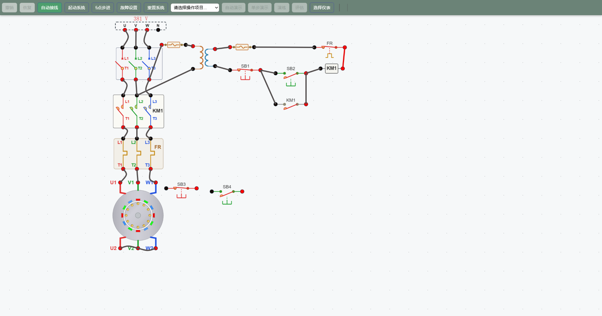
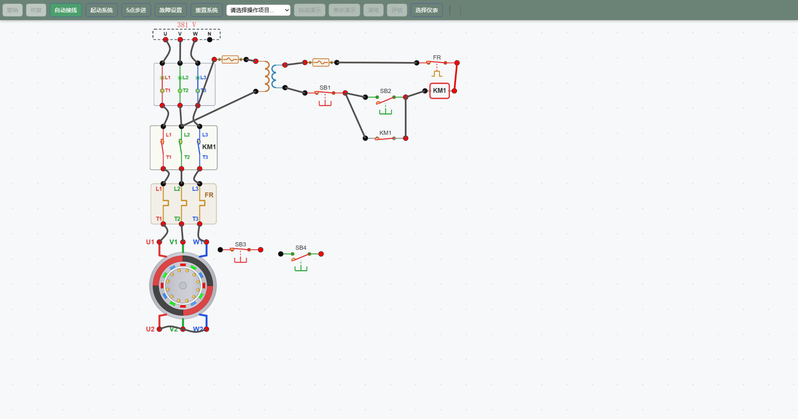
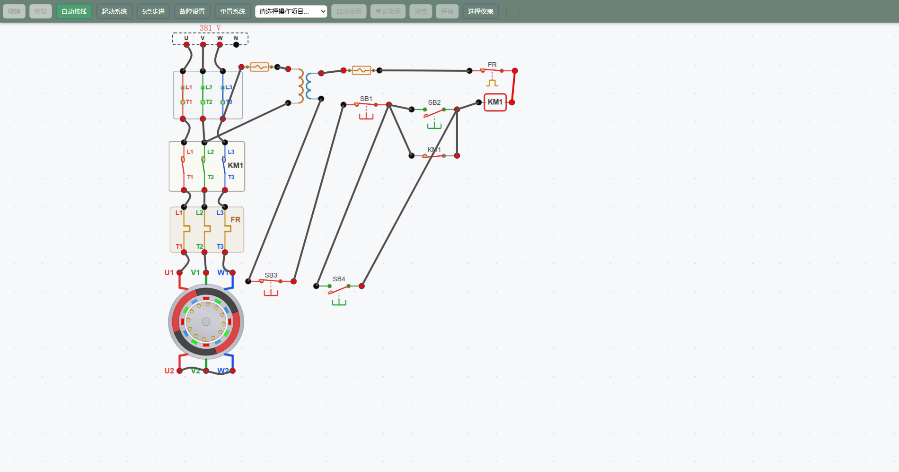
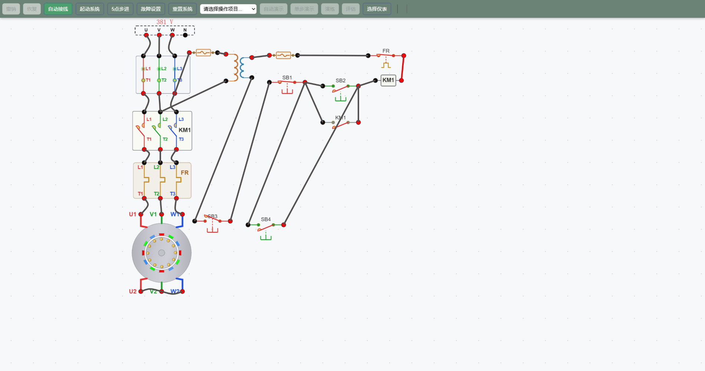
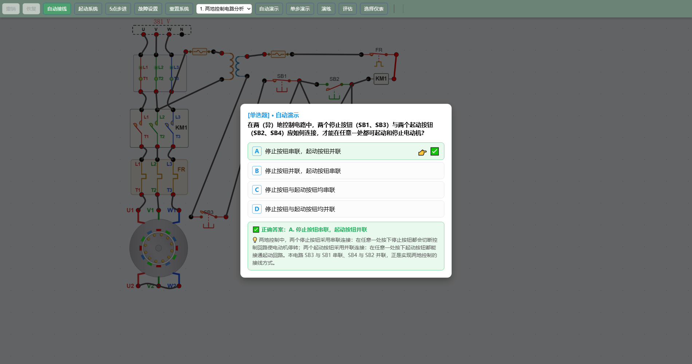

# 典型控制电路1——连续控制带两地控制

## 一、实验目的

1. 理解三相异步电动机**连续控制（自锁控制）**电路的工作原理；
2. 掌握**两地控制**的实现方法：停止按钮串联、起动按钮并联的接线规则；
3. 熟悉断路器 QF、交流接触器 KM1、热继电器 FR1、按钮 SB1~SB4 等低压电器的功能与作用；
4. 学会在仿真平台上完成接线、起动、停止与两地操作的全流程。

## 二、电路总体结构

本电路由**主回路**与**控制回路**两部分组成，如下图所示。

### 主回路（动力回路）

三相电源 L1/L2/L3 → 断路器 QF → 交流接触器主触头 KM1 → 热继电器发热元件 FR1 → 三相异步电动机 M（U1/V1/W1 进线，U2/V2/W2 出线接星形）。

- **QF**：电源总开关，接通/分断整个电路；
- **KM1 主触头**：由接触器线圈控制，实现电动机的接通与断开；
- **FR1 发热元件**：过载时动作，切断电动机供电，起过载保护作用。

### 控制回路（二次回路）

控制变压器 TC（380V→220V）副边 → 熔断器 FU4 → **停止按钮支路（SB1 与 SB3 串联）** → **起动支路（SB2 与 SB4 并联，再并联 KM1 自锁常开触点）** → 接触器线圈 KM1 → 热继电器常闭触点 FR1-NC → 熔断器 FU5 → 返回变压器副边。

## 三、连续控制（自锁）原理

按下起动按钮 SB2 时，控制回路接通，接触器线圈 KM1 得电：

1. KM1 **主触头闭合**，电动机接入三相电源开始起动；
2. KM1 **辅助常开触点（自锁触点）闭合**，与 SB2 **并联**。此时即使松开 SB2，电流仍可经自锁触点维持线圈得电，电动机持续运转——这就是**连续控制（自锁）**；
3. 按任何一路**停止按钮**（SB1 或 SB3），控制回路断电，KM1 释放，电动机停止。因自锁触点已断开，松开停止按钮后电动机也不会自行恢复起动。

> 提示：自锁触点是"连续控制"的核心，没有它电路就退化为只能点动运行。

## 四、两地控制原理与接线规则

两地控制是指**在两个不同地点都可以分别完成电动机的起动与停止**。其实现方法是给本地的停止、起动按钮各并联（实为串联/并联规则）一套异地按钮：

- **两个停止按钮 SB1、SB3 —— 串联**：任一（地）停止按钮被按下，都会切断整个控制回路的电流通路，电动机立即停转，且相互之间"或"的关系（一个断则全断）；
- **两个起动按钮 SB2、SB4 —— 并联**：任一（地）起动按钮被按下，都能将控制回路接通，使电动机起动，且相互之间"或"的关系（一个通则全通）。

上图即完成两地接线的状态：SB3 已串入变压器副边与 SB1 之间，SB4 已并联在 SB2 两端。

| 地点 | 停止按钮 | 起动按钮 | 作用 |
|------|---------|---------|------|
| 本地（甲地） | SB1 | SB2 | 起动/停止电动机 |
| 异地（乙地） | SB3 | SB4 | 同地起动/停止电动机 |
| 连接方式 | SB3 与 SB1 **串联** | SB4 与 SB2 **并联** | 两地冗余控制 |

## 五、实验流程（仿真 7 步）

### 第 1 步：接线、合闸、起动

点击**自动接线**完成全部连线；合上电源开关 **QF**（见下图）；按下本地起动按钮 **SB2**，观察 KM1 吸合、电动机起动并自锁持续运转。

### 第 2 步：本地停止

按下停止按钮 **SB1**，控制回路断电，KM1 释放，电动机停转。确认松开 SB1 后电动机不会自行运转。

### 第 3 步：串联接入异地停止按钮 SB3

先断开"控制变压器副边 → SB1"的连线，将 **SB3 与 SB1 串联**接入（变压器副边 → SB3 → SB1），实现第一个异地停止点。

### 第 4 步：并联接入异地起动按钮 SB4

将 **SB4 与 SB2 并联**（SB1 输出 → SB4 → SB2 输出），实现第一个异地起动点。至此两地控制接线完成。

### 第 5 步：异地起动

在乙地按下起动按钮 **SB4**，观察电动机起动；松开 SB4 后因自锁保持，电动机持续运转。

### 第 6 步：异地停止

在乙地按下停止按钮 **SB3**（见下图），控制回路切断，KM1 失电释放，电动机停转。

### 第 7 步：原理测试

完成测试题，验证对两地控制接线规则的掌握（下图）。

## 六、常见故障排查

- **电动机不能起动**：检查 QF 是否合闸、按钮连线是否正确、KM1 线圈是否得电、热继电器常闭触点是否复位。
- **松开起动按钮后电动机停止**：说明自锁触点（KM1-NO）支路未接通或未并联正确。
- **两地停止失效**：检查 SB3 是否真正串联进控制回路（中间任一环节断开都会全断）。

## 七、小结

- 连续控制靠 **KM1 自锁触点**维持线圈得电；
- 两地控制遵守 **"停止串联、起动并联"** 规则：停止按钮多一个、多一处断开点，起动按钮多一个、多一条起动通道；
- 各自锁、过载保护与短路保护（FU4/FU5）共同保障了电动机安全、连续、可两地操作地运行。