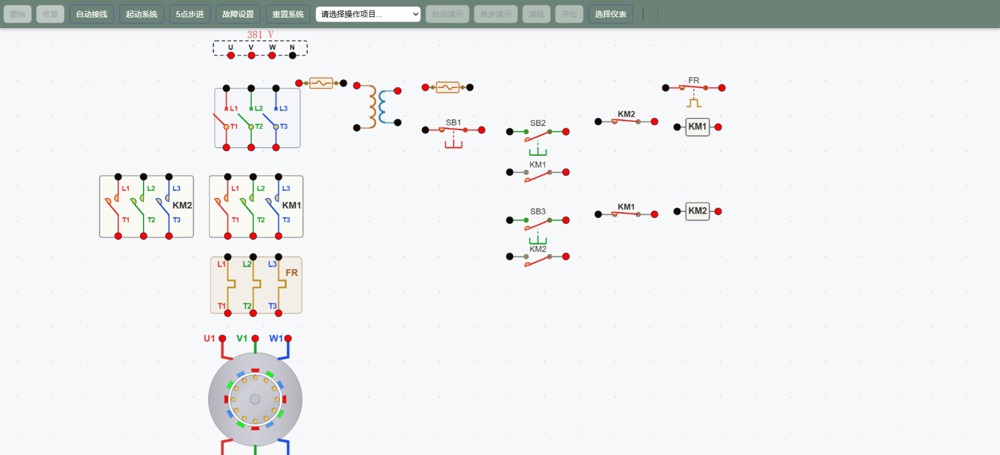
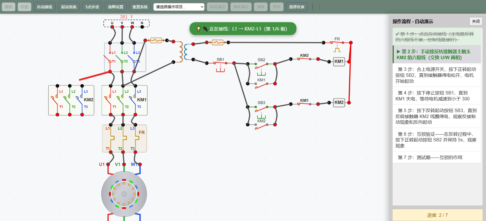
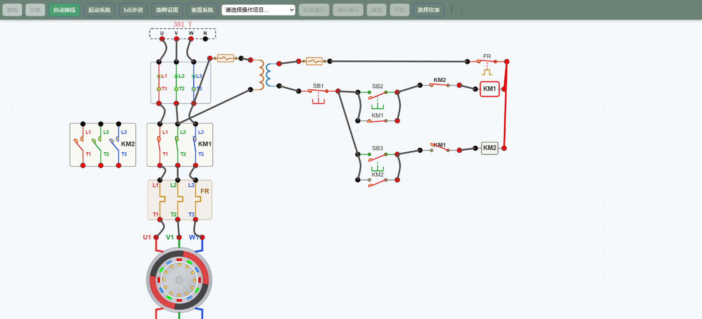
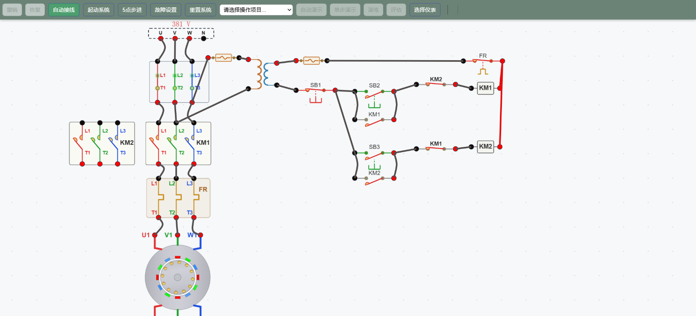
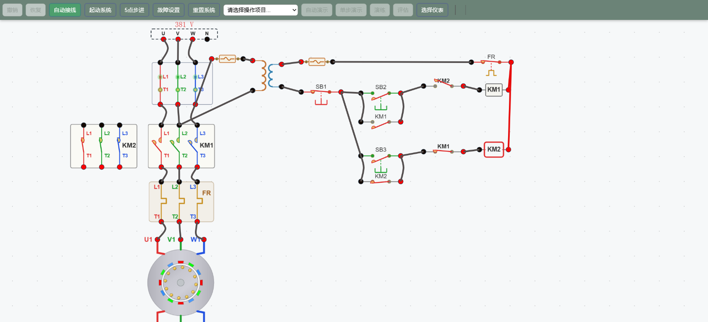

# 典型控制电路 2——三相异步电动机正反转控制

> 工业仪表与过程控制仿真教学平台 · 实验教学文档
> 配套仿真工程：`lab_06/circuit03`（典型控制电路2-正反转控制）

---

## 一、实验目的

1. 掌握三相异步电动机**正反转控制电路**的组成与工作原理。
2. 理解实现反转的**换相**（对调两相）原理。
3. 掌握接触器**自锁**（松手保持）与**电气互锁**（防止同时吸合）的作用。
4. 通过**反接制动**实验，理解改变旋转磁场方向对转子的制动作用。
5. 学会利用仿真平台进行自动接线、通电起动、运行观察与故障分析。

---

## 二、电路组成

本工程包含一台三相异步电动机的完整正反转控制电路，分为**主电路**（强电）与**控制电路**（弱电）两部分。

### 2.1 元件清单

| 符号 | 名称 | 作用 |
|------|------|------|
| QF | 空气断路器（三相） | 主电路总开关、短路保护 |
| KM1 | 正转接触器（主触头） | 接通电动机正转相序 |
| KM2 | 反转接触器（主触头） | 接通电动机反转相序 |
| FR | 热继电器（热元件+常闭触点） | 电动机过载保护 |
| M | 三相异步电动机 | 负载 |
| TC | 控制变压器 | 380V 变压为控制电压 |
| SB1 | 停止按钮（常闭） | 串于控制干路，急停 |
| SB2 | 正转起动按钮（常开） | 起动正转 |
| SB3 | 反转起动按钮（常开） | 起动反转 |
| FU | 熔断器 | 控制回路短路保护 |
| — | KM1/KM2 常开辅助触点 | 自锁 |
| — | KM1/KM2 常闭辅助触点 | 电气互锁 |



*图 1 初始界面：主电路（左上）与控制电路（右侧）的元件已就位但尚未接线。*

### 2.2 主电路

电源 → QF → **KM1/KM2 主触头（并联）** → FR 热元件 → 电动机。

- **KM1 闭合**：按原相序 U–V–W 供电，电动机**正转**。
- **KM2 闭合**：将 U、W 两相对调（变为 W–V–U）供电，旋转磁场反向，电动机**反转**。

> 只要把三相电源中**任意两相**对调，就能使旋转磁场反向，从而实现电动机反转。


*图 2 接线完成、尚未合闸状态。注意 KM1 与 KM2 输出到 FR 的两相交叉——这正是换相的关键。*

---

## 三、控制电路原理

控制电路从 TC 二次侧取电，干路串入 SB1（常闭）与 FR 常闭触点，再分正、反两支路。

### 3.1 正转支路（KM1 线圈）

```
SB1 → SB2 ‖ KM1自锁常开 → KM2常闭互锁 → KM1线圈 → FR常闭
```

- 按下 **SB2** → KM1 线圈得电 → 主触头闭合、电动机正转。
- **自锁**：KM1 常开辅助触点与 SB2 并联，松开 SB2 后线圈靠自锁触点继续保持得电。
- **互锁**：KM1 支路中串入 **KM2 常闭**触点，只要 KM2 吸合，其常闭点断开，KM1 无法得电。

### 3.2 反转支路（KM2 线圈）

```
SB1 → SB3 ‖ KM2自锁常开 → KM1常闭互锁 → KM2线圈 → FR常闭
```

- 按下 **SB3** → KM2 线圈得电 → 主触头闭合、电动机反转。
- KM2 自锁、以及 KM2 支路串入 **KM1 常闭**触点实现互锁，原理与正转对称。

> **互锁的意义**：若 KM1、KM2 同时吸合，其主触头会使电源两相短路、烧毁设备。电气互锁保证**任意时刻只有一个接触器吸合**。

---

## 四、实验操作与现象（自动演示七步）

点击工具栏 **自动演示**，平台按以下七步引导操作：



*图 3 自动演示面板：第 1 步自动接线已完成，第 2 步正在逐根接 KM2 六根线。*

### 第 1 步 · 自动接线
点击 **自动接线**，平台自动接好控制回路与主电路正转部分（**故意省略 KM2 六根线**，留待手动练习）。

### 第 2 步 · 手动接 KM2 六根线（换相）
手动连接反转接触器主触头的六根线，其中 **KM2-T1→FR-L3、KM2-T3→FR-L1** 两处交叉，实现 **U/W 换相**。这是反转能否实现的关键。

### 第 3 步 · 合闸起动正转
合上电源开关 QF → 按下正转按钮 **SB2** → KM1 得电吸合 → **KM1 线圈指示灯亮红** → 电动机**正转起动**（转速从 0 上升至额定 1440 r/min 附近）。运行状态见图 4：QF 三相闭合、KM1 主触头闭合、KM1 指示灯亮、电机箭头正向旋转。



*图 4 正向起动运行：QF 合闸、KM1 吸合、电机正转，KM1 线圈及指示灯呈得电（红/亮）显示。*

### 第 4 步 · 停止
按下停止按钮 **SB1** → 控制干路断开 → KM1 失电释放（指示灯灭、主触头断开）→ 电动机**惯性减速**。注意按下瞬间 KM1 已失电，见停止状态图 5。



*图 5 停止：SB1 按下后 KM1 失电，电机进入惯性停机阶段。*

### 第 5 步 · 反转起动与反接制动
趁电动机仍高速正转时，按下反转按钮 **SB3** → KM2 得电吸合（见图 6：KM1 失电灰色、KM2 得电红色，KM2 主触头闭合、KM1 主触头断开，电机箭号转为反转）。



*图 6 反转状态：KM1 失电（灰）、KM2 得电（红/亮），KM2 主触头闭合、电机反转。*

此时发生**反接制动**：电机仍按正转方向高速旋转，但电源已为反向旋转磁场，电磁转矩与转子转向相反，产生强烈制动力矩使转子迅速减速到零，随即反向起动。

### 第 6 步 · 互锁验证
在 KM2 反转运行中，按住正转按钮 SB2 保持 5s——观察现象：**KM1 不会吸合**（因 KM2 常闭互锁点已断开），电机保持反转。这直观验证了电气互锁的功能。

### 第 7 步 · 测试题
完成一道关于**互锁作用**的选择题，检验理解：互锁通过彼此串接对方常闭触点，防止两个接触器同时吸合造成电源相间短路。

---

## 五、反接制动的原理

反接制动属于**电源反接制动**：

1. 电机以转速 n 正转运转时，突然切换电源相序（KM1→KM2），旋转磁场以同步转速反向旋转。
2. 转差率 s = (−n₁ − n)/n₁ > 1，转子导线切割反向磁场产生大电流与反向电磁转矩。
3. 反向转矩使转子强迫减速至零；若在零速附近及时切除电源，则实现制动；若继续通电，则电机反向起动。

> **特点**：制动迅速、转矩大，但冲击电流大、机械冲击强，多用于中小型设备及需要快速停车的场合。

---

## 六、保护环节

| 保护 | 元件 | 说明 |
|------|------|------|
| 短路保护 | QF、FU | 主电路用 QF，控制回路用 FU |
| 过载保护 | FR 热继电器 | 过载时热元件动作，其常闭触点断开控制干路，KM1/KM2 同时失电停机 |
| 欠压/失压保护 | 接触器自锁 | 电网断电后需重新按起动按钮才能再起动 |
| 互锁保护 | KM1/KM2 常闭互锁 | 防止两接触器同时吸合短路 |

---

## 七、思考与小结

**思考题**
1. 若 KM1、KM2 主触头输出接线完全一致（未换相），按 SB3 会发生什么现象？
2. 反接制动时电机的转差率 s 是多少？为什么制动力矩很大？
3. 若去掉 KM1/KM2 常闭互锁触点，同时按 SB2、SB3 会有什么后果？

**小结**
本实验通过仿真完整演示了三相异步电动机**正转、停止、反接制动、反转起动**的全过程，重点掌握了：
1. 通过**主触头换相**实现转向改变；
2. 依靠**自锁**维持连续运行、依靠**互锁**保证切换安全；
3. 利用**反接制动**实现快速停车。

---

*文档由仿真工程 `lab_06/circuit03` 生成，配图为平台关键运行状态的界面截图。*
