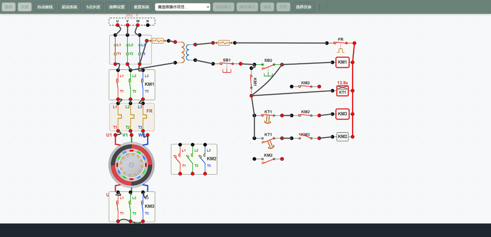
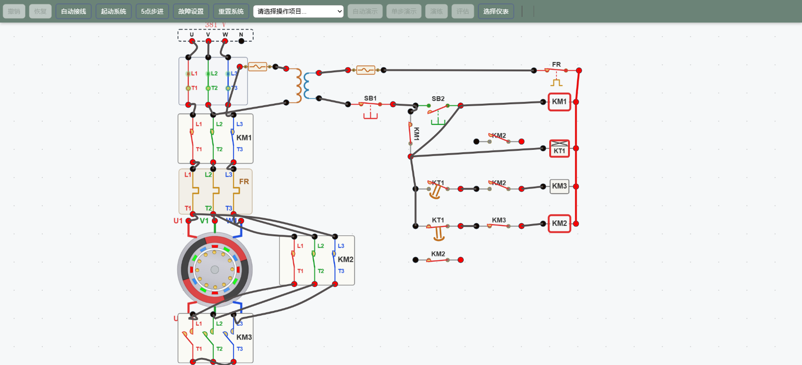
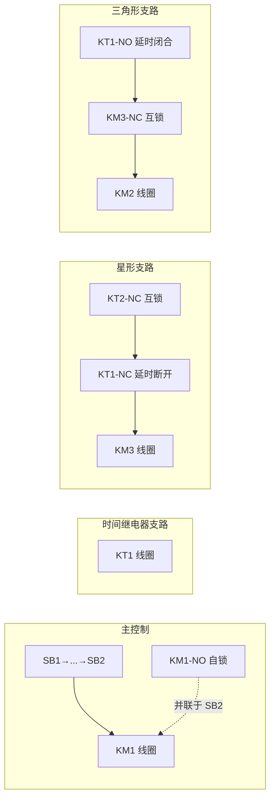
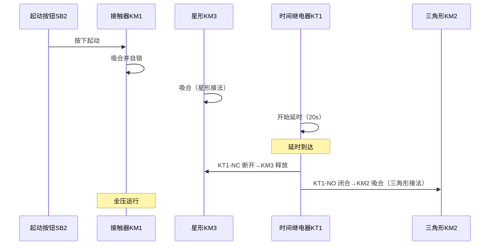

# 典型控制电路3 · 星三角降压起动

> 工业仪表与过程控制仿真教学平台 · 故障教学实验
> 工程编号：`circuit04` · 工作流：`yd-start`

## 一、实验目的

1. 理解三相异步电动机 **星形（Y）—三角形（Δ）降压起动** 的基本原理。
2. 掌握由 **主电路 + 控制电路** 构成的星三角起动控制线路结构。
3. 学会使用**时间继电器 KT1** 实现"星形延时 → 自动切换三角形"。
4. 通过对 **改进电路** 和 **故障设置** 的分析，深入理解接触器自锁、互锁与辅助触点的作用。

---

## 二、电路原理

### 2.1 为什么需要降压起动

三相异步电动机在**直接全压起动**时，起动电流可达额定电流的 **5 ~ 7 倍**，对电网冲击大。对大功率电动机，常采用降压起动方式：**起动时先按星形接法**（绕组相电压为线电压的 1/√3），待转速升高后再**切换为三角形接法**全压运行。

> 星形起动时：相电压 `U_ph = U_L / √3`
> 星形起动电流约为三角形直接起动电流的 **1/3**，但起动转矩也降为 1/3，适用于**空载或轻载**起动。

### 2.2 主电路结构

主电路为三相 380V 电源回路，元件顺序为：

```
电源 AC 380V(U,V,W) → 断路器 QF → 接触器 KM1 主触头 → 热继电器 FR 发热元件
   → 电动机定子首端 U1 / V1 / W1
星形接触器 KM3 主触头：尾端 U2 / V2 / W2 短接成中性点
三角形接触器 KM2 主触头：首端 ↔ 尾端换接（U1-V2、V1-W2、W1-U2）
```



图 1 为星形起动瞬间画面：支持 KM1、KM3 吸合（星形短接），KM2 释放，时间继电器 KT1 处于计时状态。



图 2 为切换后的三角形运行画面：KM2 吸合、KM3 释放，KT1 延时输出，电动机绕组改为三角形接法。

### 2.3 控制电路结构

控制电源由变压器 **TC** 将 380V 降为 220V，经熔断器 **FU4/FU5** 及热继电器常闭触点 **FR-NC** 供电。控制电路由五条并联支路组成：



- **主线圈支路**：`SB2 ∥ KM1-NO 自锁 → KM1 线圈`，按钮一按、信号自保持。
- **时间继电器支路**：`KT1 线圈` 得电后开始计时。
- **星形支路**：`KM2-NC 互锁 → KT1-NC(延时断开) → KM3 线圈`，起动阶段吸合 KM3。
- **三角形支路**：`KT1-NO(延时闭合) → KM3-NC 互锁 → KM2 线圈`，延时到后吸合 KM2。

> **互锁作用**：`KM2-NC` 串联在星形支路、`KM3-NC` 串联在三角形支路，保证 KM2 与 KM3 **不可能同时吸合**，避免电源短路。

---

## 三、星三角降压起动过程

### 3.1 工作过程时序



### 3.2 阶段划分

| 阶段 | 接触器状态 | 电动机接法 | 说明 |
|------|-----------|-----------|------|
| 1. 起动瞬间 | KM1＋KM3 吸合 | **星形 Y** | 降压起动，转矩小 |
| 2. 延时过程 | 同左 | 星形 Y | KT1 计时 20s |
| 3. 转换时刻 | KT1 输出 | 星→角 | KM3 释放、KM2 吸合 |
| 4. 稳定运行 | KM1＋KM2 吸合 | **三角形 Δ** | 全压额定运行 |

---

## 四、仿真操作步骤（演示流程）

本工程内置 8 步渐进式演示流程 `yd-start`，学员可逐步观察电路搭建与工作过程：

1. **第1步 · 自动接线**：接入主回路与控制回路基础导线（38 根），三角形主触头暂不接。
2. **第2步 · 设置延时**：调出 KT1 参数设置界面，将延时由 5s 改为 **20s**，便于观察星形过程。
3. **第3步 · 星形起动**：合上 QF，按下 SB2，**待 KM1 得电吸合后再松开**，电机星形降压起动，KT1 开始延时。
4. **第4步 · 接入三角形**：待 KT1 延时到（KT1-NC 断开使 KM3 释放、KT1-NO 闭合使 KM2 吸合），手动逐根接入 6 根三角形主触头导线。
5. **第5步 · 停机**：按下 SB1，**待 KM1 失电释放后再松开**，各接触器释放、电机断电滑行。
6. **第6步 · 改进①**：断开直连，将 **KM2 常闭辅助触点 km2-nc2 串联到 KT1 线圈前**。
7. **第7步 · 改进②**：将 **KM2 常开辅助触点 km2-no1 并联到 KT1 常开延时触头两端**，实现自锁。
8. **第8步 · 完整演示**：延时改回 5s，按下 SB2，完整观察"星形起动 → 延时切换 → 三角形运行"全过程。

---

## 五、改进电路分析

### 5.1 改进①：KM2-NC 串联 KT1 线圈

在 KT1 线圈电源前串联 **KM2 常闭辅助触点**：

- 当电机处于星形阶段时，KM2 未吸合，KM2-NC 保持闭合，KT1 正常得电计时。
- 当 KT1 延时到、KM2 吸合进入三角形后，**KM2-NC 断开**，切断 KT1 线圈电源，KT1 复位为零。

> 作用：KT1 每完成一次星三角转换后自动复位，避免二次起动时延时状态残留。

### 5.2 改进②：KM2-NO 并联自锁

在 KT1 常开延时触头两端并联 **KM2 常开辅助触点**：

- KT1 延时输出令 KM2 吸合后，**KM2-NO 闭合**并保持 KM2 线圈得电。
- 即使 KT1 因断电复位（KM2-NC 断开使 KT1 失电），KM2 仍由自锁支路保持吸合状态。

> 作用：三角形状态稳定保持，不会因 KT1 复位而误释放 KM2。

---

## 六、故障模拟与排查

本工程内置两个改进电路相关故障：

| 故障 | 故障现象 | 排查方法 |
|------|---------|---------|
| **km2-nc2 触点开路** | KT1 线圈无法经 KM2-NC 得电，三角形切换后 KT1 不能正常复位 | 检查改进①支路是否导通、KM2-NC 触点是否断开 |
| **km2-no1 接触不良** | KM2 无法保持自锁，KT1 复位时 KM2 随之释放 | 检查改进②并联支路的导通性 |

通过故障 `trigger / check / repair` 机制，学员可设置故障、观察异常现象，再动手排查并修复，培养故障诊断能力。

---

## 七、常见问题与安全注意

1. **星形起动不起转**：检查 QF 是否合闸、KM1 与 KM3 是否同步吸合、FR 是否跳闸（发热元件过载跳脱会使 FR-NC 断开控制回路）。
2. **长时间运行在星形**：KM3 长时间吸合会使电机长期欠压运行、绕组过热，应保证时间继电器延时恰当并最终切换到三角形。
3. **切换瞬间火花**：KM3 释放与 KM2 吸合之间存在短暂的"星角转换"过渡，控制回路通过 **KM2-NC 与 KM3-NC 双重互锁** 防止两接触器同时闭合造成电源相间短路。
4. **自锁作用**：KM1-NO 自锁保证松开 SB2 后电机持续运行；改进②的 KM2-NO 自锁保证三角形状态稳定保持。
5. **断电重启**：停机后 KT1 与各接触器应自动复位，改进①（KM2-NC 串 KT1 线圈）能保证 KT1 延时归零，避免二次起动异常。

> **星三角与直接起动的对比**：直接起动电流大、转矩大；星三角起动着起动电流小（约为直接起动的 1/3）、转矩也小（约 1/3），适合**轻载起动**的场合。降压起动还有其他方式，如定子串电阻起动、自耦变压器（补偿器）起动等，但星三角起动因结构简单、成本低，在小功率电机中应用最广。

## 八、仿真平台操作提示

- **接线**：点击工具栏"自动接线"（演示中按钮会闪烁提示），或手动拖拽端口连线。
- **参数设置**：双击时间继电器 KT1 可调出延时参数，修改后点"**保存**"退出。
- **起动/停止**：合上 QF，按 SB2 起动、SB1 停止。
- **演示与考核**：工具栏切换"自动演示 / 单步 / 演练 / 评估"模式。

---

希望同学们通过本实验，深刻理解 **星三角降压起动** 的电路结构、工作逻辑与故障分析方法。
