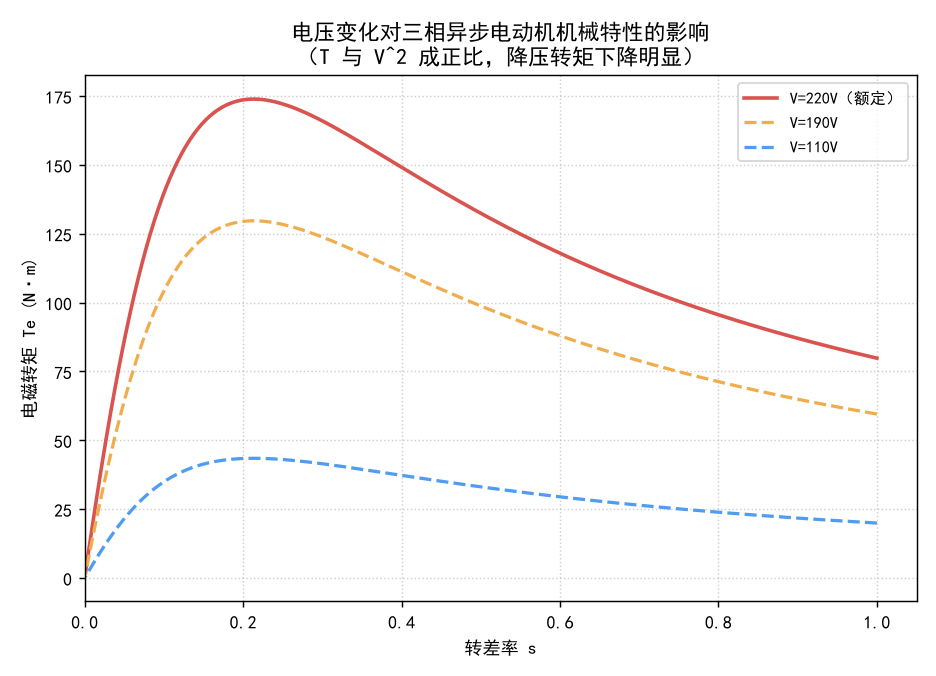
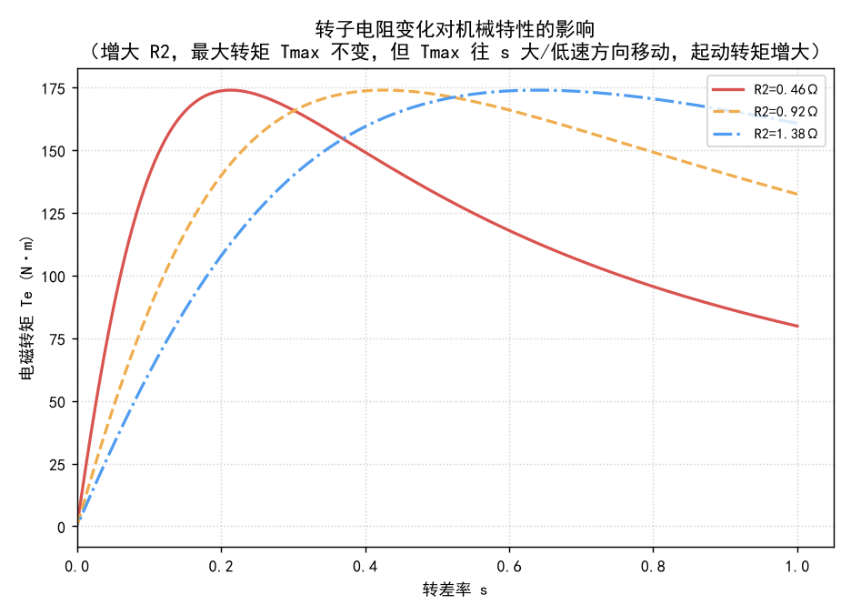
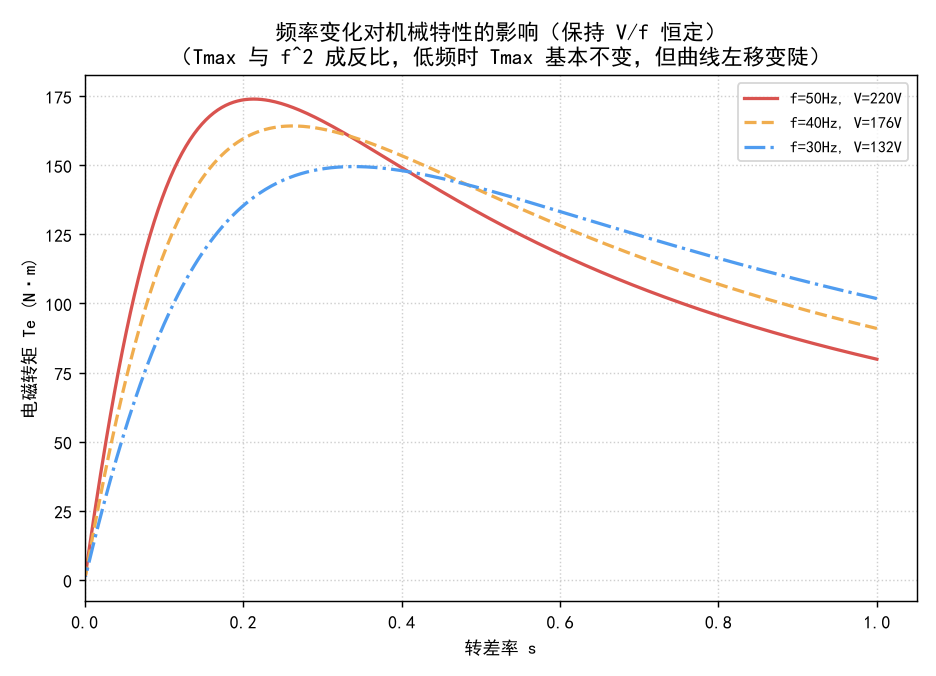

# 三相异步电动机功能实验

> 本教学文档基于**三相异步电动机仿真教学平台**（device03）编写，涵盖 9 大功能实验。每个实验均可在平台中选择对应项目（下拉框 1~9）并点击「自动演示 / 单步演示 / 演练」运行。文档结合各实验的具体操作步骤，系统阐述三相异步电动机的组成结构、工作原理、转差率概念、机械特性、起动方法、调速方法、制动方法以及缺相、欠压等常见故障。

---

## 目录

1. [三相异步电动机的组成](#一三相异步电动机的组成)
2. [工作原理与转差率概念](#二工作原理与转差率概念)
3. [机械特性（T-s 曲线）](#三机械特性t-s-曲线)
4. [功能实验总览（9 大实验）](#四功能实验总览9-大实验)
5. [实验一：三相异步电机运行](#五实验一三相异步电机运行)
6. [实验二：旋转磁场的性质](#六实验二旋转磁场的性质)
7. [实验三：三相异步电机特性测试](#七实验三三相异步电机特性测试)
8. [实验四：三相异步电机起动方法](#八实验四三相异步电机起动方法)
9. [实验五：三相异步电机调速方法](#九实验五三相异步电机调速方法)
10. [实验六：三相异步电机制动方法](#十实验六三相异步电机制动方法)
11. [实验七：三相异步电机转差率特性](#十一实验七三相异步电机转差率特性)
12. [实验八：三相异步电机常见故障分析](#十二实验八三相异步电机常见故障分析)
13. [实验九：三相异步电机 T-s 特性曲线分析](#十三实验九三相异步电机-t-s-特性曲线分析)
14. [常见故障：缺相与欠压](#十四常见故障缺相与欠压)

---

## 一、三相异步电动机的组成

三相异步电动机主要由**定子**（静止部分）和**转子**（旋转部分）两大部分构成，两者之间留有一定气隙。此外还包括机座、端盖、轴承、风扇等辅助部件。

**定子** 由定子铁芯和定子绕组组成：
- **定子铁芯**：由硅钢片叠压而成，内圆开有槽，用于嵌放三相绕组，是磁路的主要组成部分。
- **定子绕组**：三相绕组（A、B、C 三相）在空间互差 120° 电角度分布，通入三相对称交流电后即可产生旋转磁场。

**转子**（按结构分为两种基本类型）：

| 类型 | 结构特点 | 用途 |
|------|---------|------|
| **鼠笼式转子** | 转子铁芯槽内插入铝条或铜条（笼条），两端用短路环（端环）短接，自成闭合回路，无需引出接线 | 结构简单、坚固耐用、成本低，应用最广（小中型电机） |
| **绕线式转子** | 绕组与定子绕组相似的三相绕组，尾端短接，首端经滑环（集电环）引出 | 可外串电阻用于起动与调速，适用于大容量、起动转矩要求高的场合 |

> **平台对应：** 实验四（起动方法）、实验五（调速方法）中"增大转子电阻"的操作，正是针对绕线式转子；仿真中该电机转子电阻参数为 `R₂`（默认 0.46Ω），可通过参数对话框调整。

---

## 二、工作原理与转差率概念

### 2.1 工作原理

三相异步电动机的工作原理可概括为"**电生磁、磁生电、电磁生力**"：

1. **产生旋转磁场**：定子三相绕组通入三相对称交流电后，三相对称电流在空间互差 120° 合成一个幅值恒定、空间上以同步转速旋转的磁场。
2. **转子感应电动势与电流**：旋转磁场以同步转速旋转，转子导体相对磁场转动而切割磁力线，在转子导体中感应出电动势和电流（转子电流）。
3. **产生电磁转矩**：转子电流与旋转磁场相互作用产生电磁力，形成电磁转矩，驱动转子随着旋转磁场的旋转方向转动。

> 异步电动机之所以"异步"，是因为**转子转速永远不可能达到旋转磁场的同步转速**。若转子转速等于同步转速，则转子与旋转磁场相对静止，不再切割磁力线，也就无法产生感应电流和电磁转矩。

### 2.2 同步转速

旋转磁场的转速称为**同步转速**，由电源频率 f 和电机极对数 p 决定：

```
n_sync = 60 · f / p   （r/min）
```

其中 f 为电源频率（Hz），p 为极对数（4 极电机 p=2）。常见的同步转速：p=2 时 f=50Hz 对应 n_sync=1500 r/min；p=4 时对应 750 r/min。

**旋转方向**取决于三相电源的相序。互换任意两根火线即可改变相序，从而使旋转磁场（电机）反转。

### 2.3 转差率概念

转差率 s 是异步电动机最核心的参数，定义为同步转速与转子转速之差对同步转速的比值：

```
s = (n_sync - n) / n_sync
```

不同 s 值对应完全不同的运行状态：

| s 范围 | 运行状态 | 说明 |
|--------|---------|------|
| **s = 0** | 理想空载 | 转子转速等于同步转速，无感应电流、无转矩 |
| **0 < s < 1** | 电动状态 | 电机正常运行范围，s 越小转矩越小（近似线性） |
| **s = 1** | 堵转 / 起动 | 转子静止，转子感应电流最大，起动电流可达额定电流 4~7 倍 |
| **s > 1** | 反接制动 / 反向起动 | 转子逆磁场方向旋转，如反接制动的初始阶段 |
| **s < 0** | 再生制动 / 发电状态 | 转子转速超过同步转速，能量回馈电网 |

> **平台对应：** 实验七（转差率特性）专门通过改变负载、相序和频率，系统观察 s 从 0→1→>1→<0 的全范围变化。

---

## 三、机械特性（T-s 曲线）

机械特性指**电磁转矩 Te 与转差率 s（或转速 n）之间的关系曲线**，是分析电机运行、起动、调速与制动的核心工具。

### 3.1 转矩公式

在定子电压 V、频率 f、转子电阻 R₂ 一定时，电磁转矩近似为：

```
Te = 3·V²·(R₂/s) / [ ω_sync · ( (R₁ + R₂/s)² + X² ) ]
```

- ω_sync 为同步角速度，R₁、R₂ 为定子、转子电阻，X 为漏抗。
- **起动点（s=1）**：对应起动转矩 T_st
- **临界点（s=s_m）**：对应最大转矩（颠覆转矩）T_max
- **额定点**：额定负载对应的转矩与转差率
- **同步点（s=0）**：Te=0

### 3.2 电压变化对机械特性的影响

电磁转矩与电压的**平方成正比（T ∝ V²）**。降压后机械特性整体下移、变"矮"，最大转矩与起动转矩均大幅下降，而临界转差率 s_m 不变：



> 这正是**降压起动**与**欠压运行**的理论基础：降压可降低起动电流与起动转矩；而运行中电压过低会使最大转矩严重下降，导致电机过载堵转、电流增大过热。

### 3.3 转子电阻变化对机械特性的影响

增大转子电阻 R₂ 使 T-s 曲线**临界转差率 s_m 向 s 增大（低速）方向移动**，但**最大转矩 T_max 保持不变**。因此适当增大 R₂ 可显著**增大起动转矩**、同时**减小起动电流**：



> 这是**绕线式电机转子串电阻起动**的依据——绕线式异步电机正是利用这一特性改善起动性能。

### 3.4 频率变化对机械特性的影响

变频调压时若保持 **V/f 恒定**，主磁通基本不变，T-s 曲线平行左移，最大转矩近似不变，只是整条曲线沿转差率轴平移（同步转速随 f 变化）：



若单纯降低频率而不降压，V/f 增大将导致磁通过饱和；若频率升高而电压不变（V/f 减小），则进入**弱磁调速区**。

> **平台对应：** 实验三（特性测试）通过堵转、空载、额定负载、过载试验实测 T-s 曲线上的关键点；实验九（T-s 特性曲线分析）则用 T-s 面板可视化完整曲线并与负载特性线求交，确定稳定工作点。

---

## 四、功能实验总览（9 大实验）

| 序号 | 平台项目 | 核心对象 |
|------|---------|---------|
| 1 | 三相异步电机运行 | 起动、加载、停机全过程 |
| 2 | 旋转磁场的性质 | 旋转磁场方向、同步转速 |
| 3 | 三相异步电机特性测试 | 堵转/空载/负载/过载试验 |
| 4 | 三相异步电机起动方法 | 直接、降压、Y-Δ、变频、串电阻起动 |
| 5 | 三相异步电机调速方法 | 调压、串电阻、变极、变频调速 |
| 6 | 三相异步电机制动方法 | 反接、再生、能耗制动 |
| 7 | 三相异步电机转差率特性 | s 全范围变化与 T-s 关系 |
| 8 | 三相异步电机常见故障分析 | 缺相、欠压运行 |
| 9 | 三相异步电机 T-s 特性曲线分析 | 机械特性与稳定工作点 |

---

## 五、实验一：三相异步电机运行

**功能**：演示电机在 Y 形接法下的起动、加载和停机全过程，观察起动电流、转速随负载变化的规律。

**要点**
- **Y 形接法**：将三相绕组的尾端（U2、V2、W2）短接，首端（U1、V1、W1）接三相电源。每相绕组承受电压为线电压的 `1/√3`。
- **起动电流**：转子静止（s=1）时转子感应电流最大，定子电流可达额定电流的 4~7 倍。

**操作步骤**

| 步骤 | 操作说明 | 检测要点 |
|------|---------|---------|
| 1 | 将三相电源 U-V-W 分别连接至电机 U1-V1-W1 端子，并将电机接成 Y 形（U2、V2、W2 短接） | 连线正确性 |
| 2 | 开启三相电源（220V/50Hz），观察电机起动过程和面板显示的起动电流 | 电源已开启 |
| 3 | 将负载转矩调至 60.0 N·m，观察转速下降和电流增大 | loadTorque ≈ 60 |
| 4 | 关闭三相电源，电机停机 | 电源已关闭 |
| 5 | 知识问答：起动瞬间的起动电流通常为额定电流的多少倍？ | **4~7 倍** |

---

## 六、实验二：旋转磁场的性质

**功能**：观察旋转磁场的产生条件、旋转方向决定因素及与频率、极对数的关系。

**工作原理**
```
n_sync = 60f / p   （r/min）
```
- 旋转方向取决于**相序**，调换任意两根火线可反向。
- 极对数 p 决定同步转速：p 加倍则同步转速减半。

**操作步骤**

| 步骤 | 操作说明 | 检测要点 |
|------|---------|---------|
| 1 | 接线并开启三相电源（正序 UVW），观察 N-S 磁极旋转方向 | 电源开启，正序 |
| 2 | 调换 V 相与 W 相（V→W1、W→V1），重新开启电源，观察磁场反转 | 连线已交换 |
| 3 | 恢复正常接线，频率调至 30Hz，观察同步转速下降 | 频率 ≈ 30Hz |
| 4 | 频率调至 60Hz，观察同步转速上升 | 频率 ≈ 60Hz |
| 5 | 极对数由 2 改为 4，观察同步转速减半（1500→750 rpm） | 频率≈50Hz，polePairs=4 |
| 6 | 知识问答：旋转磁场转速与什么因素有关？ | **电源频率与极对数** |

---

## 七、实验三：三相异步电机特性测试

**功能**：通过堵转、空载、负载、过载试验测定电机关键参数。

**试验方法**
- **堵转试验**（s=1）：测量堵转电流与堵转转矩，反映起动性能。
- **空载试验**（s≈0）：测量空载电流与空载转速，反映励磁特性与机械损耗。
- **额定负载试验**：测量额定电流、额定转速与额定转矩。
- **过载能力**：T_max 与 T_N 之比，反映短时过载承受能力。

**操作步骤**

| 步骤 | 操作说明 | 检测要点 |
|------|---------|---------|
| 1 | 调出数字功率计，电流线圈串入 U 相，电压线圈 U+ 接 I+、U- 接 U2，V/W 相直连 | 功率计可见，连线正确 |
| 2 | 负载 200 N·m（堵转），接通 220V/50Hz，观察堵转电流与转矩 | loadTorque≥200，电源开启 |
| 3 | 空载：负载调至 0 N·m，记录空载电流与转速 | loadTorque ≈ 0 |
| 4 | 额定负载 67 N·m，记录额定电流、转速与转矩 | loadTorque ≈ 67 |
| 5 | 过载 160 N·m（略小于 T_max），观察仍稳定运行 | loadTorque ≈ 160 |
| 6 | 负载加至 200 N·m（超过 T_max），观察转速迅速下降直至堵转 | loadTorque ≈ 198 |
| 7 | 知识问答：堵转电流约为额定电流的多少倍？ | **4~7 倍** |

---

## 八、实验四：三相异步电机起动方法

**功能**：对比直接、降压、Y-Δ、变频（V/f 恒定）及增大转子电阻对起动电流和起动转矩的影响。

**起动方法原理对照**

| 方法 | 原理 | 效果 |
|------|------|------|
| **直接起动** | 全压起动 | 起动电流大（4~7 I_N），转矩为额定 1~2 倍 |
| **降压起动** | 降低定子电压 | 电流与转矩按 V² 比例下降 |
| **Y-Δ 起动** | 先 Y 后 Δ | Y 形每相 127V（220/√3），Y 形起动电流为 Δ 形的 1/3 |
| **变频起动** | V/f 恒定 | 降低频率同时等比例降压，磁通恒定，平滑起动 |
| **增大转子电阻** | 绕线式转子外串电阻 | 减小起动电流、**增大**起动转矩 |

**操作步骤**

| 步骤 | 操作说明 | 检测要点 |
|------|---------|---------|
| 1 | 调出数字功率计串入 U 相（ac_wire_u→I+→I-→im01_wire_u1），电压线圈 U+ 短接 I+、U- 接 U2，Y 形接法 | 功率计可见，连线正确 |
| 2 | 负载 200 N·m（堵转），接通 220V/50Hz，观察起动电流与起动转矩 | loadTorque≥200，电源开启 |
| 3 | 电压降至 110V（50Hz），观察电流与转矩减小（降压起动） | vRms ≈ 110 |
| 4 | 关闭电源，负载改为 400 N·m，接法由 Y 改 Δ（U1-W2、V1-U2、W1-V2），重新接通 220V/50Hz（Y-Δ） | loadTorque≥400，Δ 接线 |
| 5 | 接法还原为 Y 形（U2-V2、U2-W2），频率降至 40Hz、电压等比例 176V（恒 V/f 变频） | 频率≈40Hz，电压≈176V |
| 6 | 还原电压 220V、频率 50Hz，转子电阻 R₂ 由 0.46Ω 增大至 0.92Ω（串电阻起动） | vRms≈220，freq≈50，R2≈0.92 |
| 7 | 知识问答：增大转子电阻对起动性能的影响？ | **起动电流减小，起动转矩增大** |

---

## 九、实验五：三相异步电机调速方法

**功能**：演示调压、转子串电阻、变极、变频（含恒 V/f 与弱磁）四种调速方法。

**调速原理**
```
n = 60f/p × (1 - s)
```
| 方法 | 原理 | 特点 |
|------|------|------|
| **调压调速** | 改变 V→改变 Te→改变 s | 范围窄，适用风机泵类 |
| **转子串电阻调速** | 增大 R₂→改变 T-s 曲线→改变 s | 有级，效率随电阻增大降低 |
| **变极调速** | 改变极对数 p→改变同步转速 | 有级，需专用多速电机 |
| **变频调速** | 改变 f→改变同步转速 | 无级、范围宽、效率高，V/f 恒定保证磁通不变 |

**操作步骤**

| 步骤 | 操作说明 | 检测要点 |
|------|---------|---------|
| 1 | 接线（Y 形），风机型负载，起动 220V/50Hz，观察稳定转速 | 电源开启，loadType='fan' |
| 2 | 电压降至 160V（50Hz），观察转速下降（调压调速） | vRms ≈ 160 |
| 3 | 恢复 220V，切恒转矩 60 N·m，R₂ 由 0.46Ω 增至 1.46Ω，观察转速下降（串电阻） | loadTorque≈60，R2≈1.46 |
| 4 | 恢复 R₂=0.46Ω，极对数由 2 改 4，观察转速减半（变极调速） | R2≈0.46，polePairs=4 |
| 5 | 恢复极对数 2，频率 40Hz、电压 176V（恒 V/f 变频） | 频率≈40Hz，电压≈176V |
| 6 | 频率 60Hz、电压 220V（V/f 减小，弱磁调速） | 频率≈60Hz，电压≈220V |
| 7 | 知识问答：哪种调速方法属于改变同步转速的高效方式？ | **变频调速** |

---

## 十、实验六：三相异步电机制动方法

**功能**：演示反接制动、再生制动、能耗制动三种电气制动方法。

**原理对照**

| 方法 | 原理 | 能量流向 |
|------|------|---------|
| **反接制动** | 对调任意两相→反向旋转磁场→产生反向电磁转矩 | 电网电能+转子动能→热能 |
| **再生制动** | 降低频率（或转速超同步速）使 s<0，转为发电状态回馈 | 机械能→电能→回馈电网 |
| **能耗制动** | 断交流、通入直流→静止磁场→转子切割产生制动转矩 | 机械能→热能 |

**操作步骤**

| 步骤 | 操作说明 | 检测要点 |
|------|---------|---------|
| 1 | 接线（正序 UVW），起动电机达到稳定 | 电源开启，正序 |
| 2 | 相序切换为负序（UWV），观察转速迅速下降（反接制动） | _phaseSeq=-1 |
| 3 | 恢复正序，频率降至 30Hz，观察再生制动（转速约 900 rpm） | _phaseSeq=1，频率≈30Hz |
| 4 | 恢复 50Hz，切断交流，DC 24V 正接 U1、负接 V1，打开直流电源（能耗制动停车） | AC 关、DC 开，ω_m≈0 |
| 5 | 知识问答：哪种制动可将机械能回馈电网？ | **再生制动** |

---

## 十一、实验七：三相异步电机转差率特性

**功能**：通过改变负载、相序与频率，系统观察转差率 s 从 0→1→>1→<0 的全范围变化。

**要点**
- s = (n_sync - n)/n_sync。
- s 很小时（<0.05），电磁转矩与 s 近似成正比（T ∝ s）。

**操作步骤**

| 步骤 | 操作说明 | 检测要点 |
|------|---------|---------|
| 1 | 接线（Y 形），起动 220V/50Hz，观察 s 从 1 逐渐降至接近 0 | ω_m>140 rad/s |
| 2 | 负载 200 N·m，观察转速降至停转，s 从 0 升至 1 | loadTorque>190 |
| 3 | 卸负载，切负序（UWV），观察 s>1 | _phaseSeq=-1 |
| 4 | 恢复正序，频率 30Hz，观察再生制动（s<0） | _phaseSeq=1，频率≈30Hz |
| 5 | 恢复 50Hz，负载 19 N·m，记录 Te 与 s | loadTorque≈19，ω_m>140 |
| 6 | 负载 29 N·m，记录 Te 与 s | loadTorque≈29，ω_m>140 |
| 7 | 负载 39 N·m，验证 Te≈负载转矩，且 s 很小时 Te∝s | loadTorque≈39，ω_m>140 |
| 8 | 知识问答：s 很小时（<0.06），Te 与 s 的关系？ | **Te ∝ s** |

---

## 十二、实验八：三相异步电机常见故障分析

**功能**：模拟缺相运行与欠电压运行两种常见故障，观察电流、转速变化，理解危害。

**故障机理**（详见[第十四章](#十四常见故障缺相与欠压)）

**操作步骤**

| 步骤 | 操作说明 | 检测要点 |
|------|---------|---------|
| 1 | Y 形接线，U 相串功率计，恒转矩 30 N·m，起动电机，观察正常电流 | 电源开启，ω_m>140 |
| 2 | 运行中断开 W 相，观察功率计电流增大、电机是否停转 | W 相断开，ω_m>100 |
| 3 | 断开交流、等电机停止，重新接通电源，观察缺相下无法起动 | 电源开启，ω_m<5 |
| 4 | 恢复 W 相，稳定后电压降至 160V，观察转速下降与电流增大（欠压） | vRms≈160，ω_m>100 |
| 5 | 知识问答：缺相运行后的正确描述？ | **电机继续运行但电流增大，长时间会烧毁** |

---

## 十三、实验九：三相异步电机 T-s 特性曲线分析

**功能**：通过 T-s 特性曲线面板直观展示 Te 与 s 的关系，观察电机在恒转矩负载与风机型负载下的起动与稳定工作点。

**要点**
- **参考曲线**（虚线）：蓝=220V/50Hz/R₂=0.46Ω（额定基准）；橙=110V/25Hz/R₂=0.46Ω；绿=220V/50Hz/R₂=1.38Ω。
- **负载特性线**：恒转矩负载为水平直线（T_L=常数）；风机型负载为抛物线（T_L∝n²）。
- **稳定工作点**：T-s 曲线与负载特性线的交点（Te=T_L）。

**操作步骤**

| 步骤 | 操作说明 | 检测要点 |
|------|---------|---------|
| 1 | Y 形接线，恒转矩 30 N·m，T-s 面板显示蓝色与橙色虚线（未起动） | loadTorque>25 |
| 2 | 起动电机（220V/50Hz），红色点（工作点）沿曲线移动、蓝色点（负载点）沿负载线移动，最后在交点稳定 | ω_m>140 rad/s |
| 3 | 断开电源，切换风机型负载，负载线由水平变抛物线 | 电源关闭，loadType='fan' |
| 4 | 重新接通电源，观察风机负载下起动，红蓝两点在新交点稳定 | 电源开启，ω_m>140 |

---

## 十四、常见故障：缺相与欠压

### 14.1 缺相运行

三相电源中一相断开，电机变为单相供电，不产生旋转磁场而只产生**脉振磁场**。

- **运行中断相**：电机仍可依靠惯性继续旋转，但电流显著增大，长时间运行会**烧毁绕组**。
- **起动中断相**：电机无法自行起动，只有"嗡嗡"声，电流很大，极易过热损坏。

### 14.2 欠电压运行

电源电压低于额定值（如 160V vs 220V）。由于电磁转矩与电压平方成正比（**T ∝ V²**）：

- 最大转矩大幅降低（160²/220² ≈ 53%）；
- 相同负载下转差率增大、转速下降；
- 定子电流增大（为维持转矩需更大电流）；
- 长时间运行导致**绕组过热**。

> **危害提醒**：缺相与欠压都表现为电流异常增大与电机过热，是造成绝缘老化、烧毁电机的主要原因，运行中应配置相应的过流、欠压与缺相保护。

---

## 附：电机参数与公式速查

平台异步电动机（device03）默认参数：`R₁=0.50Ω`、`R₂=0.46Ω`、`Lσ₁=Lσ₂=0.00334H`、`极对数 p=2`、`额定功率 10kW`、`额定转速 1440 r/min`、额定相电压 `220V`、额定频率 `50Hz`。

**核心公式**

| 名称 | 公式 |
|------|------|
| 同步转速 | n_sync = 60f/p |
| 转差率 | s = (n_sync − n)/n_sync |
| 转速 | n = 60f/p × (1 − s) |
| 电磁转矩 | Te = 3V²(R₂/s) / [ω_sync((R₁+R₂/s)²+X²)] |
| 转矩与电压 | T ∝ V² |
