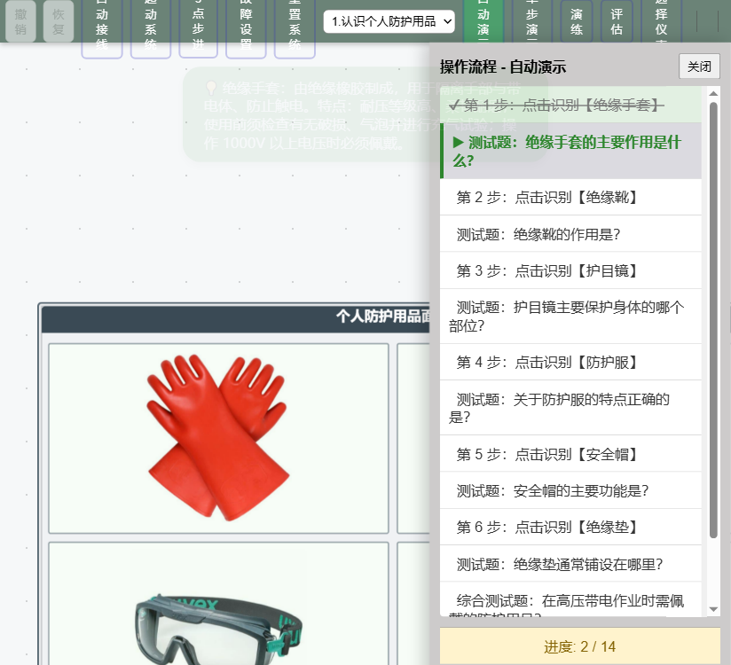
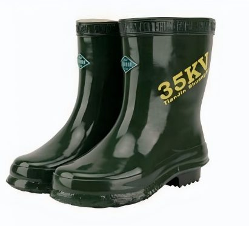
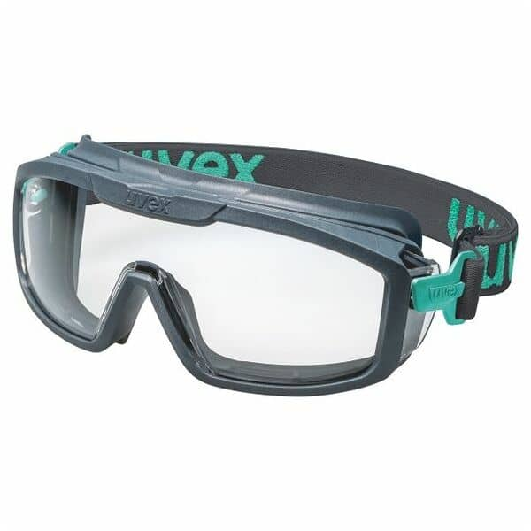
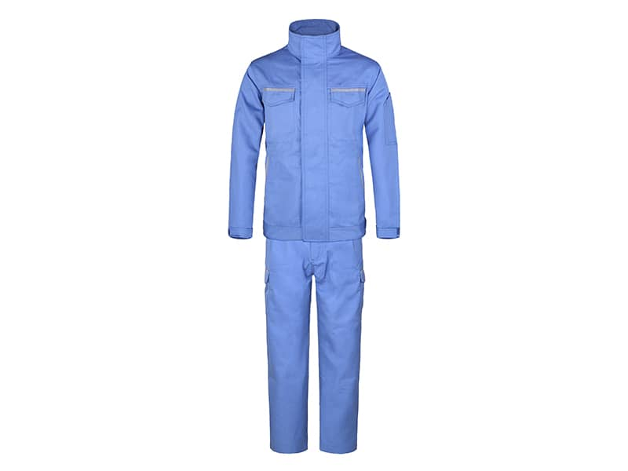
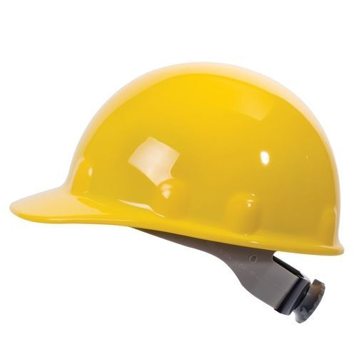
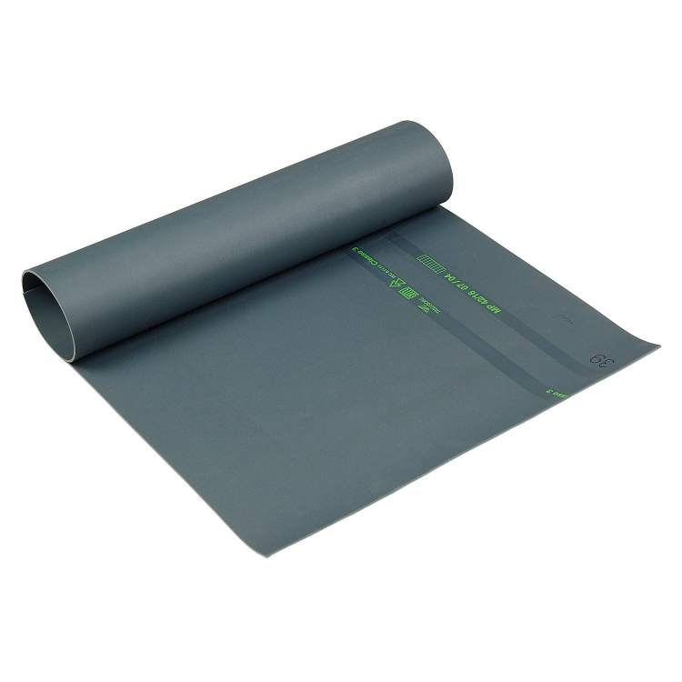

# 正确使用工人防护设备

> **课程名称**：船舶高压电气操作安全 · 个人防护用品认知与使用
> **参考资料**：`sys_cddz1-1` 高性能智能化船舶高压绝缘监测仿真平台 · 操作流程「认识个人防护用品」

---

## 一、概述

个人防护用品（Personal Protective Equipment，PPE）是保障电气操作人员生命安全的第一道防线。在船舶高压电气设备的运行、巡视与检修作业中，作业人员可能面临触电、电弧灼伤、物体打击、吸入粉尘等多种危险源。正确识别、选择并穿戴防护用品，是杜绝人身伤亡事故的重要前提。

本平台通过 2×3 网格的「个人防护用品展示面板」，形象展示六种常用防护用品——**绝缘手套、绝缘靴、护目镜、防护服、安全帽、绝缘垫**，帮助学员直观认识其外观、作用与使用特点。

---

## 二、工作原理

电气伤害的本质是**电流流过人体形成回路**。人体一旦成为电路的一部分，电流将造成灼伤、心室颤动甚至死亡。防护设备的原理核心，都在于**切断或隔离电流流经人体的通路**，主要围绕两个路径展开：

### 1. 隔离带电体（手 → 带电体）

作业人员直接或间接接触带电导体时，电流会从导体经手流入人体。**绝缘手套**采用高绝缘强度的橡胶材质，在皮肤与带电体之间形成一层电气屏障，切断此通路。

### 2. 隔离大地（人体 → 大地）

人体若与大地相连，即使只接触一根带电导线，也会因对地电位形成回路而触电——这就是常见的"单相触电"。**绝缘靴**与**绝缘垫**通过高绝缘鞋底和地面绝缘层，切断人体经脚与大地之间的电气通路。

> 绝缘手套与绝缘靴相互配合，构成"带电体侧 + 大地侧"双重隔离，是高压带电作业最核心的防护组合。

### 3. 被动物理防护

除电气防护外，还需防御其他物理伤害：

- **护目镜**：利用抗冲击、防紫外线的镜片，阻挡电弧光、飞溅金属与粉尘对眼睛的伤害。
- **防护服**：采用阻燃、耐高温、防电弧面料，降低电弧闪络瞬间的高温灼伤风险。
- **安全帽**：坚硬外壳 + 内置吸能衬垫，吸收坠落物冲击能量，保护头部免受砸伤。

 | 
:---: | :---:
**绝缘手套** | **绝缘靴**
 | 
**护目镜** | **防护服**

 | 
:---: | :---:
**安全帽** | **绝缘垫**

---

## 三、六种防护用品的作用与特点

| 名称 | 防护部位 | 主要作用 | 关键特点与使用要点 |
|------|---------|---------|-------------------|
| **绝缘手套** | 手部 | 隔离手与带电体，防止触电 | 耐压等级高、柔韧耐磨；使用前须检查破损/气泡并做充气试验；操作1000V以上设备必须佩戴 |
| **绝缘靴** | 脚部 | 隔离人体与大地 | 鞋底厚实耐压、防滑耐磨；高压带电作业、配电室巡视必穿，防跨步电压触电 |
| **护目镜** | 眼睛 | 防电弧光、飞溅物、粉尘 | 镜片抗冲击、防紫外线；产生电弧/火花的作业必须佩戴 |
| **防护服** | 躯干 | 防电弧烧伤、化学品飞溅 | 面料阻燃、耐高温、防电弧；带电作业时穿着降低灼伤风险 |
| **安全帽** | 头部 | 防坠落物、碰撞打击 | 外壳坚硬、内衬吸能减震；进入现场须正确佩戴并系紧下颏带 |
| **绝缘垫** | 足下 | 隔离人体与大地 | 绝缘橡胶制成、耐压高、表面防滑；铺于配电室/高压柜操作通道地面 |

---

## 四、实验操作步骤

本实验基于仿真平台的自动演示与演练功能，分步完成对六种防护用品的识别与作用掌握。

### 步骤 1：进入实验流程

1. 打开平台，在顶部工具栏的**项目下拉框**中选择 **「1.认识个人防护用品」**。
2. 根据教学需要，点击工具栏下方的模式按钮：
   - **自动演示**：系统自动高亮各防护用品并弹出作用说明，适合课堂讲解；
   - **单步演示**：单击"下一步"逐步学习，适合分步掌握；
   - **演练 / 评估**：自行点击识别，系统判定是否答对，适合检验掌握程度。

### 步骤 2：逐一识别六种防护用品

按照面板从上到下、从左到右的顺序，依次点击识别并阅读浮动提示，理解其防护作用与使用特点：

1. **绝缘手套** — 观察到漏电保护、工作电压等级等信息（演示会出现红色闪烁箭头指示位置）。
2. **绝缘靴** — 体会其隔离大地的防护原理。
3. **护目镜** — 记住其针对电弧光与飞溅物的防护用途。
4. **防护服** — 理解阻燃、防电弧材料的意义。
5. **安全帽** — 掌握其头部防砸的硬质结构。
6. **绝缘垫** — 认识其铺设于高压操作区域地面的作用。

### 步骤 3：完成测试题检验

每识别完一种防护用品，系统随即弹出对应**测试题**，自动演示模式会：

1. 展示题目与四个选项，停顿 2 秒供思考；
2. 高亮标注全部正确选项，并给出 `✅ 正确答案` 与 `💡 解析文字`；
3. 停留 6 秒后再进入下一步。

共设 **6 道单项选择测试题** 与 **2 道综合多项选择测试题**，覆盖各用品的作用、特点及高压带电作业的穿戴组合要求。

### 步骤 4：总结与考核

完成全部步骤后，以**演练/评估模式**独立操作，检验是否能够：

- 不看提示就准确指出六种防护用品的所在位置；
- 正确回答高压带电作业时的完整穿戴组合（绝缘手套 + 绝缘靴 + 护目镜等）。

---

## 五、安全注意事项

1. **用前检查不可省略**：绝缘手套使用前必须检查破损、气泡并做充气试验；绝缘垫表面不得有裂痕、穿刺。
2. **按耐压等级选型**：不同电压等级应选用相应等级的绝缘防护用品，严禁超等级使用。
3. **绝缘与保护并重**：绝缘类用品还需与护目镜、安全帽、防护服等被动防护结合，全面覆盖暴露部位。
4. **定期检测与更换**：绝缘手套、绝缘靴等属强制性安全用品，应按周期送检，老化、破损立即报废。

---

## 六、小结

通过本实验，学员能够熟悉六种个人防护用品的外观、作用原理与使用要点，掌握高压带电作业的标准穿戴流程，强化"安全第一、预防为主"的作业理念。正确、规范地使用防护设备，是每一位电气作业人员的必修课。

---
*本文档由正确使用个人防护设备仿真实验辅助生成，供教学使用。*