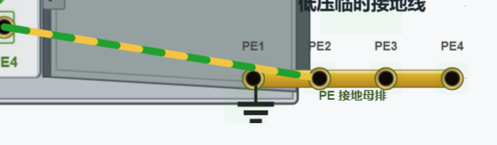
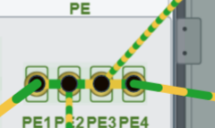
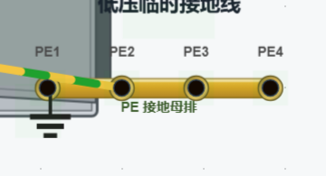
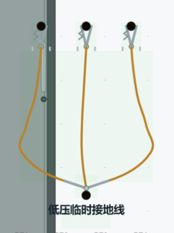
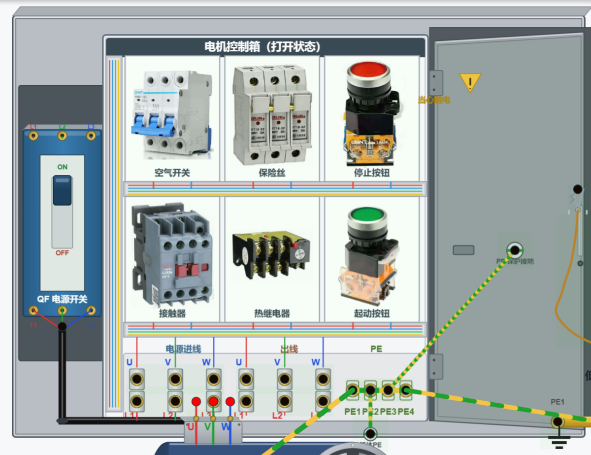

# 电站1.2 正确使用便携式和固定式接地设备

## 一、实验目的

1. 认识低压配电系统中固定式保护接地设备（接地母排、PE 端子、保护接地线）的组成与作用。
2. 认识便携式临时接地线（三相短路接地线）的结构与正确使用方法。
3. 掌握固定接地与临时接地的区别，理解"先接接地端、后挂导体端"的安全规程。
4. 理解带电挂接地线及带接地线合闸的危险性，树立安全操作意识。

## 二、实验原理

### 1. 保护接地的基本概念

电力系统中，凡人体易触及的金属外壳、柜体、柜门等导电部分，都必须通过保护接地（PE）与大地可靠连接，形成等电位连接。当设备绝缘损坏使外壳带电时，PE 线提供低阻抗泄放通路，产生足够大的故障电流使保护装置动作、切断电源，从而防止人身触电。接地是低压配电系统最基本的防触电措施之一，其核心是"等电位"——把可能带电的外壳电位牢牢锁定在地电位上。

### 2. 固定式接地设备的组成

本实验的固定式接地系统由以下四部分组成：

**（1）接地母排**

接地母排是独立于柜外的铜母线排，整条母排等电位，是本装置保护接地的总汇集点和接地参考点（0V）。其上的接线柱 PE1~PE4 在电气上属于同一节点，控制箱、电机的所有保护接地都经它汇入大地。

**（2）控制箱接地排（箱内 PE 铜排）**

控制箱内部端子区下方设有一段黄绿双色的导铜排，称为控制箱接地排。箱内的 PE 端子组（pe1~pe4）、箱体 PE 点、柜门 PE 点全部与该铜排同电位，构成箱体内部的保护接地网络。箱内各级设备外壳（接触器、热继电器、控制回路金属件等）的接地均汇集于此。

**（3）箱体与柜门 PE 端子**

控制箱箱体本身经一根黄绿固定线接至接地排，保证箱体金属框架可靠接地。柜门是可活动的部件，若用硬导线连接会随柜门反复开合而疲劳断裂，因此柜门采用**柔性黄绿软线**与箱内 PE 端子连接，使柜门在任何开合状态下始终与接地系统保持等电位。凡人体可触及的箱体、柜门金属部分都必须可靠接地，这是防止外壳意外带电伤人的关键。

　

**（4）固定接地线（PE 保护线）**

国家标准规定，保护接地线必须采用**黄绿双色**绝缘线，严禁使用蓝色、红色等相线颜色替代。固定接地线把电机机座上的 PE 端子、接地母排的 PE 端子与控制箱 PE 端子永久可靠地连接在一起，例如本系统中母排 PE2 与电机 PE1 之间的黄绿接线。固定接地线属永久性固定接线，日常运行中不作拆除。

### 3. 便携式临时接地线（三相短路接地线）

临时接地线用于停电检修作业，由三个相接线夹、一个接地线夹、绝缘操作手柄及连接软线组成。其电气特性是：三个相接线夹（p1/p2/p3）与接地夹（gnd）在内部零电阻短接。挂线时，将三个相接线夹分别夹持在停电设备的三相导线上，接地夹夹持在接地母排上——这样三相导线被短接并可靠接地，可泄放线路上残留的感应电荷、静电与装置未放尽的电荷，并防止检修期间突然来电危及检修人员安全。

### 4. 短路保护与合闸脱扣原理

低压断路器具备短路速断保护。正常运行中三相电源分别独立供电、互不同电位；一旦入口三相进线被临时接地线短接（相邻两相并入同一节点即形成相间短路），断路器检测到短路电流立即脱扣跳闸。本仿真平台完整模拟了这一物理过程：

- **未拆接地线合闸**：入口三相已被短接，断路器带短路合闸，合闸瞬间即短路速断脱扣，手柄跳至中间脱扣位。
- **带电挂接地线**：正在运行（合闸状态）时误将临时接地线挂上任意两相，保护装置约 50ms 内自动脱扣跳闸。

两种操作都会使断路器触点断开、接触器释放，须先复位分闸并拆除接地线后方可重新合闸。本仿真中这一机理用于演示"带短路合闸"与"带电挂接地线"两类危险工况，帮助学生直观理解短路保护的速断动作。

## 三、实验器材

电机控制箱（含电源开关 QF、空气开关、接触器、热继电器、起动/停止按钮及排端组）、接地母排、三相异步电机、固定黄绿接地线（预接线）、低压便携式临时接地线、仿真连线工具。

## 四、实验操作步骤

**步骤 1 · 识别接地母排**：在画布上找到独立铜母线排，观察整条母排结构与 PE1~PE4 四个接线柱，理解其"整条等电位、装置接地参考点"的作用。

**步骤 2 · 识别控制箱接地排**：打开控制箱，找到端子区下方黄绿铜排及 PE 端子组，认识箱内保护接地网络的汇集点。

**步骤 3 · 识别箱体与柜门 PE 端子**：在箱体下方找到箱体 PE 端子（黄绿色）；在柜门内侧找到经柔性黄绿软线连接的柜门 PE 端子，观察软线连接方式，理解活动部件须采用柔性导线而不宜用硬导线的道理。

**步骤 4 · 识别电机 PE 端子**：在电机机座上找到黄绿 PE 端子，确认其经固定黄绿线接至控制箱 PE1，使电机外壳可靠接地。

**步骤 5 · 识别固定接地线**：找到接地母排 PE2 与电机 PE1 之间的黄绿双色固定接线，认识 PE 保护线的颜色标识；固定接地为永久连接，日常不拆除。

**步骤 6 · 识别便携式临时接地线**：找到低压便携式临时接地线，观察三个相接线夹（p1/p2/p3）、接地线夹、绝缘操作手柄及连接软线的结构，理解"三线夹内部短接汇于接地端"的电气模型。

**步骤 7 · 安全操作仿真验证**：

1. 合闸运行中，将临时接地线任意两个相线夹挂到控制箱入口三相进线（接地夹可不接地）——断路器立即脱扣跳闸，手柄弹至脱扣位、接触器释放，演示"带电挂接地线"的危险。
2. 点击脱扣手柄将其复位分闸，拆除接地线后再合闸，断路器正常合闸送电，反证"带接地线合闸必短路速断脱扣"的机理。
3. 再按规范流程操作一遍：先断开电源开关并确认停电，然后按"**先接接地端、后挂导体端**"的顺序挂设临时接地线；拆除时顺序相反（**先拆导体端、后拆接地端**），保证人体始终不触及未接地的导体。

**步骤 8 · 测试题**：完成接地母排特点、箱体/柜门 PE 连接作用、固定接地线颜色与作用、临时接地线作用及操作顺序等测试题，巩固本节知识点。

## 五、注意事项

1. 保护接地线必须采用**黄绿双色**标准绝缘线，禁止以相线颜色线（蓝、红、黑）替代。
2. 柜门、箱体、电机外壳等一切人体可触及的金属部分必须可靠保护接地。
3. **严禁**带接地线合闸：带短路合闸会损坏断路器，并危及操作人员安全。
4. **严禁**带电挂接地线：相当于人工制造相间短路，产生的电弧与故障电流极其危险。
5. 挂设临时接地线必须"先接地端、后导体端"，拆除时顺序相反，这是检修作业保证人身安全的标准规程。

## 六、实验报告要求

1. 画出本实验固定式接地系统的连接示意图（控制箱 PE 网络、接地母排、电机 PE 端子）。
2. 说明固定接地线（PE 线）与便携式临时接地线的区别（用途、结构、颜色、拆装要求）。
3. 叙述"先接接地端、后挂导体端"的原因，并说明带电挂线及带线合闸的危害。