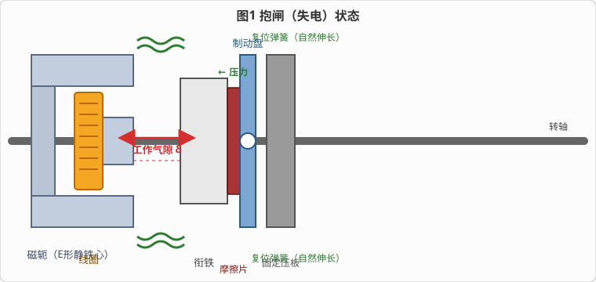
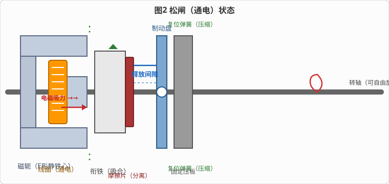
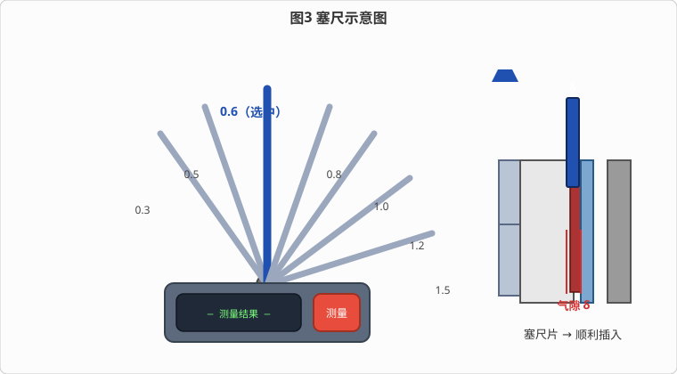

# 电磁制动器的拆装及间隙的调整

> 适用对象：圆盘式电磁制动器（失电制动器 / Spring-Set Brake）
> 本文档配套仿真教学平台（`sys01-brake`），以下操作流程均可在软件中演示：
> ① 识别圆盘式电磁制动器的组件 → ② 电磁制动器松闸/抱闸原理 → ③ 气隙调节与塞尺测量

---

## 一、概述

圆盘式电磁制动器是一种**失电制动器**（通电松闸、断电抱闸）。它依靠电磁力与弹簧力的平衡实现制动与释放：

- **断电时**：复位弹簧推动衔铁压紧摩擦片，使摩擦片压住制动盘并压向固定压板，产生摩擦力矩实现**抱闸**——这也是其作为安全制动器的核心优势：任何断电或故障状态下都能自动制停，保障设备安全。
- **通电时**：电磁铁产生吸力克服弹簧力，将衔铁吸离制动盘，摩擦片与制动盘分离，转轴可**自由旋转**。

通过三个配套仿真流程，可以依次完成：部件认知 → 通电/断电动作原理观察 → 工作气隙的测量与调整。

---

## 二、电磁制动器的组成

圆盘式电磁制动器主要由以下部件构成：

| 部件 | 作用 | 仿真识别步骤 |
|------|------|--------------|
| **电磁铁线圈** | 绕在 E 形静铁心的中柱上，通电后产生电磁力吸合衔铁 | 流程1 第1步 |
| **螺旋复位弹簧** ⨯2 | 上下各一根，安装在铁心与衔铁之间；断电时推动衔铁右移实现抱闸 | 流程1 第2步 |
| **衔铁 + 摩擦片** | 动衔铁可沿导向杆轴向滑动，右侧面贴有摩擦片；通电时被吸向铁心、摩擦片脱离制动盘（松闸） | 流程1 第3步 |
| **制动盘** | 固定在转轴上，与转轴同步旋转；抱闸时摩擦片压紧制动盘产生摩擦力矩 | 流程1 第4步 |
| **固定压板** | 与磁轭（E形铁心）刚性连接，作为摩擦副的固定侧，承受摩擦力矩 | 流程1 第3/4步 |
| **工作气隙调节旋钮** | 位于磁轭左侧，可调节工作气隙（0.3 ~ 1.5mm），向上拖动或滚轮调节 | 流程1 第5步 |

> **关键在于记住动作链**：
> `线圈通电 → 电磁力吸合衔铁（压缩弹簧）→ 摩擦片离开制动盘 → 松闸`；
> `线圈断电 → 弹簧推动衔铁右移 → 摩擦片压紧制动盘 → 抱闸`。

---

## 三、工作原理（失电制动原理）

### 3.1 抱闸（失电）状态

断电时，电磁力消失，复位弹簧处于**自然伸长**状态，推动衔铁整体右移，摩擦片压紧制动盘，制动盘被压向固定压板，依靠接触面的摩擦力矩使转轴减速并停止旋转。



### 3.2 松闸（通电）状态

线圈通以 DC24V 后，电磁铁产生吸力将衔铁吸向铁心极面（中柱端面），同时**压缩复位弹簧**；摩擦片与制动盘分离，制动盘与转轴恢复自由，可自由旋转、转速稳定不衰减。



### 3.3 三种工作状态速览

| 状态 | 线圈状态 | 弹簧状态 | 衔铁位置 | 摩擦片 | 转轴 |
|------|---------|---------|---------|--------|------|
| **松闸（运行）** | 通电 DC24V | 压缩 | 吸合靠向铁心 | 脱离制动盘（释放间隙≈工作气隙） | 可自由旋转，转速稳定 |
| **抱闸（停车/安全）** | 断电 | 自然伸长 | 右移压紧 | 压紧制动盘并压向固定压板 | 减速停止（制动时间常数 ≈0.12s） |
| **断电事故** | 断电 | 自然伸长 | 右移压紧 | 压紧制动盘 | 自动制停（失电保护） |

> **仿真操作**（流程2）：
> 1. 接线：直流电源 `+` → 线圈 `A1`，直流电源 `-` → 线圈 `A2`，接通 DC24V；
> 2. 观察衔铁吸合、弹簧压缩、摩擦片脱离制动盘（松闸）；
> 3. 拨动转轴：可自由旋转、转速稳定不衰减（松闸阻尼时间常数 ≈25s）；
> 4. 关闭电源：弹簧推动衔铁右移、摩擦片压紧制动盘（抱闸），转轴减速停止。

---

## 四、工作气隙的概念及影响

### 4.1 两个关键间隙

- **工作气隙 δ**（可调间隙）：衔铁处于**抱闸位置**时，衔铁左端面与铁芯极面（中柱端面）之间的间隙，正常值约 **0.8mm**，调节范围为 **0.3 ~ 1.5mm**。气隙调节旋钮调节的就是这一间隙。
- **释放间隙**（随动间隙）：衔铁吸合后（松闸状态），摩擦片与制动盘之间分离的距离，其大小**约等于**工作气隙。

### 4.2 气隙大小的影响

| 气隙状况 | 后果 |
|----------|------|
| **过小**（< 0.3mm） | 电磁吸力足够强，但**释放间隙不足**：松闸后摩擦片可能与制动盘发生**剐蹭**，产生噪声、加剧磨损、增加空载阻力 |
| **正常**（≈ 0.8mm） | 电磁吸力充足、释放间隙足够，吸合可靠、分离彻底，摩擦片无剐蹭 |
| **过大**（> 1.2mm） | 磁路磁阻增大，**电磁吸力不足**，衔铁吸合不到位甚至吸不住 → **松闸不彻底**，摩擦片带摩擦动、转轴拖滞、制动器过热 |

### 4.3 气隙为什么会变大？

摩擦片是易损件，使用磨损后厚度变薄。由于**磁轭（固定压板侧）位置不动**，摩擦片每磨损一部分，抱闸时衔铁整体就得更靠近制动盘补偿磨损，使**衔铁左端面与铁心极面之间的工作气隙自动增大**。

> **仿真故障演示**（流程3 第1步）：勾选「摩擦片磨损 0.5mm」故障并应用后，工作气隙由 0.80mm 自动增大到 **1.30mm**。这正是"摩擦片磨损 → 气隙变大"的真实映射。

---

## 五、塞尺及其使用

### 5.1 塞尺（Feeler Gauge / 厚度规）

塞尺由**手柄**和一组**扇形排列的薄钢片**（塞尺片）组成，各片厚度不同。本仿真中塞尺片系列为：

| 塞尺片编号 | 0 | 1 | 2 | 3 | 4 | 5 | 6 |
|-----------|---|---|---|---|---|---|---|
| 厚度 (mm) | 0.3 | 0.5 | **0.6** | **0.8** | 1.0 | **1.2** | **1.5** |



### 5.2 测量原理

> **塞尺片厚度 < 气隙** → 可**顺利插入**；
> **塞尺片厚度 ≥ 气隙** → **卡阻**（紧配合/无法滑入）。

用一组不同厚度的塞尺片逐片试插，即可估计出气隙范围：

```
能插入的最大厚度 ≤ 气隙 < 不能插入的最小厚度
```

### 5.3 测量操作步骤（仿真流程3 第2/4步）

1. 确认制动器已**断电抱闸**（通电松闸状态下测量会被拒绝，必须先断电）；
2. 点击选择一片塞尺片（选中后该片高亮、略微伸出）；
3. 点击手柄右侧「测量」按钮，塞尺片插入制动器工作气隙；
4. 读取手柄左侧结果：
   - `✅ 顺利插入 → 气隙 > 该片厚度`
   - `❌ 卡阻 → 气隙 ≤ 该片厚度`
5. 更换塞尺片厚度，从小到大逐片试插，寻找"插入 / 卡阻"边界。

### 5.4 测量实例（对照流程3）

**故障状态（气隙 ≈ 1.3mm）：**

| 塞尺片 | 结果 | 推论 |
|-------|------|------|
| 1.2mm | ✅ 顺利插入 | 气隙 > 1.2mm |
| 1.5mm | ❌ 卡阻 | 气隙 ≤ 1.5mm |

→ **结论：工作气隙在 1.2 ~ 1.5mm 之间，明显偏大，需要调整。**

**调整后（气隙 ≈ 0.8mm）：**

| 塞尺片 | 结果 | 推论 |
|-------|------|------|
| 0.6mm | ✅ 顺利插入 | 气隙 > 0.6mm |
| 0.8mm | ❌ 卡阻 | 气隙 ≤ 0.8mm |

→ **结论：工作气隙已恢复到 0.8mm 左右，符合标准。**

---

## 六、拆装与更换摩擦片

> 当工作气隙过大且无法通过调节旋钮恢复（如摩擦片磨损量超出调节范围）时，需要**拆装更换摩擦片**。

### 6.1 拆卸步骤

1. **断电并做好安全防护**：切断电源，确认制动器处于抱闸状态，防止拆装过程中衔铁意外动作；
2. **解除紧固**：松开磁轭/压板的紧固螺栓，取下固定压板；
3. **取出衔铁组件**：沿导向杆取下衔铁，检查摩擦片磨损情况；
4. **拆卸摩擦片**：卸下旧摩擦片，检查其剩余厚度与铆钉头是否露出；
   - 摩擦片厚度磨损至极限（本仿真中磨损 0.5mm 即触发故障告警）时 **必须更换**；
   - 若铆钉头已接近或露出摩擦面，也必须更换（铆钉头会刮伤制动盘）。

### 6.2 装配步骤

1. 清洁衔铁安装面与导向杆；
2. 安装**新摩擦片**，确保与衔铁贴合平整；
3. 装回衔铁组件、固定压板并紧固螺栓；
4. **重新检查并调整工作气隙**至标准值 **0.8mm**（见第七章）；
5. 通电试运转：松闸应彻底（无剐蹭异响）、抱闸应可靠。

> **仿真故障修复**（流程3 第1步演示）：勾选「摩擦片磨损0.5mm」后气隙 0.8→1.3mm；执行修复（更换摩擦片）后磨损量归零、**自动恢复故障前的气隙**。

---

## 七、工作气隙的调整

### 7.1 调节装置

工作气隙由**磁轭左侧的「气隙调节」旋钮**调节：

- 仿真操作：**向上拖动**旋钮或滚动滚轮可增减气隙；
- 调节范围：**0.3 ~ 1.5mm**，标准值约 **0.8mm**；
- 调节过程中制动器画面上方会实时显示 `工作气隙 x.xxmm`。

### 7.2 调整方法（仿真流程3 第3步）

1. 确认制动器**断电抱闸**（在抱闸位置测量才是工作气隙）；
2. 用旋钮逐步调节气隙，观察气隙数值变化：
   - 故障状态下气隙为 1.30mm → 依次调到 **1.1 → 0.9 → 0.8mm**；
3. 调至标准值 0.80mm 后停止；
4. 用塞尺复核（参考 5.4 节）：0.6mm 插入、0.8mm 卡阻，即确认气隙恢复。

### 7.3 调整注意事项

| 项目 | 要求 |
|------|------|
| 调整时机 | 必须在**断电抱闸**状态下进行 |
| 标准值 | 0.8mm（各型号以铭牌为准） |
| 过大危害 | 电磁吸力不足 → 松闸不彻底、摩擦片带摩擦动、发热 |
| 过小危害 | 释放间隙不足 → 松闸后摩擦片剐蹭、异响、磨损加剧 |
| 调整后 | 必须用塞尺复核，并做通电/断电动作试验 |

---

## 八、三个仿真流程速查

| 流程 | 内容 | 关键操作 |
|------|------|---------|
| **① 识别组件** | 认识线圈、复位弹簧、衔铁与摩擦片、制动盘、气隙调节旋钮（附测试题） | 点击各部件，观察高亮与说明 |
| **② 松闸/抱闸原理** | 接线通电 → 观察松闸 → 拨动转轴自由旋转 → 断电 → 观察抱闸（附测试题） | 接线 A1/A2 → 电源键 → 转轴 → 电源键 |
| **③ 气隙调节与塞尺测量** | 故障设置（摩擦片磨损）→ 塞尺测出气隙范围 → 旋钮调回 0.8mm → 塞尺复核 | 故障设置 → 塞尺测量 → 调节旋钮 → 复测 |

---

## 九、常见故障与处理

| 故障现象 | 可能原因 | 处理方法 |
|----------|----------|---------|
| 通电后不能松闸 / 松闸不彻底 | 工作气隙过大，电磁吸力不足；线圈供电电压过低 | 调整工作气隙至 0.8mm；检查 DC24V 供电与接线 |
| 松闸后摩擦片异响 / 转轴拖滞 | 释放间隙不足（气隙过小）；摩擦片变形 | 调大气隙至标准值；检查摩擦片 |
| 抱闸效果差，制动力不足 | 摩擦片磨损（气隙自动增大）；摩擦面油污 | 更换摩擦片并调整气隙；清洁摩擦面 |
| 气隙自动变大（无人工调节） | 摩擦片磨损（本仿真中磨损 0.5mm 使气隙 0.8→1.3mm） | 更换摩擦片，磨损量归零后气隙自动恢复 |

---

*本文档依据 `sys01-brake` 仿真平台的 3 个操作流程编写，与仿真演示一一对应，可作为拆装与间隙调整实训的参考资料。*