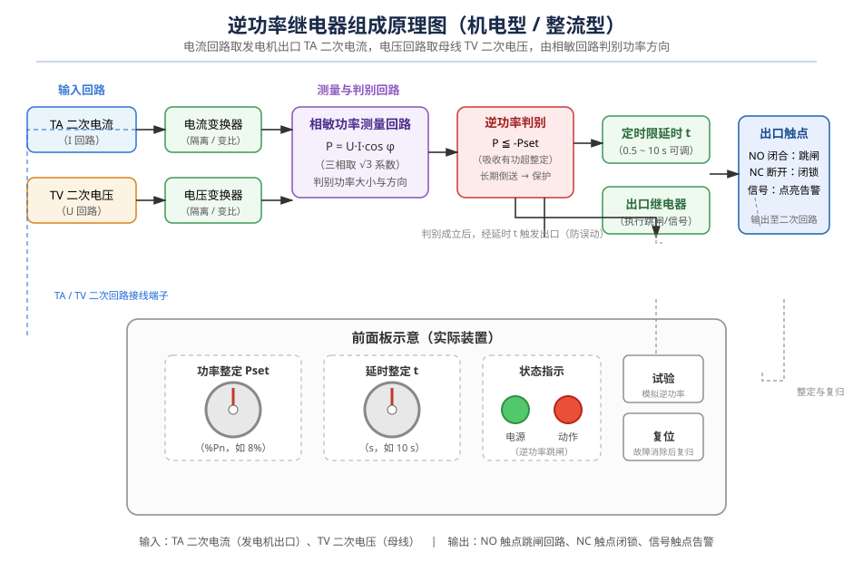
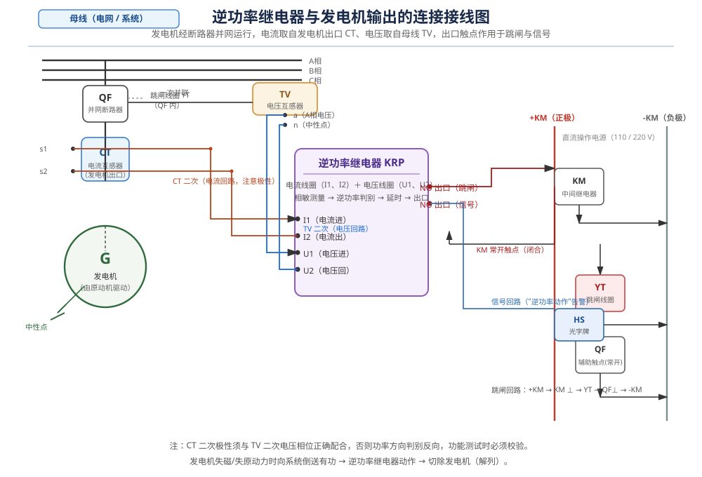

# 逆功率继电器的功能测试

## 一、概述

逆功率保护是发电机并网运行的重要保护之一。当汽轮机（水轮机等原动机）失去动力时，发电机将不再向电网输出功率，反而从电网吸收有功功率，以电动机方式运行，这种现象称为**逆功率**。长期逆功率运行会使末级叶片鼓风摩擦过热损坏，甚至造成飞车事故。因此，并网发电机均装设逆功率继电器，检测到逆功率超过整定值并持续一定时间后动作于跳闸，将发电机解列。

## 二、逆功率继电器的组成

实际应用的逆功率继电器（机电型/整流型，如 GGZ、SGZH 型；以及数字式逆功率保护装置）内部主要由以下几部分组成，如图 1 所示：

**（1）输入回路。** 由电流变换器和电压变换器组成，电流回路接入发电机出口电流互感器（TA）的二次电流，电压回路接入母线/机端电压互感器（TV）的二次电压，经隔离变换后送测量回路。

**（2）相敏功率测量回路。** 以电压为基准对电流进行相位比较（相敏整流），输出与电流有功分量成正比的直流信号，即求得有功功率 P = √3·U·I·cosφ，并给出功率的**方向**（输出或倒送）。

**（3）逆功率判别回路。** 将有功功率与整定值比较，当测得功率为负（倒送）且 |P| ≥ Pset（如整定为 8% Pn）时，判定逆功率成立。

**（4）定时限延时回路。** 逆功率成立后启动延时（一般 0.5~10 s 可调，典型 2~10 s），躲过汽轮机功率摆动、系统扰动等暂态过程，防止误动作。

**（5）出口与信号回路。** 延时结束触发出口继电器，常开触点（NO）闭合作用于跳闸，常闭触点（NC）断开用于闭锁，同时点亮动作指示灯并发出"逆功率动作"告警。

**（6）面板操作部分。** 前面板设功率整定、延时整定旋钮，电源/动作指示灯，试验按钮（模拟逆功率校验动作回路）及复位按钮（故障消除后复归）。

## 三、工作原理

正常并网运行时，发电机向电网输出有功功率（超前运行，P>0），相敏测量回路输出正向偏置信号，逆功率判别不满足，继电器不动作，常闭触点闭合、信号灯常亮。

当原动机失力（主汽门关闭、甩负荷转速下降等）时，发电机由"发电"转入"电动"，从电网吸收有功（P<0），相敏回路输出极性反转，判别回路见 |P| ≥ Pset 即启动延时；若逆功率持续存在，经整定延时 t 后出口继电器动作：NO 闭合跳闸、NC 断开、信号动作，将发电机与电网解列，保护原动机设备。

## 四、功能测试过程

功能测试在发电机停运检修期间进行，通常采用**继电保护测试仪**模拟实际工况，也可用"点动"（原动机短时带机组）方式。以测试仪法为例，接线如图 2：

**1. 接线与极性检查。** 核对 TA 二次接入电流端子、TV 二次接入电压端子的位置与极性（同名端）；确认出口触点接入跳闸回路（+KM→KM→YT→QF 辅助触点→-KM）、信号触点接入光字牌；用万用表检查直流电源正常、回路无短路。

**2. 动作值（逆功率整定）测试。** 加入额定电压，电流回路通入模拟电流并调整相位使测得功率为负方向；缓慢增大电流，记录继电器开始计时的临界点，该点功率即为动作值 Pset，误差应满足出厂要求（一般不超过整定值的 ±5%），不符则调整面板整定旋钮重新校验。

**3. 延时值测试。** 突加 1.2 倍动作值的模拟逆功率，用秒表/测试仪计时，记录从加量到出口触点（NO）闭合的时间，与整定值 t 比较，误差一般不超过 ±3% 或 ±0.1 s。

**4. 出口与信号回路验证。** 模拟逆功率使装置动作，检查跳闸中间继电器、断路器跳闸线圈确实得电（可做传动试验观察断路器分闸）；检查光字牌"逆功率动作"点亮、动作指示灯正确；复归后信号应能消除。

**5. 防误动（正向功率）验证。** 将电流相位改为输出方向（P>0），即使通入 3 倍额定电流，继电器也不应动作——验证方向判别正确，防止正常发电时误跳闸。

**6. 复归功能测试。** 逆功率消失后按面板"复位"按钮或短时断电复归，装置应回复正常状态、信号复归、触点复原。

**7. 试验记录。** 将动作值、延时、极性校验、传动结果填入保护检验记录表，与整定单核对归档。

## 五、测试注意事项

- **极性是测试成败的关键**：CT 二次极性反接会使功率方向反向，出现"正向功率误动、逆功率拒动"的假象，务必用相位伏安表校验极性及相序。
- 试验接线应在**停电**状态下进行，带电部分有明显隔离措施；跳闸回路传动前应退出相关联锁或通知运行人员。
- 用测试仪做整组试验时，电流、电压应同时加入且相位关系正确，不能只加电流或只加电压。
- 试验中严禁将逆功率跳闸出口直接短接运行中的设备；试验结束后恢复接线、核对定值、清理现场。

逆功率继电器的功能测试是机组检修的必检项目，通过上述测试可确保保护装置动作正确、可靠，保障发电机与原动机的安全运行。