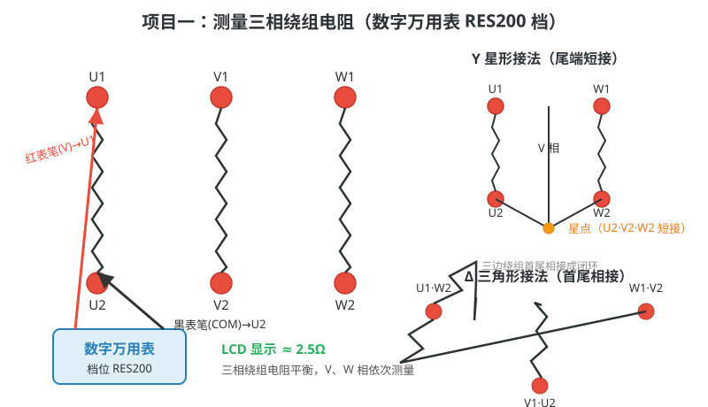
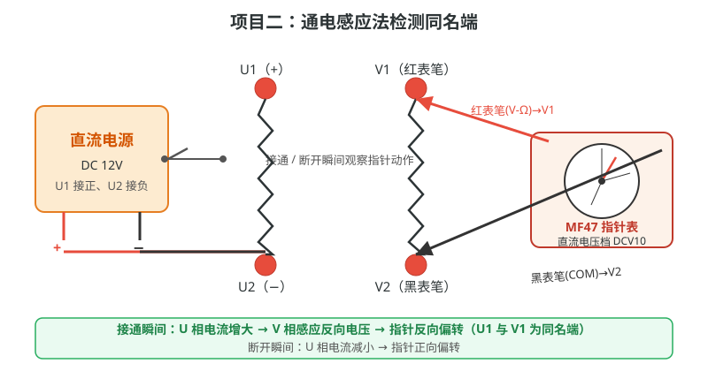
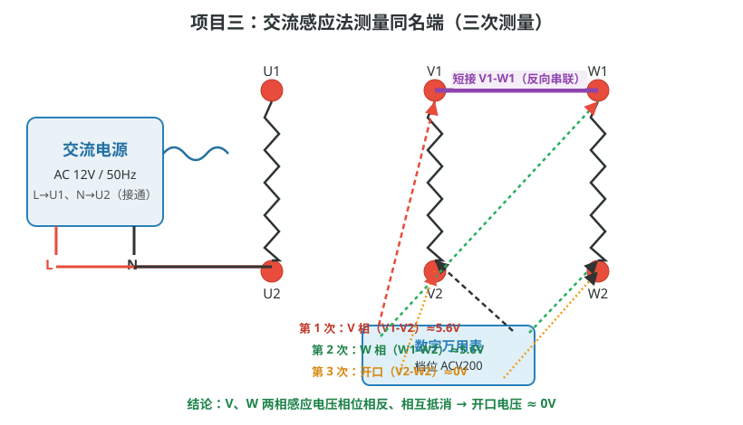

# 三相绕组接法和通电感应法测同名端

## 一、工程简介

本仿真以**三相异步电动机定子绕组接线盒**为对象，含 6 个接线端子（U1、U2、V1、V2、W1、W2），配套交流电源（AC 12V/50Hz）、直流电源（DC 12V）、数字万用表和指针式万用表（MF47）。支持拖拽连线，及"自动演示、单步演示、演练、评估"四种教学模式，完成三个实训项目：测量绕组电阻（Y/Δ 接法）、通电感应法测同名端、交流感应法测同名端。

## 二、项目一：测量三相绕组电阻

### 工作原理

三相绕组可等效为三个电感线圈，每相直流电阻约 **2.5Ω**。用电阻档（RES200）分别测 U（U1-U2）、V（V1-V2）、W（W1-W2）三相，正常时**三相电阻平衡**。接线盒支持两种接法：

- **Y 接法**：U2、V2、W2 尾端短接为星点，首端 U1、V1、W1 引出，线电压 = √3 × 相电压；
- **Δ 接法**：U1-W2、V1-U2、W1-V2 首尾相接成闭环，线电压 = 相电压。

### 操作步骤

| 步骤 | 操作说明 | 检测要点 |
|------|---------|---------|
| 1 | 数字万用表切 **RES200** 电阻档 | 档位正确 |
| 2 | 红表笔接 U1、黑表笔接 U2 | 读数 ≈ 2.5Ω |
| 3 | 依次测 V 相（V1-V2）、W 相（W1-W2） | 三相均 ≈ 2.5Ω |
| 4 | 短接 U2-V2-W2 构成 Y 型；或首尾相接构成 Δ 型 | 星点/闭环正确 |
| 5 | 知识问答：Y 接法线电压与相电压关系 | 线电压 = √3 × 相电压 |

## 三、项目二：通电感应法检测同名端

### 工作原理

同名端即感应电动势极性相同的端子。给 U 相（**U1 接正、U2 接负**）通直流电，经**互感**在 V 相感应出电动势。MF47 置 **DCV10**，红表笔接 V1、黑表笔接 V2：

- **接通瞬间**：U 相电流增大（di/dt > 0），V 相感应**反向电压**，指针**反向偏转**；
- **断开瞬间**：U 相电流减小（di/dt < 0），V 相感应**正向电压**，指针**正向偏转**。

接通瞬间指针反向偏转 ⇒ V1 极性与 U1 相反，即 **U1 与 V1 为同名端**。

### 操作步骤

| 步骤 | 操作说明 | 检测要点 |
|------|---------|---------|
| 1 | 直流电源正极接 U1、负极接 U2 | 极性正确 |
| 2 | MF47 切 **DCV10**，红表笔接 V1、黑表笔接 V2 | 档位、接线正确 |
| 3 | 接通电源观察指针 | 瞬间**反向偏转** |
| 4 | 断开电源再观察 | 瞬间**正向偏转** |
| 5 | 由偏转方向判定同名端 | U1 与 V1 同名端 |

## 四、项目三：交流感应法测量同名端

### 工作原理

无需通断操作：交流电源（AC 12V/50Hz）接 U 相（L→U1、N→U2），**V1-W1 短接**使 V、W 两相反向串联，用 **ACV200** 档连续测量三次，比较感应电压：

- **第 1 次**：V 相（V1-V2）≈ **5.6V**（互感感应电动势，约为相电压一半）；
- **第 2 次**：W 相（W1-W2）≈ **5.6V**，与 V 相对称；
- **第 3 次**：开口电压（V2-W2）≈ **0V** —— V、W 两相感应电压**相位相反、相互抵消**。

### 操作步骤

| 步骤 | 操作说明 | 检测要点 |
|------|---------|---------|
| 1 | 交流电源 L→U1、N→U2，接通电源 | 电源开启 |
| 2 | **V1-W1 短接**（反向串联） | 短接线正确 |
| 3 | 万用表切 **ACV200**，测 V1-V2 | ≈ 5.6V |
| 4 | 改测 W1-W2 | ≈ 5.6V |
| 5 | 测 V2-W2 开口电压 | ≈ 0V（抵消） |
| 6 | 知识问答：V2-W2 间电压约为多少 | 正确答案：0V |

## 五、注意事项

1. 测量绕组电阻前**先切断所有电源**，防止带电测电阻损坏万用表。
2. 电压/电阻档切换后应确认档位指示正确再接线。
3. 通电感应法通断动作要干脆，便于观察瞬时偏转：**反偏 ⇒ 同名端**。
4. 两种方法（通断感应、交流感应）判定的同名端应互相印证一致。
5. 平台以 20fps 实时求解电路，接线后等待 1~2 秒读数稳定再记录。