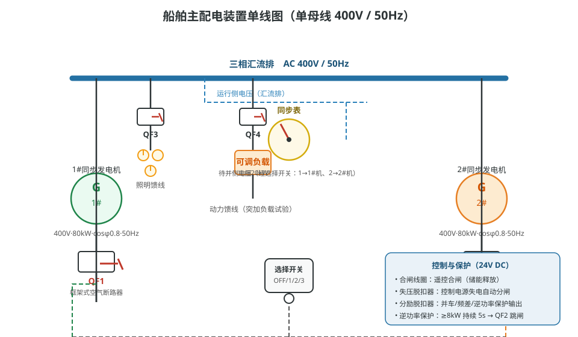
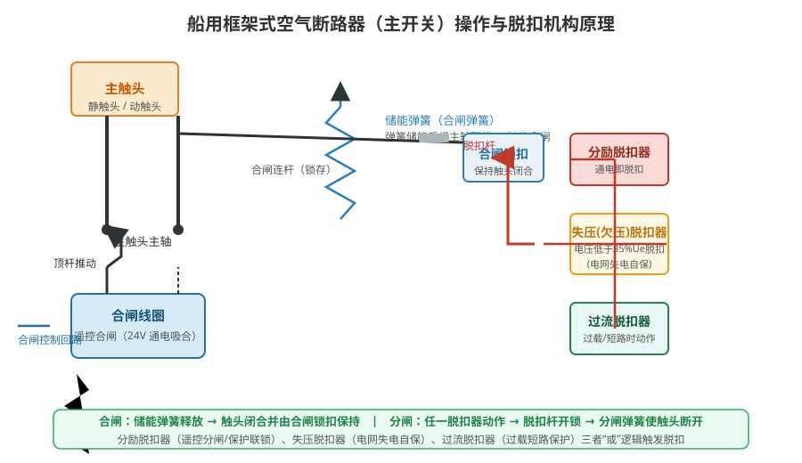
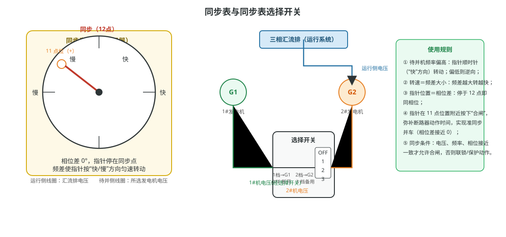

# 同步表法手动准同步并车

## 一、系统组成与基本原理

本仿真平台模拟船舶主配电装置，采用**单母线结构**，额定电压 AC 400V、频率 50Hz。两台 80kW 同步发电机组（1#、2#）分别经船用框架式空气断路器（主开关 QF1、QF2）并联向同一汇流排供电，汇流排引出照明馈线（QF3）与动力馈线（三相可调负载 20kW）等用电支路，如图 1 所示。

### 1. 主开关的操作与脱扣机构

主开关选用船用框架式空气断路器，合闸与分闸由一套机电联动的操作机构完成（图 2）：

- **合闸**：先由储能机构压缩合闸弹簧（储能）；遥控合闸时合闸线圈通电吸合，顶杆释放储能弹簧，经主轴使触头闭合，并由合闸锁扣保持在闭合位置。
- **分闸（脱扣）**：分励脱扣器、失压脱扣器、过流脱扣器三者按"或"逻辑作用于同一脱扣杆，任一动作即开锁，触头在分闸弹簧作用下断开。
  - **分励脱扣器**：通电即脱扣，用于遥控分闸及并车、频差、逆功率等保护输出；
  - **失压（欠压）脱扣器**：控制电压低于 35% 额定值时失电脱扣，实现电网失电自保；
  - **过流脱扣器**：过载或短路时动作，保护主回路。

### 2. 同步表与同步表选择开关

同步表（同步指示器）设有两个电压线圈：**运行侧**接汇流排电压（已建电网），**待并侧**经同步表选择开关接待并发电机电压（图 3）。选择开关为四档转换开关：OFF 断开、1 档接 1# 机、2 档接 2# 机、3 档备用。同步表指示规律是教学要点：

- 指针位置反映**相位差**：指针停在 12 点（同步位置）说明两电压同相位；
- 指针转速反映**频差**：待并机频率偏高时指针向"快"方向转，偏低则逆向，频差越大转得越快；
- 当指针转到 **11 点位置附近**按下"合闸"，可补偿断路器动作时间，实现准同步并车。

### 3. 并车必须满足的同步条件

准同步并车（并列运行）前必须同时满足三个条件：**电压相近**（幅值差约在额定值 ±10% 以内）、**频率相近**（频差一般小于 0.2~0.5Hz，且待并机略快）、**相位一致**（相位差接近 0°）。不满足同步条件强行合闸，会产生巨大冲击电流与冲击转矩，严重损伤发电机、主开关和电网。为此，主开关控制回路设置了两道防线：**联锁**（条件不满足时封锁合闸信号）与**并车保护**（频差、相位超限时立即全船跳闸）。

## 二、项目一：认识船舶主配电装置

**目的**：建立对船舶主配电装置的总体认识，熟悉各部件的结构、位置与作用。

本系统主要设备及其作用如下：

- **1#、2# 同步发电机**：额定电压 400V、功率 80kW、功率因数 0.8、频率 50Hz，是电能之源。发电机由原动机（柴油机）拖动，调速器控制转速即频率，励磁调节器控制电压；
- **1#、2# 主开关（船用框架式空气断路器）**：连接发电机与汇流排的合分闸设备，重点认识三部分——**储能弹簧**（为合闸储存机械能）、**合闸线圈**（遥控合闸的执行元件）、**失压脱扣器**（控制电源失电自动分闸，实现电网失电自保）；
- **1#、2# 发电机组遥控面板**：集中贴装起动、合闸、分闸按钮及频率、电压、功率指示仪表，是机舱集中控制的中枢；
- **数字同步表**：直观显示待并机与已建电网的相位差与频差，供并车判断；
- **同步表选择开关**：OFF/1/2/3 四档，选择接入同步表的待并机组，并兼作合闸联锁判断元件——只有转到本机档位，合闸联锁才放行；
- **三相汇流排**：主配电装置的公共母线（400V/50Hz），全部用电设备由其引出。

**操作方法**：选择"认识船舶主配电装置"项目后可进行自动演示或演练。演示模式下，系统用箭头与提示逐一指出上述部件；演练模式下，需在配电板图上自行点击找出部件，熟记位置与名称的对应关系，为后续操作项目打好基础。

## 三、项目二：遥控合闸与并车联锁操作

**目的**：掌握"电网无电直接合闸"与"电网有电必须同步"两种工况下的合闸原则，理解并车联锁的机理。

主开关的合闸条件随电网带电状态而变。**电网无电时**（全船失电），失压脱扣器释放，允许直接储能合闸最先正常的一台发电机；**电网有电时**，任何待并机合闸前必须满足同步条件。若同步表选择开关未转到本机档位，说明操作员尚未进行同步判断，合闸输出被**联锁**封锁——这是防止非同步合闸的第一道防线。

**典型操作步骤**：

1. 自动接线后，按 1# 遥控面板"起动"按钮起动 1# 发电机，并完成主开关储能；
2. 电网无电，直接按遥控面板"合闸"，1# 主开关合闸向汇流排供电，将频率调至 50Hz；
3. 起动 2# 发电机；
4. **验证联锁**：同步表选择开关不在 2 号档位时按 2# 面板"合闸"，观察主开关 2 不动作——合闸信号被联锁封锁，这正是防止误并车的保护；
5. 将同步表选择开关转到"2"档（本机档，联锁放行）；
6. 调节 2# 机调速器，使其频率与汇流排一致（同步表指针缓慢转动）；
7. 观察同步表指针转到 **11 点位置**附近时，按 2# 面板"合闸"并车，两机并列运行。

**教学要点**：联锁并非禁止合闸，而是强制操作员先完成"转档→看表→判同步"的正确顺序。同步判断完成后合闸，系统平稳并联、无冲击。

## 四、项目三：并车保护（非同期与频差跳闸）

**目的**：直观认识频差超限、相位差超限强行并车的严重后果，理解并车保护装置的动作逻辑。

即使联锁放行，若操作员在**不满足同步条件**的时刻合闸（频差过大或相位差落在危险区间），并车保护装置会立即检出非同期合闸趋势，输出分闸信号切断**全船**主开关，防止冲击电流损坏设备。本系统设定两道保护判据：

- **频差保护**：待并机与电网频差大于 0.5Hz 时合闸，保护立即动作，全船跳闸；
- **非同期（相位）保护**：频差虽小（小于 0.2Hz），但相位差处于 30°~300° 区间内合闸，同样判为非同期并车，保护立即动作。

**典型操作步骤**：

1. 起动 1# 发电机并合闸、调频至 50Hz，建立电网；
2. 起动 2# 发电机，将同步表选择开关转到"2"档（联锁放行）；
3. **演示一（频差保护）**：拉大 2# 机频差至大于 0.5Hz，并在此状态下合闸——并车保护立即全船跳闸（1#、2# 主开关均分闸），体会频差超限的危害；
4. **恢复供电**：将同步表选择开关打到 OFF，重新起动 1# 并合闸恢复供电，调频至 50Hz；
5. **演示二（非同期保护）**：微调 2# 机频率使频差小于 0.2Hz（满足频率条件），但在相位差 30°~300° 区间内合闸——保护再次全船跳闸，说明"频率对、相位不对"同样绝不允许并车；
6. 再次将选择开关打到 OFF 并恢复 1# 供电，理解跳闸后的复电流程。

**教学要点**：两项演示均以"允许合闸→保护跳闸"的方式呈现后果，帮助学员建立"同步三条件缺一不可"的牢固概念，并掌握失电后的正确恢复操作顺序。

## 五、项目四：逆功率状态演示

**目的**：理解逆功率产生的机理、危害及逆功率保护的动作逻辑，掌握并车后功率方向的调整方法。

并联运行的同步发电机由原动机（柴油机）拖动向电网输出有功功率。若原动机故障（如冷却水温高停机、断油、调速器故障），发电机不再被拖动，反而被电网**拖动**变为电动机，从电网吸取有功功率，此时该机功率计显示**负值（逆功率）**。长期逆功率运行会使发电机电动机化、沿轴向窜动并与原动机摩擦发热，严重损坏机组，因此必须装设逆功率保护：逆功率达到整定值（本系统 8kW）并持续延时（5s）后跳开该机主开关。

并车后的功率方向与频差关系密切：**正频差并车**（待并机频率略高，f2>f1）使 2# 机承担输出功率；**负频差并车**（f2<f1）使 2# 机吸收功率、呈现逆功率。调速器"加油门"升频率、增输出，"减油门"降频率、减输出直至逆功率。

**典型操作步骤**：

1. 自动接线，起动 1# 发电机、合闸供电并调频至约 50Hz；
2. 起动 2# 发电机，选择开关转"2"档，将 2# 机频率调至比 1# 机**低 0.1Hz**；
3. 观察同步表，在相位差允许区间合闸 2# 主开关（负频差并车）——2# 机显示逆功率（约 -0.6kW），体会"低频率并入侧吸收功率"的现象；
4. 分闸 2# 主开关，将 2# 机频率调至比 1# 机**高 0.2Hz**，再次在相位差允许区间合闸——2# 机转为输出功率，功率计为正；
5. 持续下调 2# 机调速器（减油门）直至 2# 机再次呈现逆功率；
6. 投入三相可调负载 20kW，微调调速器使 2# 机输出接近 5kW；卸载后继续下调调速器，再次形成逆功率；
7. 上调 2# 机调速器使其输出接近 10kW，随后**置冷却水温高故障**——原动机停机，2# 机被电网拖动，逆功率从 0 爬升至 9kW，达 8kW 延时 5s 后逆功率保护动作，2# 主开关跳闸，1# 机单独承担全部负载。

**教学要点**：通过正、负频差并车对比与故障注入，直观说明"并车时频差方向决定功率分配"和"逆功率保护如何动作"，并训练故障后的观察与处置。

## 六、项目五：发电机准同步并车、并联负荷转移、解列

**目的**：完整演练"准同步并车 → 两机并联负荷分配 → 负荷转移 → 解列停机"的全过程，掌握船舶电站的典型操作。

并车成功后两台发电机并联运行，负载的有功分配由各机调速器（油门）决定：**开大某机油门、其频率略升，将承接更多有功**；反之减小油门则减少承担。调节时需兼顾电网频率，使汇流排频率始终维持在 50Hz。解列前必须先转移负荷（把待解列机功率降到较小值），再分闸解列，避免解列瞬间频率波动过大。

**典型操作步骤**：

1. 自动接线，起动 1# 发电机、合闸供电并调频至 50Hz；
2. 检查 2# 发电机组遥控面板 READY FOR START 指示灯（允许起动）；起动 2# 机组并调频至 **50.2Hz**（正频差并车）；
3. 观察数字同步表：正频差 0.2~0.33Hz，指针顺时针每 3~5s 转一圈；
4. 指针转到 **11 点位置**左右时合闸 2# 主开关，随后将同步表选择开关打到 OFF（关闭同步表）；
5. **负荷分配**：调节两机调速器，使功率均分；突加三相负载 20kW，观察两机功率分配情况；
6. **负荷转移**：增大 1# 机油门、减小 2# 机油门，使电网频率维持在 50Hz 且 2# 机承担功率降到约 3kW；
7. **解列停机**：2# 主开关分闸（解列），2# 发电机组停机，负荷全部由 1# 机承担。

**教学要点**：同步表判断（相位、频差）、并车时机（11 点位）、功率分配调整（油门与频率联动）、解列前转移负荷，是本项目的四项核心技能，也是实船电站管理的日常操作。

## 小结

五个项目由"认识设备"到"联锁并车"、"保护演示"、"逆功率训练"再到"负荷转移解列"，构成完整的船舶电站操作训练链。操作中务必牢记：**先判同步、再合闸；频率差决定功率方向；保护动作后按"选择开关打 OFF→恢复 1# 供电→调频 50Hz"的顺序复电**。同步表法手动准同步并车是船舶电气专业最基本的实操作业，熟练掌握后对自动并车装置的原理与整定参数也能触类旁通。