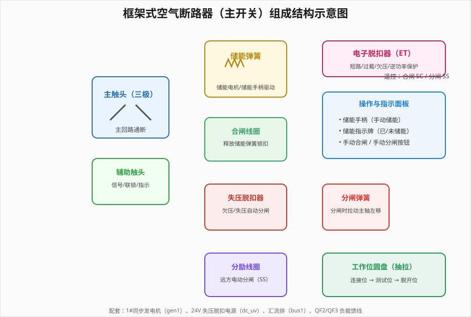
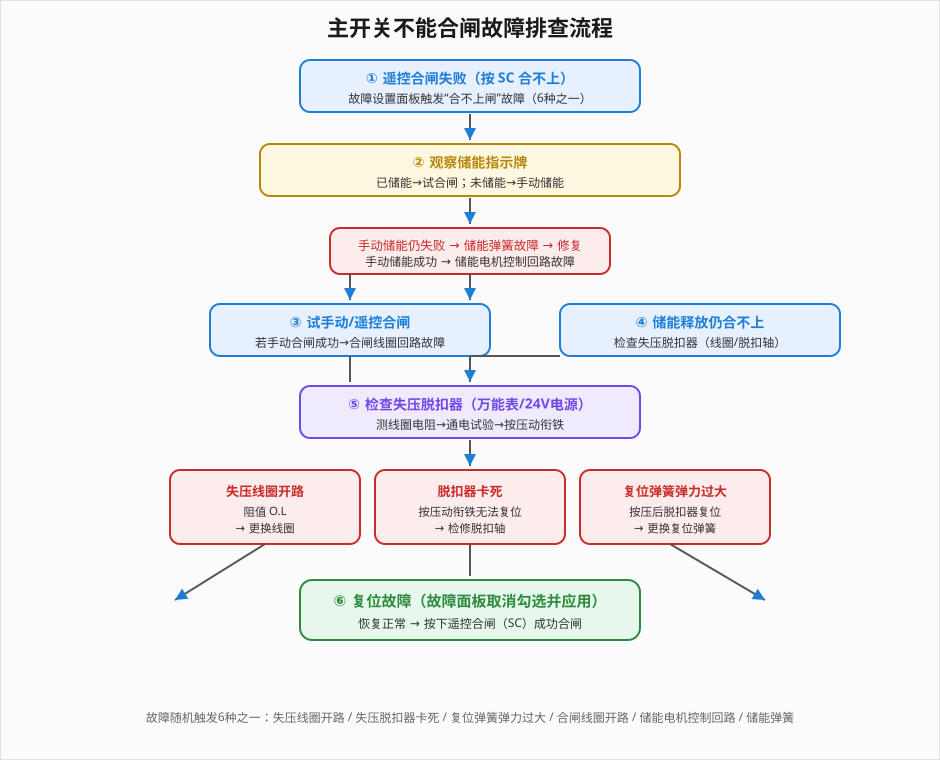
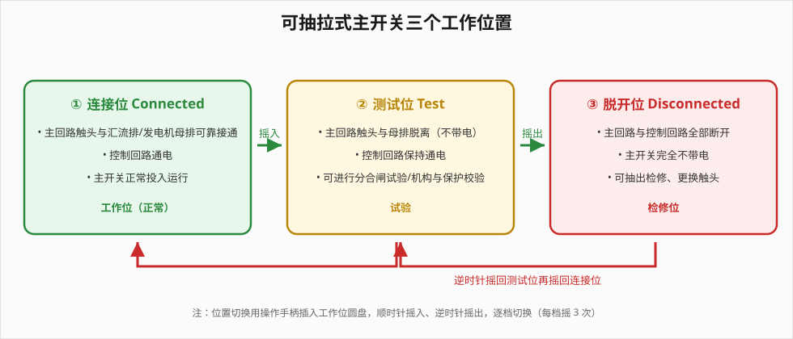

# 主开关基本操作、不能合闸故障处理、抽拉操作

> 适用对象：船舶/工业低压配电系统运维人员、相关专业学生。本文档结合仿真平台，系统讲解框架式空气断路器（主开关／发电机主开关）的部件构成、基本操作、不能合闸故障排查与可抽拉式主开关的切换操作。

---

## 一、概述

框架式空气断路器（ACB，Air Circuit Breaker）常用于发电机主开关及大容量馈电回路，具有分断能力强、可维修性好、保护功能完善等优点。在仿真系统中，以一台完整的**框架式空气断路器（主开关 qf1）**为核心，配合 1# 同步发电机（gen1）、24V 失压脱扣电源（dc_uv）、汇流排（bus1）、负载馈线（QF2/QF3）等构成一条从发电到配电的完整回路。

框架式空气断路器由**主触头系统、储能机构、合闸机构、脱扣系统、操作与指示面板**等部分组成，其结构示意如下图所示。

仿真平台共设计了 **4 个操作流程**，由浅入深覆盖「认识部件 → 基本操作 → 故障排查 → 抽拉操作」四个层次：

| 序号 | 流程名称 | 英文标识 | 教学重点 |
|------|----------|----------|----------|
| 1 | 空气断路器的部件及其功能 | acb-parts | 识别各部件并掌握作用 |
| 2 | 主开关储能、合闸、分闸 | acb-ops | 手动/电动储能、遥控与手动合闸分闸 |
| 3 | 主开关不能合闸故障判断和排除 | acb-no-close | 故障现象、排查顺序与复位 |
| 4 | 可抽拉式主开关的操作 | acb-drawer-ops | 连接位→测试位→脱开位切换 |

---

## 二、部件及其功能（流程一 · acb-parts）

本流程通过「点击部件 + 测试题」的方式，让学员逐一认识主开关的关键部件并掌握其作用。主要部件及功能如下表所示：

| 部件 | 面板/结构位置 | 主要作用 |
|------|--------------|----------|
| 储能弹簧 | 主开关上部弹簧机构 | 储能后合闸时释放能量，快速推动主触头闭合 |
| 储能手柄 | 操作面板 | 手动储能，连续按压为储能弹簧储能 |
| 合闸线圈 | 储能弹簧旁 | 得电释放储能弹簧锁扣，触发合闸 |
| 失压脱扣器 | 主开关中部 | 电压过低/失压时自动分闸，防欠压运行 |
| 分励线圈 | 主开关下部 | 远方电动分闸（配合分闸按钮 SS） |
| 电子脱扣器（ET） | 独立模块 | 实时检测电流/电压，短路、过载、欠压、逆功率等保护 |
| 主触头 | 三极触点 | 主回路通断 |
| 辅助触头 | 联动触头 | 提供信号、联锁与状态指示 |
| 分闸弹簧 | 主开关下部 | 分闸时拉动主轴使动/静触头分离 |

**要点**
- **储能弹簧**储存的机械能在合闸瞬间释放，不依赖合闸瞬间的电源容量，确保主触头快速可靠闭合。
- **失压脱扣器**线圈正常带电时闭锁脱扣轴，失压后失磁释放并联动分闸。
- **电子脱扣器**是智能化保护核心，各类故障信号汇总于此发出脱扣指令。

---

## 三、储能、合闸、分闸操作（流程二 · acb-ops）

本流程演示主开关从储能到合闸再到分闸的完整操作，涵盖手动储能、电动储能、手动/遥控合闸、手动/遥控分闸等动作。

### 3.1 储能

- **手动储能**：点击储能手柄，连续按压 5 次，储能弹簧储能至满，储能指示牌显示"已储能"。
- **电动储能**：单独接通储能电机供电（m1/m2 得电，动画接线），储能电机自动储能至满。

### 3.2 合闸

手动合闸与遥控合闸的前提相同：**储能已满 + 失压线圈有电（脱扣轴处于正常位）**。

| 方式 | 操作 | 过程 |
|------|------|------|
| 手动合闸 | 按主开关面板"手动合闸"按钮 | 储能弹簧释放 → 主轴推动三对动触头闭合 |
| 遥控合闸 | 单独接通合闸线圈回路，按合闸按钮 SC | 合闸线圈得电 → 释放储能弹簧锁扣 → 合闸 |

> 合闸瞬间储能弹簧**释放能量**，储能指示牌由"已储能"恢复为"未储能"，这是判断储能是否投入正常的关键现象。

### 3.3 分闸

| 方式 | 操作 | 过程 |
|------|------|------|
| 手动分闸 | 按住面板"手动分闸"按钮 | 机械推动脱扣轴 → 分闸弹簧释放 → 动/静触头分离 |
| 遥控分励分闸 | 单独接通分励线圈，按分闸按钮 SS | 分励线圈得电 → 脱扣轴转动分闸 |

分闸后主触头分离、主回路断开，机构回到分闸状态，可再次储能重复合闸。

---

## 四、不能合闸故障判断和排除（流程三 · acb-no-close）

### 4.1 故障现象与随机故障

在故障设置面板勾选并应用"主开关合不上闸"故障后，**6 种故障随机触发 1 种**。此时按下 SC 遥控合闸按钮，主开关无法合闸。

| 序号 | 故障 | 特征表现 |
|------|------|----------|
| 1 | 失压线圈开路 | 线圈阻值无穷大（O.L） |
| 2 | 失压脱扣器卡死 | 按压动衔铁无法复位 |
| 3 | 复位弹簧弹力过大 | 按压后脱扣器可复位 |
| 4 | 合闸线圈开路 | 手动合闸成功，遥控失败 |
| 5 | 储能电机控制回路故障 | 手动储能成功、电动储能不动作 |
| 6 | 储能弹簧故障 | 手动转动手柄仍无法储能 |

### 4.2 排查顺序

排查应遵循「**先判断储能 → 再试遥控/手动合闸 → 最后查失压脱扣器**」的顺序，逐步缩小故障范围，流程如下图所示。

### 4.3 排查要点

1. **观察储能指示**：已储能则试合闸；未储能则转动手柄手动储能。若手动储能**失败**→ 储能弹簧故障；若**成功**但电动储能不动作 → 储能电机控制回路故障。
2. **试合闸**：若手动合闸**成功**而遥控合闸失败 → 合闸线圈回路故障；若储能释放仍合不上 → 转入失压脱扣器检查。
3. **检查失压脱扣器**（调出万用表、切断电源后测线圈电阻）：
   - 阻值 O.L → 失压线圈开路，更换线圈；
   - 通电后按压动衔铁**无法复位** → 脱扣器卡死，检修脱扣轴；
   - 按压后**可复位** → 复位（反作用）弹簧弹力过大，更换弹簧。

### 4.4 复位与恢复

在故障设置面板**取消勾选**故障项并点击"应用设置"复位故障，确认失压脱扣器恢复正常后，再次按下 **SC 遥控合闸按钮**，主开关应能正常合闸。

---

## 五、可抽拉式主开关的操作（流程四 · acb-drawer-ops）

可抽拉式（抽屉式）主开关可在不停电检修主开关本体的同时保障人身安全，通过操作手柄摇动**工作位圆盘**实现三个位置的切换。

### 5.1 三个工作位置

| 位置 | 主回路 | 控制回路 | 用途 |
|------|--------|----------|------|
| 连接位 Connected | 接通母排 | 通电 | 正常投入运行 |
| 测试位 Test | 与母排脱离 | 通电 | 分合闸试验、机构与保护校验 |
| 脱开位 Disconnected | 断开 | 全部断开 | 抽出检修、更换触头 |

### 5.2 切换操作

- 顺时针摇入：**连接位 → 测试位 → 脱开位**（每档点击圆盘 3 次）。
- 逆时针摇回：**脱开位 → 测试位 → 连接位**（每档点击圆盘 3 次）。

> 切换前须先分闸；测试位可通电试验而不影响供电，脱开位完全断电方可检修，这对船电/工控系统安全维护十分重要。

---

## 六、考核要点与安全提醒

1. **合闸三前提**：储能已满、失压线圈有电、脱扣轴正常位，缺一不可。
2. **储能释放现象**：合闸瞬间储能指示牌由"已储能"变"未储能"，据此判断储能投入是否正常。
3. **故障排查顺序**：先储能后合闸再查失压脱扣器，避免盲目拆检。
4. **抽拉安全**：只有脱开位才允许抽出检修；测试位虽不带主电但控制回路带电，仍需注意。
5. **复位操作**：故障复位须在故障设置面板取消勾选并应用，不能只靠重启模拟。

通过本平台的 4 个操作流程，学员可从"认识部件"到"完整掌握主开关储能、合闸、分闸、故障排查与抽拉操作"，形成系统化、规范化的作业能力。
