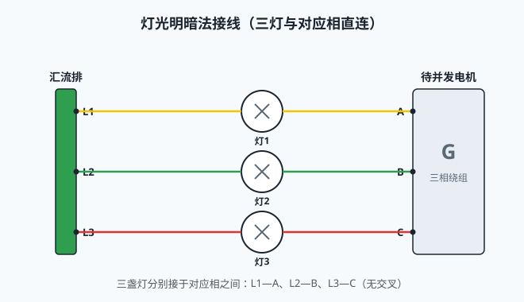
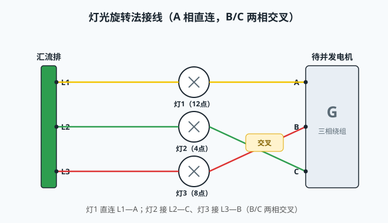
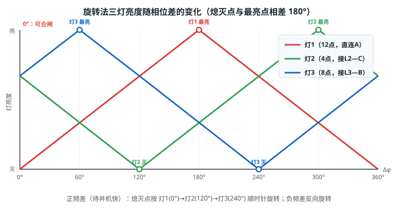

# 灯光旋转法手动准同步并车

## 一、并车的基本条件

待并发电机投入电网（并车）必须同时满足三个条件：**电压相等**（差值不超过 ±10%Un）、**频率接近**（差值不超过 ±0.5Hz）、**相位一致**（合闸瞬间相位差接近 0°）。任一条件不满足，合闸瞬间将产生巨大冲击电流，损伤发电机轴系与绕组，甚至引起全船失电。

同步指示灯就是帮助操作者直观判断"相位是否一致、频差多大、待并机偏快还是偏慢"的工具。按接线方式分为两种：**灯光明暗法**与**灯光旋转法**。

## 二、灯光明暗法（三灯直连）

三盏灯分别接在汇流排与待并机的**对应相**之间：灯1 接 L1—A、灯2 接 L2—B、灯3 接 L3—C，如图 1。

- 两侧频率相同时，三灯亮度恒定不变；
- 频率不同时，每盏灯两端的电压差按差频周期变化，**三灯同时变亮、同时变暗**——"明暗法"由此得名；
- 合闸判据：**三灯全部熄灭**＝两侧电压同相，即可合闸。

明暗法的缺点：三灯步调完全一致，**无法判断待并机偏快还是偏慢**，不能指导调速方向；且接近同相时灯光长时间停留在暗区，合闸时机难以精确把握。

## 三、灯光旋转法（两相交叉）

第 1 盏灯仍直连 L1—A，另两盏**交叉**接线：灯2 接 L2—C、灯3 接 L3—B，如图 2。由于 B、C 两相交叉，三盏灯两端的相位差各不相同，三灯**轮流熄灭**：相位差每转过 120°，熄灭位置就移动一盏灯，明暗沿灯位圆周"旋转"起来——"旋转法"由此得名。

如图 3，每盏灯的**熄灭点与最亮点严格相差 180°**：灯1 熄灭于 0°、最亮于 180°；灯2 熄灭于 120°、最亮于 300°；灯3 熄灭于 240°、最亮于 60°。亮度在熄灭点与最亮点之间线性渐变。

由此得到两条判据：

- **旋转方向指示频差方向**：待并机偏快（正频差）时，熄灭点按 灯1→灯2→灯3 顺时针旋转；偏慢（负频差）时反向旋转。据此调整调速器：顺时针转→降速，逆时针转→升速；
- **合闸判据**：直连 A 相的灯（12 点位置）熄灭、另两灯呈中等亮度时，说明待并机与电网同相，立即合闸。

## 四、明暗法与旋转法对比

| 对比项 | 灯光明暗法 | 灯光旋转法 |
|---|---|---|
| 接线 | 三灯对应相直连（L1—A、L2—B、L3—C） | A 相直连，B/C 两相交叉（L1—A、L2—C、L3—B） |
| 现象 | 三灯同时明暗 | 三灯轮流熄灭，明暗沿圆周旋转 |
| 频差方向 | 无法判断 | 旋转方向指示待并机快/慢 |
| 合闸判据 | 三灯全部熄灭 | 直连相的灯熄灭、另两灯中等亮度 |
| 合闸时机 | 灯暗区停留时间长，难把握 | 熄灭点沿圆周移动，时机明确 |
| 接线错误影响 | 三灯明暗不同步，判据失效 | 熄灭次序改变：接成直连时三灯同步明暗 |

## 五、仿真平台组件实现

本工程"灯光旋转法并车"组件按上述原理仿真：

- 三盏灯沿表盘圆周均布（12/4/8 点），灯与端子按相序对应：12 点灯接上边第 1 相与右边第 1 相之间，4 点、8 点灯类推；
- 上端三相接汇流排 L1/L2/L3，右侧第 1/2/3 相端子接待并机，默认**第 2 相接发电机 L3、第 3 相接 L2**（交叉）；
- 灯亮度随相位差线性渐变，熄灭点与最亮点相差 180°；正频差顺时针旋转（待并机快），负频差逆时针旋转（待并机慢）；
- 频差 Δf 与相位差 Δφ 直接读取数字同步表，两表显示一致；
- 使能受同步表选择开关控制；任一灯一端断线该灯熄灭并提示"接线断开"；第 2/3 相接成直连时三灯同步明暗并提示"接线错误"；
- 并车保护：合闸瞬间频差超过 ±0.5Hz 或相位差处于 60°~300° 区间内，全船主开关立即跳闸。

## 六、操作要点

1. 起动待并机组，将同步表选择开关切至本机档位（灯光旋转组件投入，三灯开始变化）；
2. 观察灯光旋转方向：顺时针说明待并机偏快，应降速；逆时针说明偏慢，应升速；
3. 待灯光旋转缓慢（频差小于 0.5Hz）后继续微调，直至 12 点位置灯接近熄灭；
4. 在 12 点位置灯熄灭、另两灯中等亮度的瞬间果断合闸；
5. 并车成功后进行负荷转移，将原机组解列。
