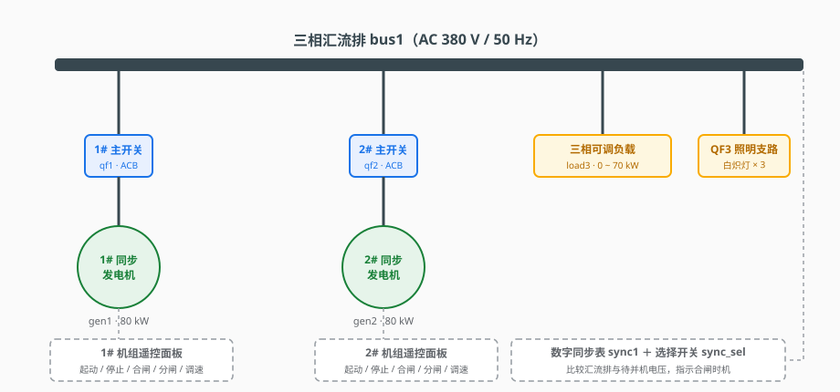
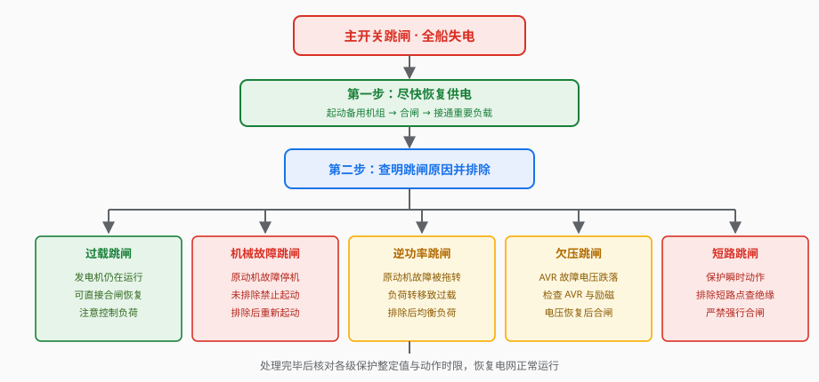

# 非自动化电站主开关跳闸的应急处理

## 一、训练概述

船舶非自动化电站由两台同步发电机组、框架式空气断路器（主开关 ACB）、三相汇流排及馈电支路组成，如图 1 所示。正常航行时一台机组承担全船负荷，另一台作为备用；高峰或机动航行时可两机并联运行。每台机组配有遥控面板，可在集控室完成起动、停机、合闸、分闸与调速操作；数字同步表配合待并机选择开关，用于手动并车时监测相位差、指示合闸时机。

主开关是发电机与汇流排之间的唯一通道，一旦保护动作跳闸，其所属机组即与电网脱离；若在网机组全部退出，便造成全船失电（俗称"黑船"），直接威胁航行安全。本训练通过仿真操作，掌握五类典型故障导致主开关跳闸后的应急处理方法。

## 二、主开关的保护功能

本工程主开关具备以下保护功能，动作后均使开关分闸、机组与电网脱离：

| 保护类型 | 动作条件 | 延时 | 跳闸后机组状态 |
|---------|---------|------|--------------|
| 失压脱扣 | 母线失电、控制电源失压 | 瞬时 | 视故障而定 |
| 过载保护 | 输出功率超过额定 120% | 15 s | 不停机 |
| 逆功率保护 | 原动机故障被拖转，逆功率超过 8 kW | 5 s | 不停机（并网时） |
| 欠压保护 | 输出电压低于约 50% 额定值 | 2 s | 不停机 |
| 短路保护 | 汇流排干线短路 | 瞬时 | 视故障而定 |
| 非同期保护 | 相位差处于 60°~270° 非允许区强行合闸 | 瞬时 | 不停机 |

理解"哪些故障跳闸后发电机仍在运行"是应急处置的关键：过载、欠压、逆功率、短路保护只跳开关，机组本体未必停机；而原动机机械故障（超速、滑油低压、冷却水温高）会使发电机单机运行时直接停机，故障未排除前无法再次起动。

## 三、五类故障跳闸的应急处理

### 1. 原动机机械故障跳闸

超速、滑油低压或冷却水温高等机械故障触发原动机保护：单机运行时发电机立即停机，母线失压，主开关失压脱扣跳闸，全船失电。应急处理：立即起动备用机组，合闸恢复供电并接通重要负载；随后排查机械故障原因。特别注意：故障未排除前该机组无法再次起动，严禁反复强行起动。

### 2. 过载跳闸

单机运行负荷过大（如突然投入大功率负载）时，过载保护经 15 s 延时动作。跳闸后负载随主开关脱离电网，但发电机并未停机，母线电压恢复正常。因此可以直接按遥控面板"合闸"按钮（待合闸弹簧重新储能完成）恢复供电，随后注意控制负荷，避免再次过载；条件允许时起动备用机组并车，由两机分担负荷。

### 3. 逆功率跳闸

两机并联运行中，一台机组原动机发生机械故障后被电网倒拖为电动机运行，向电网吸收功率形成逆功率，逆功率保护经 5 s 延时将其主开关跳闸；该机原来承担的负荷全部转移到另一台机组，若超过其过载整定值，过载保护再经 15 s 延时跳闸，最终全船失电。应急处理：迅速起动备用机组恢复供电；排除原动机故障后重新并车，并注意调整两机频率使负荷均衡分配，运行中加强监视原动机状态，防止此类连锁跳闸再次发生。

### 4. 欠压跳闸

调压器（AVR）故障使发电机输出电压跌落至约 50% 额定值时，欠压保护经 2 s 延时跳闸，发电机仍在运行但电压不合格。应急处理的首要目标仍是尽快恢复供电：迅速起动备用机组合闸接通重要负载；查明欠压原因（AVR、励磁回路）可与之并行开展，切不可因等待排查而延误恢复供电。

### 5. 汇流排短路跳闸

汇流排干线短路电流巨大，短路保护瞬时动作，两台主开关同时跳闸、全船失电。短路是电站最严重的故障，处理时必须查明并排除短路点（绝缘老化损坏、进水受潮、误操作、检修遗留导电物等），确认汇流排绝缘正常后方可合闸恢复供电，严禁在原因不明时强行合闸，否则将扩大事故、损坏设备。若因保护选择性配合不当造成非故障段主开关误跳闸，应优先恢复非故障支路供电，同时隔离故障支路，事后校核各级保护整定值与动作时限。

## 四、全船失电的应急处理总原则

综合上述五类故障，全船失电的应急处置遵循统一顺序，如图 2 所示：

**第一步，尽快恢复供电**：起动备用发电机组，合闸接通重要负载，保障船舶航行与设备安全，这一步优先于一切原因排查。**第二步，查明原因并排除**：借助报警信息与故障现象区分跳闸原因，按第三节所述分类处置；处理后核对保护整定值，恢复电网正常运行。

## 五、仿真训练操作要点

本工程提供五个训练流程，分别对应上述五类故障，均含自动演示、单步演示、演练与评估四种模式。操作要点如下：

1. **设置故障**：点击工具栏"故障设置"按钮，在面板中勾选对应故障项并应用，观察保护动作过程；
2. **机组遥控操作**：按住遥控面板"起动"按钮起动发电机，等待合闸弹簧储能完成（约 2~3 s），再按住"合闸"按钮合闸；分闸同理；
3. **手动并车**：将同步表选择开关切至待并机档位，调节待并机转速使其频率略高于电网（正频差约 0.3 Hz），观察同步表相位差进入允许区后合闸并车；
4. **负荷转移与加载**：微调两机设定频率使功率均衡分配；在"三相可调负载"上先设定功率值，再按"加载"按钮投入负荷；
5. **验证处理效果**：训练模式按步骤操作，系统自动检测每步是否完成；评估模式记录答题与操作成绩。

通过反复演练，学员应达到：见到跳闸现象能快速判断原因类别，按正确顺序恢复供电，杜绝强行合闸等违章操作。
