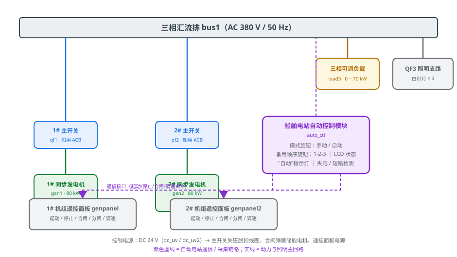
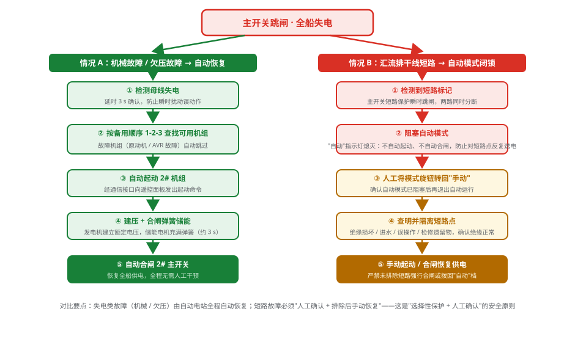

# 自动化电站主开关跳闸的应急处理

## 一、训练概述

船舶电站是全船动力与照明的心脏，主开关（ACB）一旦跳闸即造成全船失电（黑船），直接威胁航行安全。本训练以自动化电站为对象，通过仿真平台完成"起机供电→投入自动→触发故障→观察保护动作→恢复供电"的完整应急处置流程，达到以下目标：

1. 掌握主开关失压、欠压、短路、逆功率等保护的动作条件与现象；
2. 理解船舶电站自动控制模块的失电自动恢复逻辑与短路闭锁逻辑；
3. 树立"恢复供电优先、查明原因并行"的应急处置原则，以及短路故障"人工确认、严禁强送"的安全意识。

## 二、系统组成

本电站为两机一控式自动化电站（图 1），各设备作用如下：

| 设备 | 代号 | 作用 |
|------|------|------|
| 同步发电机 ×2 | gen1 / gen2 | 额定 400 V / 50 Hz / 80 kW，向汇流排供电 |
| 船用主开关 ×2 | qf1 / qf2 | 具备失压、过载、短路、逆功率保护及合闸弹簧储能机构 |
| 机组遥控面板 ×2 | genpanel / genpanel2 | 起动、停止、合闸、分闸、调速，接受自动模块通信命令 |
| 电站自动控制模块 | auto_ctl | 母线采样、失电/短路检测、备用顺序管理、自动起动机组与自动合闸 |
| 三相汇流排 | bus1 | 全船电网母线，AC 380 V / 50 Hz |
| 三相可调负载 | load3 | 0~70 kW 有功负荷，用于功率分配试验 |
| QF3 照明支路 | acb_l | 白炽灯×3，模拟基础照明负载 |

自动控制模块面板设有**模式旋钮（手动/自动）**、**备用顺序旋钮（1-2-3）**、LCD 状态显示与"自动"指示灯。只有旋钮置于"自动"档且模块有电时，自动功能才投入运行。

## 三、自动电站的控制逻辑

**（1）备用顺序管理。** 模块按备用顺序旋钮（默认 1-2-3）对机组排队。任一机组带原动机故障（超速、滑油低压、水温高）或 AVR 欠压故障时，即被标记为"不可用"，自动功能逐台查找时将其**自动跳过**，直接选用下一台可用机组。

**（2）失电自动恢复。** 母线失电后，模块经约 3 s 延时确认（防止瞬时扰动误动作），随即按备用顺序向可用机组的遥控面板发出起动命令；待发电机建压、合闸弹簧储能完成后，再延时发出合闸命令，自动恢复供电，全程无需人工干预。

**（3）短路闭锁。** 模块检测到系统中的短路标记时，立即**阻塞自动模式**："自动"指示灯熄灭，既不自动起动机组也不自动合闸，防止对短路点反复送电扩大事故。此时必须转回"手动"档，人工查明并隔离短路点后方可恢复。

## 四、三种跳闸场景对比

| 场景 | 触发故障 | 保护动作 | 发电机状态 | 恢复方式 |
|------|----------|----------|------------|----------|
| 机械故障跳闸 | 1# 机冷却水温高 | 温高保护停机→母线失压，失压脱扣跳闸 | **立即停机** | 自动识别 1# 机故障并跳过，自动起动 2# 机、自动合闸 |
| 欠压故障跳闸 | 1# 机 AVR 故障 | 电压跌至约 50%，欠压保护延时约 2 s 跳闸 | **不停机**（仅开关分闸） | 同上，1# 机因欠压被判定不可用 |
| 干线短路跳闸 | 汇流排短路 | 短路保护瞬时跳闸（两台同时分闸） | 不停机 | **自动模式被闭锁**，不自动恢复；转手动排查后人工恢复 |

对比可见：机械故障跳闸与欠压跳闸属"失电类故障"，自动电站能自动恢复供电；短路属"设备类故障"，必须人工确认短路点已隔离、汇流排绝缘正常后才能送电——若未排除短路即强行合闸或拨回自动档，将再次对短路点送电，扩大设备损坏甚至引发火灾。

## 五、仿真训练操作要点

1. **建立初始工况**：点击工具栏"自动接线"完成全船接线并复位；按住 1# 遥控面板"起动"按钮起机，观察建压及"合闸弹簧储能"过程（约 3 s），再按"合闸"向汇流排供电。
2. **投入自动模式**：将自动控制模块模式旋钮由"手动"转至"自动"，确认"自动"指示灯点亮、备用顺序保持 1-2-3。
3. **触发故障**：打开故障设置面板，按训练项目勾选"1#机冷却水温高故障"（或"1#机欠压故障"、"汇流排干线短路故障"）并应用。
4. **观察与记录**：依次观察发电机状态、主开关分合状态、自动模块 LCD 与指示灯变化，记录"失电检测→起动 2#机→建压储能→自动合闸"各环节时长；短路项目中观察自动模式闭锁及转手动后的恢复操作。
5. **完成测试题**：结合观察结果回答流程末尾的测试题，检验对自动恢复逻辑与安全原则的掌握程度。

## 六、思考与讨论

1. 全船失电后，自动化电站按什么顺序处理？为何要先恢复供电、再查明原因？
2. 1# 机欠压故障跳闸后，自动电站为什么起动 2# 机而不恢复 1# 机？"不可用机组"如何判定？
3. 干线短路后自动模式为什么被闭锁？恢复送电前必须完成哪几项检查？未排除短路强行合闸有何后果？

> **安全提示**：自动化电站可以代替人工完成"失电恢复"，但**永远不能代替人对短路故障的判断**。任何自动功能都是手段，"查明原因、确认安全"始终是恢复送电的前提。
