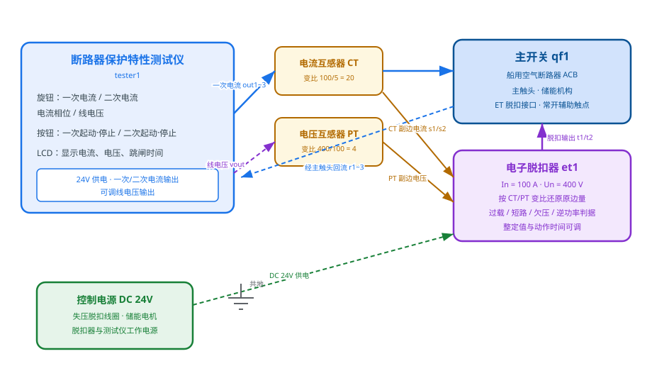
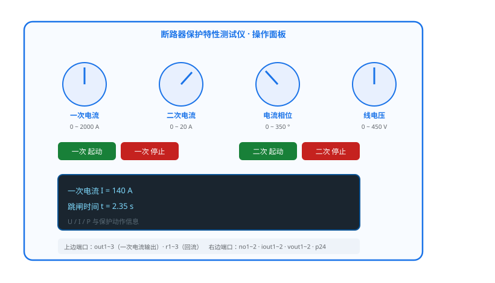
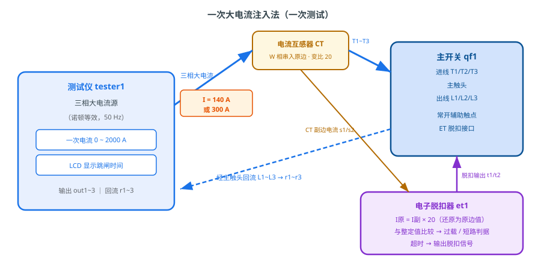
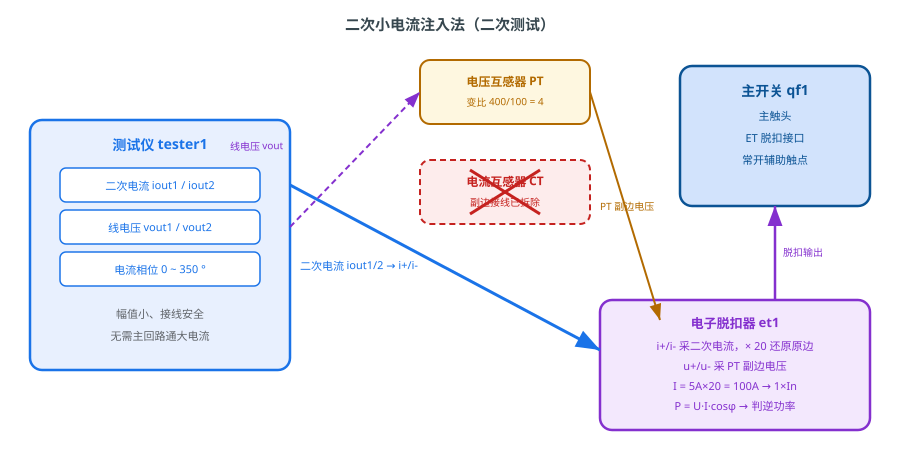
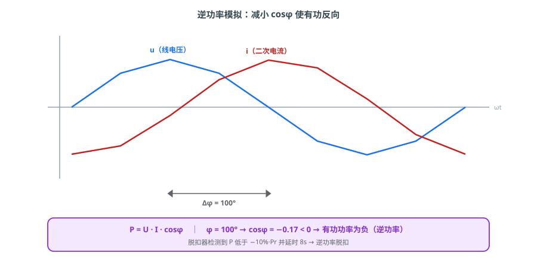
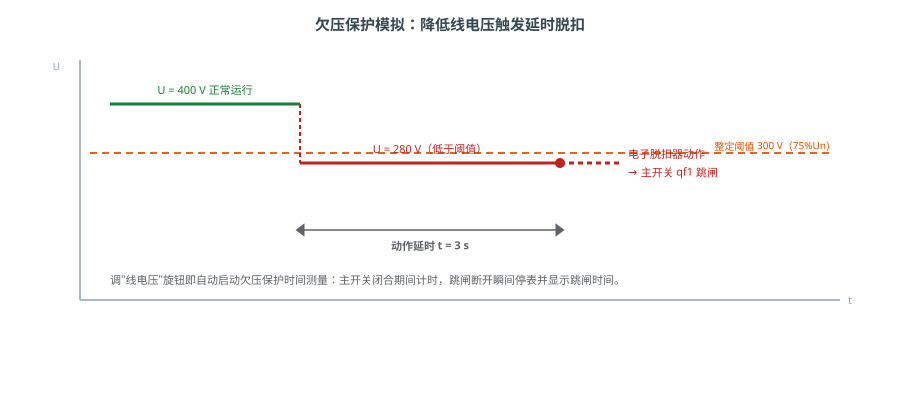
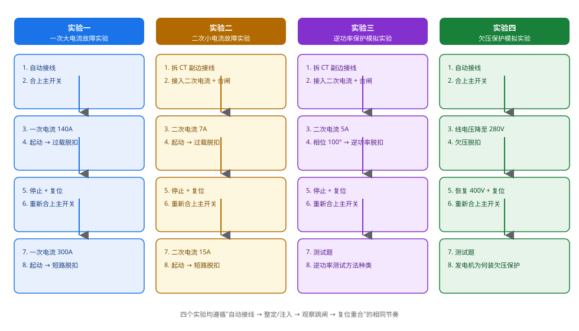

# 主开关保护功能测试

> 以船用空气断路器（ACB）为被试对象，借助断路器保护特性测试仪，对其电子脱扣器的**过载、短路、欠压、逆功率**保护特性进行模拟测试与动作时间测量。

---

## 一、实验目的

1. 掌握断路器保护特性测试仪的组成与工作原理；
2. 理解**一次大电流注入法**与**二次小电流注入法**的区别及适用场合；
3. 学会用**移相法**与**降压法**模拟逆功率、欠压故障，并测量保护动作时间；
4. 熟悉"自动接线 → 整定注入 → 观察跳闸 → 复位重合"的标准化操作流程。

---

## 二、系统组成

本实验涉及"信号源—互感器—保护装置—被控开关"四类设备，它们通过电气连线构成完整的测试回路。理解各部件在回路中的角色及信号流向，是掌握测试方法的前提。

### 2.1 系统组成与信号关系

实验系统由断路器保护特性测试仪、被试主开关、电流互感器（CT）、电压互感器（PT）、电子脱扣器及 DC 24 V 控制电源等构成，如图 1 所示。

测试仪是整个实验的**信号源**：它可向被试主回路注入一次大电流，或向电子脱扣器直接注入模拟二次小电流，同时输出可调线电压。CT 把主回路大电流按变比（本模型 100 A/5 A，变比 20）变换为小信号；PT 把线电压按变比（400 V/100 V，变比 4）变换为电压信号，二者共同送入电子脱扣器。脱扣器按整定的保护判据判断故障，经延时后输出脱扣信号，驱动主开关跳闸。测试仪同时通过主开关的常开辅助触点感知触头状态，在触头断开的瞬间停止计时，从而测得并显示**跳闸时间**。

系统中各部件的作用可概括为：测试仪提供可调、可控的电流与电压激励，是实验的"标准源"；CT、PT 完成一次侧大电量到二次侧小电量的按比例变换，兼起隔离作用；电子脱扣器完成采样、还原、比较、延时与决策；主开关是执行元件，接收脱扣信号后分闸；DC 24 V 电源为脱扣线圈、储能电机与测试仪提供工作电源；接地则保证测量回路有统一的参考电位。

### 2.2 测试仪的操作面板

测试仪面板由四只旋钮、四只按钮和一块液晶屏组成，如图 2 所示。

- **一次电流**旋钮（0～2000 A）：整定一次注入电流幅值；
- **二次电流**旋钮（0～20 A）：整定二次注入电流幅值；
- **电流相位**旋钮（0～350°）：整定向量的相位，用于逆功率模拟；
- **线电压**旋钮（0～450 V）：整定输出电压，用于欠压模拟；
- **一次起动/停止**按钮：控制一次大电流的注入与切除；
- **二次起动/停止**按钮：控制二次电流/线电压的注入与切除；
- **液晶屏（LCD）**：实时显示电流、电压、有功功率及跳闸时间。

---

## 三、断路器保护特性测试仪的工作原理

### 3.1 一次大电流注入法

一次大电流注入法直接在**主回路**中通入可控大电流，检验主开关真实的保护特性，如图 3 所示。

测试仪输出的三相大电流经 out1～out3 流入主开关进线 T1/T2/T3，穿过主触头后由出线 L1/L2/L3 经 r1～r3 回流，形成闭合回路。其中 W 相回路串入 CT 原边，CT 副边电流接入电子脱扣器的 i+/i-。脱扣器按变比把副边电流还原为原边值（I 原 = I 副 × 20），与整定值比较：当电流达到过载整定值（1.2×In = 120 A）时经延时脱扣；达到短路整定值（2×In = 200 A）时迅速脱扣。本实验中一次电流分别整定为 **140 A（过载）** 与 **300 A（短路）**。

该方法最接近真实故障工况，电流大、发热明显，适合验证性实验；缺点是接线粗重、能耗高、大电流下有一定安全风险。

从物理过程看，一次注入的大电流真实流经主触头与母线，CT 原边磁场随电流变化，副边感应出与之成比例的小电流，脱扣器据此"感知"主回路的电流状态。因此一次测试不仅能校验脱扣器整定值，还能同时检验主回路的载流能力与 CT 采样的正确性。

### 3.2 二次小电流注入法

二次小电流注入法**不经过主回路**，而是直接向电子脱扣器的电流采样回路注入标准二次电流，如图 4 所示。

操作时先拆下 CT 副边至脱扣器 i+/i- 的接线，再把测试仪的二次电流输出 iout1/iout2 直接接入 i+/i-；同时保留 PT 电压通道。测试仪输出的二次电流经脱扣器按同一变比还原为原边值：注入 **7 A** 相当于原边 140 A（过载），注入 **15 A** 相当于原边 300 A（短路）。由于注入电流小、接线简单、无需主回路通大电流，这种方法安全方便，是现场校验脱扣器整定值最常用的手段，但无法反映主回路本身（触头、母线）的发热与状态。

| 对比项 | 一次大电流注入法 | 二次小电流注入法 |
|---|---|---|
| 注入位置 | 主回路 | 脱扣器采样回路 |
| 电流大小 | 大（可达数千安） | 小（数安） |
| 是否需拆 CT 副边 | 否 | 是 |
| 能否检验主回路 | 能 | 不能 |
| 安全性与便捷性 | 较低、较繁 | 高、便捷 |
| 典型用途 | 型式试验、验收 | 现场整定校验 |

### 3.3 逆功率模拟（移相法）

逆功率保护用于防止发电机从电网吸收有功功率（如原动机失速、并车异常）。模拟逆功率最常用的方法是**移相法**：保持注入电流幅值不变，只改变电流与电压之间的相位差，如图 5 所示。

当电流滞后电压 100° 时，功率因数 cosφ = cos100° ≈ −0.17 < 0，有功功率 P = U·I·cosφ 变为**负值**，即逆功率。电子脱扣器以滑动窗口计算平均有功功率，当其低于 −10%·Pr 的整定值时开始计时，经延时（本模型 8 s）后脱扣。本实验将二次电流整定为 5 A（对应原边额定 100 A）、相位 100°，即可稳定复现逆功率工况而不会触发过流保护。

需要特别注意的是，逆功率判据比较的是**有功功率的方向**而非大小，因此模拟时必须保持电流幅值在额定附近（1×In），仅改变相位；若同时增大电流，可能先触发过载或短路保护，得到的是保护优先级中更高一级的动作，而非逆功率脱扣。

### 3.4 欠压模拟（降压法）

欠压保护用于在发电机端电压过低时切除机组或负荷，防止电动机堵转、机组失步与系统电压崩溃。模拟方法十分直接：**降低线电压**，如图 6 所示。

正常运行电压为 400 V，脱扣器欠压整定值为 75%·Un = 300 V。把测试仪"线电压"旋钮调至 **280 V**，低于整定阈值，脱扣器经延时（本模型 3 s）后动作，主开关跳闸。测试仪在旋钮调整时自动启动欠压时间测量：主开关闭合期间累计计时，触头断开瞬间停表并显示跳闸时间，便于直观读出动作延时。

欠压保护之所以必须带延时，是为了躲过电动机启动、大负荷投切等引起的短时电压跌落，避免不必要的误跳闸；只有当电压持续低于阈值超过整定时间，才判定为真正的欠压故障。

### 3.5 电子脱扣器的保护判据

电子脱扣器是整套系统的"大脑"，其判据按优先级依次为：

| 保护类型 | 判据 | 本模型整定 |
|---|---|---|
| 特大短路 | I ≥ 5×In | 瞬时 |
| 短路 | I ≥ 2×In | 0.4 s |
| 过载 | I ≥ 1.2×In | 15 s |
| 欠压 | U < 75%·Un | 3 s |
| 逆功率 | P < −10%·Pr | 8 s |

超阈值后计时，达到整定延时即置脱扣位，经 t1/t2 输出 24 V 脱扣信号使主开关跳闸；故障消失后需**手动复位**才能重新合闸。

上述判据的执行依赖一条完整的信号链：采样 → 还原 → 比较 → 计时 → 输出。脱扣器先将 i+/i- 上的副边电量乘以 CT 变比、将 u+/u- 上的副边电压乘以 PT 变比，还原为一次值，再与整定值比较；为防止电网波动与测量噪声造成误动，过流、欠压等判据均设有一定延时，并采用滑动窗口求有效值与平均功率，保证结果稳定可靠。判据之间存在优先级：电流类判据优先于欠压与逆功率，因此模拟某种故障时应避免同时越限。

---

## 四、实验流程

四个实验均遵循相同的四段节奏，如图 7 所示。

每个实验的通用操作要点如下：

1. **接线**：点击工具栏"自动接线"完成标准接线；二次类实验还需撤销 CT 副边接线并接入二次电流；
2. **合闸**：主开关需先储能再合闸，合闸后常开辅助触点闭合，测试仪才能感知"计时起点"；
3. **整定与注入**：按目标故障类型设定电流、相位或电压，再点击起动按钮注入；
4. **观察与记录**：注视液晶屏，待显示跳闸时间后记录数据；
5. **复位**：停止注入、复位脱扣器，方可重新合闸进行下一轮测试。

### 实验一：一次大电流故障实验

1. 自动接线并合上主开关；
2. 将一次电流调到 **140 A**，点击"一次 起动"，触发过载，观察液晶屏至显示跳闸时间；
3. 点击"一次 停止"，复位电子脱扣器，重新合上主开关；
4. 将一次电流调到 **300 A**，点击"一次 起动"，触发短路，观察跳闸时间。

**观察与分析**：140 A 时过载保护经较长延时动作，300 A 时短路保护迅速动作，可见电流越大动作越快，体现了反时限保护特性。

### 实验二：二次小电流故障实验

1. 自动接线后**撤销 CT 副边接线、接入二次电流**，合上主开关；
2. 将二次电流调到 **7 A**，点击"二次 起动"，触发过载，观察跳闸时间；
3. 点击"二次 停止"，复位电子脱扣器，重新合上主开关；
4. 将二次电流调到 **15 A**，点击"二次 起动"，触发短路，观察跳闸时间。

**观察与分析**：二次 7 A、15 A 经变比还原后与原边 140 A、300 A 等效，测得的跳闸时间应与一次测试基本一致，说明二次注入法能以小信号等效替代一次大电流测试。

### 实验三：逆功率保护模拟实验

1. 自动接线后撤销 CT 副边接线、接入二次电流，合上主开关；
2. 将二次电流调到 **5 A**、电流相位调到 **100°**，点击"二次 起动"，触发逆功率，观察跳闸时间；
3. 点击"二次 停止"，复位电子脱扣器，重新合上主开关；
4. 完成测试题：逆功率保护测试方法的种类（移相法等）。

**观察与分析**：电流幅值保持额定、相位超过 90° 后有功功率反向，脱扣器按逆功率整定延时动作，验证了移相法模拟逆功率的有效性。

### 实验四：欠压保护模拟实验

1. 自动接线并合上主开关；
2. 将线电压减少到 **280 V**，触发欠压，观察液晶屏至显示跳闸时间；
3. 恢复电压到 **400 V**，复位电子脱扣器，重新合上主开关；
4. 完成测试题：发电机为什么要实施欠压保护。

**观察与分析**：电压降至阈值以下并持续整定延时后脱扣，恢复电压并复位后可重新合闸，说明欠压保护具有延时确认、需手动复位的特点。

---

## 五、思考题

1. 一次大电流注入法与二次小电流注入法各有什么优缺点？现场校验脱扣器时为何优先采用二次注入？
2. 逆功率模拟中为何要"保持电流幅值不变、只改变相位"？若同时改变幅值会出现什么问题？
3. 欠压保护的动作时间为何需要延时？若取消延时会带来什么后果？
4. 脱扣器动作后为什么要先复位再重新合闸？
5. 若主开关未合闸就注入二次电流，测试仪为什么无法测出跳闸时间？由此说明辅助触点在测试回路中的作用。
