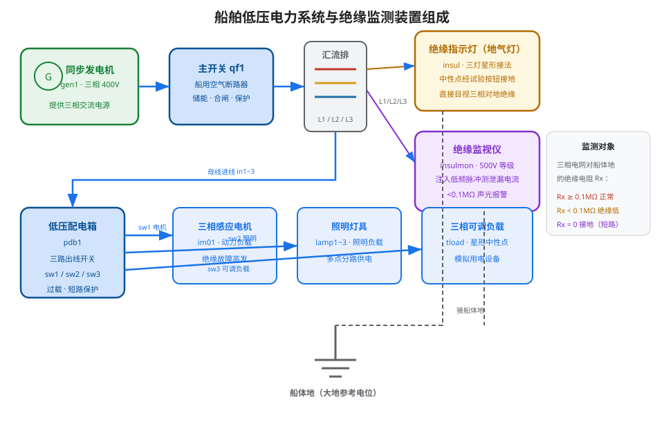
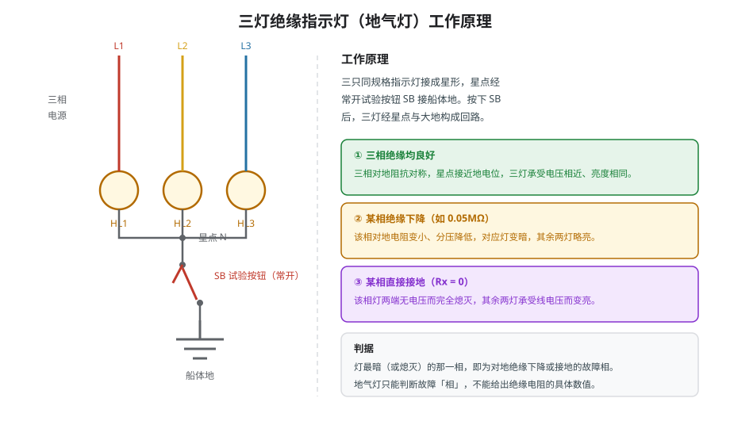
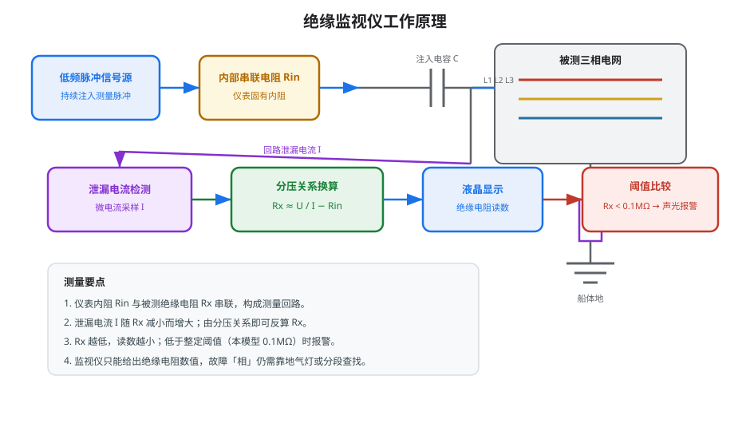
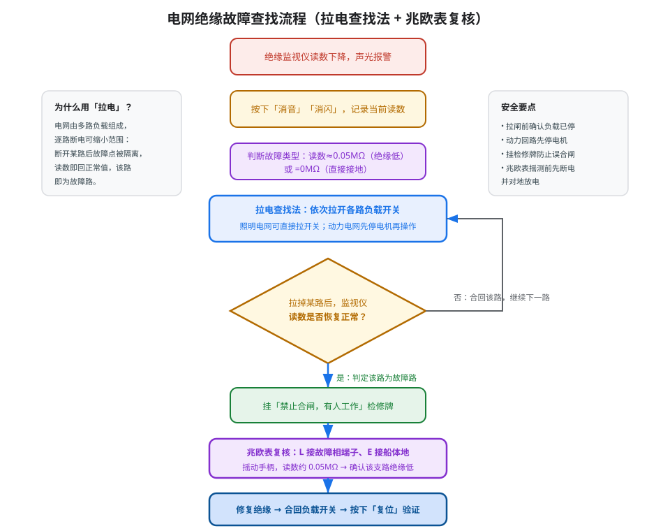

# 船舶绝缘故障查找

> 面向船舶低压电力系统，讲解**三灯绝缘指示灯（地气灯）**与**绝缘监视仪**的工作原理，以及"拉电查找法 + 兆欧表复核"的绝缘故障查找方法与标准操作流程。本文与仿真工程 `sys11-iso` 对应。

---

## 一、为什么船舶电网必须监测绝缘

船舶低压电力系统通常采用**中性点不接地系统**（IT 系统），船体作为公共参考电位。相线对船体之间只隔着一层绝缘介质，正常状态下呈现为很高的绝缘电阻（几十至数百 MΩ）。一旦绝缘受潮、老化、机械损伤或被油污污染，绝缘电阻就会下降；严重时导线直接碰壳，形成**单相接地**。

绝缘故障的危害是渐进而严重的：轻微绝缘下降若不及时发现，会发展为相间短路；单相接地后，非故障相对地电压会升高到线电压，进一步击穿绝缘；同时可能造成人员触电、设备外壳带电、保护误动或火灾。因此，船舶电网必须配置**绝缘监测装置**，做到"早发现、早定位、早处理"。

船舶电网为何采用中性点不接地方式？因为发生单相接地时，故障电流只能经绝缘电阻与分布电容流通，数值很小，不会像中性点直接接地系统那样立即产生大短路电流，从而保证供电的连续性；但这也意味着故障初期具有很强的"潜伏性"——接地相不易被察觉，往往要等到绝缘进一步恶化、发展为多相短路才暴露。既不能靠大电流保护动作来发现，又必须尽早发现，这正是绝缘监测装置存在的意义。

本仿真系统的主接线如图 1 所示：同步发电机经主开关送入汇流排，再由低压配电箱分三路供给三相感应电机（动力负载）、照明灯具（照明负载）和三相可调负载；绝缘指示灯与绝缘监视仪并联接于汇流排与船体地之间，共同构成绝缘监测环节。

---

## 二、地气灯（三灯绝缘指示灯）工作原理

三灯绝缘指示灯俗称"地气灯"，是船舶上最直观的绝缘检查装置，其原理如图 2 所示。三只同规格指示灯接成**星形**，分别接 L1、L2、L3 三相，星点经一个**常开试验按钮 SB** 接船体地。平时按钮断开，三灯不构成回路；按下按钮后，三灯经星点与船体地形成检测回路。

其核心在于**三相对地阻抗的分压关系**：

1. **三相绝缘均良好**——三相对地绝缘电阻基本相等且远大于灯丝电阻，星点接近地电位，三灯承受的电压相近，因此**亮度相同**。
2. **某相绝缘下降（如 0.05 MΩ）**——该相对地电阻显著变小，使星点电位偏移，该相灯两端分压减小、**灯变暗**，其余两相灯略亮。
3. **某相直接接地（Rx = 0）**——该相与地等电位，对应灯两端几乎无电压而**完全熄灭**，另外两相灯承受线电压而变亮。

因此，**最暗（或熄灭）的那一相就是故障相**。需要强调的是：

- 地气灯只能判断故障**相**，不能给出绝缘电阻的具体**数值**；
- 由于是按压式检查，只能间断观察，无法连续监测；
- 灯丝本身也是负载，会对测量产生一定影响，故它更多用于辅助判断而非精确测量。

---

## 三、绝缘监视仪工作原理

绝缘监视仪是能够**连续、定量**监测电网绝缘的仪表，与地气灯互补，其原理如图 3 所示。它不断向被测电网（经注入电容）注入一个**低频测量脉冲信号**，信号在仪表内部依次经过**内部串联电阻 Rin**、注入电容，再进入被测电网，最后经**被测绝缘电阻 Rx** 回到船体地，形成测量回路。

在回路中，仪表内阻 Rin 与被测绝缘电阻 Rx 串联，回路电流即**泄漏电流 I**。由于注入电压 U 与内部电阻 Rin 已知，仪表通过检测泄漏电流，利用串联分压关系即可反算出绝缘电阻：

> Rx ≈ U / I − Rin

由此可看出仪表的工作规律：

- **绝缘电阻越小 → 泄漏电流越大 → 显示读数越小**；
- 当绝缘电阻低于整定阈值（本模型为 **0.1 MΩ**）时，仪表发出**声光报警**；
- 报警后可**消音**（关闭蜂鸣）、**消闪**（报警灯由闪烁转为常亮锁定），以确认故障已被人注意，但报警状态会保留；
- 只有绝缘恢复正常（读数回升到阈值以上）后按下**复位**，才能解除锁存、熄灭报警灯。

测量之所以采用**低频脉冲**而不是直流或工频，是为了排除电网对地**分布电容**的分流影响：直流会被电容隔离，无法真实反映泄漏电流；工频信号又容易被系统自身的电压干扰。低频脉冲既能穿透电容效应，又便于与工频量区分，从而稳定地反映绝缘电阻。报警阈值取 0.1 MΩ，则是兼顾安全裕度与误报率的工程折中——低于该值即认为绝缘已明显劣化，需要尽快查找处理。

绝缘监视仪的优势是实时、定量、可远传；局限是它只给出"绝缘电阻数值"，若电网由多路负载组成，仍无法直接指出**具体是哪一路**，这就需要下一节的查找方法配合。

---

## 四、绝缘故障查找的方法与流程

当绝缘监视仪报警后，应按"**确认现象 → 缩小范围 → 精确定位 → 修复验证**"的思路处理，标准流程如图 4 所示。

### 4.1 拉电查找法

电网往往由多路负载（如动力、照明、可调负载）组成，每路又可能再分支路。**拉电查找法**的做法是：依次断开某一支路的开关，观察绝缘监视仪读数是否恢复正常。

- 若拉到某一路时**读数恢复**到阈值以上，说明**该路即为绝缘故障所在的支路**，因为故障点已随该路被隔离；
- 若读数仍然偏低，则合回该路，继续排查下一路。

这一方法安全、快速，能逐级缩小故障范围，是分路绝缘故障查找的常用手段。

例如：三路负载中照明回路的 B 相绝缘下降，监视仪读数降至 0.05 MΩ。依次拉开照明、动力、可调三路开关观察读数——当拉开**照明**一路时，读数由 0.05 MΩ 回升到 100 MΩ 以上，而拉开其它路时读数几乎不变，即可判定故障在**照明回路**；随后再对照明回路的下级分支路继续拉电查找，逐步缩小到具体支路。

### 4.2 兆欧表复核

定位到故障支路后，用**手摇兆欧表（绝缘电阻表）**做最终确认。按规程应先**断电并验电、放电**，然后在配电箱上挂"**禁止合闸，有人工作**"检修牌，再：

1. 将兆欧表的 **L 端**接到被测负载的某一相端子；
2. 将 **E 端**接到船体地；
3. 以额定转速摇动手柄，读出绝缘电阻值。

若某相读数约为 0.05 MΩ（明显低于正常值），即可确认该支路该相绝缘不良。兆欧表与被测设备间不应有其它并联通路，测量中不得触碰接线端子，测完应放电。

### 4.3 动力电网与照明电网查找的区别

- **照明电网**由多个照明支路开关供电，支路多而分散，可直接**拉照明开关**逐级断电查找；
- **动力电网**负载为电动机等大功率设备，带载拉闸会产生较大工况变化甚至电弧，因此必须**先停机（停电机）、使负载断电后**再操作。

两者手法相似（拉电/断电后观察读数），但动力回路强调"**先停机再操作**"。

### 4.4 标准操作流程（对应仿真流程 2）

1. 自动接线，起动同步发电机，合上主开关，依次合上三路负载开关，为绝缘指示灯与监视仪供电；
2. 触发"动力电网绝缘低"故障，监视仪读数下降至约 0.05 MΩ，声光报警；
3. 按下"消音""消闪"，报警灯转为常亮；
4. 采用拉电查找法逐路拉闸，当拉到某路时读数恢复正常，判定该路绝缘低；
5. 挂检修牌，调出手摇兆欧表，L 接故障相、E 接地，摇测复核（读数约 0.05 MΩ）；
6. 修复绝缘故障，合回负载开关，按下"复位"，报警解除、读数恢复正常。

---

## 五、绝缘低与接地故障对照

| 项目 | 绝缘低（如 0.05 MΩ） | 直接接地（Rx = 0） |
|------|----------------------|-------------------|
| 监视仪读数 | 明显下降，低于阈值 | 降至 0 MΩ |
| 地气灯现象 | 故障相灯变暗，其余略亮 | 故障相灯熄灭，其余变亮 |
| 报警表现 | 越限后声光报警 | 越限后声光报警，更严重 |
| 危害程度 | 需尽快处理，防止恶化 | 非故障相电压升高，须立即处理 |
| 查找方法 | 拉电查找法 + 兆欧表复核 | 拉电查找法 + 兆欧表复核 |

---

## 六、安全注意事项

1. 拉闸前确认负载已停，动力回路先停电机，避免带载拉闸；
2. 挂"禁止合闸，有人工作"检修牌，防止他人误合闸；
3. 兆欧表测量前必须断电、验电并对地放电，测量中不得触碰端子；
4. 摇测时兆欧表输出高压，严禁在测量回路中作业；
5. 处理完毕后合闸前应再次确认绝缘已恢复，并复位报警、观察读数。

---

## 七、小结

船舶绝缘监测采用"**地气灯 + 绝缘监视仪**"双重手段：地气灯通过三灯亮度差异直观判断故障**相**，绝缘监视仪通过注入脉冲、测量泄漏电流定量给出绝缘**电阻值**并报警。故障发生后，先用**拉电查找法**逐路缩小范围、定位故障支路，再用**兆欧表复核**确认具体相与阻值，最后修复绝缘、合闸并复位报警。掌握这一"**目视判相—定量监测—拉电定位—摇表复核**"的完整链条，是船舶电气人员处理绝缘故障的基本功。
