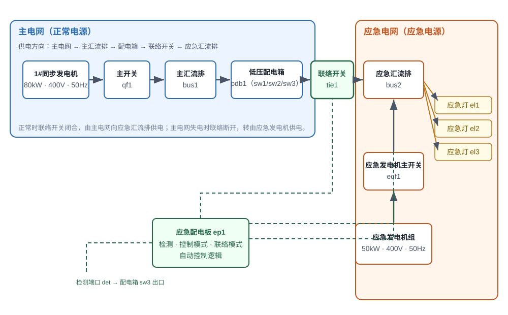
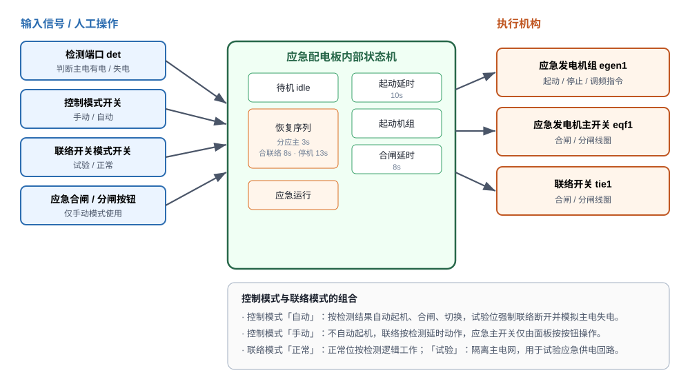
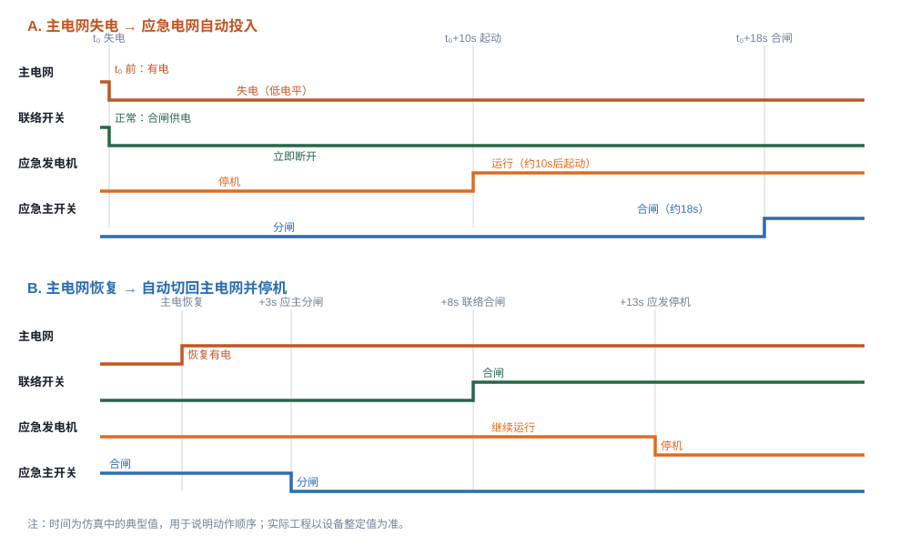
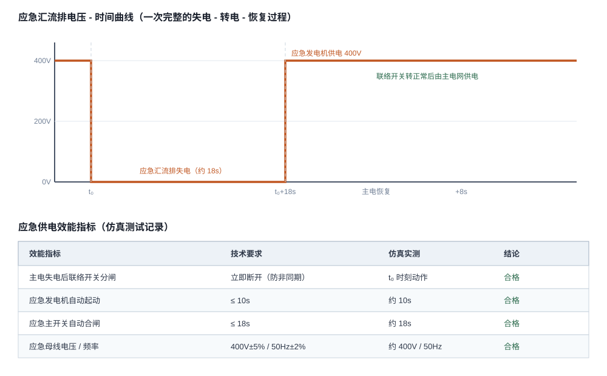

# 船舶应急配电板功能测试

在船舶电力系统中，主电网承担全船正常用电，应急电网则在主电网失电时迅速接替，保障应急照明、通信、导航等关键负载。二者能否可靠配合，取决于**应急配电板（EmergencyPanel）**的检测与自动控制逻辑。本仿真正是围绕这一核心，帮助学员掌握主/应急两网的关系、联络开关的切换规则，以及应急发电机的自动起动与供电效能。

## 一、主电网与应急电网的关系

系统由两套电源与一条联络通道构成：

| 电网 | 主要组成 |
|------|----------|
| 主电网 | 1#同步发电机（80kW / 400V / 50Hz）→ 主开关 qf1 → 主汇流排 bus1 → 低压配电箱 pdb1 |
| 应急电网 | 应急发电机组（50kW / 400V / 50Hz）→ 应急发电机主开关 eqf1 → 应急汇流排 bus2 → 应急灯 el1/el2/el3 |
| 联络通道 | 低压配电箱第 3 路开关 sw3（应急供电开关）→ 联络开关 tie1 → 应急汇流排 bus2 |

两套电网之间由**联络开关 tie1** 桥接。应急配电板的检测端口 det 取自配电箱 sw3 出口，用来判断主电是否有电——这正是整个自动转电逻辑的「眼睛」。

- **正常工况**：主电网有电，联络开关合闸，主电网经「主汇流排 → sw3 → 联络开关 → 应急汇流排」向应急负载供电，应急发电机停机备用。
- **主电失电**：det 电压消失，应急配电板**立即断开联络开关**，随后自动起动应急发电机并合上应急主开关，由应急电网独立供电。
- **主电恢复**：配电板自动分断应急主开关、合上联络开关、停掉应急发电机，重新回到主电网供电。

> 记忆要点：**主电有电——联络合、应急停；主电失电——联络分、应急投；主电恢复——应急退、联络合。**

## 二、联络开关

联络开关 tie1 是连接主电网与应急电网的咽喉设备，其状态直接决定两网是否并列，因此必须遵循**先断后合、禁止非同期并列**的原则。

- **正常位**：按检测逻辑工作——主电有电时合闸，把主电网送到应急汇流排；主电失电时立即分闸，为应急电网让出通道。
- **试验位**：应急配电板强制联络开关断开，并模拟主电失电，用于在不影响主电网的前提下检验应急供电回路。

联络开关的分励、合闸、失压线圈分别由独立控制电源与独立接地回路驱动，应急配电板通过端口输出电压来操作线圈完成合/分，而不是靠机械联动。因此，一旦控制电源、线圈回路或接地接线有误，联络开关就会出现「该分不分、该合不合」的现象。

## 三、应急发电机手动起动测试

为验证机组本体与手动操作功能，先做手动测试（操作流程一）：

1. 自动接线，起动 1#同步发电机并合上主开关供电；
2. 在机旁控制面板把应急发电机「控制方式」开关拨到**手动**；
3. 按「起动」按钮起动应急发电机，观察机旁 LCD 的电压与频率；
4. 按「停止」按钮手动停机；
5. 把控制开关拨回**自动**，恢复自动控制。

手动模式下，应急配电板不会自动起机，联络开关仅按检测延时动作，应急主开关也只能由面板按钮操作，便于单独检查设备状态。这也是规程要求「检修、试验或岸电接入前先切手动」的原因。

## 四、应急发电机自动起动测试

自动测试（操作流程二）考察配电板的自动转电能力，可用两种方式触发：

- **联络开关试验位**：把联络开关模式开关转到「试验」位，配电板强制联络断开并模拟失电，触发自动起动序列；
- **断开配电箱应急供电开关**：断开 sw3（第 3 路开关），检测端口失压，同样触发自动转电。

自动转电的典型时序如下：

| 时刻 | 动作 |
|------|------|
| t₀ | 主电失电，联络开关立即分闸 |
| t₀+10s | 应急发电机自动起动 |
| t₀+18s | 应急主开关自动合闸，应急电网投入 |
| 主电恢复 +3s | 应急主开关分闸 |
| 主电恢复 +8s | 联络开关合闸，恢复主电网供电 |
| 主电恢复 +13s | 应急发电机自动停机 |

整个过程无需人工干预。可以看到，应急电网的投入存在一段必然的「空窗期」（约 18s），这正是应急电源无法瞬时供电的客观限制，也是效能实验要重点测量的对象。

## 五、应急供电效能实验

效能实验的目的是量化「应急供电是否及时、可靠、合格」。完成一次完整的「失电—转电—恢复」过程后，按下表记录并判定：

| 测试项目 | 技术要求 | 观察方法 |
|----------|----------|----------|
| 失电时联络开关分闸 | 立即断开 | 观察 tie1 状态与指示灯 |
| 应急发电机起动延时 | ≤10s | 从失电到机组运行 |
| 应急主开关合闸延时 | ≤18s | 从失电到 eqf1 合闸 |
| 应急母线电压 | 400V±5% | 应急汇流排 / 机组 LCD |
| 应急母线频率 | 50Hz±2% | 机组 LCD |
| 应急负载供电 | 三盏应急灯点亮 | 观察 el1~el3 |

实验步骤建议：①按流程二完成一次自动转电；②记录失电到起机、合闸的时间；③读取应急母线电压、频率；④确认应急灯全部点亮；⑤把联络开关转回正常位，观察恢复时序并记录停机时间。若出现起机过慢、主开关拒动或电压频率异常，应检查控制电源、合闸/分励线圈回路与检测端口接线。

## 六、思考与测试

1. 为什么接入岸电或主电恢复前，必须先将应急发电机置于手动或分闸状态？
2. 若把联络开关先合闸、后分应急主开关，会产生什么后果？
3. 试验位与正常位下，联络开关的动作逻辑有何本质区别？

**参考要点**：避免非同期并列造成短路与设备损坏；应先确认主电网已恢复、频率电压正常，再切除应急电源；试验位是强制断开并模拟失电，正常位则按实际检测结果动作。掌握这三点，就能从「会操作」进阶到「懂原理」。
