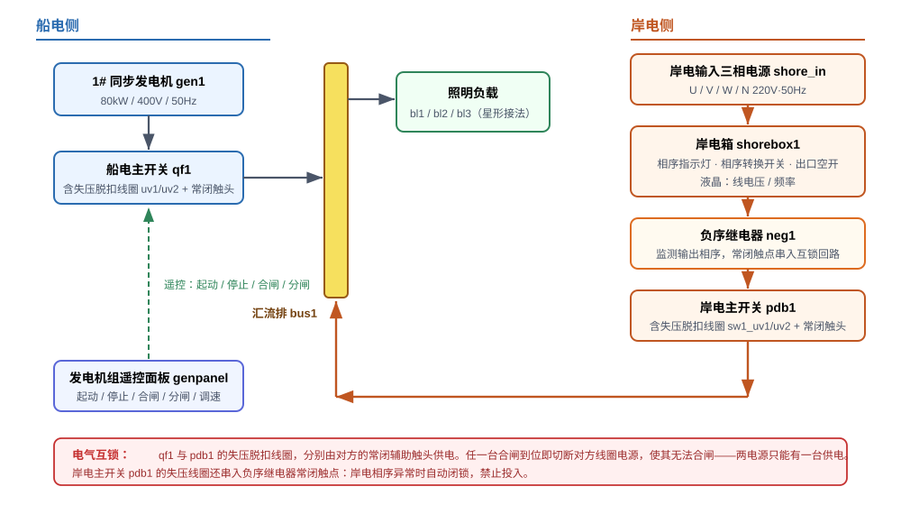
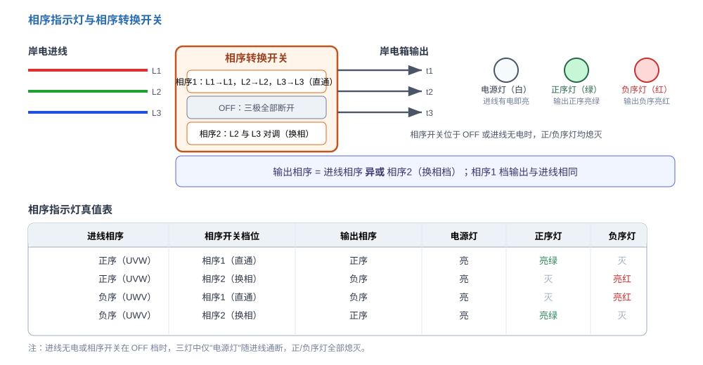
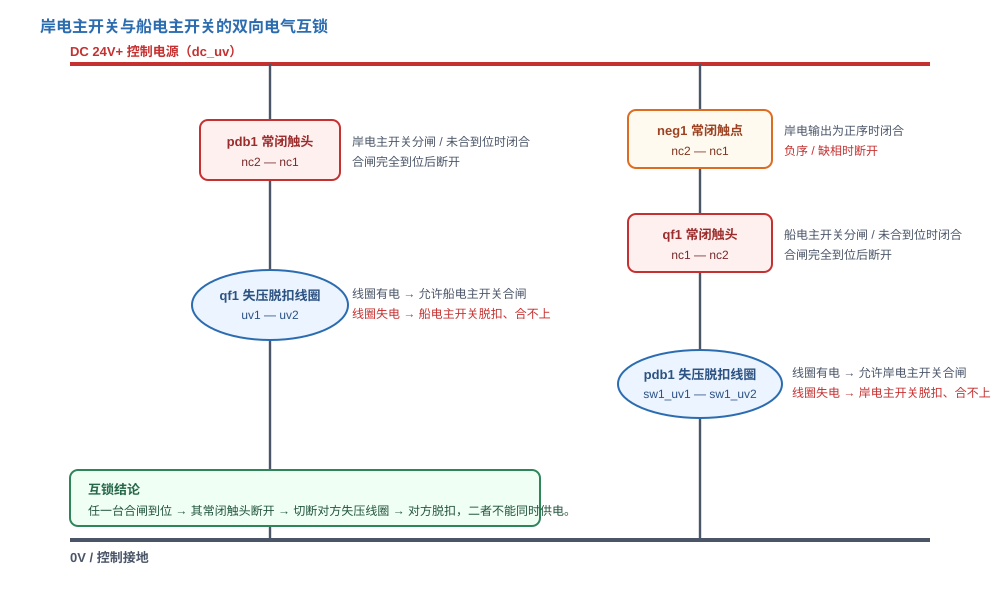
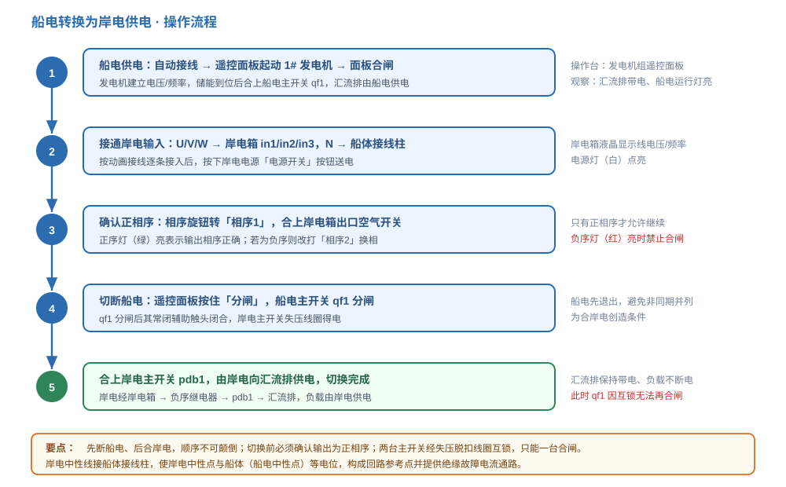

# 船电、岸电切换

船舶靠港后通常停掉船用发电机、改由码头电源（岸电）供电，以节约燃油、降低排放与噪声。岸电与船电（船上发电机）是两套相互独立的电源，**绝不允许同时向船舶电网供电**，否则会因非同期并列产生巨大冲击电流，造成短路与设备损坏。本仿真以「1# 同步发电机 → 船电主开关 → 汇流排 ← 岸电主开关 ← 负序继电器 ← 岸电箱 ← 岸电电源」为主线，重点讲解相序指示、负序保护与双向电气互锁，并演示「船电转换为岸电」的完整操作。

## 一、系统组成

| 侧别 | 组成 |
|------|------|
| 船电侧 | 1# 同步发电机 gen1（80kW / 400V / 50Hz）→ 船电主开关 qf1 → 汇流排 bus1；发电机组遥控面板 genpanel 负责起动、停止、合闸、分闸与调速 |
| 岸电侧 | 岸电输入三相电源 shore_in（U/V/W/N）→ 岸电箱 shorebox1（相序指示 + 相序转换 + 出口空气开关）→ 负序继电器 neg1 → 岸电主开关 pdb1 → 汇流排 bus1 |
| 负载 | 三盏白炽灯 bl1~bl3 星形接法接于汇流排 |
| 控制电源 | DC 24V 电源 dc_uv，为两台主开关的失压脱扣线圈及遥控面板供电 |

两条供电通道在汇流排处汇合，谁合闸谁供电，因此在任一时刻只允许一条通道投入。能否安全切换，取决于三点：**岸电相序是否正确、中性线（中线）是否可靠连接、以及两台主开关能否严格互斥**。岸电箱负责相序的检测与转换，负序继电器负责相序闭锁，失压脱扣线圈负责互锁，三者协同构成完整的切换安全链。船电与岸电互为备用电源，其切换必须遵循「先断后合、禁止并列」的基本原则：任何时候都先让在网电源退出，再投入待用电源，绝不允许两者同时挂在汇流排上。

## 二、相序指示灯

岸电箱左侧面板有一排三只圆形指示灯：**电源（白）、正序（绿）、负序（红）**，用于直观判断岸电的输出相序。

- 岸电进线带电时，**电源灯**点亮；
- 相序转换开关不在 OFF 档且输出为**正相序**时，**正序灯**亮绿；
- 输出为**负相序**时，**负序灯**亮红；
- 相序转换开关打到 OFF 或进线无电时，正、负序灯全部熄灭。

相序转换开关有三档：**相序1**（三线直通）、**OFF**（三极断开）、**相序2**（L2 与 L3 对调，即换相）。其规律为：

> **输出相序 = 进线相序 异或 相序2档。**

因此，若进线本身是负序，只要把开关打到「相序2」即可得到正序输出；反之亦然。这正是岸电箱「先看灯、再调档」的操作依据。

实际操作要点：先合上岸电电源，观察电源灯是否点亮；再转动相序转换旋钮，边转边看正序灯与负序灯，直到正序灯稳定亮绿；确认液晶显示的线电压约为 400V、频率约为 50Hz 后，才允许合上出口空气开关。**不可省略「看灯确认」这一步**——相序指示灯是把不可见的相位关系变成可见的颜色信号，让操作人员在合闸前就能判断岸电是否可用。

## 三、负序继电器

负序继电器 neg1 接在岸电箱的**输出端（t1/t2/t3）**，实时检测输出相序，其**常闭触点**串接在岸电主开关失压脱扣线圈的供电回路中：

- 输出为**正相序**时，常闭触点闭合，允许岸电主开关合闸；
- 输出为**负序或缺相**时，常闭触点断开，切断失压脱扣线圈电源，使岸电主开关**合不上闸**（或合上后随即跳闸）。

相序接反会使三相电动机反转、计时器失真，甚至损坏设备，因此必须在合闸前把关。**相序指示灯负责「观察」，负序继电器负责「闭锁」**，两者一观一控，共同构成相序保护。即使值班人员一时疏忽、在负序状态下误按合闸，继电器的常闭触点也会在合闸回路断开，使岸电主开关无法保持合闸，形成不依赖人判断的第二道防线。

## 四、岸电与船电的电气互锁

两台主开关都装有**失压脱扣线圈（UV）**。线圈有电时脱扣轴释放、开关才能合闸并保持；线圈一旦失电，开关立即脱扣，且无法再合闸。互锁正是利用这一特性实现的：

- **船电主开关 qf1 的失压线圈**，由**岸电主开关 pdb1 的常闭辅助触头**（nc2→nc1）供电；
- **岸电主开关 pdb1 的失压线圈**，由**负序继电器常闭触点**与**船电主开关 qf1 的常闭辅助触头**串联供电。

由此得到两条结论：

1. 岸电主开关合闸完全到位后，其常闭触头断开，切断 qf1 的失压线圈电源 —— 船电主开关随即脱扣，无法合闸；
2. 船电主开关合闸到位后，其常闭触头断开，切断 pdb1 的失压线圈电源 —— 岸电主开关无法合闸。

可见，**任一台合闸都会自动锁死另一台**，从电气上杜绝船电与岸电同时供电。两台主开关的状态组合可归纳如下：

| 船电主开关 qf1 | 岸电主开关 pdb1 | 供电与互锁结果 |
|:---:|:---:|------|
| 合闸 | 分闸 | 船电供电；pdb1 失压线圈失电，无法合闸 |
| 分闸 | 合闸 | 岸电供电；qf1 失压线圈失电，无法合闸 |
| 分闸 | 分闸 | 两电源均退出，汇流排由负载侧自然失电 |
| 合闸 | 合闸 | 互锁不允许，实际不可能出现 |

需要注意的是：常闭辅助触头只有在**合闸完全到位**时才断开；合闸中途或被互锁弹回（TRIP）时保持闭合，避免误切对方线圈造成误跳。

## 五、船电转换为岸电供电流程

1. **船电供电**：在遥控面板上按住「起动」按钮起动 1# 发电机，待储能到位后再按「合闸」按钮合上 qf1，汇流排由船电供电。
2. **接通岸电输入**：将岸电 U/V/W 接岸电箱 in1/in2/in3、N 接船体接线柱（逐条动画接线），随后按下岸电电源的「电源开关」按钮送电。
3. **确认正相序**：把相序转换旋钮转到「相序1」，观察正序灯是否亮绿、液晶线电压与频率是否正常，确认后合上岸电箱出口空气开关。
4. **切断船电**：在遥控面板上按住「分闸」按钮，使 qf1 分闸。此时 qf1 常闭触头闭合，岸电主开关的失压线圈得电，具备合闸条件。
5. **合上岸电**：合上岸电主开关 pdb1，岸电经「岸电箱 → 负序继电器 → pdb1 → 汇流排」向负载供电，切换完成。

第 4、5 步的**顺序不可颠倒**：若先合岸电，互锁会使船电主开关立即失压跳闸，虽然最终也能切到岸电，但会出现短暂失电冲击，且不符合「先断后合、禁止并列」的操作规程。

操作要点速记：

- 起动、合闸、分闸都在**发电机组遥控面板**上完成，机旁按钮仅用于检修；
- 岸电输入 U/V/W/N 必须**逐条接线**并检查无误后再送电；
- 送电后先看**相序指示灯**，正序灯亮绿才允许合上岸电箱出口空气开关；
- 切换时**先分船电、后合岸电**，尽量缩短中间失电时间；
- 岸电供电期间船电主开关因互锁无法合闸，属正常现象，不必反复操作。

## 六、思考与测试

1. 接入岸电前，为什么必须先把船电主开关分闸？如果两台主开关同时合闸会怎样？
2. 岸电进线为负序时，应把相序转换开关打到哪一档？负序继电器在其中有何作用？
3. 岸电的中性线为什么要接到船体接线柱？不接会有什么后果？
4. 若某台主开关的常闭辅助触头在合闸**中途**就提前断开，可能引发什么误动作？

**参考要点**：船电与岸电互为备用，必须严格互斥，避免非同期并列；进线负序时用「相序2」换相，负序继电器在输出非正序时断开常闭触点、闭锁岸电主开关；岸电中性线接船体接线柱，使岸电中性点与船体（船电中性点）等电位，既保证单相回路完整，又为绝缘故障提供电流通路；常闭触头应仅在合闸完全到位时断开，否则会在推闸过程中误切对方线圈、造成误跳闸。掌握相序、互锁与切换顺序这三条主线，就能从「会操作」进阶到「懂原理」。
