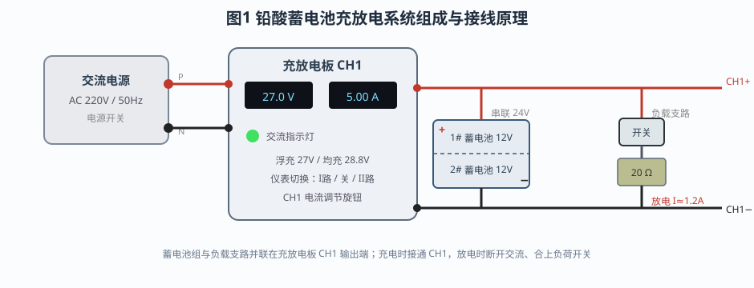
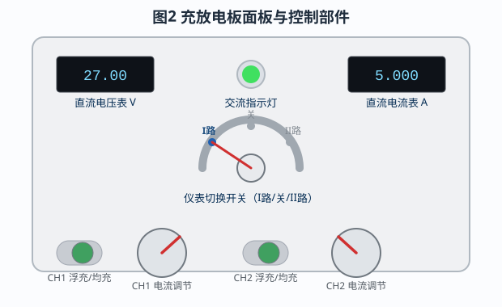
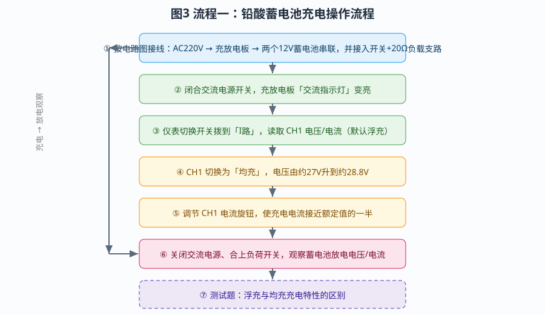
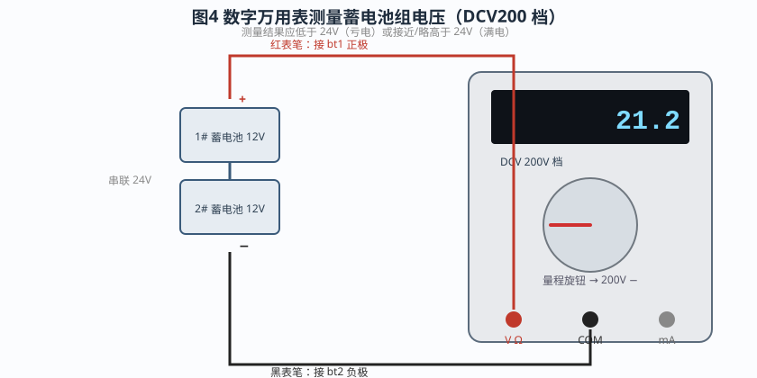
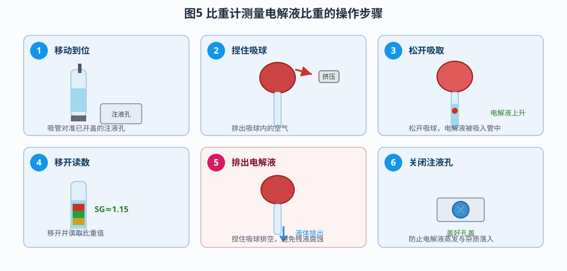
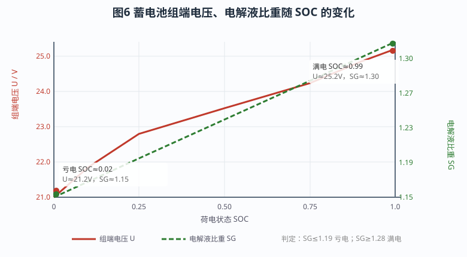
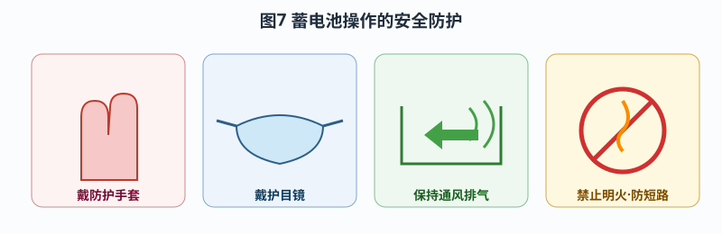

# 蓄电池检查和充放电操作

> 工业仪表与过程控制仿真教学平台 · 实验指导书
> 适用课程：船舶电气 / 电工电子技术 / 电气设备维护

---

## 一、实验目的

1. 掌握铅酸蓄电池充放电电路的正确接线方法，能看懂"交流电源—充放电板—蓄电池组—负载"的主回路原理图；
2. 理解**浮充**与**均充**两种充电方式的区别、参数与适用场合；
3. 学会使用**数字万用表**测量蓄电池组端电压，并据此初步判断电池的荷电状态；
4. 学会使用**比重计**测量电解液比重，掌握"端电压 + 电解液比重"双重判据；
5. 通过"亏电—满电"两种状态的对比测量，建立荷电状态 SOC 与电压、比重之间的定量关系；
6. 树立规范操作与个人安全防护意识。

---

## 二、实验原理

### 2.1 铅酸蓄电池的电动势与荷电状态

铅酸蓄电池由正极板（二氧化铅 PbO₂）、负极板（海绵状铅 Pb）和稀硫酸电解液组成。单体电池的标称电压为 2V，一个"12V 蓄电池"内部由 6 个单体串联构成，因此它的端电压在 12V 附近。本实验用两只 12V 蓄电池首尾串联，组成 24V 蓄电池组：**第一只的负极接第二只的正极**，整个电池组的正极取自第一只电池的正极，负极取自第二只电池的负极。

电池的开路电压随荷电状态（State of Charge，SOC）变化：荷电越多，电解液浓度越高，单体电动势越高。工程上常用的一组近似数据见表 1。

**表 1 单体电压与 SOC 的近似关系**

| SOC | 0.00 | 0.10 | 0.25 | 0.50 | 0.75 | 0.90 | 1.00 |
|-----|------|------|------|------|------|------|------|
| 单体电压 / V | 1.75 | 1.82 | 1.90 | 1.96 | 2.02 | 2.07 | 2.10 |

按上表折算，24V 蓄电池组在亏电（SOC≈0.02）时端电压约为 21.2V，满电（SOC≈0.99）时约为 25.2V。端电压越低，说明电池越亏电；但端电压会受负载电流和内阻压降影响，所以单看电压并不够，需要与比重配合判断。

电池容量以安时（Ah）表示，本实验所用电池为 56Ah，其含义是以 56A 电流放电可维持约 1 小时（或 5.6A 放电约 10 小时）。电池内部存在欧姆内阻与极化效应，放电电流越大，端电压相对开路电压下降越多；因此测量开路电压应在断开负载、静置一段时间后进行，读数才更接近真实的荷电状态。

### 2.2 电解液比重与荷电状态

电解液是稀硫酸，其密度（工程上称"比重"SG）随硫酸浓度变化。电池放电时硫酸被消耗、生成水，比重下降；充电时硫酸重新生成，比重回升。因此，**比重是判断荷电状态最直接的指标之一**。本仿真采用线性近似模型：

```
SG ≈ 1.15 + 0.15 × SOC
```

即亏电时 SG≈1.15，满电时 SG≈1.30。工程判定经验值为：

- **SG ≤ 1.19**：电池严重亏电，需要充电；
- **1.20 ~ 1.27**：电量中等，需补充充电；
- **SG ≥ 1.28**：电池已充足电。

比重计（密度计）就是利用浮力原理测量比重的仪器：管内浮子的吃水深度随液体密度变化，从浮子上的刻度即可读出比重值。

### 2.3 两种充电方式：浮充与均充

充放电板为蓄电池提供两种充电模式：

- **浮充（Float）**：以恒定电压（本机约 **27V**）对电池长期涓流充电，用于电池充满后维持容量、补偿自放电，适合备用电源长期在线运行的场合。
- **均充（Equalize）**：以较高电压（本机约 **28.8V**）进行快速充电，用于深度放电后的补充充电以及消除极板硫化，一般定期进行、不宜长期使用，否则会造成电解液失水和极板腐蚀。

两种方式的主要区别可以概括为：**均充电压高于浮充电压，用于快速充电和活化电池**；浮充则用于充满后维持容量。充放电板上可通过"浮充/均充"切换开关选择模式，并通过电流调节旋钮设定充电电流大小。

### 2.4 放电回路与放电电流

为观察放电过程，在充放电板 CH1 输出端并联一条负载支路：**CH1 正极 → 负荷开关 → 20Ω 电阻 → CH1 负极**。断开交流电源、合上负荷开关后，蓄电池组通过电阻放电，放电电流近似为

```
I ≈ U / R ≈ 24V ÷ 20Ω ≈ 1.2A
```

放电时端电压会低于开路电压并逐渐下降，电流则基本稳定；这正体现了"电压随 SOC 下降"的规律。



---

## 三、实验系统的组成

仿真系统由以下部分组成，如图 1、图 2 所示：

1. **交流电源**：提供 AC 220V/50Hz，带电源开关，用于给充放电板供电；
2. **充放电板（CH1/CH2）**：核心设备，含交流指示灯、直流电压表、直流电流表、仪表切换开关、浮充/均充开关和电流调节旋钮；
3. **蓄电池组**：两只 12V/56Ah 铅酸蓄电池串联为 24V；
4. **负载支路**：负荷开关 + 20Ω 电阻，用于放电观察；
5. **测量仪表**：数字万用表（测电压）、比重计（测电解液比重）。

充放电板面板上各控制部件的功能为：

- **仪表切换开关（I路 / 关 / II路）**：选择电压表/电流表显示哪一路的数据。拨到"I路"时显示 CH1 的电压与电流；
- **CH1 浮充/均充开关**：切换 CH1 的充电方式；
- **CH1 电流调节旋钮**：设定均充模式下的充电电流（以最大电流的百分比表示）；
- **交流指示灯**：交流输入正常（≥110V）时点亮。



---

## 四、实验内容与操作步骤

实验分为两个操作流程，可在软件的"操作项目"下拉框中分别选择。

### 4.1 流程一：铅酸蓄电池充电操作

操作流程如图 3 所示，具体步骤如下：

**（1）接线。** 按电路图连接主回路：交流电源 P、N → 充放电板交流输入；充放电板 CH1 正极 → 1# 蓄电池正极；1# 蓄电池负极 → 2# 蓄电池正极；2# 蓄电池负极 → CH1 负极；再接入负载支路（CH1 正极 → 开关 → 20Ω 电阻 → CH1 负极）。接线时注意**正负极性**和**端子压接牢固**。软件中可点击工具栏"自动接线"完成，演示模式下连线会以动画逐根绘制。

**（2）闭合交流电源。** 打开交流电源开关，充放电板"交流指示灯"应点亮，说明充电板已得电。

**（3）选择显示通道。** 将仪表切换开关拨到"I路"，观察 CH1 的电压和电流数值。此时默认处于**浮充**模式，电压表读数约为 27V。

**（4）切换均充。** 将 CH1 切换到"均充"模式，观察充电电压由约 27V 升高到约 28.8V、充电电流增大。

**（5）调整充电电流。** 旋转 CH1 电流调节旋钮，把充电电流调整到接近额定值的一半（约 30%），观察电流表读数的变化。

**（6）停止充电、转为放电观察。** 关闭交流电源（充电停止），合上负荷开关，接通 20Ω 负载。此时蓄电池组通过电阻放电，观察蓄电池端电压随放电逐渐下降、放电电流约为 1.2A。

**（7）完成测试题**：判断题——浮充与均充充电特性的主要区别。



### 4.2 流程二：电压与比重测量，判定电池状态

本流程模拟对亏电、满电两种状态分别测量并对比，操作步骤见表 2。

**表 2 流程二操作步骤**

| 步骤 | 操作内容 | 观察/记录 |
|------|----------|-----------|
| 1 | 仅将两只蓄电池串联（1# 负极 → 2# 正极）；通过"参数设置"界面把两只电池的初始 SOC 动态设为 0.02 | 模拟电池电量用光 |
| 2 | 从"选择仪表"界面调出数字万用表，旋钮打到 **DCV200 档** | 万用表显示进入测量状态 |
| 3 | 红表笔接 1# 正极、黑表笔接 2# 负极，测量电池组电压（软件中表笔连线以动画绘制） | 记录亏电端电压 |
| 4 | 测量完毕，断开表笔、关闭万用表 | 保持台面整洁 |
| 5 | 打开一个注液孔，用比重计测量电解液比重：**移动到位 → 捏住吸球 → 松开吸取 → 移开读数** | 记录亏电比重（应≤1.19） |
| 6 | 读数后排出比重计内电解液，关闭注液孔 | 防止残液腐蚀、蒸发 |
| 7 | 将两只电池初始 SOC 设为 0.99，重复第 2~6 步测电压与比重 | 记录满电数据 |
| 8 | 完成两道测试题：状态判断、安全防护 | 巩固理论 |

数字万用表测量接线如图 4 所示：红表笔插入"V/Ω"孔接电池组正极，黑表笔插入"COM"孔接电池组负极；量程必须选择**直流 200V 档（DCV200）**，因为电池组电压最高约 25V，用 200V 档既有足够分辨率又不会过载。

比重计的使用如图 5 所示，可归纳为"**一到、二捏、三松、四读、五排、六盖**"：先将吸管对准已打开的注液孔（一到），捏住吸球排出空气（二捏），松开吸球让电解液被吸入管中（三松），移开比重计读取浮子刻度（四读），读数后捏球排空残液（五排），最后盖回注液孔盖（六盖）。





---

## 五、数据记录与状态判定

按上述步骤测量，将结果填入表 3（示例数据来自仿真模型）。

**表 3 亏电与满电状态测量记录**

| 电池状态 | SOC | 组端电压 U | 电解液比重 SG | 判定 |
|----------|-----|-----------|---------------|------|
| 亏电（电量用光） | 0.02 | ≈21.2V | ≈1.153 | 电压偏低、比重低于 1.19 → **亏电，需充电** |
| 满电（充满电） | 0.99 | ≈25.2V | ≈1.299 | 电压明显升高、比重不低于 1.28 → **满电** |

图 6 给出了端电压、电解液比重随 SOC 变化的曲线。可以看到两者都随 SOC 单调上升，且变化趋势一致，因此实际判断电池状态时应**同时参考电压和比重**：若电压与比重都偏低，则可判定电池亏电；若两者不一致（例如电压正常而比重偏低），则应进一步检查是否存在电解液缺失、极板硫化或测量误差。



---

## 六、安全注意事项

铅酸蓄电池的电解液是稀硫酸，具有强腐蚀性；充电后期电解液可能沸腾，析出的氢气和氧气若积聚还有爆炸风险。操作时应做到（图 7）：

1. **戴防护手套和护目镜**。这是最基本的个人防护——防止电解液或酸雾溅到皮肤、眼睛造成化学灼伤；手套还兼有一定的绝缘作用。**这也正是本实验测试题的核心考点。**
2. **保持通风**。充电过程会产生氢氧气体，作业场所必须通风良好，严禁明火和吸烟。
3. **防止短路**。金属工具不得同时搭在电池正负极上，接线、拆线时应先断开电源、后操作电池端子。
4. **正确使用仪器**。万用表量程要大于被测电压；比重计使用后应清洗并排空残液，避免腐蚀。
5. **规范处置**。若电解液溅到皮肤应立即用大量清水冲洗，溅入眼睛须立即冲洗并就医；废旧电池应交由专业回收，不得随意丢弃。



---

## 七、思考与练习

1. 为什么判断蓄电池状态时，不能只看端电压，还要测电解液比重？
2. 浮充和均充分别适用于什么场合？长期使用均充会带来什么问题？
3. 本实验中放电电流约为多少？如果负载电阻改为 10Ω，放电电流将如何变化？
4. 结合图 4，说明当 SOC 从 0.5 降到 0.2 时，端电压和比重分别如何变化。
5. 操作蓄电池时为什么要戴防护手套和护目镜？

---

*说明：本文档中的元件符号、显示数值均来自仿真模型，仅用于教学演示，实际测量请以现场仪器和规程为准。*
