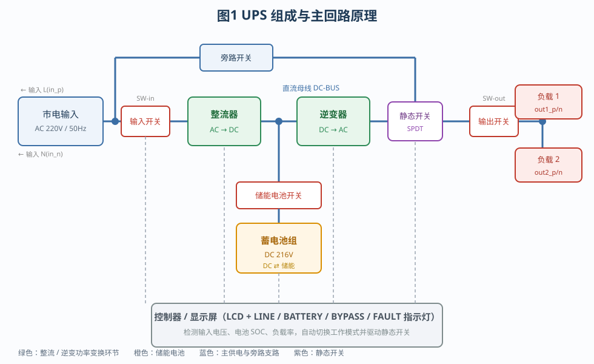
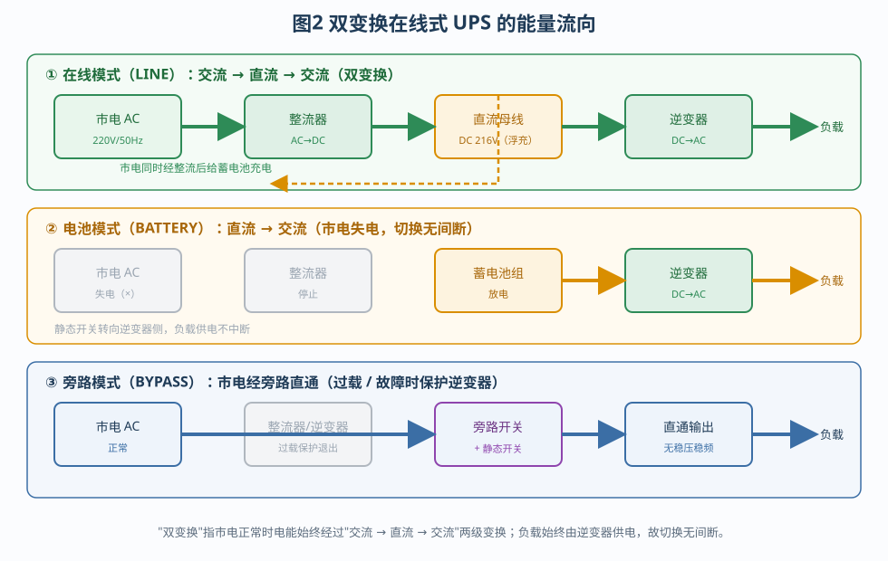
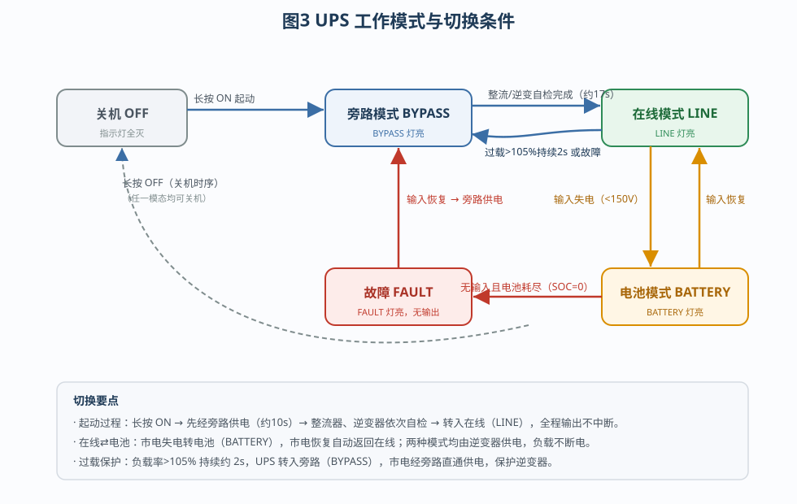
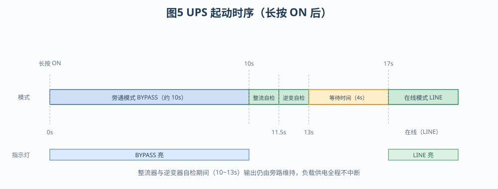
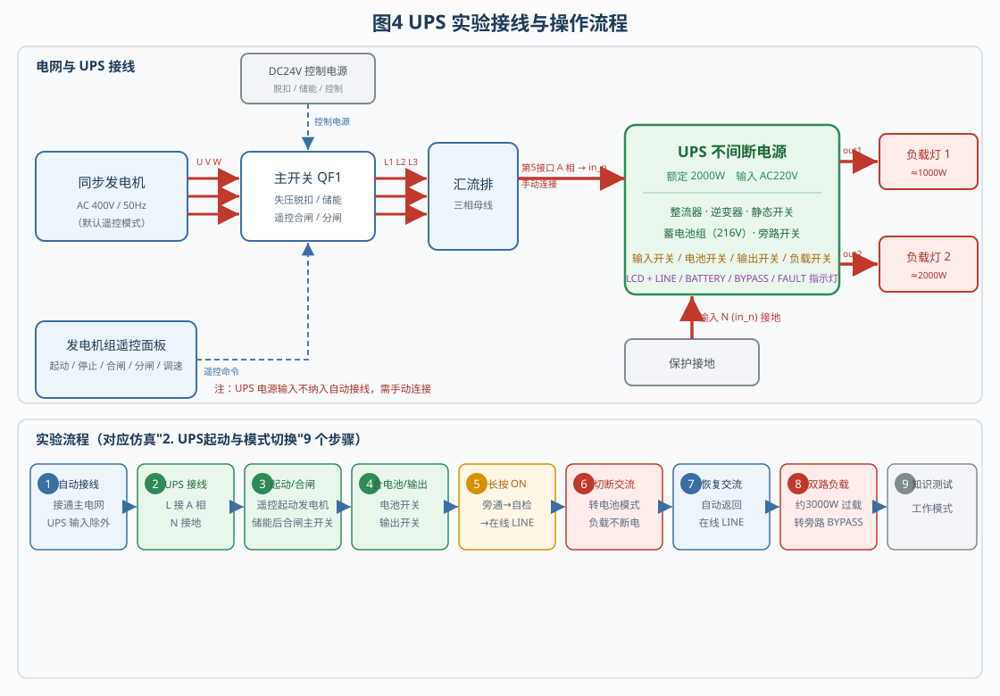

# UPS设置和维护

> 本实验以船舶电力系统为背景，围绕一台**双变换在线式 UPS（不间断电源）**展开。你将通过"识别组成 → 接线 → 起动 → 模式切换 → 过载保护"的完整流程，理解 UPS 如何在市电中断、波动或过载时，为重要负载提供稳定、不间断的交流电。

**实验目的**

1. 认识双变换在线式 UPS 的组成部件及其作用；
2. 理解"交流 → 直流 → 交流"双变换的工作原理与在线式 UPS 的特征；
3. 掌握在线、电池、旁路、故障四种工作模式的切换条件；
4. 熟悉 UPS 的接线、起动、模式切换与过载保护操作流程；
5. 了解 UPS 主要参数的设置与日常维护要点。

---

## 一、为什么需要 UPS

船舶电网、数据中心、医疗设备等场合，一旦市电中断或电压、频率异常，负载会立即停止工作，甚至造成设备损坏、数据丢失。**UPS（Uninterruptible Power Supply，不间断电源）**就是串接在电网与负载之间的"电力保护装置"：

- 市电正常时，它一边给负载供电，一边给蓄电池充电；
- 市电异常或中断时，它立即改用蓄电池供电，负载**感觉不到断电**；
- 市电电压波动、频率不稳、谐波干扰时，它还能"净化"电能，输出稳定的电压和频率。

要做到"不间断"，关键在于 UPS 内部有一块**蓄电池**和一套**能自动切换的电子开关**。本实验采用的双变换在线式 UPS，是供电质量最高、切换真正无间断的一类。

---

## 二、UPS 的组成

UPS 的组成可以按"主回路"和"控制显示"两部分理解（见图1）。

**1. 主回路部件**

| 部件 | 作用 |
|------|------|
| 输入开关 | 接通/断开市电输入，本实验由学生手动合上 |
| 整流器 | 把市电交流（AC）整流成直流（DC），并给蓄电池充电 |
| 蓄电池组 | 储能元件，市电中断时提供直流电能，本仿真额定约 216V |
| 逆变器 | 把直流逆变成稳定的交流（DC→AC），是负载的"最后一道电源" |
| 静态开关 | 单刀双掷（SPDT）电子开关，在"逆变器输出"与"旁路"之间选择 |
| 旁路开关 | 过载或故障时，让市电经旁路直接供给负载 |
| 输出开关 | 接通/断开 UPS 输出，本实验断开后再逐路合负载 |
| 负载开关 1/2 | 两路负载的分路投切开关（接两盏负载灯） |

**2. 控制与显示**

控制器持续检测输入电压（端口 in_p/in_n）、电池 SOC（剩余电量）、负载率，并据此自动决定工作模式、驱动静态开关。面板上有 **LCD 显示屏**与四个状态指示灯：

- **LINE**：在线模式
- **BATTERY**：电池模式
- **BYPASS**：旁路模式
- **FAULT**：故障

在本仿真中，UPS 额定功率 **2000W**，输入 AC220V/50Hz，输出 AC220V/50Hz；蓄电池初始 SOC 为 90%，在线模式下会缓慢充电，电池模式下则逐步放电。

---

## 三、工作原理与"双变换"特征

**双变换**指：市电正常时，电能要依次经过"**交流 → 直流 → 交流**"两级变换（见图2）。

1. 市电 AC 先经**整流器**变成 DC；
2. 一路直流给**蓄电池**浮充；
3. 另一路直流再经**逆变器**变回 AC 供给负载。

由于负载始终由逆变器供电，市电只是"原料"，因此 UPS 输出与电网**完全隔离**。这正是"在线式"的含义——逆变器**始终在线工作**。

**双变换在线式 UPS 的主要特征：**

- **无间断切换**：无论市电中断还是恢复，负载都由逆变器连续供电，切换时间理论上为 0；
- **稳压稳频**：输出由逆变器重新生成，不受市电电压跌落、频率波动、谐波干扰影响；
- **同时充电**：市电正常时持续给电池充电，保证后备能量充足；
- **过载与旁路保护**：负载过大时自动转旁路，保护逆变器功率器件；
- **代价**：电能经过两次变换，整机效率略低、成本较高——因此多用于对供电质量要求高的场合。

**与其它类型 UPS 的对比：**

| 类型 | 供电方式 | 切换时间 | 输出质量 | 典型场合 |
|------|----------|----------|----------|----------|
| 后备式 | 市电直供，断电才切电池 | 数 ms～十几 ms | 一般（多为准正弦） | 家用电脑 |
| 在线互动式 | 市电经变压器/调压，断电切电池 | 约 2～4 ms | 较好 | 小型网络设备 |
| 双变换在线式 | 始终 AC→DC→AC | 0（无间断） | 高（稳压稳频） | 船舶、医疗、数据中心 |

可以看出，双变换在线式的供电质量最高，但效率与成本也最高，因此多用于对供电连续性、电能质量要求苛刻的场合。

---

## 四、工作模式与切换

UPS 有五种典型状态（见图3），由控制器自动判定：

| 模式 | 触发条件 | 供电路径 | 指示灯 |
|------|----------|----------|--------|
| 在线 LINE | 输入正常（电压 > 150V） | 市电→整流→逆变→负载 | LINE 亮 |
| 电池 BATTERY | 输入失电且电池有电 | 电池→逆变→负载 | BATTERY 亮 |
| 旁路 BYPASS | 过载（负载率 > 105% 且持续约 2s）或故障且输入正常 | 市电→旁路开关→静态开关→负载 | BYPASS 亮 |
| 故障 FAULT | 无输入且电池耗尽/断开 | 无输出 | FAULT 亮 |
| 关机 OFF | 长按 OFF | 无输出 | 全灭 |

**模式切换的关键点：**

- **在线 ⇄ 电池**：市电失电立即转电池，市电恢复自动返回在线。两种模式都由逆变器供电，**负载不断电**，这是"无间断"的核心。
- **在线 → 旁路**：负载率超过 105% 并持续约 2 秒，或内部故障时，UPS 转旁路，由市电直通供电，避免逆变器过载损坏。此时输出不再稳压稳频。
- **旁路 → 在线**：故障消除（负载降到 90% 以下并持续数秒）后自动恢复。
- **故障**：市电与电池都不可用时出现，属于"彻底没电"状态。

**电池的充放电**：在线模式下 SOC 缓慢上升（充电）；电池模式下 SOC 按负载电流下降，耗至 0 时置故障标志。因此电池模式下要关注剩余电量。

---

## 五、起动时序

长按面板 **ON** 按钮 3 秒，UPS 按固定时序起动（见图5）：

1. **0~10s 旁通**：先接通旁路开关，市电经旁路给负载供电，旁通模式保持约 10 秒；
2. **整流器自检**：整流器指示灯闪烁 3 次，确认整流环节正常；
3. **逆变器自检**：逆变器指示灯闪烁 3 次，确认逆变环节正常；
4. **等待约 4s**：确认输出稳定；
5. **转入在线（LINE）**：静态开关转向逆变侧，旁路开关断开，UPS 进入在线模式。

自检期间输出一直由旁路维持，因此**起动过程也不中断供电**。整个过程约 17 秒。

---

## 六、实验流程

实验接线与流程见图4。系统由**同步发电机 → 主开关 QF1 → 汇流排**构成主电网，UPS 从汇流排取电、向两路负载供电；DC24V 控制电源为 QF1 的失压脱扣、储能电机和遥控面板供电。**同步发电机默认处于遥控模式**，须经遥控面板操作。

**准备阶段**

1. **点击工具栏"自动接线"**，接通主电网（QF1、汇流排、控制电源等）。注意：**UPS 的电源输入不纳入自动接线**，需手动连接，以便单独观察 UPS 输入接线。
2. **UPS 接线**：输入 **L 端（in_p）接汇流排 A 相第 5 接口**，输入 **N 端（in_n）接地**。

**运行阶段**

3. 在**遥控面板**上按"起动"起动发电机，待主开关**储能完成**后按"合闸"；再合上 UPS **输入开关**，观察 LCD 显示输入/输出电压与电池参数。
4. 合上**储能电池开关**，再合上 **UPS 输出开关**（此时两路负载仍未接通）。
5. **长按 ON 按钮 3 秒**起动 UPS。观察起动过程：先进入**旁通**（约 10s），约 17s 后切换至**在线 LINE**。
6. **切断交流电源**（遥控面板分闸，断开主开关）。UPS 由蓄电池经逆变器供电，进入**电池模式 BATTERY**，负载不中断。
7. **恢复交流电源**（遥控面板合闸）。UPS 自动返回**在线 LINE**，负载供电仍然不间断。
8. 依次合上**第 1 路、第 2 路负载开关**，两路负载总功率约 **3000W**，超过 UPS 额定 2000W，形成**过载**。持续约 2 秒后 UPS 自动转入**旁路 BYPASS**，由市电直通供电，保护逆变器。
9. 完成**知识测试**，检验对工作模式的理解。

**面板与 LCD 操作**

UPS 面板除 ON/OFF 外，还有 ▲ / ▼ / ENTER 按钮：

- **▲ / ▼ 翻页**：第 0 页显示"输入电压 / 输出电压"与"电池 SOC / 负载率"；第 1 页显示"工作模式 / 频率"与"电池电压 / 输出功率"。实验中应两页都查看，尤其关注切换到电池模式后 SOC 的下降。
- **ENTER 编辑**：进入"设定负载"模式后，用 ▲ / ▼ 在 0~150% 之间调整模拟负载，可在没有实际负载的情况下观察不同负载率下的行为（例如调到 110% 观察过载转旁路）。

**注意事项**

- UPS 输入接线必须在断电状态下进行，确认 L/N 无误后再合闸；
- 主开关合闸前须等储能完成，否则合闸命令无效；
- 观察模式切换时，应同时留意面板指示灯与 LCD 参数的变化；
- 过载转旁路后，应及时切除部分负载，避免长时间旁路运行中的市电波动直接影响负载。

---

## 七、UPS 的设置与维护

**1. 主要可设置参数**

在组件"参数设置"对话框中，可调整以下参数，不同设置会直接影响运行结果：

| 参数 | 含义 | 本仿真默认 |
|------|------|-----------|
| 额定功率 | 决定额定电流与过载判定基准 | 2000W |
| 输出频率 | 逆变输出的频率 | 50Hz |
| 输出电压 | 逆变输出的电压 | 220V |
| 电池容量 | 影响电池模式下 SOC 的下降速度 | 50Ah |
| 初始 SOC | 起动时的电池剩余电量 | 90% |
| 内阻 | 输出等效内阻 | 0.5Ω |

例如把"额定功率"改小，同样的负载就会更快触发过载转旁路；把"初始 SOC"调低，电池模式能维持的时间就会缩短。理解这些参数的意义，有助于按实际负载合理配置 UPS。

**2. 维护要点**

- **蓄电池是 UPS 最易老化的部件**：应定期测量端电压与内阻，容量明显下降时及时更换；
- **保持通风散热**：逆变器与电池在高温下寿命会显著缩短，机柜应留足散热空间；
- **定期做放电试验**：人为模拟市电中断，验证切换是否正常、后备时间是否满足要求；
- **避免长期旁路运行**：旁路状态下输出不再稳压稳频、也失去了抗干扰能力，应及时排查过载或故障；
- **确保输入 N 端可靠接地**：既是安全要求，也是输入电压测量的参考点；
- **关注告警**：FAULT 灯亮表示既无市电又无电池，是最严重的状态，须立即处理。

---

## 八、小结与思考

**小结**：双变换在线式 UPS 由整流器、逆变器、蓄电池、静态开关和旁路开关组成，把"交流→直流→交流"两级变换贯穿于市电正常、中断、恢复的全过程；并借助静态开关在在线、电池、旁路之间自动切换，配合蓄电池储能，实现对负载**无间断、稳压稳频**的供电。

**思考题**

1. 为什么双变换在线式 UPS 在电池模式与在线模式之间切换时，负载不会断电？
2. 过载时 UPS 为什么选择转入旁路，而不是继续让逆变器硬扛？旁路运行有什么风险？
3. 如果输入 N 端没有可靠接地，会对 UPS 运行和人身安全造成什么影响？
4. 蓄电池 SOC 为 0 时可能进入哪种模式？此时应如何处理？
