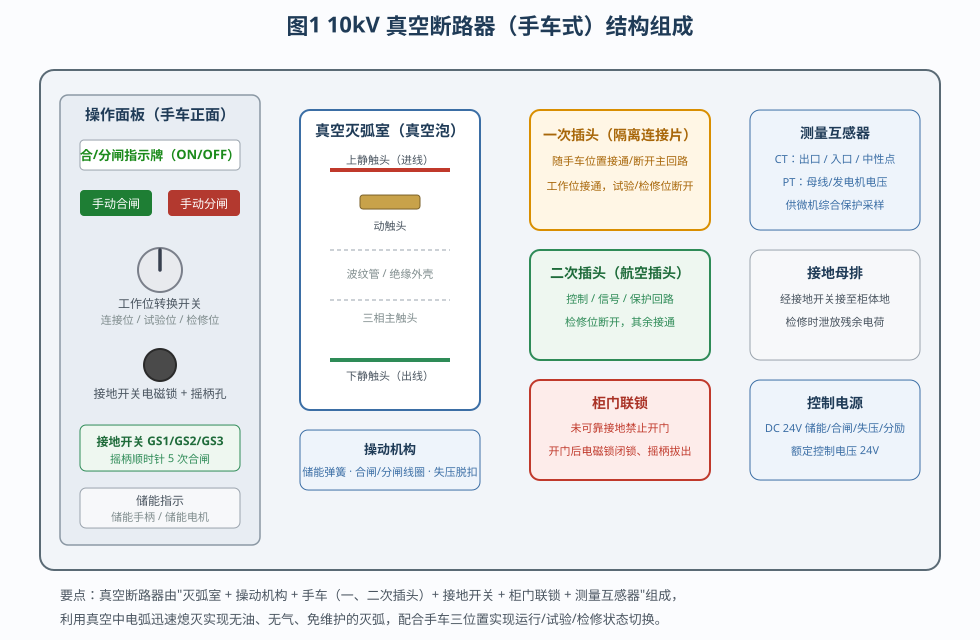
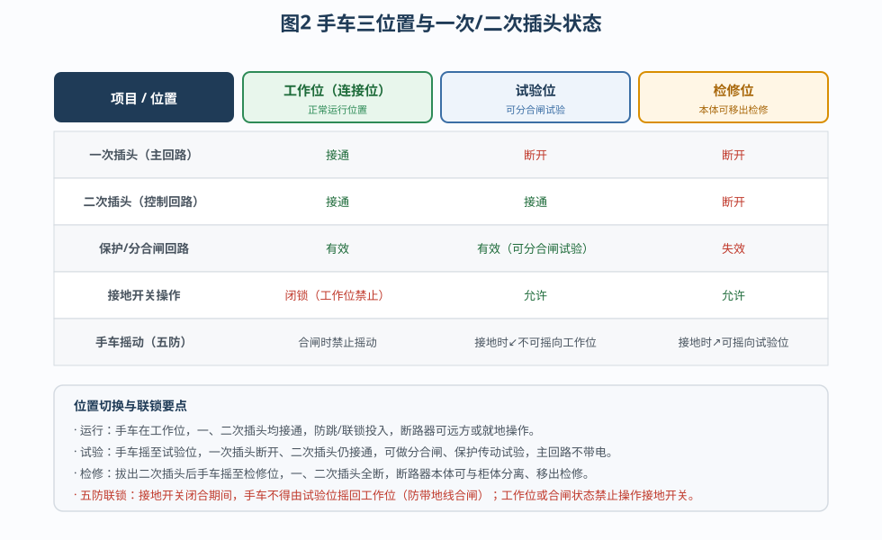
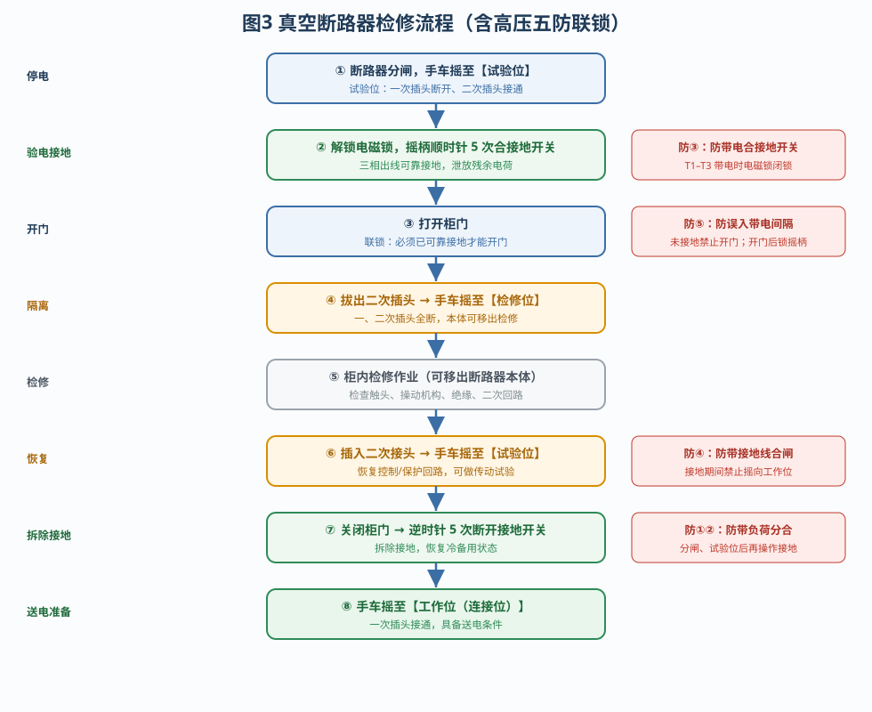
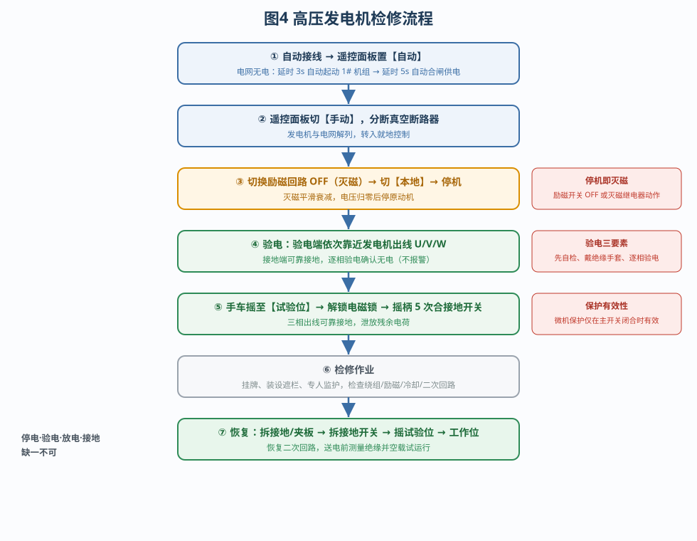
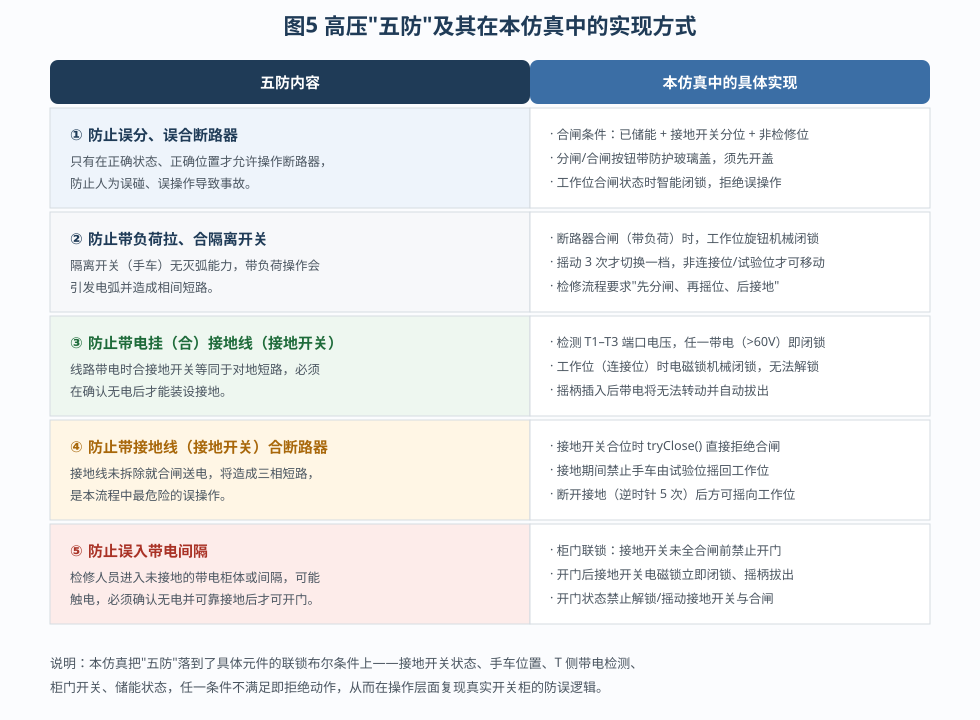
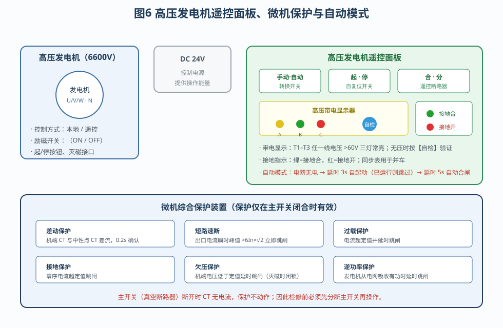

# 船舶高压电力系统操作和维护

船舶高压电力系统是船舶电站的核心，通常采用 6.6kV（本仿真为 6600V）三相交流供电。系统中，**真空断路器**是发电机与电网之间唯一的带载分合元件，**微机综合保护装置**负责故障检测与跳闸，而**高压"五防"**则是保障人身与设备安全的操作底线。本文结合仿真平台，重点讲解真空断路器的结构、原理与检修流程，高压发电机的检修流程，以及高压"五防"的具体实现方式。

---

## 一、真空断路器的结构与原理

### 1.1 结构组成

真空断路器（手车式）由"灭弧室＋操动机构＋手车＋接地开关＋柜门联锁＋测量互感器"六大部分组成，如图 1 所示。

- **真空灭弧室（真空泡）**：核心部件。密封绝缘外壳内有上静触头、动触头与下静触头，动触头通过波纹管与外部操动杆连接，保证真空密封的同时可上下运动。三相各有独立的灭弧室。
- **操动机构**：包括储能弹簧、储能电机（DC 24V）、合闸线圈、分闸（分励）线圈、失压脱扣器。合闸前必须先由储能电机或手动储能手柄把弹簧拉到储能位，合闸时释放弹簧能量，瞬间推动动触头闭合。
- **手车（可移开部件）**：断路器本体装在可摇出的手车上，通过**一次插头（隔离连接片）**接通主回路、**二次插头（航空插头）**接通控制与信号回路。摇动手车即可改变手车在工作位、试验位、检修位之间的位置。
- **接地开关**：三相共三只（GS1/GS2/GS3），合上后把断路器出线侧三相可靠接地，用于检修时泄放残余电荷、防止突然来电。接地开关配有**电磁锁**和**摇柄插入孔**，摇柄顺时针转 5 次合闸、逆时针转 5 次分闸。
- **柜门联锁**：柜门只有在地开关可靠接地后才允许打开，开门后接地开关电磁锁自动闭锁，防止带电误入。
- **测量互感器**：出口 CT、入口 CT、中性点 CT 与 PT，为微机综合保护装置提供电流、电压信号。

### 1.2 灭弧原理

断路器分断电路时会产生电弧。若灭弧不成，电弧将持续燃烧并烧损触头。真空断路器把触头置于高真空（气压约 10⁻⁴ Pa）中，真空的**绝缘强度极高、介质恢复速度极快**：当动、静触头分离瞬间产生的金属蒸气电弧，在电流过零时因缺少可电离介质而迅速熄灭，电弧在半个周波（约 10ms）内即可熄灭。因此真空断路器具有体积小、无油、无爆炸危险、免维护、电寿命长等优点，广泛用于船舶高压配电板。

### 1.3 手车三位置

手车的工作位、试验位、检修位与一次、二次插头的对应关系见图 2。

- **工作位（连接位）**：一、二次插头均接通，断路器具备分合闸条件，是正常运行位置。
- **试验位**：一次插头断开、二次插头接通，主回路隔离但控制回路带电，可做分合闸与保护传动试验。
- **检修位**：一、二次插头全部断开，断路器本体可与柜体完全分离、移出检修。

位置切换必须遵循"先分闸、后摇车"的原则，且接地开关闭合期间手车不得摇回工作位。

---

## 二、真空断路器检修流程

真空断路器的检修流程如图 3 所示，每一步都对应着一项"五防"联锁。

1. **摇至试验位**：确认断路器已分闸，将手车由工作位摇到试验位，一次插头断开，主回路与电网隔离。
2. **验电接地**：合上接地开关前，先确认出线侧无电。解锁接地开关电磁锁，插入操作手柄，顺时针转 5 次使 GS1/GS2/GS3 全部合上，三相出线可靠接地，泄放残余电荷。
3. **打开柜门**：接地开关可靠接地后，柜门联锁解除，方可打开柜门进入柜内作业。
4. **拔二次插头、摇至检修位**：先拔出二次插头（航空插头），切断控制与信号回路，再把手车摇到检修位，此时一、二次插头全断，断路器本体可以移出。
5. **柜内检修**：检查真空灭弧室、触头磨损、操动机构、绝缘件与二次接线，必要时更换部件。
6. **恢复**：装回本体、插入二次接头，把手车摇回试验位，恢复控制与保护回路，可先做分合闸传动试验。
7. **关柜门、断接地**：关闭柜门后，逆时针转 5 次断开接地开关，拆除接地，恢复冷备用状态。
8. **摇至工作位**：将手车摇回工作位（连接位），一次插头接通，断路器恢复送电条件。

整个流程体现的是一条"停电 → 验电 → 接地 → 检修 → 恢复"的标准化安全作业线。仿真中每一步都设置了状态校验，操作顺序错误（例如未接地就开门、接地未拆除就摇向工作位）都会被联锁拒绝。

---

## 三、高压发电机检修流程

高压发电机的检修同样遵循"停电—验电—放电—接地"的顺序，其流程见图 4。

1. **自动运行观察**：自动接线后把遥控面板置于"自动"档。当电网无电时，控制逻辑会**延时 3s 自动起动 1# 机组**（若机组已运行则跳过），机组建压正常后**延时 5s 自动合闸供电**。通过这一过程，可以直观看到自动电站的"自起动—自并网"逻辑。
2. **切手动、分断断路器**：把遥控面板由"自动"切换为"手动"，按下"合·分"开关分断真空断路器，使发电机与电网解列。
3. **灭磁、切本地、停机**：先将励磁开关打到 **OFF**（灭磁），使发电机电动势平滑衰减到零；再把发电机控制方式由"遥控"切换为"本地"；最后按下本地"停止"按钮停掉原动机。仿真中灭磁采用时间常数约 1.2s 的平滑衰减，避免电动势突变造成保护误判。
4. **验电**：使用高压验电器，验电端依次靠近发电机出线端口 U、V、W，逐相确认线路无电。操作时先把接地端可靠接地，戴绝缘手套，并先在带电设备上验证验电器完好。
5. **摇至试验位、合接地开关**：将手车摇至试验位，解锁接地开关电磁锁，摇动手柄 5 次合上接地开关，把发电机出线三相可靠接地。
6. **检修作业**：悬挂标示牌、装设遮栏、设专人监护，检查定子绕组、励磁回路、冷却系统与二次回路。
7. **恢复送电**：拆除接地、恢复二次回路，将手车摇回试验位再到工作位；送电前测量绝缘电阻并空载试运行，确认正常后方可并网。

需要特别注意的是：**微机综合保护装置的保护只在主开关（真空断路器）闭合时才有效**。主开关断开时 CT 中无电流，保护出口不会动作；因此检修前必须先分断主开关，再操作发电机，避免出现"保护误动"或"保护拒动"的混淆。

---

## 四、高压"五防"及具体实现方式

高压电气"五防"是防止误操作、保障人身与设备安全的基本要求，具体内容及本仿真中的实现方式见图 5。

| 序号 | 五防内容 | 仿真中的具体实现 |
|---|---|---|
| ① | 防止误分、误合断路器 | 合闸需满足"已储能＋接地开关分位＋非检修位"；手动按钮带防护玻璃盖；状态不正确时拒绝动作 |
| ② | 防止带负荷拉、合隔离开关 | 断路器处于合闸（带负荷）状态时，工作位旋钮机械闭锁；手车摇动 3 次才切换一档 |
| ③ | 防止带电挂（合）接地线（接地开关） | 检测 T1–T3 端口电压，任一带电（>60V）即闭锁电磁锁；工作位时接地开关机械闭锁 |
| ④ | 防止带接地线（接地开关）合断路器 | 接地开关处于合位时，合闸指令被直接拒绝；接地期间禁止手车由试验位摇回工作位 |
| ⑤ | 防止误入带电间隔 | 接地开关未全部合闸前禁止打开柜门；开门后电磁锁立即闭锁、摇柄自动拔出 |

这些"五防"并非抽象的口号，而是落到具体元件上的布尔联锁条件：**接地开关状态、手车位置、T 侧带电检测、柜门开关、储能状态**，任一条件不满足即拒绝动作。这样就把真实开关柜的防误逻辑完整地搬进了仿真。

与"五防"配套的还有高压发电机遥控面板与微机综合保护装置，如图 6 所示。

遥控面板集成了"手动/自动"转换开关、"起·停"与"合·分"自复位开关、高压带电显示器（黄/绿/红三灯对应 A/B/C 三相，并带自检测试按钮）、接地指示（绿=接地合、红=接地开）以及同步表。微机综合保护装置则实现差动、短路速断、过载、接地、欠压、逆功率六种保护：差动保护比较机端与中性点两侧 CT 的差流，短路保护按出口电流瞬时峰值判断，欠压保护在人为灭磁/停机过程中闭锁，避免正常停机被误判为故障。

---

## 五、操作要点与安全提示

1. **顺序不可颠倒**：分闸 → 摇位 → 验电 → 接地 → 开门 → 检修 → 恢复 → 送电。任何"带负荷拉合、带电接地、带地线合闸"都属于误操作。
2. **验电要"三先三后"**：先自检、后验电；先戴绝缘手套、后接触；对三相线路逐相验电，不可只验一相。
3. **接地是检修的生命线**：接地开关合上后三相出线可靠接地，是允许开门和检修的必要条件。
4. **保护有效性有前提**：微机保护只在主开关闭合时有效，检修前必须先分断主开关。
5. **自动模式要心中有数**：自动模式下电网无电会延时 3s 自起动、延时 5s 自动合闸；检修时应先退出自动、切到手动，防止机组意外自起动。

掌握真空断路器的结构与原理、熟悉高压发电机和断路器的检修流程、理解"五防"的实现方式，是船舶高压电力系统安全操作与维护的基础。

---

## 六、仿真平台的操作与考核

本仿真平台把上述内容组织为三个操作流程，并提供四种演练模式，便于分层次教学：

- **流程 1「高压配电板认识与操作」**：自动接线认识系统结构，点击识别 1# 真空断路器、微机综合保护装置、遥控面板带电显示器与接地开关，完成带电显示器自检，遥控起动 1# 机组并观察带电显示、电网绝缘参数与接地指示，最后把电站切到自动模式。
- **流程 2「高压发电机检修流程」**：从自动并网观察开始，依次完成切换手动、分断断路器、切换励磁回路与本地控制、停机、逐相验电、摇试验位并合接地开关等检修操作。
- **流程 3「真空断路器检修流程」**：完整演示"摇试验位 → 接地 → 开门 → 隔离 → 检修 → 恢复 → 送电"的标准化作业线。

每种流程均支持**自动演示、单步演示、演练、评估**四种模式。自动演示模式会以闪烁箭头依次指示每一步的操作部件，并给出结果提示；演练与评估模式则要求学员亲手点击对应的组件——例如验电步骤必须在发电机出线端口完成至少三次接触测量，检修步骤必须真正把手车摇到规定位置，系统才会判定通过。通过"看—做—考"一体化的练习，学员既能理解原理，又能形成规范、安全的操作习惯。
