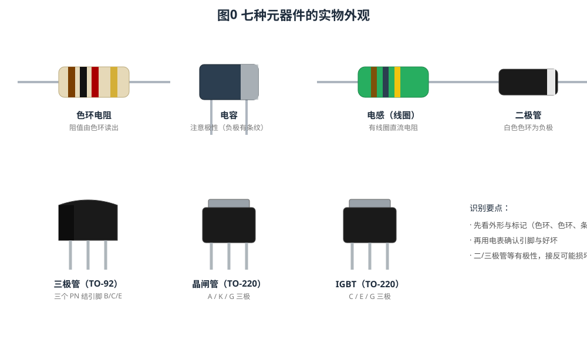
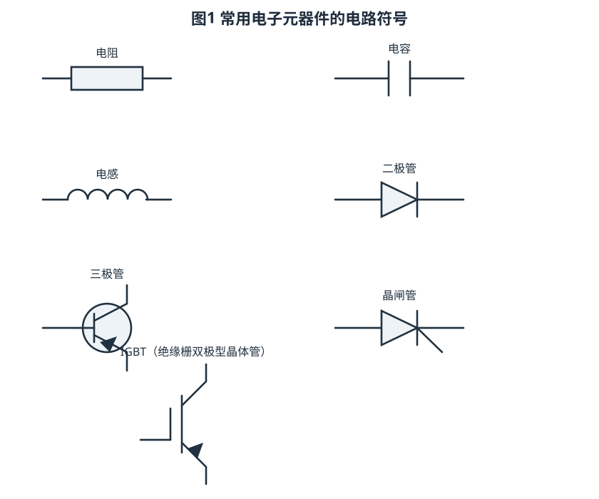
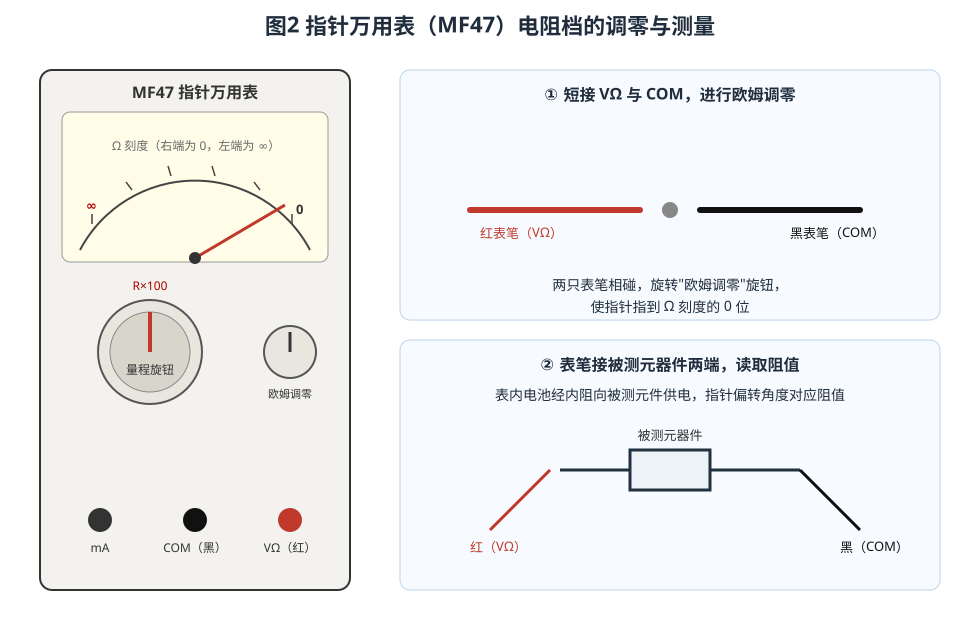
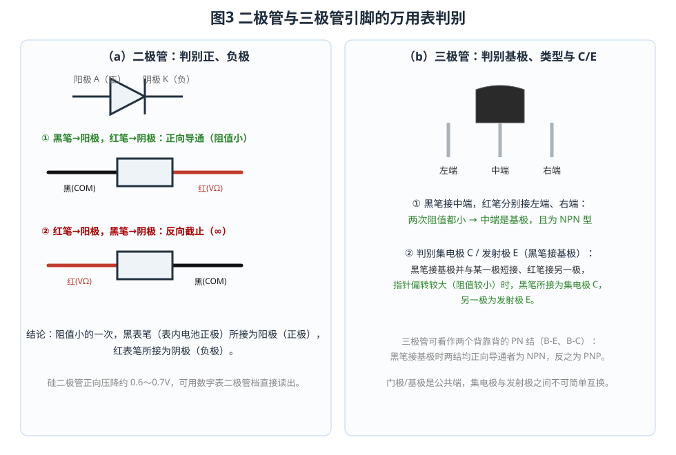
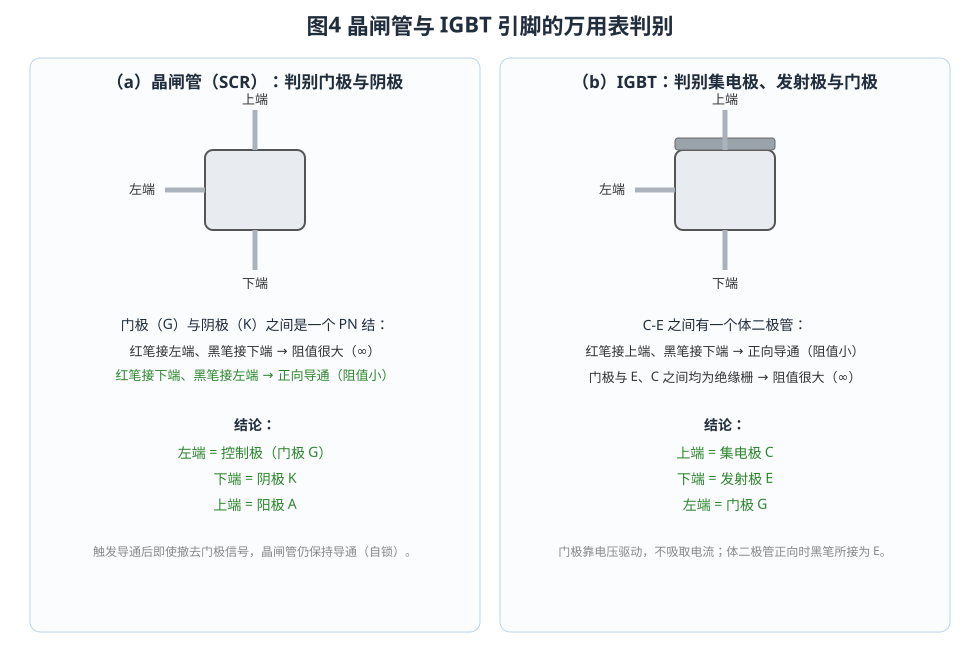

# 常用电子元器件识别与测量

## 一、课程目的与平台简介

电子技术入门的第一步，是认识常用元器件、看懂它们的电路符号，并会用电表判断引脚、极性和好坏。本仿真工程把 **电阻、电容、电感、二极管、三极管、晶闸管、IGBT** 七种元器件集中在一块画布上：左侧是它们的"实物外形"，右侧是对应的"电路符号"，底部提供 24V 直流电源与接地，可从工具栏调出模拟万用表（MF47）、数字万用表等仪表，按操作流程一步步完成识别与测量。

平台内置了 6 个操作流程，支持 **自动演示、单步演示、演练、评估** 四种模式。自动演示会动态展示每一步的动作，便于课前预习；演练与评估则隐藏答案，由学生亲手操作、系统自动判分。

掌握本课内容后，你应当能够：看懂常见元器件的电路符号；用指针万用表的电阻档判断二极管、三极管、晶闸管、IGBT 的引脚与极性；理解电容"充电后指针回 ∞"、电感"读出线圈直流电阻"等现象背后的原理。

## 二、七种元器件的实物与电路符号

识别元器件要从两方面入手：**外形与标记**（实物）和**图形符号**（电路图）。下表汇总了七种元件的关键特征。

| 元器件 | 电路符号特征 | 主要参数 | 是否分极性 |
| --- | --- | --- | --- |
| 电阻 | 矩形（或锯齿线） | 阻值 Ω、误差 | 否 |
| 电容 | 两条平行短线 | 容量 F | 电解电容分正负 |
| 电感 | 连续半圆线圈 | 电感量 H、线圈电阻 | 否 |
| 二极管 | 三角 + 竖线 | 正向压降 V | 是（阳/阴极） |
| 三极管 | 圆圈内基极竖线与发射极箭头 | 放大倍数 β | 是（B/C/E） |
| 晶闸管 | 二极管加门极引线 | 触发/维持电流 | 是（A/K/G） |
| IGBT | 沟道条 + 绝缘栅极 | 阈值电压、饱和压降 | 是（C/E/G） |

**电阻**是最常见的元件，阻值可通过色环读出：第 1、2 环为有效数字，第 3 环为倍率，第 4 环为误差。例如"棕黑红金"表示 10×100Ω、误差 ±5%，即 1kΩ。在仿真中点击色环电阻即可看到实物，点击右侧矩形符号则对应电路图符号。

**电容**储存电荷，"通交流、隔直流"。电解电容有正负极，负极一侧通常印有一条色带。**电感**把电能储存在磁场中，对直流相当于导线，因此用电阻档测量时能读出线圈的直流电阻。

**二极管**具有单向导电性，三角的尖端一侧为阴极（实物上用白色色环标出）。**三极管**可看作两个背靠背的 PN 结，有基极 B、集电极 C、发射极 E 三个引脚。**晶闸管**（可控硅）在门极触发后导通，撤去触发信号仍能自锁导通。**IGBT** 是绝缘栅双极型晶体管，门极靠电压控制，其 C-E 之间集成有体二极管。

## 三、指针万用表（MF47）电阻档的使用

指针万用表是判别元器件引脚最直观的工具。电阻档使用表内电池供电，**黑表笔（COM）接表内电池正极**，红表笔（VΩ）为负——这一点是后面判别极性的关键。

**（1）选档。** 根据被测元件的大致阻值选择量程，本课常用 **R×100** 档。量程数字表示"读数×倍率"。若指针偏转太小或太大，应更换量程后重新调零。

**（2）欧姆调零。** 把红、黑表笔短接（相碰），旋转面板上的"欧姆调零"旋钮，使指针指到 Ω 刻度的 **0 位**（表盘最右端）。每次更换量程都必须重新调零，否则读数不准。

**（3）测量读数。** 表笔跨接在被测元件两端，读取指针在 Ω 刻度上的位置，再乘以所选倍率。欧姆刻度是非线性的：**右端为 0、左端为 ∞**，读数应尽量落在刻度中段，误差最小。

**（4）用后收档。** 测完不要把表停在电阻档，应旋到交流电压最高档或 OFF 档，避免表笔相碰耗尽电池。

**量程选择的技巧。** 欧姆刻度是非线性的，指针落在刻度中段（约中值电阻的 0.1～10 倍）时读数最准，越靠近两端刻度越密、误差越大。若指针偏转太小（靠近 ∞），应换用更高的倍率；偏转太大（靠近 0），应换用更低的倍率，而且每次换档后都必须重新调零。以 R×100 档为例，其中值约为 2kΩ，测量 1kΩ 左右的电阻最合适；本工程的电阻、二极管、三极管等测量也统一采用该档，便于对照。

## 四、电阻、电容、电感的测量

**电阻的测量**最简单：选 R×100 档调零后，表笔接电阻两端，指针稳定后读数即为阻值。本工程中的色环电阻标称 1kΩ，在 R×100 档上指针约偏转到中偏右位置。

色环电阻的读数方法是本课的必练项目。常见的四色环电阻，第 1、2 环为有效数字，第 3 环为倍率，第 4 环为误差（金 ±5%、银 ±10%）。常用色码如下表。

| 颜色 | 黑 | 棕 | 红 | 橙 | 黄 | 绿 | 蓝 | 紫 | 灰 | 白 |
| --- | --- | --- | --- | --- | --- | --- | --- | --- | --- | --- |
| 数字 | 0 | 1 | 2 | 3 | 4 | 5 | 6 | 7 | 8 | 9 |
| 倍率 | ×1 | ×10 | ×100 | ×1k | ×10k | ×100k | ×1M | ×10M | — | — |

例如"棕黑红金"：有效数字为 1、0，倍率 ×100，故阻值 10×100Ω＝1kΩ，误差 ±5%。练习时先读色环、再用电表验证，两者一致才说明读数正确。

**电容的测量**利用充电现象。把表笔跨接在电容两端（注意电解电容黑表笔接正极），开始瞬间电容相当于短路，充电电流大，指针迅速向右偏转；随着电容充满，充电电流趋于零，指针逐渐回到 **∞**。因此："指针先偏转、后慢慢回到 ∞"＝电容正常、漏电小；"指针不回到 ∞"＝漏电或击穿；"指针不动"＝开路。测完应断开表笔，并把电容短接放电。

**电感的测量**看到的是线圈的直流电阻。电感对直流相当于导线，表笔接线圈两端稳定后的读数，就是漆包线的**直流等效电阻**（一般很小，几欧到几十欧），而不是"感抗"。本工程中实物电感的线圈电阻约为 10Ω。

## 五、半导体器件引脚的判别

半导体器件都有极性，接反可能不工作甚至烧坏，因此"判别引脚"是重点。

### 5.1 二极管：判别阳、阴极

二极管内部是一个 PN 结，正向电阻小、反向电阻极大。

- 黑表笔接阳极、红表笔接阴极：**正向导通**，指针偏转大（阻值小）；
- 红表笔接阳极、黑表笔接阴极：**反向截止**，指针几乎不动（∞）。

结论：**阻值小的一次，黑表笔所接为阳极（正极），红表笔所接为阴极（负极）**。数字万用表用"二极管档"可直接读出正向导通压降（硅管约 0.6～0.7V）。

### 5.2 三极管：判别基极、类型与 C/E

三极管有两个 PN 结（B-E、B-C）。**先找基极：** 黑表笔固定接某一脚，红表笔分别接另外两脚，若两次阻值都很小，说明这一脚就是**基极**（两个结都正向导通）。由于此时黑表笔接的是基极且两结均导通，基极为 P 型区，该管是 **NPN**；若两结均反向截止，则为 **PNP**。

**再分集电极 C 与发射极 E：** 黑表笔接基极，并与假定的某一极短接，红表笔接另一极。**指针偏转较大（阻值较小）的一次，黑表笔所接为集电极 C，另一极为发射极 E**。这是因为 C、E 两个 PN 结的掺杂浓度不同，正向压降略有差异。

### 5.3 晶闸管：判别门极与阴极

晶闸管的**门极 G 与阴极 K 之间是一个 PN 结**，可按二极管的方法测量：黑表笔接门极、红表笔接阴极时正向导通（阻值小），反接则为 ∞。剩下的一脚即**阳极 A**。本工程中实物晶闸管在 R×100 档正向读数约 500Ω。晶闸管一旦被触发导通即可自锁保持，这也是它与普通二极管的重要区别。

### 5.4 IGBT：判别集电极、发射极与门极

IGBT 的 C-E 之间有一个**体二极管**（E 为阳极、C 为阴极），而门极 G 是**绝缘栅**，与 C、E 之间电阻都极大（∞）。因此：

- 黑表笔接某脚、红表笔接另一脚，测得**正向导通（阻值小）**时，黑表笔所接为**发射极 E**，红表笔所接为**集电极 C**；
- 与门极之间无论正反向都测不出 PN 结，说明该脚是门极 G。

本工程中实物 IGBT 在 R×100 档的 C-E 正向读数约为 1417Ω。注意 IGBT 的门极不能悬空、更不能超压，否则容易损坏。

下表汇总了"指针万用表电阻档"对各种元器件的典型现象与判断结论，可作为实操时的速查表。

| 元器件 | 指针现象 | 判断结论 |
| --- | --- | --- |
| 电阻 | 读数稳定不随时间变化 | 读数即阻值 |
| 电容 | 先向右偏转，随后慢慢回到 ∞ | 正常（漏电小）；不回 ∞ 为漏电/击穿 |
| 电感 | 稳定的小阻值 | 线圈的直流等效电阻 |
| 二极管 | 一个方向阻值小、反向 ∞ | 阻值小的一次，黑笔所接为阳极 |
| 三极管 | 黑笔接某脚、另两脚均小 | 该脚为基极，且为 NPN |
| 晶闸管 | 黑笔接门极、红笔接阴极时阻值小 | 门极-阴极之间为 PN 结 |
| IGBT | 黑笔接发射极、红笔接集电极时阻值小 | C-E 间为体二极管 |

## 六、数字万用表的补充测量

数字万用表（DMM）比指针表更直观，电阻档把结果直接显示在屏幕上。测量电阻时，把红表笔插入 VΩ 孔、黑表笔插入 COM 孔，选好量程后读数即可；开路或超量程时显示 `O.L`。

**二极管档**是数字表的特色：它向被测器件注入约 1mA 的小电流，直接显示管压降。红表笔接正极、黑表笔接负极，若显示 0.3～3V 即为正向导通（硅管约 0.68V）；若显示 `O.L` 则为反向或开路。因此数字表特别适合验证二极管、三极管、晶闸管和 IGBT 的引脚。

需要强调的是：**电阻档与二极管档的判别结果必须一致**。因为指针表的黑表笔（COM）是表内电池正极，而数字表的红表笔（VΩ）才是正极——两者"看正极"的表笔颜色不同，但物理原理相同，结论也应当互相印证。

## 七、仿真平台操作指南

1. **选择元器件**：左侧 7 个为"实物"元件，右侧 7 个为对应的"电路符号"，可对照点击识别。
2. **调出仪表**：点击工具栏"选择仪表"，勾选"指针万用表（MF47）"或"数字万用表"；不需要的仪表应取消勾选收起。
3. **接线**：点击元件引脚（小圆点）依次连接两根导线即可接线；测量表笔（VΩ、COM）按前述规则接到被测元件两端。
4. **运行流程**：在工具栏的下拉框选择"1. 识别电阻并测量"等任务，再点击"自动演示 / 单步演示 / 演练 / 评估"开始。自动演示会高亮并指向每一步的目标部件，接线以动画逐根绘制，并在填空题、测试题中给出答案与解析。
5. **快捷按钮**："自动接线"用于快速复位接线；"重置系统"用于清空状态重新开始。

以流程"1. 识别电阻并测量"为例：先点击右侧的**电阻符号**、再点击左侧的**色环电阻实物**，完成识别；接着从"选择仪表"调出 MF47，旋到 R×100 档，短接 VΩ 与 COM 进行欧姆调零后断开短接线；然后把表笔接到色环电阻两端，先读出阻值，最后把测量结果填入填空题。选择"自动演示"时，每一步都会用箭头指出目标部件并自动、逐步地接线；选择"演练/评估"时则由学生亲手操作，系统按每一步的检查条件自动判定是否通过。

流程 2～6 分别针对电容与电感、二极管、三极管、晶闸管、IGBT，操作思路完全一致：**识符号 → 认实物 → 调出万用表 → 选档调零 → 测量读数 → 判断引脚/极性 → 填写答案**。建议对照本课图 3、图 4 的接线方式，边做边想"为什么这样接、结果说明什么"。

## 八、安全注意事项与思考题

使用万用表时务必注意：测量前先确认档位与量程；电阻档绝对不能去测带电的电路；测电容前必须放电；更换量程后要重新欧姆调零；测完收档。

思考题：

1. 为什么指针表测电容时，指针会先向右偏转，再慢慢回到 ∞？
2. 用指针表判别二极管极性时，为什么"阻值小的一次黑表笔所接为阳极"？
3. 三极管的基极、晶闸管的门极、IGBT 的门极，在测量上各有什么特点？
4. 为什么测量电感得到的是线圈的直流电阻，而不是感抗？
5. 同样是"看正极"，指针表的黑表笔和数字表的红表笔为什么颜色不同？

理解并掌握以上内容，就完成了从"认识元器件"到"会用万用表测量、判别"的入门训练，为后续的电路识图与故障检修打下基础。
