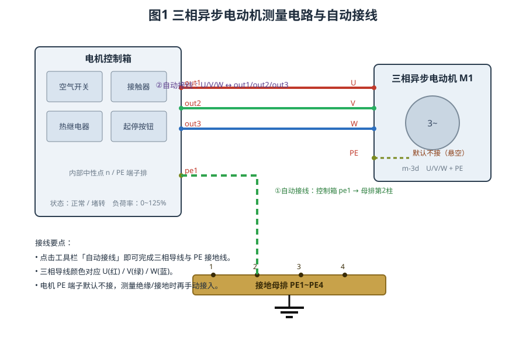
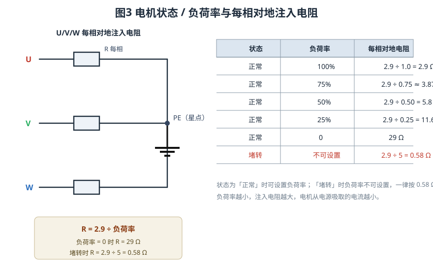
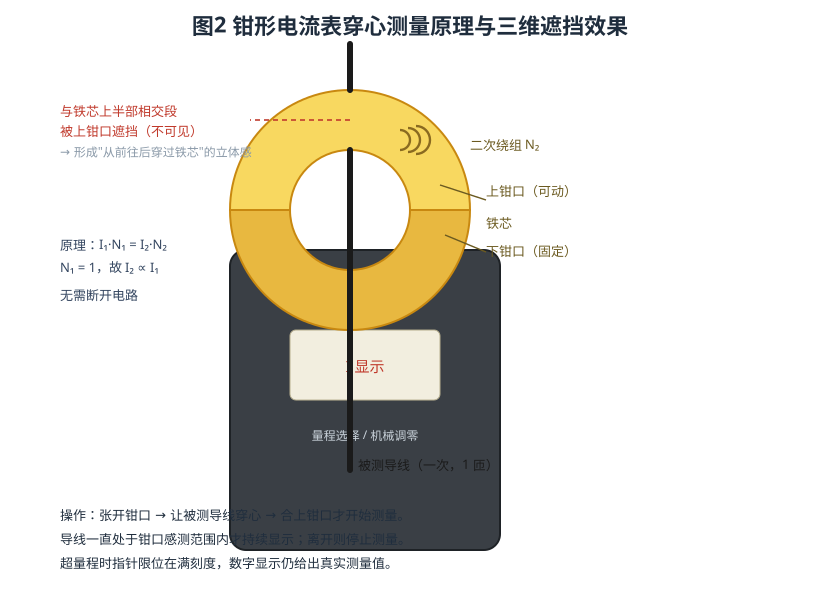

# 常用仪表及工具的使用

> 三相异步电动机电流测量仿真实验 · 操作指导

## 一、实验目的

1. 认识电机控制箱、三相异步电动机、接地母排等电气设备与器件。
2. 掌握交流电压表、交流电流表、钳形电流表的使用方法与量程选择。
3. 理解电流互感器（CT）、电压互感器（PT）的变比关系与接线方式。
4. 掌握用钳形电流表"穿心"测量三相电动机各相电流的方法。
5. 理解电动机运行状态（正常 / 堵转）与负荷率对电流的影响。

## 二、实验电路组成

实验电路由"电机控制箱 + 三相异步电动机 + 测量仪表 + 接地母排"组成，如图 1 所示。

### 2.1 三相异步电动机（m-3d）

电动机为 3D 立体造型，顶部接线盒引出 **U、V、W** 三根相线端子，机壳右上角为黄绿色的 **PE** 保护接地端子，丝印标注额定功率、额定电压与额定转速。电动机内部按"每相对地注入电阻"的方式等效建模，电流大小由运行状态与负荷率共同决定（详见第四节）。

### 2.2 电机控制箱

控制箱内装有空气开关、接触器、热继电器与起停按钮。右侧端子排对外引出三相出线端 **out1 / out2 / out3**，以及保护接地端子排 **PE1~PE4**。合上空气开关并按下起动按钮后，接触器吸合，三相电源经 out1 / out2 / out3 送至电动机。控制箱内部中性点与 PE 端子排均为同电位网络。

### 2.3 测量仪表

本实验使用"简化外观（Diagram 版）"仪表，只保留表盘操作界面：

- **钳形电流表**：不断开电路即可测量导线电流，带穿心测量与三维穿心效果；
- **交流电压表**：并联于被测电压两端，量程 100 V；
- **交流电流表**：串联于被测回路，量程 5 A；
- **电压互感器 / 电流互感器**：把高电压、大电流按比例变换为低电压、小电流后送入仪表。

### 2.4 接地母排

接地母排为一条黄铜扁排，上有 4 个接线柱（PE1~PE4）。母排左端画有接地符号，表示整条母排经接地线连至大地，正常时为 0 V 等电位参考，不承载工作电流。**控制箱第 1 个端子（PE1）接至接地母排第 2 个端子（PE2）**，使整个保护接地系统可靠接地。

## 三、自动接线

点击工具栏中的**「自动接线」**按钮，系统会自动完成以下连接：

| 序号 | 起点 | 终点 | 说明 |
|---|---|---|---|
| 1 | 电机 U | 控制箱 out1 | 三相进线 |
| 2 | 电机 V | 控制箱 out2 | 三相进线 |
| 3 | 电机 W | 控制箱 out3 | 三相进线 |
| 4 | 控制箱 PE1 | 接地母排 PE2 | 保护接地 |

需要注意：**电动机的 PE 端子默认不接线（悬空）**。这样既能正常测量三相电流，又便于后续进行绝缘电阻、接地电阻等项目时再手动接入 PE。

## 四、电动机的运行状态与负荷率

电动机有**状态**与**负荷率**两个可配置参数（右键组件 → 参数设置）：

- **状态**：可选择"正常"或"堵转"，默认为**正常**；
- **负荷率**：可选择 0、25%、50%、75%、100%、125%，默认为 **100%**；
- **只有状态为"正常"时才能设置负荷率**；状态为"堵转"时负荷率不可设置。

仿真按下列规则对 U、V、W 每相与地（PE）之间注入电阻：

- 正常、负荷率 100%：R = 2.9 Ω，即 2.9 ÷ 1.0；
- 正常、负荷率不为 0：R = 2.9 ÷ 负荷率（如 50% 时 R = 5.8 Ω，25% 时 R = 11.6 Ω）；
- 正常、负荷率 = 0：R = 29 Ω（空载、电流最小）；
- 堵转：R = 2.9 ÷ 5 = 0.58 Ω（阻抗最小、电流最大）。

可见：**负荷率越低，注入电阻越大，电机从电源吸取的电流越小**；**堵转时电阻最小，电流最大**。因此电流大小可作为判断电动机负载与堵转状态的依据。需要特别指出，堵转时电机转子**停止转动**，表盘转速显示为"堵转"。

## 五、钳形电流表的穿心测量

### 5.1 工作原理

钳形电流表利用电流互感器原理：被测导线作为一次绕组（N₁ = 1 匝）从钳口铁芯中间穿过，铁芯上绕有二次绕组（N₂ 数百匝）。根据互感关系：

**I₁ · N₁ = I₂ · N₂**

由于 N₁ = 1，二次电流 I₂ 与一次电流 I₁ 成正比，二次电流经整流后驱动表头，即无需断开电路就能读出导线电流。

### 5.2 操作步骤

1. 点击钳形电流表的扳机，**张开钳口**；
2. 拖动电流表，使被测导线（如电机 U 相导线）**从钳口中间穿心而过**；
3. 再点扳机**合上钳口**，此时才开始测量；数字显示与指针同时给出该相电流；
4. 测量 V、W 相时，把钳口移到对应导线上，重复上述步骤。

### 5.3 测量规则（仿真要点）

- **必须"先张开、后合上"**才会进入测量；导线只是从已闭合的钳口中穿过不会自动开始测量；
- 合口的瞬间会锁定当前穿心导线，**导线需始终处于钳口感测范围内**才持续显示电流；导线一旦离开感测范围，测量立即停止，需重新"张开—合上"；
- **数字显示真实测量值，即使超量程也照常显示**；指针则由机械限位停在满刻度，不再继续偏转；
- 合口测量后，穿心导线呈现三维效果：**导线与铁芯上半部分（可动上钳口）相交的一段被遮挡而不可见**，看似从铁芯后面穿过，导线在下钳口一侧（前）仍可见。

### 5.4 读数机理

仿真中，钳形电流表在每个刷新周期采集一次穿心导线的瞬时电流，并对其进行滑动窗口的**均方根（RMS）**计算，得到交流电流的有效值后再送显。因此合口瞬间读数会有一段短暂的爬升过程，稍等片刻即趋于稳定，这是仪表机械惯性与有效值计算的正常现象，并非故障。测量时应待读数稳定后再记录。

此外，钳形电流表测量的是**穿过钳口的那一根导线**的电流。若同时穿过两根导线（如相线与中性线），两者电流方向相反、磁场相互抵消，读数将接近零，这也是现场判断线路是否成对穿心的依据。

## 六、互感器与仪表的配合

在测量高电压或大电流时，直接接入仪表既不安全也可能超量程，此时使用互感器：

- **电流互感器（CT）**：原边串入被测回路，副边接电流表。变比 K = I₁ / I₂，例如 100/5 表示一次 100 A 对应二次 5 A。**CT 副边绝不允许开路**，否则铁芯磁通剧增、副边感应出高电压，危及安全。
- **电压互感器（PT）**：原边并接被测电压，副边接电压表。变比 K = U₁ / U₂，例如 400/100。

接入互感器后，仪表读数乘以变比即为实际值。

交流电压表与被测两点**并联**，其内阻很大、几乎不分流，因此绝不允许串入回路；交流电流表与被测支路**串联**，其内阻很小、几乎不分压，因此绝不允许并联在电源两端，否则将造成短路。使用互感器时，仪表读数须乘以变比 K 才是实际值。

## 七、实验步骤

1. 观察电路，认识电机控制箱、电动机、接地母排与各仪表。
2. 点击「自动接线」，完成三相导线与 PE 接地线的连接。
3. 合上控制箱空气开关，按下起动按钮，使三相电源送至电动机。
4. 将状态设为"正常"、负荷率设为 100%，观察三相电流大小。
5. 依次把负荷率改为 75%、50%、25%、0，记录电流变化，验证"负荷率越低、电流越小"。
6. 将钳形电流表张开钳口，分别套入 U、V、W 相导线，合口读取各相电流并比较。
7. 将状态改为"堵转"，观察电流增大、转子停转（显示"堵转"），负荷率不可再设置。
8. 用交流电压表、交流电流表测量相电压与相电流，并尝试经 PT/CT 接入，验证变比关系。

## 八、注意事项

1. 钳形电流表必须**先张开钳口再合上**，且导线要穿心而过，否则不进入测量。
2. 选择合适量程；虽数字可显示超量程值，但指针已到达满刻度，读数精度下降。
3. 电机 PE 端子默认不接，做保护接地相关项目时再手动接入，并确认接地可靠。
4. 堵转工况电流很大，仅作短时观察，避免长时间运行。
5. 严禁电流互感器副边开路运行。

## 九、常见问题

**问：钳口已套住导线，为什么不显示电流？**
答：必须完成"张开钳口 → 合上钳口"的动作才会进入测量；此外导线要确实从钳口内孔穿过，且电动机已通电、有电流流过。

**问：为什么指针停在满刻度，数字却还在变大？**
答：这是正常现象。指针受机械限位只能到满刻度；数字显示的是真实测量值，即使超量程也照常给出，便于判断实际电流大小。

**问：负荷率调到 0，电流为什么不为零？**
答：负荷率为 0 时每相对地注入电阻为 29 Ω，并非断路，因此仍有较小的空载电流流过。

**问：把 PE 端子接到接地母排有什么作用？**
答：使电动机外壳与接地系统可靠等电位，漏电时提供低阻抗泄放通路并驱动保护动作；自动接线默认不接，是为后续绝缘、接地类测量留出手动操作空间。

**问：堵转时为什么转子不转了？**
答：堵转表示电动机承受的负载超过其电磁转矩上限，转子被"卡住"无法转动，此时绕组阻抗最小、电流最大，长时间运行会过热，应尽快停机。
