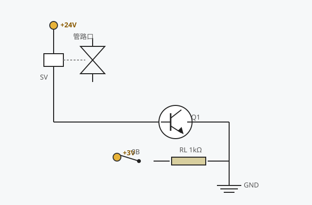

# 电磁阀驱动电路的仿真

## 一、电路组成

本仿真工程搭建了一个由三极管开关驱动的电磁阀小系统，主要元件如下：

| 元件 | 位号 | 说明 |
|------|------|------|
| 电位端子 | PT1 | +24V，替代主回路直流电源 |
| 电位端子 | PT2 | +3V，替代基极偏置电源 |
| 电磁阀 | SV | 线圈内阻 500Ω，串入主回路；右侧截止阀上下为管路口 |
| 三极管 | Q1 | NPN，放大倍数 100，实现开关作用 |
| 开关 | SB | 单级开关，接通/断开基极偏置支路 |
| 电阻 | RL | 1kΩ，基极限流电阻 |
| 接地 | GND1 | 发射极参考地 |

`docs-img/sv-circuit.svg`

## 二、电路原理

### 1. 主回路（集电极回路）

24V 电位端子 → 电磁阀线圈（500Ω）→ 三极管 C→E → 接地。
线圈串联在集电极回路中，其流过电流即为回路电流 `Ic ≈ (24 − Vce) / 500`。

### 2. 控制回路（基极支路）

3V 电位端子 → 开关 SB → 限流电阻 RL（1kΩ）→ 三极管基极。
开关合上时，基极电流约为 `Ib ≈ (3 − 0.7) / 1k ≈ 2.3mA`。

### 3. 电磁阀吸合特性

电磁阀采用电流迟滞控制：

- 线圈电流 **＞ 30mA** 时电磁阀吸合，截止阀上下管路口连通，阀体三角形填充蓝色，线圈外框变红加粗；
- 电流 **＜ 20mA** 时电磁阀释放，管路截止，阀体恢复白底、线圈外框恢复黑色。

## 三、三极管两种状态

| 状态 | 条件 | Vce 读数 |
|------|------|----------|
| 截止 | 发射结未正偏（SB 断开，Ib=0） | Vce ≈ 24V（电源电压全部降在管子两端） |
| 饱和 | 发射结正偏、集电结正偏（Ib 足够大） | Vce ≈ 0.1~0.2V（管压降很小） |

开关 SB 合上后，Ib≈2.3mA，而饱和所需基极电流仅约 0.5mA（β=100、Ic≈48mA），
故三极管进入**饱和状态**，回路电流约 48mA，满足吸合条件。

## 四、操作流程（自动演示步骤）

1. **控制回路接线**：3V 电源 → 开关 SB → 限流电阻 RL → 三极管基极；
2. **主回路接线**：24V 电源 → 电磁阀线圈 → 三极管 C-E → 接地；
3. **测量**：调出数字万用表（工具栏"选择仪表"→ 勾选 → 关闭），先指向 200V 档并转动档位开关至直流 200V 档，红表笔接集电极、黑表笔接发射极；开关未合时测得 Vce ≈ 24V，管子处于截止状态，测量后断开表笔；
4. **合上 SB**：三极管饱和导通，线圈电流约 48mA＞30mA，电磁阀吸合（阀体变蓝、线圈外框变红）；
5. **再次测量**：Vce ≈ 0.1V，管子处于饱和状态，测量后断开表笔；
6. 归纳三极管饱和条件：发射结正偏、集电结正偏。

## 五、思考与拓展

- 为什么用 24V/3V 电位端子替代直流电源能简化仿真电路？
- 若把 RL 改为 10kΩ，基极电流还有多大？电磁阀能否吸合？
- 若断开电磁阀线圈的接地端（或主回路任一导线），Vce 读数如何变化？为什么？
