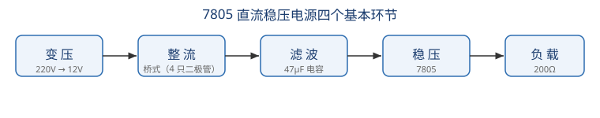

# 直流稳压电源的仿真

## 一、教学目标

1. 认识直流稳压电源电路中的主要元器件，理解其作用；
2. 掌握"变压 → 整流 → 滤波 → 稳压"四个基本环节的工作原理；
3. 学会用示波器观察各环节波形、用万用表测量输出电压，理解稳压电路的作用。

## 二、电路组成

本仿真电路由交流电源（AC 220V）、保险丝、控制变压器（220V/12V）、桥式整流（4 只二极管）、滤波电容（47µF）、三端稳压器 7805、输出滤波电容（22µF）及 200Ω 负载组成。

## 三、元器件与作用

| 元器件 | 电路位置 | 作用 |
|--------|----------|------|
| 控制变压器 | 变压环节 | 将 220V 交流降压为 12V |
| 二极管 ×4 | 整流环节 | 单向导电性组成桥式整流，把交流变为脉动直流 |
| 电解电容 47µF | 滤波环节 | 充放电储能，平滑脉动电压 |
| 7805 三端稳压器 | 稳压环节 | 不论输入电压或负载如何变化，输出稳定 +5V |
| 电解电容 22µF | 稳压输出端 | 进一步滤除高频纹波，改善动态响应 |

## 四、工作流程分析

1. **变压**：220V 交流经保险丝加到变压器原边，副边输出 12V 交流；
2. **整流**：四只二极管构成桥式整流（两组对臂二极管随交流极性交替导通），输出脉动直流；
3. **滤波**：47µF 电容充电到峰值约 15.6V，放电填补波谷，波形变得平缓；
4. **稳压**：7805 把 10~15V 的输入稳定在 +5V 输出，22µF 电容进一步滤除纹波。

**验证方法**：改变电源电压（220V→240V）或负载电阻（200Ω→300Ω），万用表读数基本仍为 5V。

## 五、仿真操作步骤

在仿真平台中选择对应操作流程，按提示逐步操作：

- **流程 1（识别元器件）**：依次点击识别变压器、整流二极管、滤波电容、三端稳压器，并完成 3 道测试题；
- **流程 2（工作流程分析）**：点击工具栏【自动接线】完成连线 → 接通电源 → 调出三路示波器，用 CH1/CH2 测变压器原、副边波形，CH3 测滤波电容两端波形（若波形未满屏，按「CHx档」按钮调整档位）→ 调出数字万用表（直流 20V 档）测负载两端电压 → 通过参数设置界面调整电源电压与负载电阻，观察输出仍稳定在 +5V。

## 六、测试题要点

1. 二极管的作用：**整流，把交流转换为脉动直流**（单向导电性）；
2. 滤波电容的作用：**储能并平滑电压波形**；
3. 直流稳压电源四个基本环节：**变压、整流、滤波、稳压**；
4. 7805 的作用：**将不稳定的直流电压稳压为稳定的 +5V 输出**。

## 七、安全注意事项

- 改接线路前先断开交流电源；保险丝称为"保护"环节，切勿用导线代替；
- 三端稳压器接反输入/输出端会损坏；注意区分电解电容极性（负极接地）。
