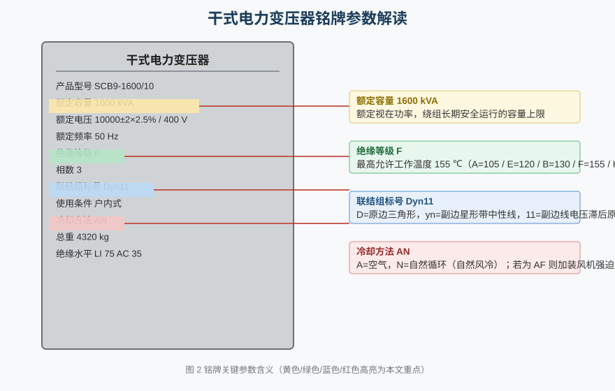
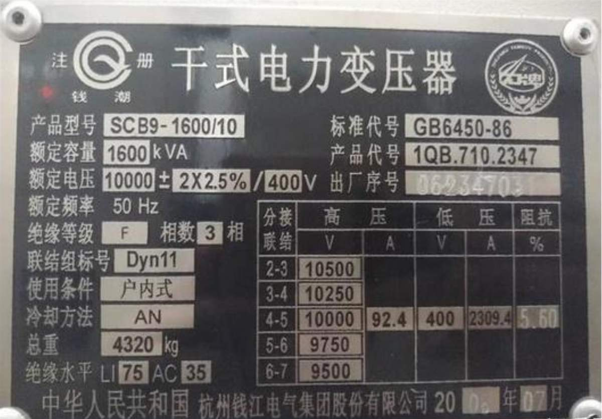
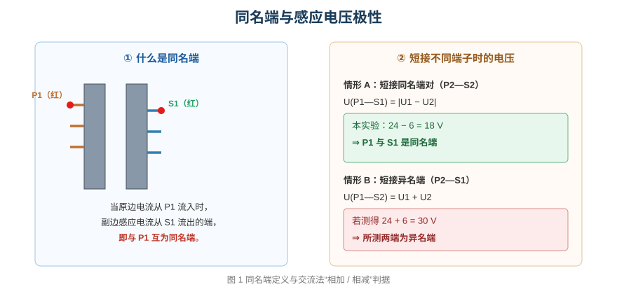
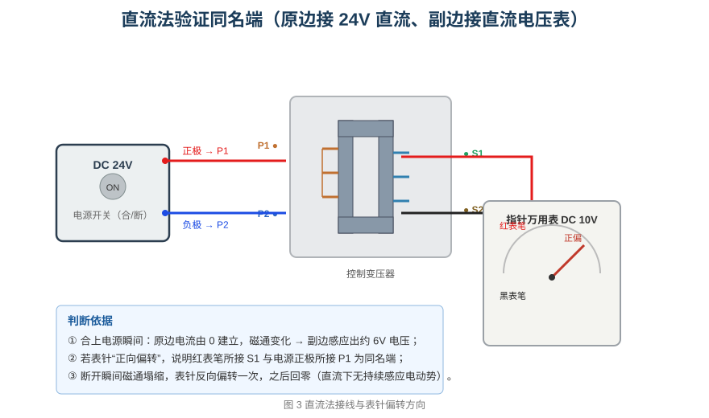
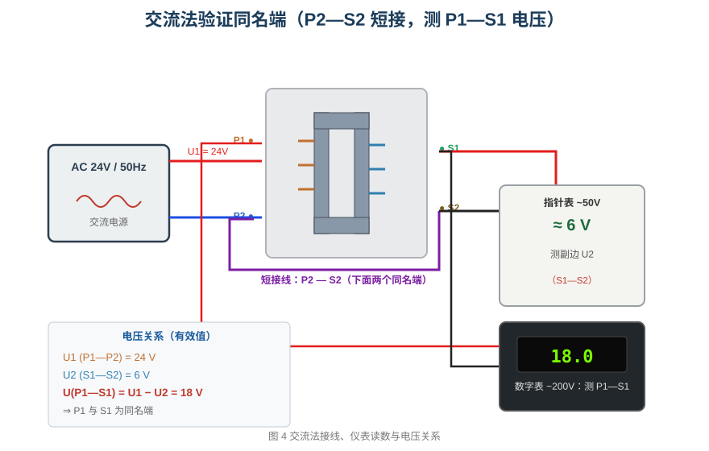

# 变压器铭牌认识与同名端判断

> 适用对象：电气类 / 船舶电气专业学生  
> 仿真平台：变压器认知工程（操作流程 1 / 2 / 3）  
> 学习目标：看懂变压器铭牌、理解同名端概念、掌握直流法与交流法两种同名端判别方法

---

## 一、为什么要认识铭牌

变压器铭牌是制造厂给出的“身份证”，标注了绕组容量、电压等级、绝缘水平、联结组别和冷却方式等关键数据。现场判断一台变压器能否替换、能否并联运行、负载能否继续增加，第一步都是核对铭牌。**铭牌上的每一个符号都不是装饰，而是运行的边界条件。**



本工程铭牌照片如下（点击工具栏“变压器铭牌”复选框即可在画布中显示）。



### 1.1 额定容量（视在功率）

铭牌上的 **额定容量 1600 kVA** 指变压器长期安全运行的视在功率上限。注意单位是 **kVA 而不是 kW**：变压器损耗（铜损、铁损）与负载功率因数无关，限制发热的是电流，而电流与视在功率直接相关，因此容量用视在功率表示。

若负载功率因数 cosφ = 0.8，则 1600 kVA 可带的有功功率约为 1600 × 0.8 = 1280 kW。仿真工程中变压器组件按“空载励磁电流为额定电流的 5%”折算励磁电感，正是以额定容量参与计算的。

### 1.2 电压等级与变比

**额定电压 10000±2×2.5% / 400 V** 表示高压侧额定 10 kV（可调 ±2×2.5%）、低压侧额定 400 V。两者之比即为变比：

```
K = U1 / U2 = 10000 / 400 = 25
```

本仿真中为便于观察，把变压器配置为 **原边 220 V / 副边 55 V**，变比 K = 4。因此当原边加 24 V 交流时，副边得到 24 ÷ 4 = 6 V——这正是后面交流法实验中出现的数值。

### 1.3 绝缘等级与温升

铭牌写着 **绝缘等级 F**。绝缘等级决定了绕组绝缘材料允许的最高工作温度，是变压器容量设计的根本依据：

| 绝缘等级 | A | E | B | F | H |
|---|---|---|---|---|---|
| 最高允许温度 | 105 ℃ | 120 ℃ | 130 ℃ | **155 ℃** | 180 ℃ |

所以 F 级绝缘的变压器运行时最高温度**不超过 155 ℃**。需要区分两个概念：**温升**是绕组温度与环境温度之差（F 级通常规定 100 K），而**最高温度**是绕组允许的绝对温度上限。仿真演示中绝缘老化、过载发热类故障，判据都取自这张表。

### 1.4 联结组标号

**联结组标号 Dyn11** 是三个部分的组合：

- **D**：高压（原边）绕组接成**三角形**；
- **yn**：低压（副边）绕组接成**星形并引出中性线**；
- **11**：副边线电压相对于原边线电压的相位移为 11 × 30° = 330°（滞后）。

联结组别决定了变压器能否与其他变压器**并联运行**：只有联结组别相同（或属于同一组别号）的变压器才能并联，否则副边线电压间将出现相位差，形成环流烧毁绕组。

### 1.5 冷却方式

**冷却方法 AN** 由两个字母构成：**A** 表示冷却介质为空气，**N** 表示介质循环方式为自然循环。故 AN 即“空气自然循环”——干式变压器靠空气自然对流散热。若铭牌为 AF，则表示加装风机强迫风冷，同一台变压器在 AF 方式下可短时提高容量。

---

## 二、什么是同名端

### 2.1 变压器的基本结构与工作原理

变压器由**铁芯**和套在铁芯上的**原边（一次）绕组**、**副边（二次）绕组**构成。原边接交流电源后，交变电流在铁芯中激励出交变磁通；该磁通同时穿过原、副边绕组，在副边感应出电动势，从而实现电压变换。理想情况下：

```
U₁ / U₂ = N₁ / N₂ = K ，   I₁ / I₂ = 1 / K
```

即电压与匝数成正比、电流与匝数成反比（忽略励磁电流与损耗）。需要强调：**变压器的“变压”依赖磁通的变化**，因此它只能变换交流。把直流加在原边上，除了通断瞬间的暂态外，稳态下副边没有持续电压——这一点正是直流法判别同名端的物理基础。

变压器按冷却介质分为油浸式与干式两大类；干式变压器以空气为冷却介质，结构简单、无油、阻燃，常用于室内配电，本工程铭牌即为干式变压器（冷却方式 AN）。

### 2.2 同名端的定义与工程意义

变压器原、副边绕组绕在同一个铁芯上，磁通是公共的。但绕向与引出端不同，**原边电流与副边感应电流的极性关系并不直观**。为此引入“同名端”（也叫同极性端、对应端）：

> 当电流分别从两个绕组的某一端流入时，若它们在铁芯中产生的磁通方向相同，则这两个端称为同名端。

工程上用“·”或“*”标记同名端。同名端的意义在于：它确定了副边感应电压的**极性**。判断错了同名端，接线会导致多台变压器环流、差动保护误动、可控整流触发相位错误等严重后果。例如两台变压器并联时，若副边极性相反，副边之间将出现约两倍额定电压的电位差，形成极大的环流，可能瞬间烧毁绕组。因此，新装或大修后的变压器（尤其是绕组引线重新接过的情况）必须重新校验同名端。

本实验用两种方法验证本工程变压器 P1 与 S1 是否同名端。



---

## 三、操作流程 1：认识变压器铭牌

在任务下拉框中选择 **“1. 认识变压器铭牌”**，按提示逐步完成：

1. **勾选工具栏“变压器铭牌”复选框**。演示模式会先用红色虚线框和箭头指向该复选框，再执行勾选，画布随即显示铭牌图片。
2. **填空题**：变压器的绝缘等级是（F），变压器运行时的最高温度不超过（155）℃。
3. **填空题**：变压器的连接组别是（Dyn11），原边连接形式是（三角形），副边连接形式是（星形带中性线）。
4. **填空题**：变压器的冷却方式是（AN）。
5. **填空题**：变压器的额定视在功率是（1600 kVA）。

> 小提示：绝缘等级与温度限值的对应关系（F→155 ℃）是常考点，建议结合 1.3 节的表格记忆。

---

## 四、操作流程 2：直流法验证同名端

### 4.1 实验原理

在**直流**励磁下，变压器只在**接通与断开的瞬间**产生感应电动势：

- **接通瞬间**：原边电流由 0 建立，铁芯磁通增大，副边按变比感应出一个电压（本工程为 24 ÷ 4 = 6 V）；
- **稳态**：直流电流不再变化，磁通恒定，副边感应电动势为零；
- **断开瞬间**：磁通迅速塌缩，副边感应出与接通时**反极性**的电压脉冲，随后回零。

因此，观察**接通瞬间表针的偏转方向**即可判断同名端——这就是“直流法”（也叫脉冲法）。



### 4.2 操作步骤

1. **识别同名端**：原边红色接线柱 **P1** 与副边红色接线柱 **S1** 是同名端。演示模式会依次用箭头指示这两个接线柱；演练模式下单击变压器即可通过。
2. **接直流电源**：24 V 直流电源正极接 P1、负极接 P2。
3. **调出模拟万用表（MF47）**：打开“选择仪表”界面，勾选指针万用表，点击“关闭”，再把量程开关打到**直流 10V 档**。
4. **接副边**：红表笔（V·Ω）接 S1，黑表笔（COM）接 S2。
5. **合上电源**：按下直流电源的电源键，观察**表针正向偏转**（副边约 6 V），随后迅速回零。
6. **断开电源**：再按一次电源键，观察表针**反向偏转一次**后回零。

### 4.3 结果判读

| 现象 | 结论 |
|---|---|
| 表针正向偏转（副边电压为正） | 红表笔所接 S1 与电源正极所接 P1 为**同名端** |
| 表针反向偏转 | S1 与 P1 为**异名端** |

**为什么稳态时读不到电压？** 因为直流下磁通不变化，副边感应电动势恒为零。仿真中这一瞬态被有意压缩为约 0.25 s 的“闪现阶段”，避免平台时间基准把真实的 L/R 暂态放大成分钟级的缓慢衰减，从而更接近真实演示效果。

### 4.4 通电与断电的瞬态分析

设原边绕组电阻为 R₁、励磁电感为 Lₘ，副边开路。合上直流电源后，原边电流按一阶电路规律建立：

```
i₁(t) = (U / R₁) · (1 − e^(−t/τ)) ,   τ = (Lₘ + L₁) / R₁
```

由法拉第电磁感应定律，副边感应电压正比于原边电流的变化率：

```
u₂(t) = M · di₁/dt = (U / K) · e^(−t/τ)
```

可见：

- **t = 0⁺ 瞬间**，副边电压达到最大值 **U / K**。本工程 U = 24 V、K = 4，故峰值恰为 **6 V**，与实测一致；
- 随后按时间常数 τ 指数衰减，最终趋于 0——**这就是“直流下变压器不能变压”的数学表达**；
- **断开瞬间**，原边电流由 I₀ 迅速下降到 0，di₁/dt 变号，于是副边电压极性翻转，产生一个**反向脉冲**，幅值与断开前的稳态磁通相对应。

因此完整观察到的现象是：**合闸时表针正偏一次并很快回零；分闸时表针反偏一次再回零**。若把两个表笔对调再合闸，表针将由“正偏”变为“反偏”，据此即可判定表笔所接端子与电源正极是否为同名端。

### 4.5 仿真操作要点

- 直流电源的“通电”由面板上的**电源键**控制，按下为合、再按为断；
- MF47 的**直流 10V 档**才能看清约 6 V 的脉冲；档位过大（如 250V 档）指针偏转很小，不易分辨方向；
- 表笔极性不能接反：**红表笔（V·Ω）对应感应电压的正端**，黑表笔（COM）接另一端，否则方向判断会整体颠倒；
- 每次通断只产生一次脉冲，若错过可反复通断观察。

---

## 五、操作流程 3：交流法验证同名端

### 5.1 实验原理

直流法依赖瞬态，读数短暂；交流法用**稳态电压**判断，更稳定、更精确。

把两绕组的**一对同名端短接**（本实验短接下面的 P2 与 S2），则另一对端子 P1 与 S1 之间的电压等于两绕组电压的**相量差**：

- 若 P1 与 S1 为**同名端**：`U(P1—S1) = |U1 − U2|`（相减）
- 若 P1 与 S1 为**异名端**：`U(P1—S1) = U1 + U2`（相加）



### 5.2 操作步骤

1. **接交流电源**：24 V 交流电源接原边 P1、P2。
2. **调出 MF47**：勾选指针万用表并关闭界面，量程打到**交流 50V 档**；红表笔接 S1、黑表笔接 S2，测量副边电压 U2。
3. **短接同名端**：用导线把下面两个端子 **P2—S2** 短接。
4. **调出数字万用表**：勾选数字万用表并关闭界面，量程打到**交流 200V 档**；红表笔接 P1、黑表笔接 S1，测量 P1—S1 之间的电压。
5. **合上交流电源**，分别读取两只表的电压值。

> 注意：数字万用表的档位由**旋钮手柄角度**决定。设置档位时若只改显示模式而手柄仍停在 OFF，读数不会刷新；正确做法是同步转动手柄到“~200V”刻度。

### 5.3 结果与判读

| 测量项 | 实测值 | 说明 |
|---|---|---|
| 原边电压 U1（P1—P2） | **24 V** | 交流电源设定值 |
| 副边电压 U2（S1—S2） | **6 V** | 24 ÷ 4，变比 K = 4 |
| P1—S1 之间电压 | **18 V** | = 24 − 6，为两电压之**差** |

由于测得电压等于两绕组电压之**差**（U1 − U2 = 18 V），说明短接 P2—S2 后 P1 与 S1 处于**同名端**关系，与流程 2 的结论一致。

**填空题答案**：原边电压 **24 V**，副边电压 **6 V**，P1 与 S1 两端之间的电压 **18 V**。

### 5.4 相量推导

把副边看成一个电压相量 **U̇₂**，其参考方向由同名端决定。将 P2 与 S2 短接后，从 P1 到 S1 的路径相当于两个绕组**串联**：

- 若 P1、S1 为**同名端**，则 U̇₁ 与 U̇₂ 的参考方向相反，串联后：

  ```
  U̇(P1—S1) = U̇₁ − U̇₂   →   有效值 |U₁ − U₂| = 24 − 6 = 18 V
  ```

- 若 P1、S1 为**异名端**，则两电压方向相同，串联后：

  ```
  U̇(P1—S1) = U̇₁ + U̇₂   →   有效值 U₁ + U₂ = 24 + 6 = 30 V
  ```

因此只需比较实测值与 24 V、6 V 的关系（和还是差），即可判定同名端。本实验测得 18 V，属于“差”，故 P1 与 S1 为同名端。

### 5.5 测试题要点

> 短接一对同名端后，若另一对端子电压为 U1 + U2（之和），说明这两端是**异名端**；若为 U1 − U2（之差），则为**同名端**。

记忆口诀：**同短测同得差，同短测异得和。** 其中“同短”指短接的是一对同名端，“测同/测异”指测量端是否为同名端。

---

## 六、两种方法对比与常见问题

| 项目 | 直流法（脉冲法） | 交流法 |
|---|---|---|
| 激励 | 24 V 直流，仅瞬态有效 | 24 V 交流，稳态有效 |
| 仪表 | MF47 直流 10V 档 | MF47 交流 50V 档 + 数字表交流 200V 档 |
| 判据 | 接通瞬间表针偏转方向 | 短接同名端后测 U1 ± U2 |
| 优点 | 接线简单、无需交流电源 | 读数稳定、结论明确 |
| 缺点 | 瞬态短暂、需抓准方向 | 需两只表、接线稍多 |

**常见问题**

1. **直流稳态读数为零是不是表坏了？** 不是。直流下磁通恒定，副边本就没有持续感应电动势，只有通断瞬间有脉冲。
2. **断开瞬间表针为什么反向？** 磁通塌缩使 di/dt 变号，感应电压极性与接通时相反。
3. **为什么短接同名端后电压是相减？** 两个绕组的电压相量方向相反，串联后相互抵消一部分，故为差；短接异名端时方向相同，则为和。

---

## 七、仿真平台操作说明

本工程提供三种教学模式，可在工具栏切换：

- **自动演示（show）**：逐步播放操作过程。凡涉及接线，均以动画方式逐根连出；凡需勾选、转档等界面操作，会先用红色虚线框与箭头指向目标，再执行动作，便于看清“指哪儿、做什么”。
- **单步演示（step）**：由教师控制节奏，点一次走一步，适合课堂讲解。
- **演练 / 评估（train / eval）**：由学生自行操作，系统检查完成情况。演练模式保留提示，评估模式隐藏后续步骤并要求独立完成。

完成接线与读数后，填空与测试题会自动核对答案：

- 流程 1 填空题：绝缘等级 **F**、最高温度 **155 ℃**、连接组别 **Dyn11**、原边 **三角形**、副边 **星形带中性线**、冷却方式 **AN**、额定视在功率 **1600 kVA**；
- 流程 3 填空题：原边 **24 V**、副边 **6 V**、P1—S1 **18 V**；
- 流程 3 测试题：短接同名端后测得的“差”说明测量端为同名端。

**操作时的几个易错点**

1. 直流法务必在**通断瞬间**看表针，稳态读数为零属正常现象；
2. 数字万用表换档要真正**转动手柄**，仅看显示数字可能仍停在 OFF 档；
3. 交流法必须先**短接 P2—S2**，再测量 P1—S1，否则 P1—S1 间的电压不全；
4. 两只表笔极性不要接反，否则偏转方向与结论整体颠倒。

---

## 八、小结

1. 铭牌是变压器的运行边界：**1600 kVA** 定容量、**F 级 155 ℃** 定温度、**Dyn11** 定接线与并联条件、**AN** 定冷却方式。
2. **同名端**描述的是两绕组磁通方向一致的端子对，它决定副边感应电压的极性。
3. **直流法**看瞬态表针方向；**交流法**短接同名端后测“和”还是“差”。
4. 本工程实测：U1 = 24 V、U2 = 6 V、U(P1—S1) = 18 V = U1 − U2，故 **P1 与 S1 是同名端**。
