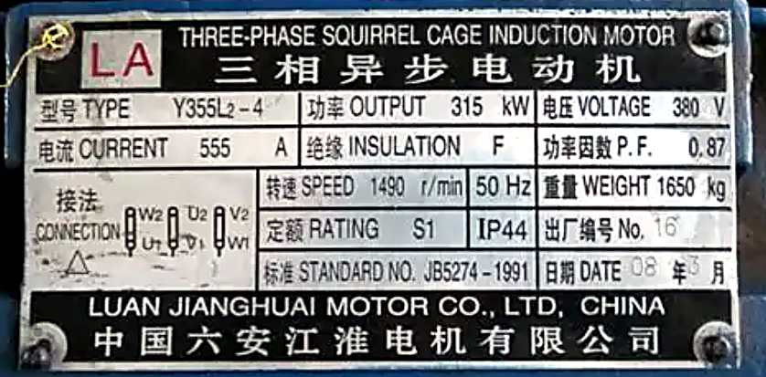
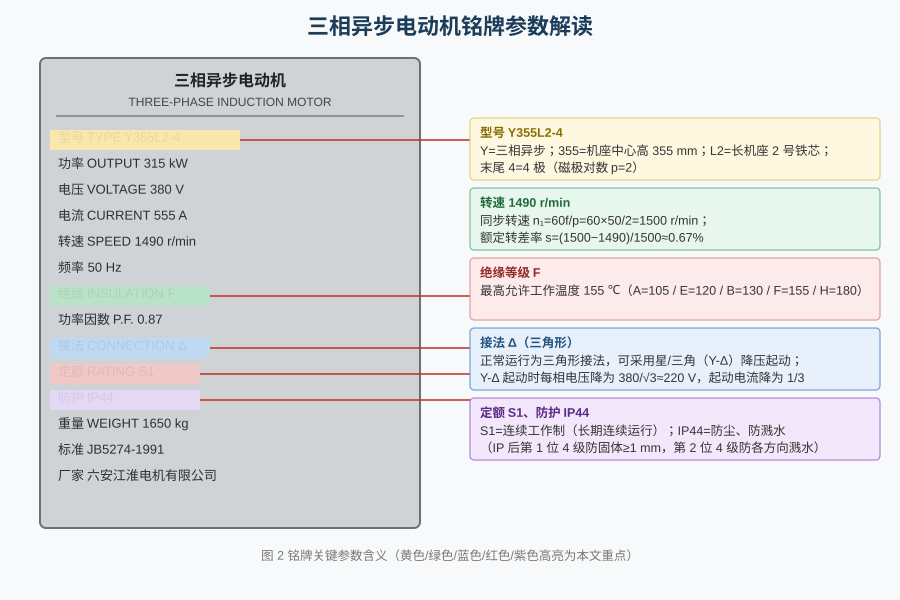
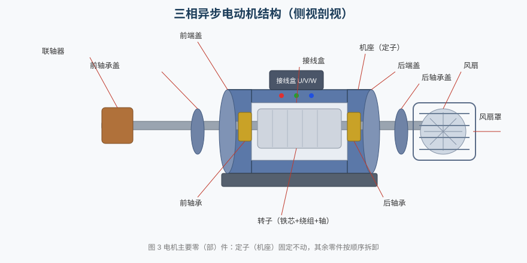
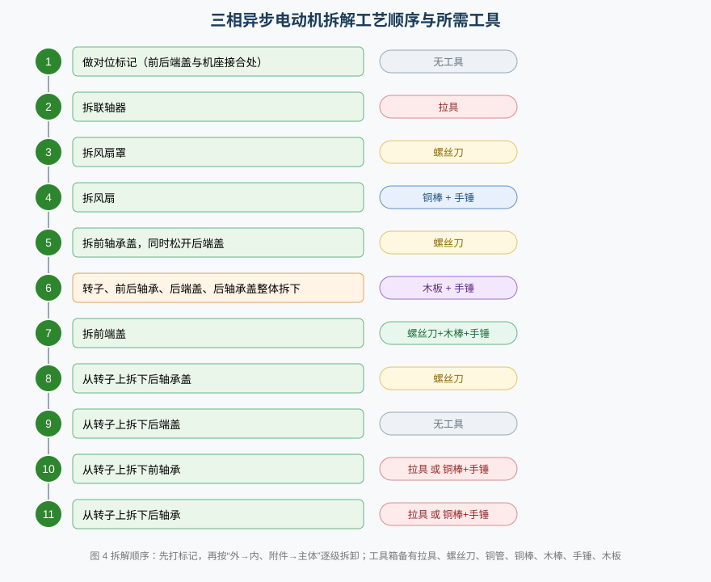

# 电动机铭牌认识和电动机拆解

> 适用对象：电气类 / 船舶电气专业学生  
> 仿真平台：三相异步电动机工程（操作流程 1 / 2）  
> 学习目标：读懂三相异步电动机铭牌、掌握其结构与拆解工艺、正确选用拆装工具

---

## 一、为什么要认识铭牌

铭牌是电动机的“身份证”，标注了型号、功率、电压、电流、转速、绝缘、接法、定额与防护等级等关键数据。判断一台电机能否替换、能否采用星—三角降压起动，第一步都是核对铭牌——**铭牌上的每个数字都是运行的边界条件。**

本工程铭牌照片如下（勾选工具栏“电动机铭牌”复选框即可在画布中显示）。





### 1.1 型号 Y355L2-4

型号包含四个信息：**Y** 表示三相异步电动机；**355** 表示机座中心高 355 mm；**L2** 表示长机座 2 号铁芯；末尾 **4** 表示 **4 极**，即磁极对数 **p = 2**。

### 1.2 额定数据

**额定功率 315 kW** 是转轴上长期输出的机械功率；**额定电压 380 V**、**额定电流 555 A** 为额定工况下的线电压与线电流；**功率因数 0.87** 是定子吸收的有功功率与视在功率之比。三者与效率满足 P_N = √3·U_N·I_N·cosφ·η。

### 1.3 转速与转差率

50 Hz、p = 2 时，旋转磁场的**同步转速**为

```
n₁ = 60 f / p = 60 × 50 / 2 = 1500 r/min
```

铭牌转速 **1490 r/min** 略低于同步转速，二者之差即**转差率**：

```
s = (n₁ − n_N) / n₁ = (1500 − 1490) / 1500 ≈ 0.0067 = 0.67%
```

异步电动机正是靠这点转差，使转子导体切割磁场产生感应电流与电磁转矩；若 s=0（转速等于同步转速），转子与磁场无相对运动，就没有转矩——这便是“异步”的本质。

### 1.4 绝缘等级与防护等级

铭牌写着 **绝缘等级 F**。绝缘等级决定绕组绝缘材料允许的最高工作温度：

| 绝缘等级 | A | E | B | F | H |
|---|---|---|---|---|---|
| 最高允许温度 | 105 ℃ | 120 ℃ | 130 ℃ | **155 ℃** | 180 ℃ |

故 F 级绝缘的电机运行时绕组最高温度**不超过 155 ℃**。防护等级 **IP44** 中，前一位 4 表示防止直径≥1 mm 的固体异物进入，后一位 4 表示防各方向溅水，适用于粉尘、潮湿的机舱环境。

### 1.5 接法与定额

**接法 Δ（三角形）** 表示在 380 V 线电压下三相绕组接成三角形。由于正常运行为三角形接法，**可以采用星/三角（Y—Δ）降压起动**：起动时先接成星形，每相电压降为 380/√3 ≈ 220 V，起动电流降为直接起动的 1/3；转速升高后切换为三角形运行。

**定额 S1** 表示**连续工作制**——电机可按额定功率长期连续运行而不超过温升限值（另有 S2 短时、S3 断续等）。

---

## 二、三相异步电动机的结构

三相异步电动机由两大部分组成：**定子**（机座、定子铁芯、三相绕组、接线盒）固定不动；**转子**（转轴、转子铁芯、转子绕组）在轴承支撑下旋转。此外还有端盖、轴承盖、轴承、风扇、风扇罩、联轴器等零（部）件。



- **机座**：支撑定子铁芯并散热；
- **端盖**：装于前、后端，用止口与机座对中，内含轴承室；
- **轴承盖**：压在端盖外面，固定轴承并封油，分前、后轴承盖；
- **风扇与风扇罩**：非驱动端轴伸装风扇，罩内强制通风冷却；
- **联轴器**：装于驱动端轴伸，与负载机械连接。

---

## 三、操作流程 1：电动机铭牌参数的认识

在任务下拉框选择 **“1. 三相异步电动机铭牌参数的认识”**，按提示完成。演示模式会先用箭头指向工具栏复选框并勾选，画布随即显示铭牌。

| 序号 | 题目 | 答案 |
|---|---|---|
| 1 | 勾选工具栏“电动机铭牌” | 显示铭牌图片 |
| 2 | 磁极数 / 磁极对数 p | **4 极** / **p = 2** |
| 3 | 正常工作接法 / 能否星—三角降压起动 | **三角形（Δ）** / **可以** |
| 4 | 绝缘等级 / 最高允许温度 | **F** / **155 ℃** |
| 5 | 防护等级 | **IP44** |
| 6 | 额定转差率 | **0.0067（0.67%）** |
| 7 | 定额 / 工作制 | **S1** / **连续工作制** |

> 记忆要点：由型号末尾数字定磁极数→定同步转速→算转差率；由接法判断能否 Y—Δ 起动。

---

## 四、操作流程 2：电动机的拆解

### 4.1 拆装原则

1. **先标记、后拆卸**：拆卸前在前后端盖与机座接合处做好**对位标记**，装配时按标记复位，保证端盖与机座同心、转子不扫膛。
2. **工具对应**：先选对工具（工具箱含拉具、螺丝刀、铜管、铜棒、木棒、手锤、木板），**未勾选所需工具则拆不动**，拆下后自动取消勾选。
3. **由外及内、由附件到主体**：先拆外部附件（联轴器、风扇罩、风扇），再拆端盖，最后抽出转子并分解轴承。
4. **忌用铁锤直接敲击**：敲击端盖、转子应垫**木板/木棒**，用**铜棒**传导冲击，防止损伤配合面与轴颈。



### 4.2 拆解步骤

| 步骤 | 操作 | 所需工具 | 说明 |
|---|---|---|---|
| 1 | 做对位标记 | 无 | 在前后端盖与机座接合处划线 |
| 2 | 拆联轴器 | **拉具** | 用拉具将联轴器从轴伸上拉出 |
| 3 | 拆风扇罩 | **螺丝刀** | 拧下固定螺钉，取风扇罩 |
| 4 | 拆风扇 | **铜棒 + 手锤** | 铜棒抵住风扇根部，手锤轻击拆下 |
| 5 | 拆前轴承盖并松开后端盖 | **螺丝刀** | 拧下前轴承盖螺栓，同时松开后端盖螺栓 |
| 6 | 转子、前后轴承、后端盖、后轴承盖**整体拆下** | **木板 + 手锤** | 垫木板轻敲轴端，将转子连同轴承、后端盖、后轴承盖一起抽出 |
| 7 | 拆前端盖 | **螺丝刀 + 木棒 + 手锤** | 螺丝刀拆螺栓，木棒垫住、手锤敲击取下端盖 |
| 8 | 从转子上拆后轴承盖 | **螺丝刀** | 拧下螺栓取下轴承盖 |
| 9 | 从转子上拆后端盖 | 无 | 沿轴颈退出后端盖 |
| 10 | 从转子上拆前轴承 | **拉具**（或铜棒+手锤） | 优先用拉具；无拉具时铜棒抵住轴承内圈、手锤敲击 |
| 11 | 从转子上拆后轴承 | **拉具**（或铜棒+手锤） | 同上 |

> 注意步骤 6：此时**转子、前后轴承、后端盖、后轴承盖仍连在一起**，先整体抽出，再在步骤 8～11 中逐个分解，避免在机座内强行拆轴承而损伤轴颈。

### 4.3 关键要点

- **拉具**（拉马）利用螺旋顶杆将过盈配合的零件（联轴器、轴承）平稳拉出，受力均匀、不伤轴；
- **铜棒**较软，可吸收锤击冲击而不损伤零件，常用于敲击风扇、轴承内圈；**木板/木棒**作缓冲垫，用于敲击端盖、转子；
- 抽出转子时应在**定子内腔垫薄纸板或木板**，防止转子铁芯擦伤定子绕组与铁芯；
- 装配顺序与拆卸相反，并按对位标记复位。

---

## 五、仿真平台操作说明

本工程提供三种教学模式，可在工具栏切换：

- **自动演示（show）**：逐步播放，每步先用箭头指向目标，再执行操作；
- **单步演示（step）**：由教师控制节奏，点一次走一步；
- **演练 / 评估（train / eval）**：由学生自行操作，系统按 `check` 判定，评估模式隐藏后续步骤。

**易错点**：① 忘记先打标记就去拆件（系统提示“拆卸前请先做好对位标记”）；② 工具选错或漏选导致拆不动（如拆风扇需同时勾选铜棒与手锤）；③ 顺序错误（如先拆前端盖再抽转子）。

---

## 六、小结

1. 铭牌是电机的运行边界：**315 kW / 380 V / 555 A / 1490 r/min / F 级 155 ℃ / Δ 接法 / S1 连续 / IP44**；
2. 由型号“-4”得 p = 2、n₁ = 1500 r/min，额定转差率 **s ≈ 0.67%**；正常运行为三角形接法，**可以**星—三角降压起动；
3. 拆解遵循 **先标记 → 拆附件 → 拆端盖 → 整体抽转子 → 分解轴承** 的顺序，工具对应、垫木缓冲、拉具优先；
4. 仿真中工具未勾选或顺序错误都会“拆不动”，正是对真实工艺规范的模拟。
