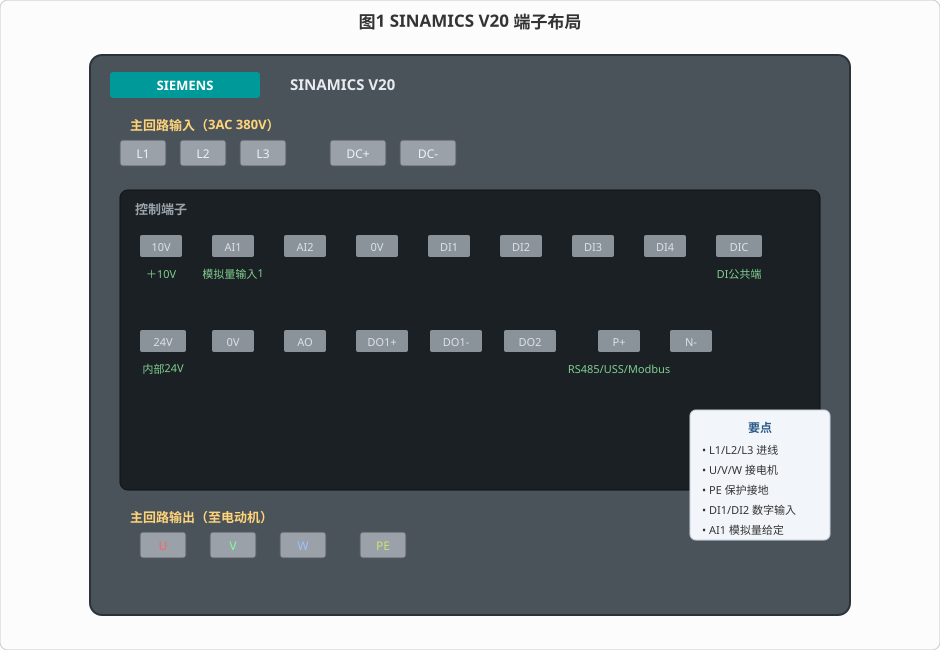
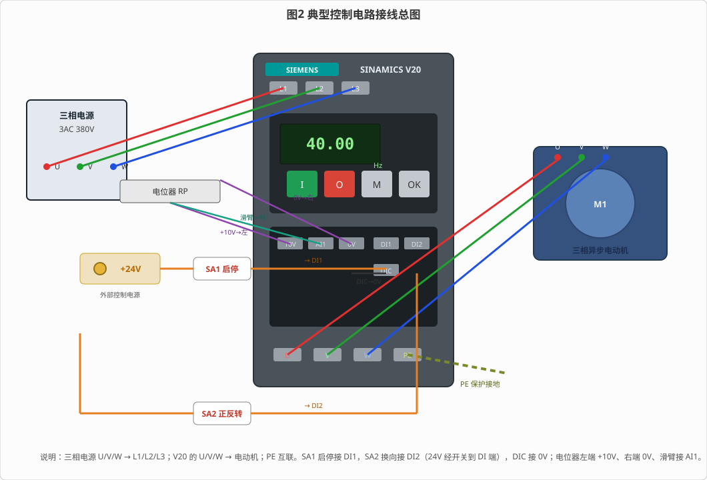
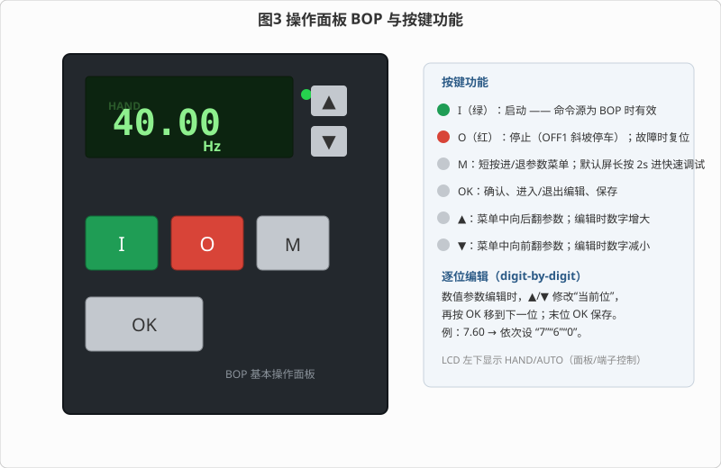
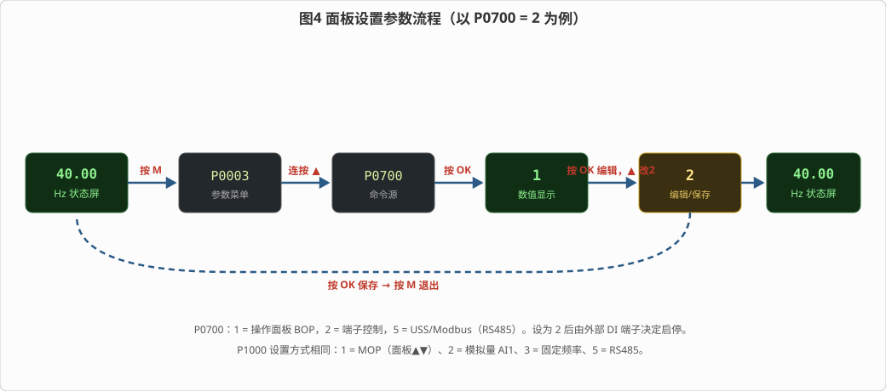
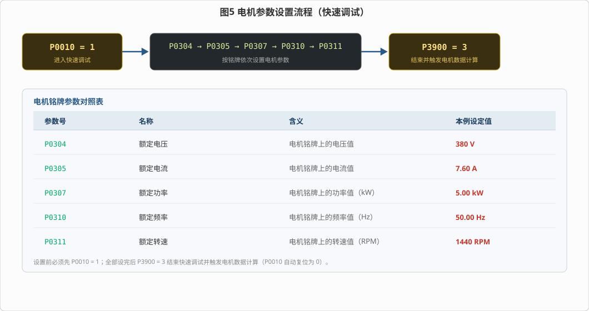

# 变频器接线和参数设定

> 适用对象：西门子 **SINAMICS V20** 紧凑型变频器（0.12 ~ 30 kW）
> 配套仿真平台（本工程），含三个自动演示流程，本文所述操作均可在软件中逐一演示：
> ① 变频器端子识别与接线　② 变频器参数设置（端子启停 + 模拟量调速）　③ 电机参数设置

---

## 一、概述

变频器（VFD / VSD）先把工频交流电整流成直流，再逆变成**电压、频率都可调**的交流电，去驱动三相异步电动机，从而实现**无级调速**。相比传统的直接起动、星三角起动，变频调速具有起动电流小、调速平滑、节能（风机水泵类负载尤为明显）等优点。

西门子 SINAMICS V20 是一款面向基本应用的紧凑型变频器：接线简单、内置**基本操作面板（BOP）**、支持 **V/f 控制**，并提供**连接宏 / 应用宏**，可快速完成常用参数配置。它常用于风机、水泵、压缩机、输送机等设备。

本实验的目标是：**① 认识变频器端子 → ② 完成典型控制电路接线 → ③ 用面板启停电机并调速 → ④ 设置命令源/频率源 → ⑤ 按电机铭牌设置电机参数**。

### 1.1 变频调速的基本原理

三相异步电动机的同步转速 `n₁ = 60f / p`（f 为定子供电频率，p 为磁极对数），实际转速 `n = n₁(1 − s)`（s 为转差率）。可见**改变供电频率 f 即可平滑地改变电机转速**。变频器在改变频率的同时，按 **V/f = 常数** 成比例地改变输出电压，使电机磁通基本保持不变，避免低频率时磁通饱和、转矩不足——这就是最基本的 **V/f 控制**。V20 采用 V/f 控制（并提供二次方 V/f、带 FCC 的 V/f 等模式），因此其“输出频率”与“电机转速”基本成正比，这正是本实验用频率来观察转速的依据。

### 1.2 安全提示

- 变频器主回路端子 **L1/L2/L3、DC+/DC-、U/V/W** 在断电后仍可能带危险电压，**断电后须等待约 5 分钟**，待内部直流母线放电完毕后方可开盖；
- 接线、拆装必须在**完全断电**状态下进行，并确保可靠接地（PE）；
- 禁止在运行中带电插拔电机线，避免电弧与器件损坏。

---

## 二、SINAMICS V20 的端子

V20 的端子分为**主回路端子**和**控制回路端子**两大类，见图 1。

### 2.1 主回路端子

| 端子 | 名称 | 说明 |
|------|------|------|
| **L1 / L2 / L3** | 三相进线 | 接三相电源（400V 级为 3AC 380~480V） |
| **U / V / W** | 电机输出 | 接三相异步电动机定子绕组 |
| **PE** | 保护接地 | 变频器与电机外壳统一接保护大地 |
| **DC+ / DC-** | 直流母线 | 直流母线端子（多台共直流母线时使用） |

### 2.2 控制回路端子

| 端子 | 类别 | 说明 |
|------|------|------|
| **+10V、0V** | 模拟量电源 | 内部 10V 基准电源，供电位器/给定使用 |
| **AI1、AI2** | 模拟量输入 | AI1 可作 0~10V / 0~20mA 给定，常接电位器调速 |
| **DI1 ~ DI4** | 数字量输入 | 可设 ON/OFF、正反转、故障确认、固定频率等功能 |
| **DIC** | 数字量公共端 | DI 的公共端（PNP 时接 0V，NPN 时接 24V） |
| **+24V、0V** | 24V 辅助电源 | 内部 24V 输出，可作 DI 的电源 |
| **AO** | 模拟量输出 | 0~20mA，可输出频率/电流等 |
| **DO1、DO2** | 数字量输出 | DO1 晶体管、DO2 继电器，可输出“运行中/故障” |
| **P+、N-** | RS485 | USS / Modbus RTU 通信端子 |

> **要点**：主回路负责“送电”，控制回路负责“发令”。L1/L2/L3 进、U/V/W 出、PE 接地是最基本的“三进三出一接地”。

---

## 三、典型控制电路接线（操作流程 1）

一个最典型的控制电路如图 2 所示：主电路把三相电源送到变频器、再从变频器送到电机；控制电路用**外部 24V** 经**启停开关**接 DI1、经**正/反转开关**接 DI2，用**电位器**给 AI1 送 0~10V 调速信号。

### 3.1 接线步骤

| 序号 | 接线内容 | 线数 |
|------|---------|------|
| 1 | 三相电源 **U/V/W → L1/L2/L3** | 3 |
| 2 | 变频器 **U/V/W → 电动机 U/V/W**，**PE → PE** | 4 |
| 3 | **DIC → 0V**；**+24V → SA1（启停）→ DI1**；**+24V → SA2（正/反转）→ DI2** | 5 |
| 4 | **+10V → 电位器左端**，**0V → 电位器右端**，**滑臂 → AI1** | 3 |

> 图 2 中：SA1 合上=运行、断开=停止；SA2 合上=反转、断开=正转；电位器滑臂越靠左输出电压越高、频率越高。

> **接线注意事项**：① 主回路导线应按功率选截面，L1/L2/L3（进线）与 U/V/W（出线）不可接反；② **PE 必须可靠接地**；③ 控制线尽量远离主回路动力线，避免电磁干扰；④ 模拟量 AI1 建议使用屏蔽线，屏蔽层单端接地。

### 3.2 演示流程（流程 1，共 8 步）

1. 识别电源输入 **L1/L2/L3**，逐根接到三相电源；
2. 识别电源输出 **U/V/W** 与 **PE**，完成与电机的接线；
3. 识别数字量输入 **DI1/DI2/DIC**，完成数字量接线；
4. 识别模拟量输入 **AI1**，完成电位器接线；
5. 开启电源，按面板 **I** 键起动电机；
6. 按 **▲** 键，把频率调到 **45Hz**，观察转速上升；
7. 按 **▼** 键，把频率调到 **40Hz**，观察转速下降；
8. 按 **O** 键，停止电机。

> 演示中每做一个动作前，都会先用箭头圈出对应端子/按键，接线采用**逐根动画**，调频则模拟人手**每按一次 0.5Hz**。

---

## 四、操作面板 BOP

V20 内置基本操作面板（BOP），是现场最常用的操作与观察窗口，见图 3。

| 按键 | 功能 |
|------|------|
| **I（绿）** | 起动。命令源为 BOP（P0700=1）时有效 |
| **O（红）** | 停止（OFF1 斜坡停车）；有故障时用于**故障复位** |
| **M** | 短按：进入/退出**参数菜单**；在默认屏**长按约 2s**：进入**快速调试** |
| **OK** | 确认；进入数值显示；进入/退出编辑；保存 |
| **▲ / ▼** | 菜单中翻阅参数；编辑时增大/减小 |

**参数菜单操作**：按 `M` 进入 → 用 `▲/▼` 选中参数号 → `OK` 显示数值 → 再按 `OK` 进入编辑 → 用 `▲/▼` 修改 → `OK` 保存 → `M` 退出。

**逐位编辑（digit-by-digit）**：数值参数编辑时，`▲/▼` 只修改**当前一位**数字，再按 `OK` 移到下一位，最后一位按 `OK` 即保存。例如把电流设为 `7.60`，依次修改“个位 7”“十分位 6”“百分位 0”即可，无需反复按上百次。

面板左下角显示 **HAND / AUTO**：HAND 表示命令来自面板（BOP），AUTO 表示命令来自端子。

### 4.1 LCD 显示

- **运行状态屏**显示输出频率（如 `40.00 Hz`）；停止时闪烁显示设定值；
- **故障时**显示故障码（如 `F0003` 欠电压），此时按 `OK` 或红键可复位；
- **参数菜单**显示参数号（如 `P0700`），按 `OK` 显示数值，再按 `OK` 进入编辑。

---

## 五、命令源与频率源的设置（操作流程 2）

变频器要“听谁的命令、按谁的频率运行”，由两个关键参数决定：

| 参数 | 名称 | 取值 |
|------|------|------|
| **P0700** | 命令源（启停通道） | **1 = 操作面板 BOP；2 = 端子；5 = USS/Modbus（RS485）** |
| **P1000** | 频率设定源 | **1 = MOP（面板▲▼）；2 = 模拟量 AI1；3 = 固定频率；5 = RS485** |

出厂默认 `P0700=1、P1000=1`，即面板控制、面板调速。改成端子控制时设 `P0700=2`；改成模拟量调速时设 `P1000=2`。

### 5.1 面板设置流程（以 P0700 由 1 改为 2 为例）

1. 按 `M` 进入参数菜单；
2. 连按 `▲`，直到显示 **P0700**；
3. 按 `OK`，进入数值显示；
4. 按 `OK`，进入编辑；
5. 按 `▲`，把数值改为 **2**；
6. 按 `OK` 保存；
7. 按 `M` 退出参数菜单。

P1000 的设置方法完全相同，只是把目标参数换成 **P1000**、数值改为 **2**。

### 5.2 演示流程（流程 2，共 6 步）

1. 点击【自动接线】完成全部接线，并开启交流电源；
2. 面板设置 **P0700 = 2**（由外部端子决定启停）；
3. 合上 **SA1** 远程启停开关，电机起动；
4. 断开 **SA1**，电机停止；
5. 面板设置 **P1000 = 2**（由 AI1 模拟量决定速度）；
6. 合上 SA1 起动，把电位器滑臂滑到 **75%**，观察转速变化。

> 提示：改为端子控制后，面板的 `I/O` 键不再启停电机（会提示“当前为外部控制”），这正是 `P0700` 的作用。

### 5.3 HAND / AUTO 与 P0810

若需要“面板 / 端子”随时切换，可把 **P0810（手/自动切换 CDS 位 0）** 指定到一个数字量输入（如设为 `722.3` 对应 DI3）：该 DI **闭合时进入 AUTO**（端子控制），**断开时回到 HAND**（面板控制）。`P0810 = 0` 时不做此自动切换，完全由 `P0700` 决定。这也是 V20 手册中“按 M+OK 切换 Hand/Auto”的软件实现方式。

---

## 六、电机参数的设置（操作流程 3）

变频器必须知道电机的额定数据，才能正确进行 V/f 控制与保护。设置电机参数前，要先进入**快速调试**（Quick Commissioning）：**先把 P0010 设为 1**，设完后再用 **P3900 = 3** 结束快速调试并触发电机数据计算。

| 参数 | 名称 | 含义 | 本例设定（按铭牌） |
|------|------|------|------------------|
| **P0304** | 额定电压 | 电机铭牌电压值 | **380 V** |
| **P0305** | 额定电流 | 电机铭牌电流值 | **7.60 A** |
| **P0307** | 额定功率 | 电机铭牌功率值（kW） | **5.00 kW** |
| **P0310** | 额定频率 | 电机铭牌频率值（Hz） | **50.00 Hz** |
| **P0311** | 额定转速 | 电机铭牌转速值（RPM） | **1440 RPM** |

### 6.1 演示流程（流程 3，共 8 步）

1. 点击【自动接线】并开启交流电源；
2. 设置 **P0010 = 1**（进入快速调试）；
3. 设置 **P0304 = 380**；
4. 设置 **P0305 = 7.60**；
5. 设置 **P0307 = 5.00**；
6. 设置 **P0310 = 50.00**；
7. 设置 **P0311 = 1440**；
8. 设置 **P3900 = 3**（结束快速调试并触发电机数据计算，P0010 自动复位为 0）。

> 说明：进入快速调试（P0010=1）后，上述电机参数才会在面板参数列表中显示出来；结束后它们又会隐藏到扩展级。

### 6.2 为什么要设置电机参数

变频器的过流、过载、V/f 曲线与保护门限都以电机额定数据为基准：**额定电压**决定 V/f 曲线的最高输出电压；**额定电流 / 额定功率**用于过载保护（I²t）；**额定频率 / 额定转速**决定基频点与弱磁（恒功率）区起点。若参数与实际电机不符，可能出现**起动转矩不足、频繁过载报警或保护失灵**，因此上电调试应首先按铭牌正确设置 P0304、P0305、P0307、P0310、P0311，再用 P3900=3 结束。完成后变频器即按这台电机的最优 V/f 曲线运行。

---

## 七、连接宏与应用宏（快捷配置）

V20 内置**连接宏**和**应用宏**，可一次性写入成组参数，免去逐项设置。

| 参数 | 名称 | 常用取值 |
|------|------|---------|
| **P0015** | 连接宏 | Cn001 = BOP 面板控制；**Cn002 = 端子控制 + 模拟量**；Cn003 = 固定频率…… |
| **P0016** | 应用宏 | AP000 = 工厂默认；AP010 = 简单泵；AP020 = 简单风机；AP021 = 压缩机；AP030 = 输送机 |

例如要做“端子启停 + 电位器调速”，直接把 **P0015 设为 2（Cn002）** 即可一键配置命令源与频率源。

---

## 八、常见现象与处理

| 现象 | 可能原因 | 处理方法 |
|------|----------|---------|
| **面板不亮、无显示** | 主电源未接通（L1/L2/L3 无电） | 合上三相电源；检查进线接线 |
| **显示 F0003（欠电压）** | 进线电压偏低/缺相 | 检查三相电源电压；确认后按 `OK` 复位 |
| **上电正常但电机不转** | 命令源/频率源设置不当；DI 未得电 | 核对 `P0700/P1000`；检查 DI1 接线与开关 |
| **面板 I 键不能起动** | 命令源为端子（P0700=2） | 改回 `P0700=1`，或用端子开关起动 |
| **调速旋钮无反应** | 频率源不是 AI1 | 设 `P1000=2`，并检查电位器接线 |
| **反向开关无效** | 相应 DI 功能未设为“反转” | 检查 P0702 等功能设置 |
| **低频时转速显示异常** | 变频器未得电/给定过小 | 确认主电源；检查给定电压 |

---

## 九、三个操作流程速查

| 流程 | 内容 | 关键操作 |
|------|------|---------|
| **① 端子识别与接线** | 主电路 / 数字量 / 模拟量接线，面板启停与调速 | 接线 → 合电源 → `I` 起动 → `▲` 45Hz → `▼` 40Hz → `O` 停止 |
| **② 参数设置（端子启停+模拟量）** | 设 P0700=2、P1000=2，用端子与电位器控制 | 自动接线 → 设 P0700 → SA1 启停 → 设 P1000 → 电位器 75% |
| **③ 电机参数设置** | 快速调试设电机铭牌参数 | P0010=1 → P0304/0305/0307/0310/0311 → P3900=3 |

---

## 九、思考与练习

1. 若把 `P0700` 设回 1，用面板 `I` 键能否起动电机？为什么？
2. 电机转速 n 与输出频率 f 有什么关系？当输出 30Hz 时，四极电机（p=2）的理论同步转速是多少？
3. 电位器滑臂向左移动时输出频率如何变化？说明 `+10V`、`0V`、滑臂与 AI1 的对应关系。
4. 为什么设置电机参数前要先设 `P0010=1`，设完后要设 `P3900=3`？
5. 显示屏出现 `F0003` 说明什么？应如何排查与复位？

---

*本文档依据本工程仿真平台的三个操作流程编写，与自动演示一一对应，可作为变频器接线、操作与参数设置的实训参考资料。*
