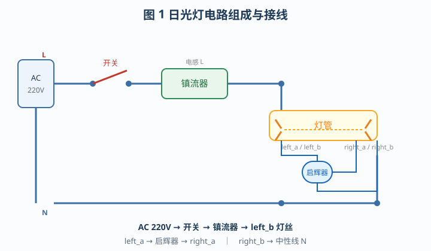
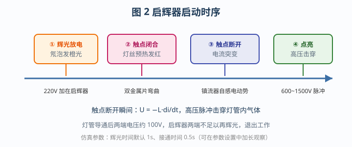
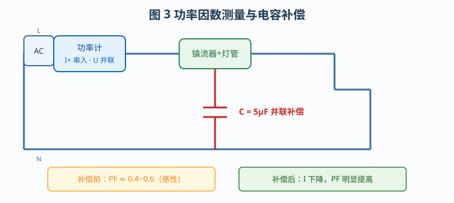
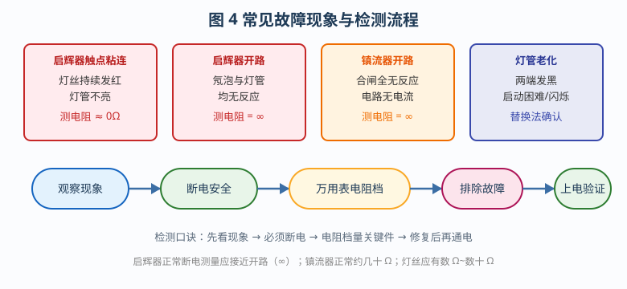

# 荧光灯接线及故障排除

## 一、实验目的

1. 认识日光灯电路组成（灯管、启辉器、镇流器、开关、AC 220V），掌握正确接线。
2. 观察启辉器辉光—预热—断开—高压点灯全过程，理解镇流器双重作用。
3. 用功率计测量并联电容前后的功率因数，理解无功补偿。
4. 掌握触点粘连、镇流器开路等故障的现象、断电电阻检测与排除方法。

## 二、电路组成与原理

主回路六根线：

`ac_p → sw_l`；`sw_r → bal_l`；`bal_r → lamp_right_b`；`lamp_left_a → st_l`；`st_r → lamp_right_a`；`lamp_left_b → ac_n`

| 部件 | 作用 |
|------|------|
| **灯管** | 两端灯丝预热发射电子；击穿电压约 420V，导通后约 220Ω |
| **启辉器** | 辉光加热双金属片→触点闭合预热→冷却断开 |
| **镇流器** | 断开瞬间产生高压脉冲击穿灯管；正常工作限流 |
| **补偿电容** | 并联补偿感性无功，提高功率因数（本工程默认水平放置） |

**启动时序**：辉光放电 → 触点闭合（灯丝发红）→ 触点断开 → 镇流器高压 → 灯管发光，启辉器随后退出。

## 三、实验步骤（对应 4 条工作流）

### 任务 1 · 接线和功能实验

1. 工具栏「自动接线」完成主回路（≤8 根为动画接线；默认无预接线）。
2. 右键启辉器「参数设置」：辉光 8.5s、接通 5.5s，便于观察完整周期。
3. 接通电源面板「电源」→ 闭合开关，观察点灯过程。
4. 断电后将参数恢复默认（1s / 0.5s），重新点亮。
5. 仪表勾选数字万用表 → 交流 200V，红黑表笔接启辉器两端读电压。
6. 完成测试题：镇流器的作用。

### 任务 2 · 启辉器作用测试

1. 接线点亮后，**拆除启辉器两端线**——灯仍亮（灯管已导通不依赖启辉器）；再断电熄灭。
2. 用开关 `sw2` 代替启辉器接入 `left_a / right_a`，闭合后灯丝预热发红。
3. 断开 `sw2`；若未亮则反复闭合约 1s 再断开，直至高压点亮。
4. 测试题：启辉器工作原理。

### 任务 3 · 功率因数测量

1. 勾选数字功率计，串入电流线圈、并联电压线圈（共 9 根，＞8 用瞬时接线）。
2. 点亮后读稳定值：I、P、PF。
3. 万用表 AC 200V 测灯管两端、再改接测镇流器两端。
4. 电容两端接 `bal_l` 与 `lamp_left_b`，观察 **I 减小、PF 提高**。
5. 测试题：并联电容的作用。

### 任务 4 · 线路故障检测

| 故障 | 现象 | 断电测量 | 处理 |
|------|------|----------|------|
| 启辉器触点粘连 | 灯丝持续发红不亮 | 两端 ≈ 0Ω | 取消故障/更换 |
| 镇流器开路 | 整灯无反应 | 两端 ≈ ∞（正常几十 Ω） | 更换镇流器 |

流程：故障设置 → 上电观察 → **断电** → 电阻档（200Ω/2kΩ）接可疑件 → 排除故障 → 通电验证。

## 四、注意事项

1. 测量电阻必须先断开开关并关闭交流电源。
2. 参数调整一律经组件「参数设置」对话框保存，勿改内部属性。
3. 通电观察时等待读数/状态稳定后再进入下一步。

## 五、思考题

1. 拆掉启辉器后灯为何仍能亮？再次合闸为何难启动？
2. 镇流器断开瞬间高压从何而来？并联电容如何提高 PF？
