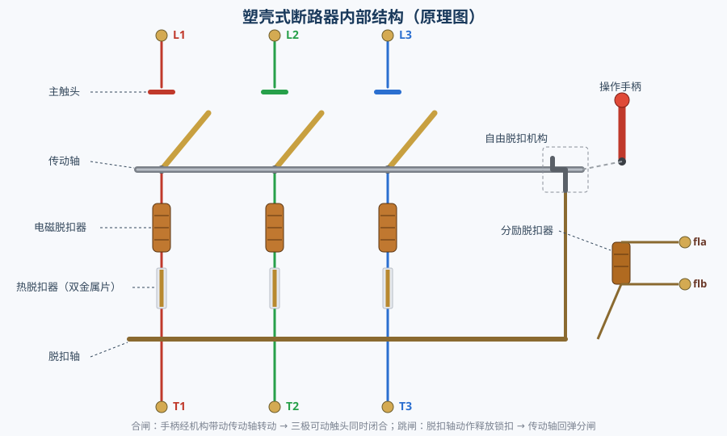
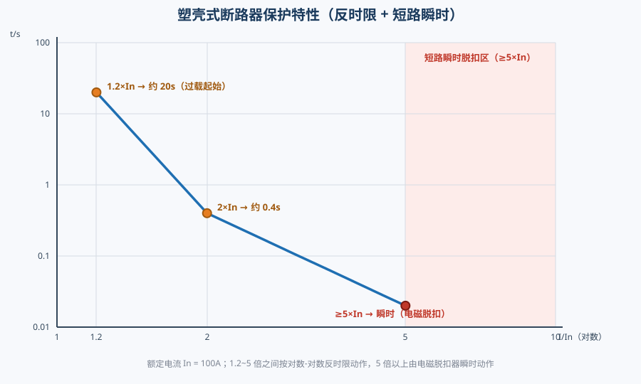
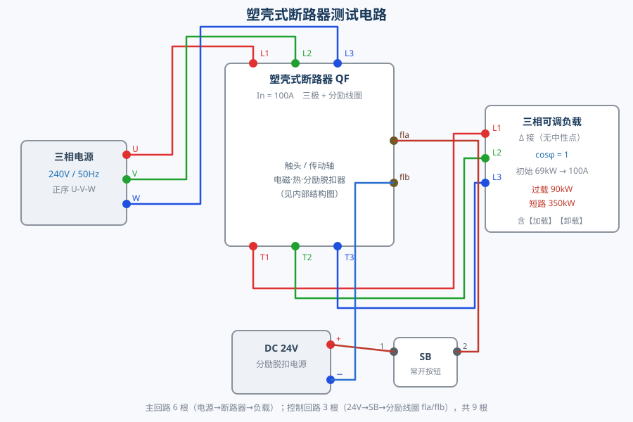

# 塑壳式断路器的结构

## 一、实验目的

1. 认识塑壳式断路器（MCCB）的外观与操作手柄，掌握合闸、分闸、跳闸后复位的操作顺序。
2. 认识内部结构：主触头、传动轴、电磁脱扣器、热脱扣器（双金属片）、分励脱扣器、脱扣轴、自由脱扣机构。
3. 理解三段保护：过载反时限热脱扣、短路瞬时电磁脱扣、分励（远控）脱扣。
4. 通过测试电路验证合闸、分闸、过载脱扣、短路脱扣与分励脱扣功能。

## 二、内部结构与动作原理

| 部件 | 作用 |
|------|------|
| **操作手柄** | 手动合闸/分闸；跳闸后停在中间 TRIP 位 |
| **传动轴** | 由手柄经机构带动旋转，使三极可动触头同步开合 |
| **主触头** | 三极可动触头 + 静触头，接通/断开三相主回路 |
| **电磁脱扣器** | 每相 1 个线圈，短路大电流时衔铁瞬时吸合，直接推动脱扣轴 |
| **热脱扣器** | 每相 1 个双金属片，过载时受热弯曲，延时推动脱扣轴 |
| **脱扣轴** | 汇集电磁/热/分励脱扣器的动作，拨动自由脱扣机构 |
| **自由脱扣机构** | 锁扣；跳闸时释放，传动轴在弹簧作用下迅速回弹分闸 |
| **分励脱扣器** | 1 个线圈（fla/flb），接 24V 电源即跳闸，用于远控/联锁 |
| **分断弹簧** | 合闸时被拉长储能，是跳闸（分断）的动力来源 |

**动作过程**

- **合闸**：手柄上推 → 机构带动传动轴转动 → 三极触头闭合，同时分断弹簧被拉长储能。
- **分闸**：手柄下扳 → 传动轴反转 → 三极触头断开。
- **跳闸**：任一脱扣器动作 → 脱扣轴拨动锁扣释放 → 传动轴在弹簧作用下瞬间分闸，手柄停在 TRIP 位。
- **复位**：跳闸后必须先把手柄**下扳到 OFF 位**（自由脱扣机构重新扣合），再上推才能合闸。

## 三、保护特性

额定电流 **In = 100A**，动作特性如下（可在组件「参数设置」中修改）：

| 工况 | 判据 | 动作时间 | 动作部件 |
|------|------|----------|----------|
| 正常 | I ≤ 1.2×In | 不动作 | — |
| 过载 | 1.2×In | 约 20s | 热脱扣器（双金属片） |
| 过载 | 2×In | 约 0.4s | 热脱扣器（双金属片） |
| 短路 | ≥5×In | 瞬时 | 电磁脱扣器 |
| 分励 | 线圈接 24V | 瞬时 | 分励脱扣器 |

1.2～5 倍之间按对数-对数反时限动作：电流越大，动作越快。

## 四、测试电路

- **主回路 6 根**：三相电源 U/V/W → 断路器 L1/L2/L3；断路器 T1/T2/T3 → 三相可调负载。
- **控制回路 3 根**：DC 24V（+）→ 常开按钮 SB → 分励线圈 fla；flb → DC 24V（−）。
- 负载为**角形（Δ）联接、无中性点**，cosφ = 1，初始 69kW，对应线电流约 100A（= In）。
- 电气接口共 8 个：上排 `l1/l2/l3`、下排 `t1/t2/t3`、右缘 `fla/flb`。

## 五、实验步骤

### 任务 1 · 塑壳式断路器结构的认识

1. 点击左侧外观面板的**操作手柄**（蓝色手柄，位于壳体中央滑槽内）。
2. 点击右侧内部结构的**电磁脱扣器**（三组线圈）。
3. 点击**热脱扣器**（双金属片）。
4. 点击**分励脱扣器**（右侧线圈，接 fla/flb）。
5. 点击**主触头**（三极可动/静触头）。
6. 完成测试题：跳闸后先往下扳的作用。

### 任务 2 · 塑壳式断路器的功能测试

1. 工具栏「自动接线」接好 9 根线，再合上三相电源开关。
2. 点击断路器手柄**合闸**。
3. 再次点击手柄**分闸**，验证合闸、分闸正常。
4. 再次合闸，点击三相可调负载的【加载】按钮接通负载（约 100A）。
5. 把负载调到 **90kW**（约 1.3×In）→ 观察双金属片受热弯曲、约十几秒后热脱扣跳闸；随后点击【卸载】。
6. 合闸后把负载调到 **350kW** 并加载 → 观察电磁脱扣器衔铁瞬时弹出、**瞬时脱扣**；随后点击【卸载】。
7. 合闸后按下**分励脱扣按钮 SB**（24V）→ 观察分励脱扣过程。

## 六、常见问题

**Q1：跳闸后为什么直接上推合不上闸？**
跳闸时自由脱扣机构已释放，手柄停在中间 TRIP 位，机构处于"脱扣"状态。必须先下扳到 OFF 位使其**重新扣合（复位/再扣）**，再上推才能合闸。

**Q2：负载面板显示的电流与实际不符？**
负载面板的电流按铭牌公式 `I = S /(√3×400V)` 估算（如 350kW 显示 505A）；而仿真中电源有内阻，带载后端电压略低，实际线电流约 434A。两者均 ≥5×In，脱扣判据与现象一致。

**Q3：为什么 350kW 是"短路"而不是"过载"？**
350kW 时电流已达 4～5 倍额定，瞬时值超过短路整定，电磁脱扣器动作（显示"短路脱扣"）；90kW 时电流约 1.3 倍额定，由热脱扣器反时限动作（显示"过载脱扣"）。
