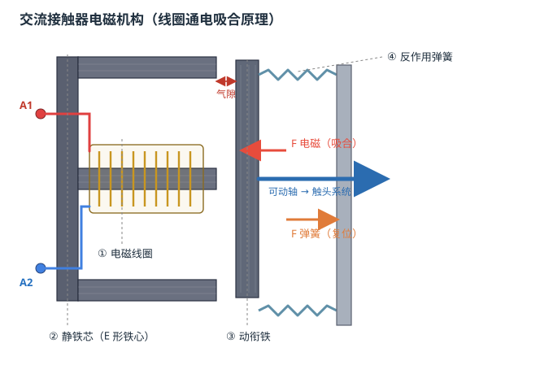
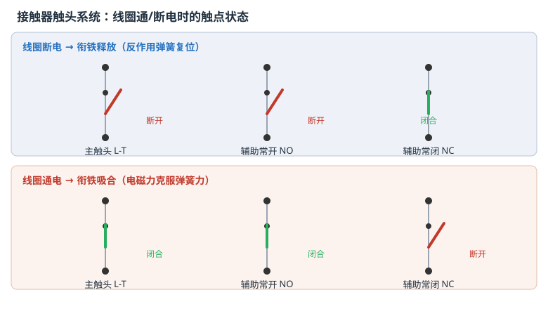
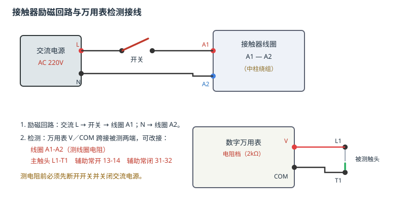

# 接触器的结构与工作原理

## 一、实验目的

1. 认识三相交流接触器的电磁机构与触头系统，掌握各组成部分的名称与作用。
2. 理解线圈通电吸合、断电释放的动作过程，掌握「线圈失电—弹簧复位」的失压保护特性。
3. 学会用数字万用表检测线圈电阻和各触点的通断状态，判断接触器好坏。
4. 掌握接触器励磁回路的正确接线与通电/断电测试方法。

## 二、组成与工作原理

三相交流接触器由**电磁机构**和**触头系统**两大部分组成。

| 部件 | 作用 |
|------|------|
| **电磁线圈** | 绕在 E 形静铁心中柱上，两端为 A1、A2；通电产生磁场与电磁吸力 |
| **静铁芯** | E 形（磁轭 + 三条铁心腿），固定不动，由硅钢片叠压，提供低磁阻磁路 |
| **动衔铁** | 可水平运动，被电磁力吸合、被弹簧复位，通过可动轴带动全部触头 |
| **反作用弹簧** | 一端接动衔铁、一端固定；断电后靠其弹性力使衔铁释放复位 |

动作过程：**线圈通电 → 电磁力克服弹簧力吸合动衔铁 → 可动轴带动触头切换；线圈断电 → 电磁力消失 → 弹簧推动衔铁释放 → 触头复位。**

接触器具有**失压（欠压）保护**特性：线圈额定电压 220V 时，吸合电压约为 **187V（0.85 倍）**、释放电压约为 **154V（0.70 倍）**，两者之间留有回差，避免电压波动时触头抖动。

| 触头 | 线圈断电（释放） | 线圈通电（吸合） |
|------|------------------|------------------|
| 主触头 L1-T1、L2-T2、L3-T3 | 断开（常开） | 闭合（接通主电路） |
| 辅助常开 NO 13-14、23-24 | 断开 | 闭合（自锁、控制） |
| 辅助常闭 NC 31-32、41-42 | 闭合 | 断开（互锁、联锁） |

## 三、实验步骤（对应 3 条工作流）

工具栏选择任务后，可用「自动演示 / 单步演示 / 演练 / 评估」四种方式运行。

### 任务 1 · 电磁铁结构的认识

自动演示依次闪烁指示并圈选 7 个部件，讲解其作用：

1. 电磁线圈 → 2. 静铁芯 → 3. 动衔铁 → 4. 反作用弹簧 → 5. 主触头 → 6. 辅助常开触头 → 7. 辅助常闭触头，最后完成结构知识测试题。

### 任务 2 · 万用表检测接触器线圈与触点（未通电）

1. 调出数字万用表，旋钮转到 **2kΩ 电阻档**。
2. V 孔（红）接线圈 **A1**、COM 孔（黑）接 **A2**，读线圈电阻（正常约 1000Ω）。
3. 改接主触头 **L1-T1**：未通电时为常开，应不导通（显示 O.L）。
4. 改接辅助常开 **13-14**：未通电应不导通。
5. 改接辅助常闭 **31-32**：未通电应导通（接近 0Ω）。
6. 完成结构知识测试题。

### 任务 3 · 通电测试接触器动作

1. 接线：交流电源 **L → 开关 → 线圈 A1**，电源 **N → 线圈 A2**。
2. 接通交流电源并合上开关，线圈得电，观察接触器**吸合**（吸合电压 ≥ 187V）。
3. 万用表接主触头 **L1-T1**，吸合后应导通。
4. 万用表接辅助常开 **13-14**，吸合后应导通。
5. 万用表接辅助常闭 **31-32**，吸合后应断开。
6. 断开开关、关闭交流电源，线圈失电，观察接触器**释放**，主触头 L1-T1 恢复断开。
7. 完成动作原理测试题。

## 四、注意事项

1. 测量电阻时必须先**断开开关并关闭交流电源**，严禁带电测电阻。
2. 主触头用于通断主电路，可承载大电流；辅助触头仅用于控制回路，不可混用。
3. 自动演示中箭头指示即为操作对象，实际演练时按提示点击对应部件/接线端即可。
4. 通电观察时，待衔铁动作完成、触点状态稳定后再进入下一步。

## 五、思考题

1. 线圈通电后，主触头、辅助常开、辅助常闭分别发生什么变化？为什么？
2. 为什么接触器既能实现「远距离控制」，又能实现「失压保护」？
3. 若万用表测得线圈 A1-A2 电阻为无穷大，可能是什么故障？应如何处理？
