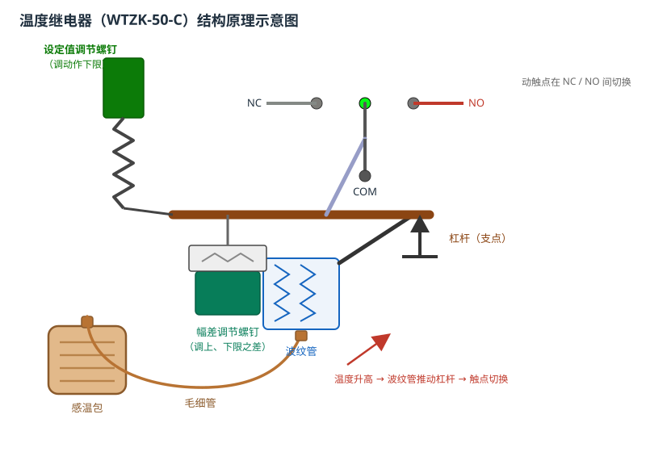
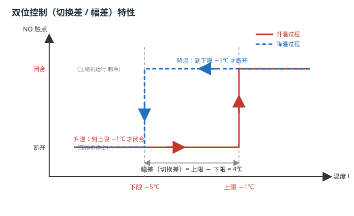
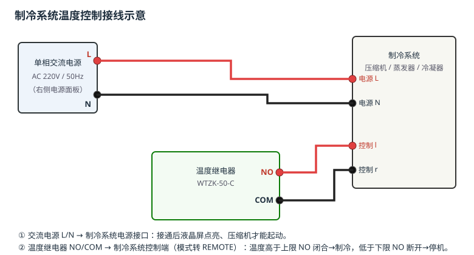

# 温度继电器的结构与工作原理

## 一、实验目的

1. 认识温度继电器（温控器）的感温包、毛细管、波纹管、杠杆与触点系统，掌握各组成部分的名称与作用。
2. 理解双位（通断）控制的动作过程，掌握动作下限、动作上限与**幅差（切换差）**之间的关系。
3. 学会通过「设定值调节」螺钉和「幅差调节」螺钉整定温控器的动作值。
4. 掌握制冷系统电源与温度开关的接线方法，理解电源接通与遥控（REMOTE）双位控制的工作过程。

## 二、组成与工作原理

温度继电器由**感温机构、传动放大机构、给定机构、幅差机构和触点系统**组成，型号 WTZK-50-C，温度量程 **−20 ~ 20 ℃**。

| 部件 | 作用 |
|------|------|
| **感温包** | 感受被测温度，内部工质随温度升高而膨胀，产生压力信号 |
| **毛细管** | 把感温包的压力传送到波纹管，长细管可远距离传递 |
| **波纹管** | 把压力转换为位移，推动传动杆与杠杆动作 |
| **杠杆（支点）** | 比较测温力矩与给定弹簧力矩，决定触点状态 |
| **设定值调节螺钉** | 改变给定弹簧预紧力，整定**动作下限**（本机每点一次变化 1℃） |
| **幅差调节螺钉** | 改变幅差弹簧，整定**动作上、下限之差**（幅差） |
| **触点系统 NO/NC/COM** | NO 为常开触点：温度高于上限闭合、低于下限断开，用于控制压缩机 |

**双位控制原理**：温度升高 → 感温包压力增大 → 波纹管顶推杠杆 → 温度高于**动作上限**时 NO 触点闭合，压缩机起动制冷；温度下降 → 压力减小 → 温度低于**动作下限**时 NO 触点断开，压缩机停止。上、下限之间留有一差值（幅差），使继电器在设定点附近不会频繁通断。

出厂默认：动作下限 **0 ℃**、动作上限 **3.5 ℃**（幅差 3.5 ℃）。当幅差调为 4 ℃、下限调为 −5 ℃ 时，上限即为 **−1 ℃**。

## 三、实验步骤（对应工作流「1. 温度继电器的调整和应用」）

1. **接线并接通电源**：交流电源 L/N 接制冷系统**右侧电源接口**；温度继电器 NO/COM 接制冷系统**左侧控制端**。接通电源后液晶屏点亮（环境温度约 10 ℃），温度高于上限，确认 **NO 触点闭合**。
2. **查看参数**：打开温度继电器的参数配置界面，查看动作下限 **0 ℃**、动作上限 **3.5 ℃**。
3. **手动起动压缩机**：温度开始下降，当降到**低于下限 0 ℃**时，NO 触点断开。
4. **手动停止压缩机**：温度开始回升，当**高于上限 3.5 ℃**时，NO 触点恢复闭合。
5. **整定下限**：点击「设定值调节」螺钉下半部，每点击一次下限降低 1 ℃，把下限调到 **−5 ℃**。
6. **整定幅差**：点击「幅差调节」螺钉右半部，把幅差调到 **4 ℃**，则上限变为 **−1 ℃**。
7. **转遥控观察双位控制**：把制冷系统模式旋钮由 LOCAL 转到 **REMOTE**，温度高于上限 −1 ℃ 时压缩机自动起动降温，低于下限 −5 ℃ 时自动停止，温度保持在 **−5 ~ −1 ℃** 之间，即进入双位控制。

## 四、注意事项

1. 必须先接通右侧单相交流电源，液晶屏才有显示、压缩机才能起动。
2. 只有把制冷系统模式转到 **REMOTE**，温度继电器的 NO 触点才真正控制压缩机，LOCAL 为手动起停。
3. 温度下降到下限后如继续制冷会过冷，演示时应及时停止压缩机，观察回温过程。
4. 自动演示中箭头所指即为操作对象；演练时按提示点击对应旋钮、按钮或接线端即可。

## 五、思考题

1. 幅差（切换差）过大或过小分别对制冷系统有什么影响？
2. 把动作下限调到 −5 ℃、幅差调到 4 ℃ 后，动作上限是多少？为什么？
3. 温度继电器 NO 触点在温度升高、降低时各处于什么状态？由此说明它为什么能实现双位控制。
