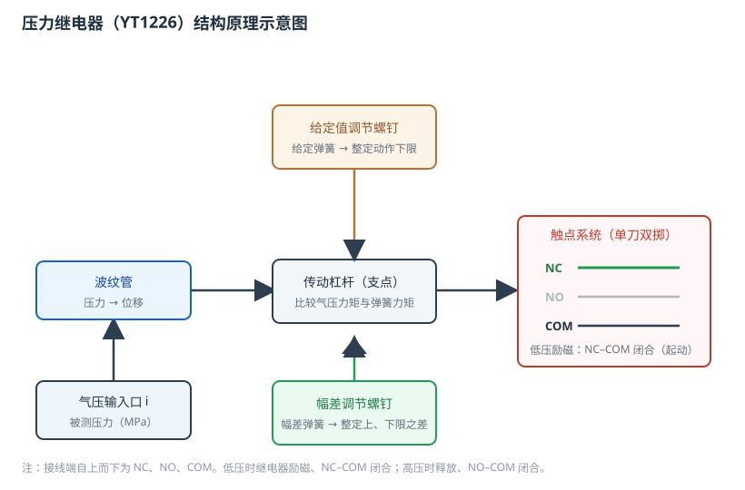
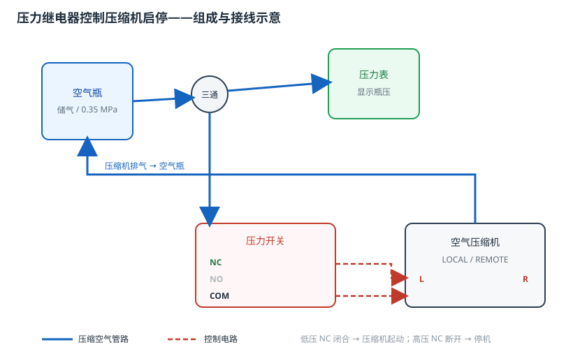

# 压力继电器的结构与工作原理

## 一、实验目的

1. 认识压力继电器（压力开关）的波纹管、传动杠杆、给定弹簧、幅差弹簧与触点系统，掌握各组成部分的名称与作用。
2. 理解压力双位（通断）控制，掌握动作下限、动作上限与**幅差（切换差）**之间的关系。
3. 学会用「给定值调节」和「幅差调节」螺钉整定压力开关的动作值。
4. 掌握「压缩机—空气瓶—三通—压力表/压力开关」的接线，以及由压力开关控制压缩机起停的应用方法。

## 二、组成与工作原理

压力继电器（型号 **YT1226**）由**压力检测、传动放大、给定机构、幅差机构和触点系统**组成，压力量程 **0 ~ 0.2 MPa**，幅差范围 **0.07 ~ 0.25 MPa**。

| 部件 | 作用 |
|------|------|
| **气压输入口 i** | 接入被测压力（本实验接空气瓶压力） |
| **波纹管** | 把压力转换为位移，推动传动杆与杠杆 |
| **传动杠杆（支点）** | 比较气压力矩与给定弹簧力矩，决定触点状态 |
| **给定值调节螺钉** | 改变给定弹簧预紧力，整定**动作下限** |
| **幅差调节螺钉** | 改变幅差弹簧，整定**动作上、下限之差**（幅差） |
| **触点系统 NC/NO/COM** | 低压时 NC–COM 闭合（起动压缩机），高压时 NO–COM 闭合 |

**双位控制原理**：瓶压低于**动作下限**时，继电器励磁、**NC 触点闭合**，压缩机起动充气；瓶压高于**动作上限**时，继电器释放、**NC 断开**，压缩机停机。上、下限之间留有幅差，使继电器在设定点附近不会频繁通断。

默认给定值 50%、幅差 50%，对应动作下限 **0.10 MPa**、动作上限 **0.26 MPa**。若把给定值调到 60%、幅差调到 30%，则下限为 **0.12 MPa**、上限约为 **0.24 MPa**。

## 三、实验步骤（对应工作流「1. 压力继电器的调整和应用测试」）

1. **按组成接线**：压缩机排气口→空气瓶；空气瓶出气口→三通接头；三通一路接压力表（显示瓶压）、一路接压力开关（检测瓶压）；压力开关 **NC/COM** 串入压缩机控制端 **L/R**。
2. **查看参数**：打开压力开关参数配置界面，查看量程 0 ~ 0.2 MPa、幅差 0.07 ~ 0.25 MPa 及当前动作上、下限。
3. **整定给定值**：连续点击「给定值」螺钉上半部，给定值 50%→60%，动作下限升到 0.12 MPa。
4. **整定幅差**：点击「幅差」螺钉右半部，幅差 50%→30%，切换差减小，动作上限降到约 0.24 MPa。
5. **转遥控并开启耗气**：把压缩机模式由 LOCAL 旋到 **REMOTE**，空气瓶开始模拟耗气，瓶压由 0.35 MPa 缓慢下降。
6. **低压起动**：瓶压降到动作下限以下，压力开关励磁、NC 闭合，压缩机**自动起动**向空气瓶充气。
7. **高压停止**：瓶压升到动作上限，压力开关释放、NC 断开，压缩机**自动停机**。
8. **双位循环**：耗气使瓶压再次下降，到下限时压缩机重新起动，形成「充气—停机—泄压—再启动」的双位控制循环。

## 四、注意事项

1. LOCAL 为手动起停；只有把模式转到 **REMOTE**，压力开关触点才真正控制压缩机。
2. 压力开关接线端自上而下为 **NC、NO、COM**；控制压缩机起动使用 **NC** 触点（低压闭合）。
3. 空气瓶耗气速率与压缩机充气速率共同决定循环周期；本实验耗气约 0.006 MPa/s、充气约 0.02 MPa/s。
4. 自动演示中闪烁箭头所指即为操作对象；演练时按提示点击对应螺钉、旋钮与接线端即可。

## 五、思考题

1. 幅差过大或过小，对压缩机起停次数和瓶压波动各有什么影响？
2. 压力开关为什么用 NC 触点控制压缩机起动、而以 NO 触点表示高压状态？
3. 若给定值由 50% 调到 80%、幅差保持 50%，动作下限和动作上限各为多少？
