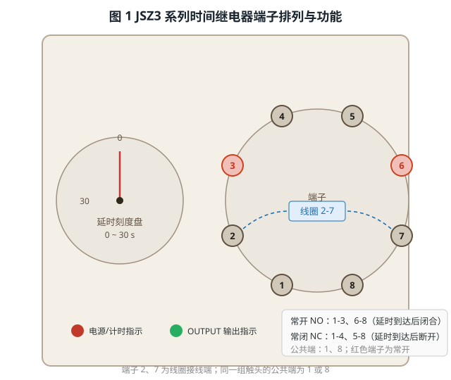
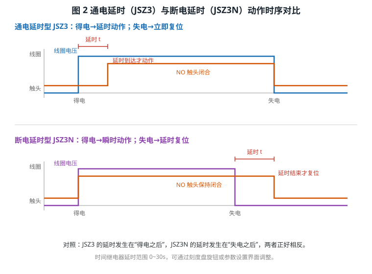
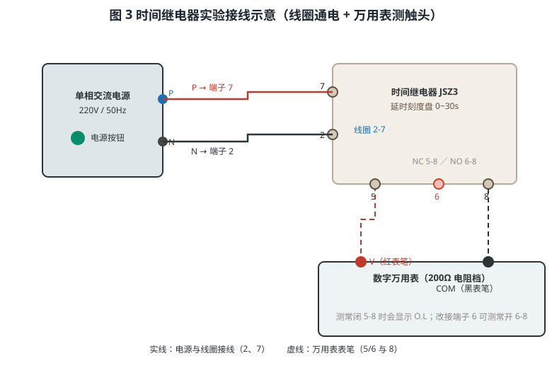

# 时间继电器的结构与工作原理

> 适用对象：**JSZ3 通电延时型**与 **JSZ3N 断电延时型**时间继电器（0~30 s 可调）
> 配套本工程仿真平台，含三个自动演示流程，本文操作均可在软件中逐一演示：
> ① 通电延时继电器电流延时操作　② 用万用表检测时间继电器触头　③ 断电延时继电器功能测试

---

## 一、概述

时间继电器是一种**在接收到输入信号（线圈得电或失电）后，经过预设延时时间才使触头动作**的自动控制电器。它本身不直接通断主电路，而是通过延时的触头去控制接触器、电磁阀等，从而实现**按时间顺序**的自动控制，广泛应用于电动机星三角（Y-△）启动、多台设备的顺序启停、风机延时停机等场合。

按其延时的“时机”不同，常见两类（见图 2）：

- **通电延时型（JSZ3）**：线圈**得电后延时**触头动作，线圈**失电立即复位**；
- **断电延时型（JSZ3N）**：线圈**得电瞬时动作**，线圈**失电后延时**复位。

---

## 二、结构与端子

JSZ3 / JSZ3N 面板左侧为**延时刻度盘**（0~30 s 可调），右侧为一圈**8 个接线端子**，另有电源/计时指示与 OUTPUT 输出指示灯，见图 1。

| 端子 | 用途 | 端子 | 用途 |
|------|------|------|------|
| **2、7** | 线圈（接控制电源） | **1、8** | 两组触头的公共端 |
| **1-3、6-8** | 常开触头 NO | **1-4、5-8** | 常闭触头 NC |

> 要点：**2、7 是线圈**，接上电源后继电器才工作；触头成对使用，**公共端 1 或 8** 分别是两组触头的公共端。JSZ3N 端子定义与 JSZ3 完全相同，区别只在动作时序。

---

## 三、工作原理

时间继电器内部由**线圈、延时机构（电子或机械）、触头系统**组成。线圈通电产生电磁吸力，延时机构按设定时间延迟后推动触头动作，如图 2 所示。

- **JSZ3（通电延时）**：线圈得电瞬间开始计时（面板指示灯闪烁），**延时 t 到达**后常开触头闭合、常闭触头断开（OUTPUT 灯转为常亮）；线圈失电时触头**立即复位**，NC 闭合、NO 断开。
- **JSZ3N（断电延时）**：线圈得电时触头**立即切换**至 NO（不延时）；线圈失电后进入**断电延时**状态（面板显示“断电延时中”，输出灯闪烁），触点**保持**在 NO 位置，**延时 t 结束**后才回到 NC，状态恢复“待机”。

**结论**：JSZ3 的延时发生在“得电之后”，JSZ3N 的延时发生在“失电之后”，二者正好相反。选用时依据工艺要求确定：需要“通电后延时动作”选 JSZ3，需要“断电后延时复位”选 JSZ3N。

---

## 四、实验接线与操作流程

### 4.1 接线原则

以 JSZ3 为例（JSZ3N 相同），见图 3：

| 序号 | 接线内容 | 线数 |
|------|---------|------|
| 1 | 交流电源 **正端 P → 端子 7**、**负端 N → 端子 2**（线圈） | 2 |
| 2 | 万用表 **红表笔 V → 端子 5（NC）**、**黑表笔 COM → 端子 8** | 2 |

接线前应确保电源处于断开状态；测量电阻时必须**断电**，或按流程在通电前先测冷态触头。

> 自动演示中，接线采用**逐根动画**（约 3 s/根）：先用闪烁箭头圈出目标端子，再逐根接好并停留，便于观察。

### 4.2 三个自动演示流程

| 流程 | 内容 | 关键步骤 |
|------|------|---------|
| **① 通电延时（JSZ3）** | 线圈接线、通电计时、延时到达、断电复位 | 接 2/7 → 按电源键 → 观察计时 → 延时到达 OUTPUT 常亮 → 断电复位 → 参数改为 5 s 重演 |
| **② 万用表检测触头** | 用电阻档验证触头通断 | 调出万用表 → 拨 200Ω 档 → 接 5-8 测 NC（≈0Ω）→ 通电延时 → NC 断开显示 O.L、改接 6-8 测 NO（≈0Ω） |
| **③ 断电延时（JSZ3N）** | 勾选“断电延时”切换到 JSZ3N | 勾选工具栏复选框 → 接 2/7 → 通电瞬时动作 → 断电延时保持 → 延时结束复位 → 参数改为 8 s 重演 |

> 切换说明：勾选工具栏**「断电延时」**复选框后，画面显示 JSZ3N 并自动隐藏 JSZ3（被隐藏元件的连线一并移除、重新显示时再恢复），避免出现悬空连线。

---

## 五、延时时间的设置

延时时间有两种调整方式：

1. **面板刻度盘旋钮**：旋转刻度盘粗调，面板刻度 0~30 s；
2. **参数设置界面**：右键继电器 →「参数设置」，在“延时时间 (s)”输入框中精确设定，可设 0~30 s（步进 0.5 s）。

> 自动演示中，凡涉及参数修改（如由 15 s 改为 5 s），都会**调出参数设置界面**，用箭头指向输入框、填入新值，再指向并点击「保存」，完整展示参数调整过程。

---

## 六、常见问题与处理

| 现象 | 可能原因 | 处理方法 |
|------|----------|----------|
| 线圈通电后不计时 | 线圈未接在 2、7 端；电源未接通 | 检查 2/7 接线与电源按钮状态 |
| 延时到达触头不动作 | 延时时间设置过长；触头未接公共端 | 缩短延时；确认公共端 1 或 8 |
| 万用表测电阻始终为 O.L | 触头处于断开状态；表笔接错端子 | 断电确认 NC/NO 状态；接对 5/6 与 8 |
| 断电后触头立即复位 | 使用的是通电延时型 JSZ3 | 需断电延时请切换为 JSZ3N |
| 读数不稳定 | 通电状态下测电阻受到回路影响 | 断开电源后再测量电阻 |

---

## 七、思考与练习

1. 为什么线圈必须接在 **2、7** 端？若误接到触头端会出现什么现象？
2. 通电延时型与断电延时型的触头动作时刻分别发生在何时？画图说明。
3. JSZ3 延时设为 5 s，线圈得电 3 s 后即断电，OUTPUT 灯会亮吗？为什么？
4. 用万用表分别测量延时前后 NC（5-8）与 NO（6-8）的电阻，记录数据并说明变化规律。
5. 在电动机 Y-△ 启动中，时间继电器应选通电延时型还是断电延时型？简述其控制过程。

---

*本文档依据本工程仿真平台的三个操作流程编写，与自动演示一一对应，可作为时间继电器结构认知、接线与检测的实训参考资料。*
