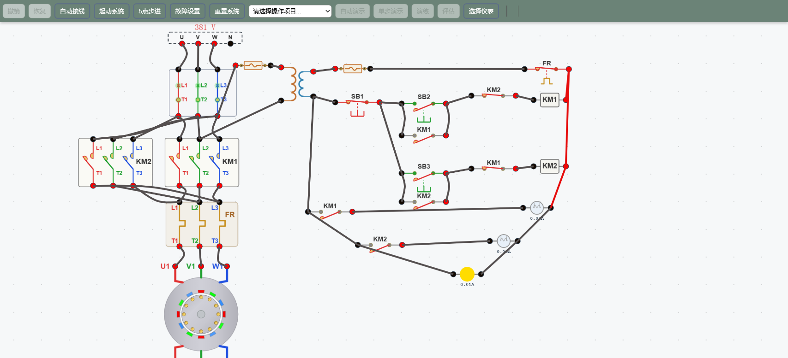

# 电机正反转控制电路的故障查找

## 一、实验目的

1. 掌握三相异步电动机**正反转控制电路**的组成与工作原理；
2. 理解**自锁**与**互锁（电气联锁）**的作用；
3. 掌握短路、缺相、断路三类典型故障的**查找方法**（带电测压法、断电测阻法）；
4. 熟悉数字万用表电压档、电阻档的使用与读数判读。

## 二、电路组成

**主回路**（左）：三相电源 U/V/W → 空气开关 QF → 并联的 KM1（正转）、KM2（反转）主触头 → 热继电器 FR 发热元件 → 电动机（U1/V1/W1、U2/V2/W2）。KM2 将 U、W 两相调换，实现反转。

**控制回路**（右）：控制变压器 TC（380V/220V）副边 → 熔断器 FU4/FU5 → 停止按钮 SB1 → 正转支路（SB2 ∥ KM1 常开自锁 → KM2 常闭互锁 → KM1 线圈）/ 反转支路（SB3 ∥ KM2 常开自锁 → KM1 常闭互锁 → KM2 线圈）→ 热继电器常闭 FR → 回到变压器。

**指示支路**：KM1 常开触头 + 正转绿灯、KM2 常开触头 + 反转红灯、电源黄灯（白灯芯，点亮呈亮黄），并联于 KM2 线圈下方。

## 三、工作原理

- **正转**：按 SB2 → KM1 线圈得电 → KM1 主触头闭合、常开辅助触头自锁 → 电机正转；
- **停止**：按 SB1 → KM1 线圈失电 → 自锁解除 → 电机停止；
- **反转**：按 SB3 → KM2 线圈得电并自锁 → 主触头交换两相 → 电机反转；
- **互锁**：正转时 KM1 常闭触头断开反转支路，即使按住 SB3，KM2 也不吸合，避免两接触器同时吸合造成**电源相间短路**。

## 四、故障查找

本实验提供四类故障及对应操作流程，均可在工具栏中选择项目后以「自动演示 / 单步演示 / 演练 / 评估」四种模式教学。

| 故障 | 现象 | 查找方法 |
|------|------|----------|
| 主回路短路（U1、V1 相间短路） | 起动时空气开关 QF 立即脱扣 | 断电后万用表 **R×200** 档测各相间电阻，接近 0Ω 即该两相短路 |
| 主回路缺相（KM1 一极接触不良） | 电机**有声音但不起动** | 带电 **AC 500V** 测主触头入口相间电压判断电源；断电 **R×200** 测各相触头入口—出口电阻，读数为 **O.L** 即该相接触不良 |
| 控制回路开路（3 号开路点，FU5 熔断） | 电源指示灯不亮；按 SB2 无反应 | 带电 **AC 500V** 测变压器出口电压确认电源正常；断电 **R×200** 测熔断器、FR 触点电阻，**O.L** 即为断点 |
| 控制回路短路（KM1 线圈短路） | 起动时控制回路熔断器 FU5 熔断 | 测线圈电阻，接近 0Ω 即短路 |

### 查找要点

1. **带电测压法**：电路通电，万用表置于交流电压档，沿回路测各元件两端电压——正常导通处电压≈0，**断点两端电压≈电源电压**，可快速定位。
2. **断电测阻法**：断开电源并确认放电后，万用表置于电阻档（R×200），测元件通断——正常应导通（≈0Ω），**显示 O.L（超量程）即断路/接触不良**。
3. **二分法**：在通路中点测量，快速缩小故障范围。

## 五、操作流程（示例）

**流程 3：主回路缺相故障排除**

1. 自动接线，合上电源开关 QF；
2. 触发主回路缺相故障；
3. 按 SB2 起动电机——现象：电机有声音但不起动，判定为缺相；
4. 调出数字万用表，AC 500V 档测 KM1 主触头 3 个入口相间电压，判断电源是否缺相；测完撤销接线；
5. 断开电源开关，KM1 模拟闭合；
6. 万用表转 R×200 档，测每相触头入口—出口电阻，读数为 O.L 表示该相接触不良；测完撤销接线、收起万用表；
7. KM1 模拟闭合复位，修复缺相故障；
8. 合上电源开关，起动电机应正常运行。

**流程 4：控制回路断路故障排除**

1. 自动接线，合上电源开关；
2. 触发控制回路 3 号开路故障（FU5 开路）；
3. 观察现象：电源指示灯不亮，按 SB2 无任何反应；
4. AC 500V 档测控制变压器出口电源，确认电源正常；撤销接线；
5. 断开电源开关，R×200 档测熔断器、FR 辅助触点电阻，O.L 即为断点；撤销接线、收起万用表；
6. 修复控制回路开路故障；
7. 合上电源开关，起动电机。

## 六、注意事项

1. 查找带电回路时务必注意**安全用电**，测压法应在教师指导下进行；
2. 断电测阻前必须**断开电源并放电**，防止带电测量损坏仪表；
3. 万用表档位选择要合适：测 380V/220V 交流用 AC 500V 档，测小电阻用 R×200 档；
4. 读数判读：电阻档显示 **O.L** 表示超出量程（开路）；交流电压档读数应接近额定值（相间约 380V，控制回路约 220V）。
