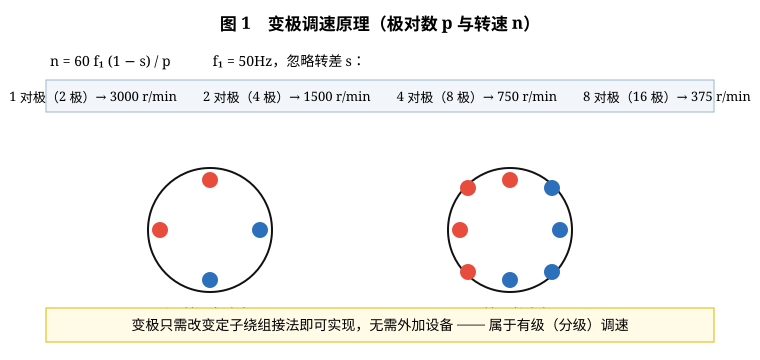
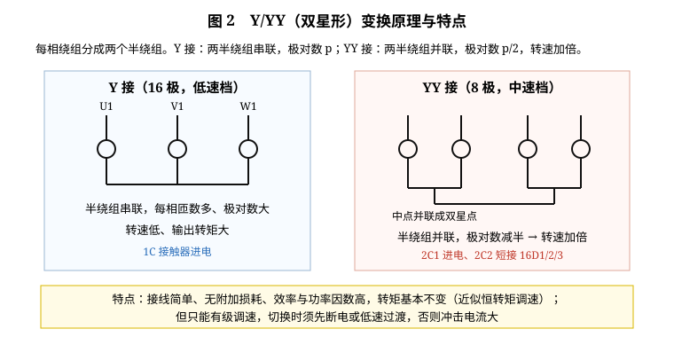
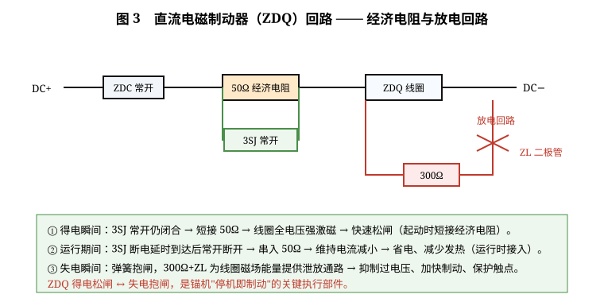
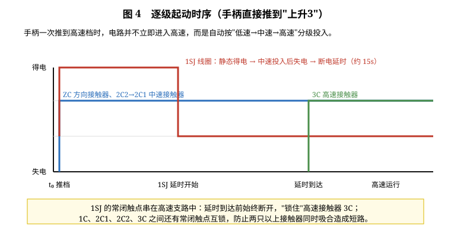
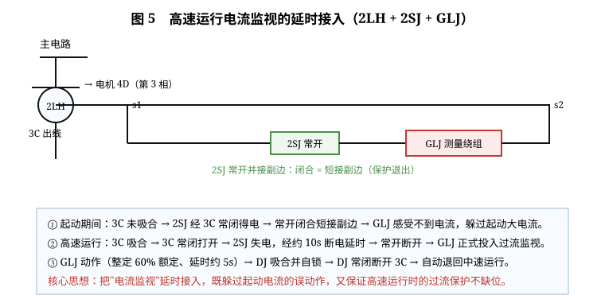

# 电动三速锚机仿真系统

> 本文围绕本仿真系统的电气主电路与控制电路，重点讲解**变极调速原理**、**Y/YY 变换的原理与特点**、**直流电磁制动器的工作过程（重点：经济电阻）**、**逐级起动工作原理**以及**高速运行电流监视的延时接入**五个核心问题。

---

## 一、三速锚机的电气组成与调速思路

船用锚机要完成"抛锚—起锚"作业，负载特性是典型的恒转矩负载：起锚时负载重、需要低速大转矩；收缆与航行中需要中速；空载或快速收放时用高速提高效率。若只用一台普通异步电动机，只能靠机械变速箱换挡，结构复杂、冲击大；因此船用锚机普遍采用**变极调速三相异步电动机**，用电气方法直接获得 2～3 种转速。

本系统的主电路由三相电源 Q（空气开关）→ 正转接触器 ZC / 反转接触器 FC → 三条并联的速度支路组成：

| 档位 | 接触器组合 | 电机绕组 | 同步转速 |
|---|---|---|---|
| 上升1 / 下降1 | ZC（或 FC）+ 1C | 16 极（16D1/2/3） | 375 r/min |
| 上升2 / 下降2 | ZC（或 FC）+ 2C2 + 2C1 | 8 极（8D1/2/3） | 750 r/min |
| 上升3 / 下降3 | ZC（或 FC）+ 2C2 + 3C | 4 极（4D1/2/3） | 1500 r/min |

控制电路则由**主令控制器**（7 档直推手柄，带 LK1～LK7 辅助触点）、**零压继电器 LYJ**、**方向接触器 ZC/FC**、**速度接触器 1C/2C1/2C2/3C**、**时间继电器 1SJ/2SJ/3SJ**、**过流继电器 GLJ**、**中间继电器 DJ**、**制动接触器 ZDC** 与**电磁制动器 ZDQ** 组成。三条速度支路之所以要用 5 只接触器，正是变极调速与逐级起动的必然结果，下文逐一说明。



---

## 二、变极调速原理

三相异步电动机的转速由下式决定：

$$n = \frac{60 f_1}{p}(1-s)$$

式中 $f_1$ 为电源频率（50Hz），$p$ 为定子旋转磁场的**极对数**，$s$ 为转差率。在频率不变的前提下，改变极对数 $p$ 即可改变同步转速：$p=1$ 时 3000 r/min，$p=2$ 时 1500 r/min，$p=4$ 时 750 r/min，$p=8$ 时 375 r/min。这就是**变极调速**。

极对数由定子绕组的连接方式决定。把定子绕组按一定规律分成若干段，改变各段的电流方向与串并联关系，就能在同一套绕组上得到不同的磁极分布：

- **改变半绕组电流方向**：例如将 U 相绕组一半反接，使原本形成的 2 对极变成 4 对极；
- **改变半绕组串并联关系**：串联时极对数多、并联时极对数少，这是本机采用的方式（Y ↔ YY 变换）；
- **双绕组/三绕组方案**：在同一个定子铁芯内嵌装两套或三套相互独立的绕组，各套绕组各自的极对数不同，用接触器分别投入。本机 16D、8D、4D 三组出线端就是三个极数对应的引出端。

由于极对数只能按整数跳变，变极调速属于**有级调速**，转速不能连续调节。它的优点是：不需要附加的变频装置，控制简单可靠、效率高、功率因数高、初期成本低，且变极时机械特性硬度基本不变，适合船舶锚机、镗床、起重机械等"只需几个固定速度等级、要求大起动转矩"的场合。它的缺点是：调速级数少、切换时电流与转矩有冲击、且不能在运行中任意平滑调节。

---

## 三、Y/YY 变换的原理与特点

Y/YY（双星形）变换是变极调速中最常用的一种，也是本机中速档的实现方式。

### 3.1 接线原理

把每相绕组分成两个相同的半绕组。以 U 相为例，两个半绕组分别记作 a、b。

**Y 接（串联）**：两半绕组 a、b 依次串联后接入三相电源（U1、V1、W1 进电，尾端接成星点）。此时每相的有效匝数多，电流在串联的两半绕组中同向流动，形成 **2p 个磁极**（本机对应 16 极）。

**YY 接（并联）**：将两半绕组的中点也接成星点，使 a、b **并联**接到电源上。并联后每相的有效匝数减为一半、等效电流方向改变，极对数便减少一半，变成 **p 个磁极**（本机对应 8 极），同步转速加倍。

本机中速档的具体接线是：

- **2C1 主触头**：把三相电源送到电机 8D1/8D2/8D3（8 极绕组进电）；
- **2C2 主触头**：把 16D1、16D2、16D3 三个端子**短接**在一起。

短接 16D 的三个端子，实质上就是把原 16 极绕组的三个尾端连接成星点，从而配合 2C1 的进电构成 YY 双星形接法，使电机以 8 极运行。可见中速档的"两台接触器"不是冗余，而是分别承担**送电**与**短接**两种功能，缺一不可。

### 3.2 为什么要保证 2C2 先于 2C1

观察控制电路可知，2C2 的线圈由 1C 常闭触点直接供电，而 **2C1 的线圈串在 2C2 的常开触点之后**：

```
LK5 → 1C 常闭 → 2C2 常开 → 2C1 线圈 → 公共返回节点
LK5 → 1C 常闭 → 2C2 线圈 → 2C1 线圈右端
```

因此中速档的合闸顺序被电路"锁死"为：**先 2C2 短接 16D1/2/3，再 2C1 向 8D 送电**。若顺序颠倒——即尚未短接就把电源送入 8D——绕组极数配置不完整，气隙磁场畸变，可能出现无旋转磁场（电机不转）、起动电流过大甚至绕组过热。次序本身就是一种**保护性联锁**。

### 3.3 特点小结

| 项目 | 说明 |
|---|---|
| 转速 | 变换后转速约加倍（16 极 ↔ 8 极） |
| 转矩 | 输出转矩基本不变（近似**恒转矩调速**），适合锚机这类恒转矩负载 |
| 功率 | 转速上升、转矩不变，故功率近似随转速成比例增大 |
| 优点 | 接线简单、附加损耗小、效率高；只用接触器即可切换，无附加设备 |
| 缺点 | 有级调速，级差大；切换瞬间有冲击，须断电或经低一级速度过渡；接触器数量多，控制电路较复杂 |



---

## 四、直流电磁制动器的工作过程（重点：经济电阻）

锚机停机后必须立即抱闸，否则吊起的锚与锚链会在重力作用下溜车。本机采用**失电制动**（弹簧抱闸、电磁松闸）的直流电磁制动器 ZDQ：线圈得电时电磁力克服弹簧力使闸瓦松开，电机才能转动；一旦失电，弹簧立即把闸瓦压紧制动。ZDQ 是直流线圈，直流电源由控制变压器 TM 降压、经桥式整流器 KZ 整流、电容 Cz 滤波后提供。

### 4.1 主回路

```
DC+ → ZDC 常开触点 → 50Ω 经济电阻 Rdc → ZDQ 线圈 → 直流回线
```

其中 ZDC 是**制动接触器**，它的线圈回路由 `LK7 → (ZC 常开 ∥ FC 常开) → ZDC 线圈` 构成。也就是说：只有当主令手柄离开零位、方向接触器 ZC 或 FC 吸合之后，ZDC 才得电，其常开触点才接通 ZDQ 回路。这样保证"电机确实获得方向电源"之后才松闸，避免误松闸溜车。

### 4.2 经济电阻的作用（本部分重点）

50Ω 电阻 Rdc 与 **3SJ 的常开触点并联**。3SJ 是一台**断电延时**时间继电器，其线圈由 `ZDC 常开触点左侧 → ZDC 常闭 → 3SJ 线圈` 供电，因此它在 ZDC 失电（即停车、抱闸）时得电，在 ZDC 得电（松闸运行）时失电。整个制动器的工作过程分三个阶段：

**① 得电瞬间——强激磁快速松闸（起动时短接经济电阻）**

主令手柄一离开零位，ZDC 得电、ZDC 常开闭合，这时 3SJ 的线圈因 ZDC 常闭刚刚打开而失电，**但断电延时尚未结束，其常开触点仍保持闭合**，于是 50Ω 电阻被短接，ZDQ 线圈承受全电压。直流电磁铁的吸力与线圈电流成正比，全电压使电流与吸力最大，闸瓦被迅速吸开，制动器"快速松闸"，缩短起动时间、减少闸瓦磨损。

**② 运行期间——串入经济电阻（运行时接入经济电阻）**

约 5s 后，3SJ 断电延时到达，其常开触点断开，50Ω 电阻串入 ZDQ 回路。线圈电压下降、电流减小到只足以维持电磁吸合力的数值。此时电磁铁无需再做"克服弹簧力吸合"的功，只需维持吸合，因此**维持电流远小于吸合电流**，线圈铜损和发热大幅下降，直流电源的容量也可取得较小——这就是"**经济电阻**"名称的由来：用一只电阻换来运行期间长期的节能与降温。

**③ 失电瞬间——弹簧抱闸与放电回路**

手柄回零位或保护动作时 ZDC 失电，其常开触点断开，ZDQ 线圈断电，电磁吸力消失，弹簧立即把闸瓦压紧制动。此时线圈电感中的磁场能量必须有释放通路，否则会在线圈两端产生很高的反向电压，击穿绝缘或烧蚀触点。电路中特意设置了**放电回路**：300Ω 电阻 R₃ 与二极管 ZL 串联后**并接在线圈两端**。断电瞬间感应电动势使二极管导通，能量经 300Ω 电阻以热的形式耗散，既抑制过电压、保护线圈与触点，又使电流较快衰减、制动响应更快、减少拖滞。

综合起来：

| 阶段 | 3SJ 状态 | 3SJ 常开触点 | ZDQ 线圈回路 | 效果 |
|---|---|---|---|---|
| 得电瞬间 | 刚从得电转失电，延时中 | 闭合 | 全电压（电阻被短接） | 强激磁、快速松闸 |
| 运行期间 | 失电，延时到达 | 断开 | 串入 50Ω | 维持吸合、省电降温 |
| 失电瞬间 | 状态无关 | — | 经 300Ω+ZL 放电 | 弹簧抱闸、抑制过电压 |



---

## 五、逐级起动工作原理

### 5.1 为什么必须逐级起动

变极电机的三套绕组对应三种极数，若手柄从零位直接推到高速档就把 4 极绕组投入电网，电机将以接近 1500 r/min 的高同步转速起动。此时转子接近堵转，转差率 s ≈ 1，转子回路阻抗很小，起动电流可达额定电流的 5～7 倍，不仅对船舶电网造成很大冲击（电压跌落），也会对锚机机械传动造成扭矩冲击。逐级起动的思路是：**无论手柄一次推到哪一档，都强制先经低速、中速，延时后再进入高速**，让电机在较低的转速下逐步加速。

### 5.2 电路上的实现——1SJ 时间继电器

关键在于 1SJ（时间继电器）的线圈供电回路：

```
DC+ → 3C 常闭触点 → 2C1 常闭触点 → 1SJ 线圈 → Cz 右端(DC−)
```

- 静态（手柄在零位或低速档）时，3C 常闭、2C1 常闭都闭合，**1SJ 线圈一直得电**；
- 进入中速档时，2C1 吸合，其常闭触点打开，**1SJ 线圈失电**，开始断电延时（约 15s）；
- 1SJ 的**常闭触点串在高速支路**中（`LK6 → DJ 常闭 → 1SJ 常闭 → 3C 线圈`）。延时到达前它始终断开，把高速接触器 3C"锁住"；延时到达后才闭合，允许 3C 吸合。

可见"逐级起动"的时序是由 1SJ 的**断电延时**实现的一次"时间保险"：中速投入后必须等待一段时间，才允许升入高速。低速→中速之间则由 1C、2C1、2C2 的常闭触点互锁，保证不出现两只以上速度接触器同时吸合造成的绕组短路。

### 5.3 时序过程（手柄直接推到上升3）

1. 手柄推出零位，LK1 打开、LK2 闭合，ZC 吸合；ZDC 得电、ZDQ 强激磁松闸；
2. LK5 闭合，1C 常闭 → 2C2 吸合（短接 16D1/2/3）→ 2C2 常开闭合 → 2C1 吸合（8D 送电），电机先以 8 极中速运行；
3. 2C1 常闭打开 → 1SJ 线圈失电，开始 15s 断电延时；
4. 延时到达，1SJ 常闭触点闭合；此时 LK6 已闭合，3C 线圈得电，4 极绕组投入，电机升入高速；
5. 3C 吸合后通过自身常开触点与 `c1-nc2` 构成自锁，手柄松开也不会掉速。



---

## 六、高速运行电流监视的延时接入

高速运行时电机电流最大、绕组最易过热，因此只对高速档设置**过流保护**（GLJ）。保护的难点在于：高速档的**起动电流**同样很大，若保护一开始就投入，必然被起动电流误动作。解决方法是"**延时接入监视**"。

### 6.1 电流互感器 2LH 的接入

高速支路的第三根线特意穿过**电流互感器 2LH** 的原边：

```
母线 →（经 2LH）→ 3C 主触头 → 电机 4D
```

互感器把原边的大电流按变比（本机 20:1 左右）变换为副边小电流，供 GLJ 测量，从而实现"强电与弱电隔离"。

### 6.2 GLJ 的整定

GLJ 为过流继电器，动作电流按额定电流的 **60%** 整定，并带有约 **5s 延时**以躲过短时冲击。本机额定电流 75.9A，则原边动作电流约 45.5A，折算到副边约 2.28A。GLJ 一旦动作，其常开触点闭合，使中间继电器 DJ 吸合并**自锁**。

### 6.3 延时接入的关键——2SJ

**2SJ 的常开触点并接在 2LH 副边两端**，而 2SJ 线圈由 `ZDC 常闭 → 3C 常闭 → 2SJ 线圈` 供电：

- **起动期间**：3C 尚未吸合，其常闭触点闭合，2SJ 线圈得电，**常开触点闭合把 2LH 副边短接**，互感器副边被短路，GLJ 感受不到电流 → 保护暂时"退出"，不会被起动大电流误动作；
- **进入高速运行**：3C 吸合，其常闭触点打开，2SJ 线圈失电，经约 **10s 断电延时**后其常开触点断开，取消对副边的短接 → **GLJ 正式投入过流监视**。

这就是"**高速起动电流延迟接入监视控制**"的完整含义：先短接、后接入，既躲过起动电流，又保证稳定运行时保护不缺位。

### 6.4 过流后的自动降速

GLJ 动作后，DJ 吸合并自锁，**DJ 的常闭触点串在高速支路**中（LK6 → DJ 常闭 → 1SJ 常闭 → 3C）。DJ 常闭一断开，3C 线圈失电、主触头断开，4 极绕组退出；而此时 LK5 仍然闭合，2C2/2C1 依旧吸合，电机便**自动退回中速运行**。这样既切除过载的高速工况，又避免了整机停机导致的锚链冲击，是非常典型的"降级运行"保护策略。故障排除、电流恢复正常后 GLJ 返回、DJ 复位，把手柄经中速档再推回高速档，即可恢复高速运行。



---

## 七、其它保护与仿真操作建议

除高速过流保护外，电路还设有：

- **过载保护**：低速支路的 1KR、中速支路的 2KR 热继电器，其热元件分别串在 1C、2C1 的进线回路中，过载时双金属片受热弯曲，推动常闭触点断开，切断 LYJ 回路使整机停机（热继电器带"不动作区"，电流小于 1.1 倍整定值时长期不动作）；
- **零压保护**：零压继电器 LYJ 线圈经零位触点 LK1、1KR 常闭、2KR 常闭供电，手柄必须在零位才能吸合自锁；一旦断电或保护动作，LYJ 释放，手柄必须重新回零才能再次起动，防止突然来电造成的自起动事故；
- **方向互锁**：ZC 与 FC 的常闭触点互相串在对方线圈回路中，防止正反转接触器同时吸合造成相间短路；
- **缺相运行**：低压档缺一相时，三相绕组仅两相通电，电机无法建立旋转磁场不能正常起动，电流急增，最终由热继电器动作停机。

建议配合本仿真系统的操作流程进行验证：

1. **认识三速锚机电路的关键元器件**（17 步识别）；
2. **三速锚机控制电路的接线**（逐根动画接线，理解各支路）；
3. **低速档运行流程分析**（LYJ 得电条件、1SJ/2SJ/3SJ 初始化作用）；
4. **中高速档运行流程分析**（双接触器 2C2/2C1 与逐级起动）；
5. **三速锚机保护功能分析**（缺相、过载、GLJ 过流后自动退中速）。

建议观察并记录的实验现象：① 16 极 / 8 极 / 4 极三种转速下电机绕组端电压与电流；② 从推档到 3C 吸合之间 1SJ 的延时时间；③ 高速运行后 2SJ 失电、GLJ 投入的时刻；④ 负载加到 80% 以上时 GLJ 动作、电机退回中速的过程；⑤ 刹车时 ZDQ 线圈电流从强激磁到经济电阻维持的变化。

---

### 附录一　关键元器件与功能对照

| 代号 | 名称 | 在电路中的作用 |
|---|---|---|
| Q | 空气开关 | 主电路总电源，带过流与短路保护 |
| ZC / FC | 正转 / 反转接触器 | 接通起锚（上升）或抛锚（下降）方向电源，互相常闭互锁 |
| 1C | 低速接触器 | 向 16D1/2/3 送电，16 极低速 |
| 2C1 | 中速接触器 | 向 8D1/2/3 送电，8 极中速（YY 接） |
| 2C2 | 双星形短接接触器 | 中速时短接 16D1/2/3，构成双星点；须先于 2C1 吸合 |
| 3C | 高速接触器 | 向 4D1/2/3 送电，4 极高速，并带自锁 |
| 1SJ | 时间继电器（断电延时） | 锁住高速支路，实现低速→中速→高速逐级起动 |
| 2SJ | 时间继电器（断电延时） | 起动时短接 2LH 副边，高速运行后接入 GLJ 监视 |
| 3SJ | 时间继电器（断电延时） | 起动时短接制动器经济电阻，运行时接入电阻 |
| 2LH | 电流互感器 | 串在 3C 出线（4D 第 3 相），把大电流按变比变换供 GLJ 测量 |
| GLJ | 过流继电器 | 按 60% 额定整定、约 5s 延时，动作后使 DJ 吸合并自锁 |
| DJ | 中间继电器 | 过流执行元件，常闭断开 3C 使电机自动退回中速 |
| ZDC | 制动接触器 | 方向接触器吸合后接通 ZDQ 回路，实现"先通电、后松闸" |
| ZDQ | 直流电磁制动器 | 得电松闸、失电弹簧抱闸；回路串 50Ω 经济电阻 |
| LYJ | 零压继电器 | 手柄零位才能吸合自锁，实现零压（失压）保护 |
| 1KR / 2KR | 热继电器 | 低速 / 中速支路过载保护，动作后切断 LYJ 回路停机 |
| LK1～LK7 | 主令控制器辅助触点 | 零位触点与各档位触点，决定速度支路的投入顺序 |

### 附录二　常见问题

**问：为什么中速档要有两台接触器？** 答：变极电机的中速档要同时完成"向 8D 送电"与"短接 16D1/2/3 构成双星点"两件事，一台接触器只能完成一种通断，故需 2C1 与 2C2 分工。

**问：为什么手柄直接推到高速档，电机不会立刻高速？** 答：因为 1SJ 的常闭触点串在 3C 回路中，中速投入后 1SJ 失电并开始断电延时，延时到达前高速支路是断开的。

**问：为什么高速运行时 GLJ 不会在起动瞬间误动作？** 答：起动期间 3C 未吸合，2SJ 经 3C 常闭得电并把 2LH 副边短接，GLJ 感受不到电流；进入高速运行后 2SJ 失电、延时断开，GLJ 才投入监视。

**问：为什么制动器要串 50Ω 电阻？** 答：得电瞬间由 3SJ 短接电阻获得强激磁以快速松闸；运行期间串入电阻减小维持电流，达到省电与降温的目的。

**问：GLJ 动作后为什么要退回中速而不是直接停机？** 答：DJ 常闭只断开高速接触器 3C，LK5 仍闭合使 2C1/2C2 保持吸合，电机降为中速继续作业，既切除过载工况又避免锚链冲击。

