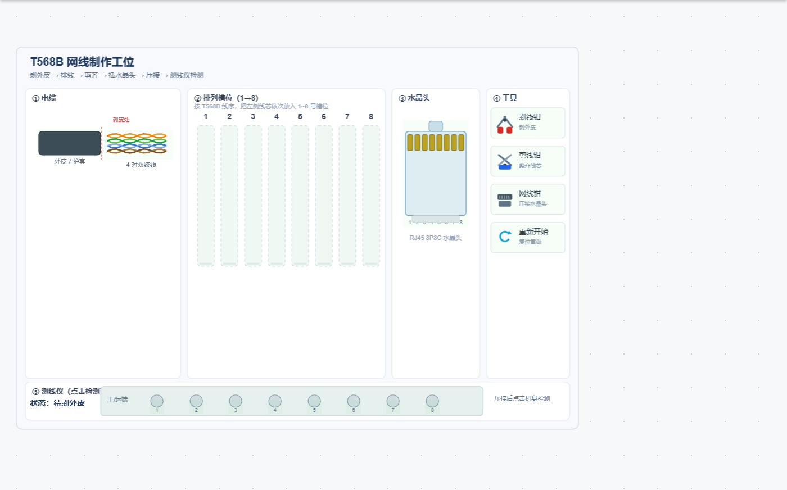
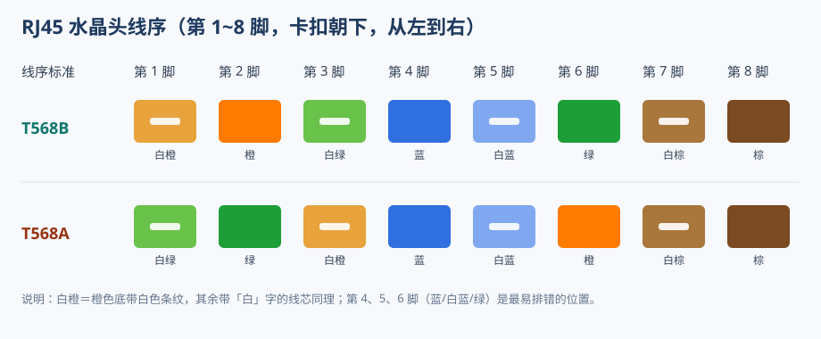
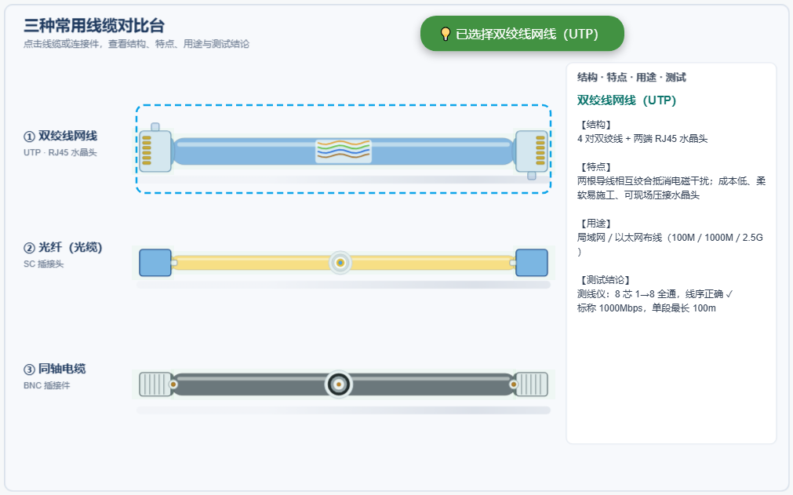
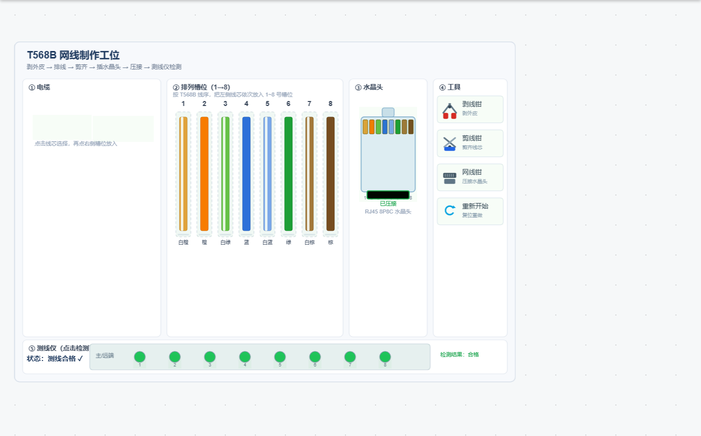

# T568B网线制作仿真系统

## 一、系统概述

本仿真系统用于演示 **T568B 直通网线**的制作全过程，并对**网线、光纤、同轴电缆**三种常用线缆做对比认知，可供学员反复练习、判读与排错。

网线制作工艺链：**剥外皮 → 解绞排线 → 剪齐 → 插入水晶头 → 压接 → 测线仪检测**。

## 二、T568B 线序

RJ45 水晶头（8P8C）卡扣朝下，从**左到右**为第 1~8 脚。T568B 直通线两端的线序相同：

| 脚位 | 1 | 2 | 3 | 4 | 5 | 6 | 7 | 8 |
|---|---|---|---|---|---|---|---|---|
| 颜色 | 白橙 | 橙 | 白绿 | 蓝 | 白蓝 | 绿 | 白棕 | 棕 |

需要注意：按线对聚拢时线序是「白绿、绿」相连，而 T568B 要求第 3、5、6 脚为「白绿、白蓝、绿」——蓝对夹在中间，绿线落在第 6 脚，这正是最容易排错的地方。若两端一端 T568B、一端 T568A，则构成**交叉线**。

## 三、网线制作工位

工位组件 `T568BCableBench` 分为五个区域：

| 区域 | 可识别部件 | 作用 |
|---|---|---|
| ① 电缆 | 外皮、4 对双绞线 | 剥皮后显示 8 根彩色线芯 |
| ② 排列槽位 | 1~8 号槽位 | 按线序把线芯放入对应槽位 |
| ③ 水晶头 | RJ45 本体、8 个金脚 | 插入线芯后金脚按序显示颜色 |
| ④ 工具 | 剥线钳、剪线钳、网线钳、重新开始 | 完成对应工艺动作 |
| ⑤ 测线仪 | 8 个指示灯 | 压接后点击检测线序与通断 |

交互方式：**点击线芯选中 → 点击槽位放入**；每完成一步，顶部状态栏会提示当前进度。

## 四、三种常用线缆对比台

对比台组件 `CableTypesBench` 以 3D 立体效果平行摆放三种线缆，中段带**剖面**显示内部结构，点击线缆或连接件即在右侧显示其结构、特点、用途与测试结论。

| 线缆 | 连接件 | 结构要点 | 主要用途 |
|---|---|---|---|
| 双绞线网线（UTP） | RJ45 水晶头 | 4 对相互绞合的导线，绞合抵消干扰 | 局域网／以太网布线（100M/1000M/2.5G，单段 100m） |
| 光纤（光缆） | SC 插接头 | 纤芯＋包层＋涂覆层＋加强件＋护套 | 骨干网、数据中心、长距离高带宽链路 |
| 同轴电缆 | BNC 插接件 | 内导体＋绝缘层＋外导体（编织网）＋护套 | 有线电视、视频监控、射频与仪器信号 |

三种线缆的共同点是都以铜或玻璃纤维为传输介质，区别在于**抗干扰能力、带宽、传输距离与接头工艺**：网线最经济、可现场压接；光纤带宽最大、抗电磁干扰、距离最远；同轴屏蔽最好、特性阻抗稳定（视频 75Ω／射频 50Ω）。

## 五、仿真操作流程

系统内置四套流程，可在工具栏「操作项目」下拉框中切换：

1. **认识网线与 T568B 线序**：逐个识别外皮、双绞线对、水晶头 8 个金脚与线色、各工具与测线仪。
2. **制作 T568B 直通线**：按工艺顺序完成剥皮、8 根线芯依次入槽、剪齐、插头、压接、测线。每步均可在「演练／评估」模式下由系统自动判定是否完成。
3. **测线判读与故障排查**：先制备并检测合格网线，再经工具栏「故障设置」注入线序错误，观察测线仪报警，随后修复并复测；最后演示「线序标准改为 T568A」导致同一根网线判不合格。
4. **认识三种线缆并测试其用途与特点**：识别网线／光纤／同轴电缆及其连接件，逐个点击线缆「测试」，读取结构、特点、用途与测试结论，并完成配套测试题与填空题。

制作完成并检测合格后，金脚按序着色、测线仪 8 个指示灯 **1→8 依次点亮**：

## 六、常见故障与测线判读

| 故障 | 现象 | 原因 |
|---|---|---|
| 线序错误 | 仅个别脚（如第 4、6 脚）指示灯异常 | 线芯位置放反，如把绿线误放第 4 脚 |
| 断路 | 某一脚指示灯不亮 | 该芯未压接、接触不良或中途断芯 |
| 短路 | 相邻两脚同时异常 | 芯线搭接、外皮破损导致互相导通 |

判读要点：若只有个别脚异常，多为线序或接点问题；若多脚甚至全部异常，应先检查水晶头是否压紧、外皮是否剥净。实际工程中，网线两端的线序必须一致（同为 T568B），否则即使单端「看起来正确」，整线仍可能无法通信。

## 七、教学要点

- 牢记 T568B 线序，尤其是第 4、5、6 脚的蓝／绿顺序。
- 剥皮长度约 20mm、留芯长度约 12mm，外皮须压在卡扣内以保证抗拉强度。
- 压接后必须用测线仪逐脚检测，确认线序与通断均正确。
- 选型时要综合考虑带宽、距离、抗干扰与施工成本：网线经济、光纤远、同轴屏蔽好。