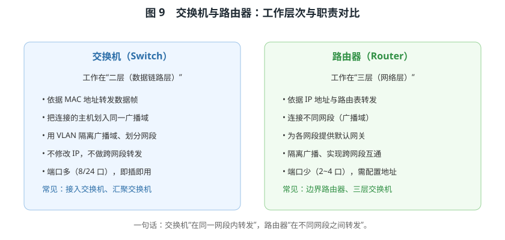
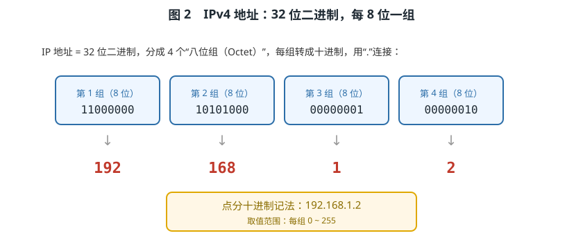
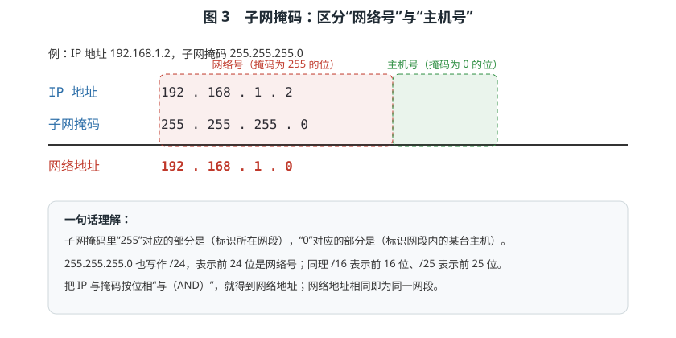
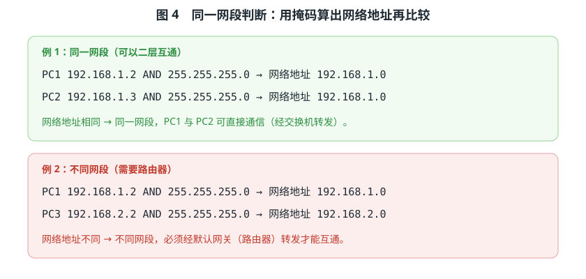
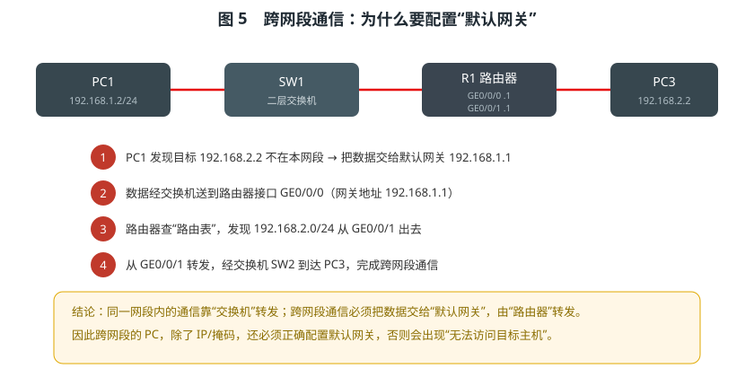
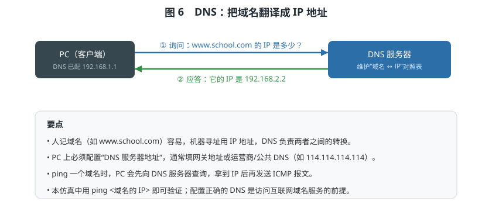
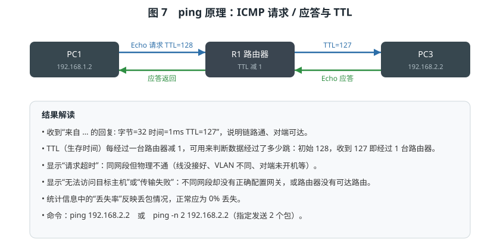
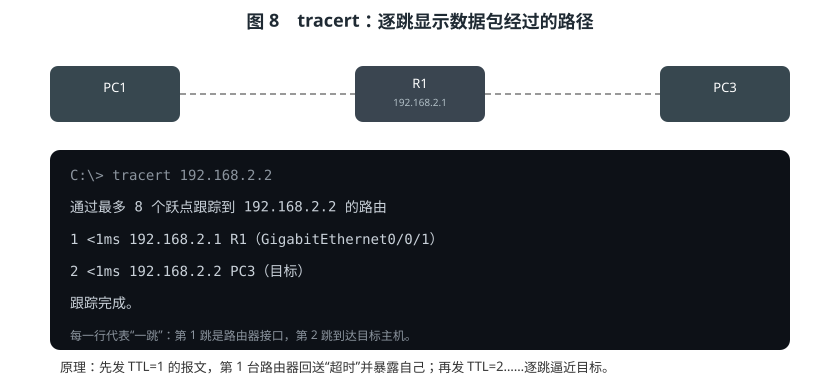
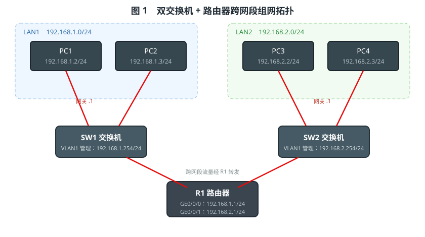

# 简单组网仿真系统

> 教学文档 · 配套仿真工程《简单组网仿真系统》
>
> 学习目标：理解 IPv4 地址（32 位地址、网络号/主机号、子网与掩码）、默认网关、DNS 的含义；掌握 ping、ipconfig、tracert 等常用网络命令；初步认识交换机与路由器的工作原理，并能完成一次“双交换机 + 路由器”的跨网段组网与连通性测试。

---

## 前言：为什么要学“组网”

我们每天都在用网络：手机连 Wi‑Fi、电脑访问网页、机房里的服务器互相通信。把多台设备连接起来并能互相通信，就叫**组网**。组网离不开三块基石：

1. **地址**：每台设备都要有一个“门牌号”，也就是 **IP 地址**；
2. **连接设备**：把设备连起来的是 **交换机**，把不同网段连起来的是 **路由器**；
3. **规则与工具**：知道数据怎么走，并用 **ping、ipconfig、tracert** 等命令去验证。

本仿真系统提供了一个完整的实验环境：4 台 PC、2 台交换机、1 台路由器，可以像真实网络一样配置 IP、掩码、网关、DNS，并通过命令行验证连通性。下面从最基础的概念讲起。

---

## 一、交换机与路由器简介

### 1.1 交换机（Switch）

交换机工作在 OSI 模型的**第二层（数据链路层）**，它的核心任务是：**在同一网段（同一广播域）内，把数据帧准确地转发给目标设备。**

- 交换机内部维护一张 **MAC 地址表**：记录“哪个 MAC 地址在哪个端口上”；
- 当它收到一个数据帧时，查看目的 MAC 地址，只从对应端口转发出去（而不是像集线器那样向所有端口广播）；
- 交换机**不关心 IP 地址**，也不会修改数据包，因此它**不能实现跨网段转发**；
- 通过划分 **VLAN**，交换机可以把一个物理交换机切成多个逻辑广播域，从而隔离流量、划分网段。

在本仿真中，交换机支持 VLAN 划分、端口所属 VLAN 设置，以及配置 **VLAN 管理地址**（在 `Vlanif 1` 虚接口上配置），用于远程管理交换机。

### 1.2 路由器（Router）

路由器工作在**第三层（网络层）**，它的核心任务是：**在不同网段之间转发数据。**

- 路由器有多个接口，每个接口通常属于**不同的网段**，并配置各自的 IP 地址；
- 路由器内部维护一张 **路由表**，记录“要到达某个网段，应该从哪个接口、经哪个下一跳转发”；
- 路由器是每个网段的**默认网关**：当主机发现目标不在本网段时，就把数据交给网关，由路由器接力转发；
- 路由器还能隔离广播（广播不会跨过路由器），因此它同时充当了网段的边界。

| 对比项 | 交换机 | 路由器 |
|--------|--------|--------|
| 工作层次 | 二层（数据链路层） | 三层（网络层） |
| 转发依据 | MAC 地址 | IP 地址 + 路由表 |
| 作用范围 | 同一网段内 | 不同网段之间 |
| 是否改 IP | 否 | 是（逐跳转发） |
| 典型端口数 | 8 / 24 口 | 2~4 口 |
| 是否可划 VLAN | 是 | 通常通过子接口/VLANIF 配合 |



> 一句话记忆：**交换机“在同一网段内转发”，路由器“在不同网段之间转发”。**

---

## 二、IP 地址详解

### 2.1 什么是 IPv4 地址

**IPv4 地址**是给网络中每台设备分配的逻辑地址，它由 **32 位二进制数**组成，习惯上写成 **点分十进制**：把这 32 位分成 4 组，每组 8 位（1 字节），转成 0~255 的十进制数，中间用英文句点“.”连接。

例如 `192.168.1.2`，它对应的二进制为：

```
11000000 . 10101000 . 00000001 . 00000010
   192   .   168    .     1     .     2
```



因此，每一组取值范围是 0~255，一个 IPv4 地址总共有 2³² ≈ 43 亿个。地址分为两部分：

- **网络号**：标识设备所处的“网段”；
- **主机号**：标识该网段内的“某一台主机”。

那么如何知道哪部分是网络号、哪部分是主机号？答案就是**子网掩码**。

### 2.2 子网掩码：网络号与主机号的分界线

**子网掩码**也是一串 32 位二进制数，规定为“前面连续的 1 + 后面连续的 0”：

- 掩码中为 **1** 的位，对应 IP 地址的**网络号**；
- 掩码中为 **0** 的位，对应 IP 地址的**主机号**。

最常用的掩码是 `255.255.255.0`，写成二进制是 `11111111.11111111.11111111.00000000`，即前 24 位是网络号，后 8 位是主机号。它也可以简写为 **/24**。

将 **IP 地址**与**子网掩码**按位做“与（AND）”运算，就得到**网络地址**：

```
IP  地址：192.168.1.2
子网掩码：255.255.255.0
按位相与：192.168.1.0        ← 网络地址
```



这个 `192.168.1.0` 就是该网段的名字。同一个网段内的所有主机，网络地址都相同。

### 2.3 如何判断两台主机是否在同一网段

**方法**：分别用自己的 IP 与自己的掩码做 AND 运算，得到各自的网络地址，再比较是否相同。

**例 1（同一网段）：**

```
PC1：192.168.1.2 AND 255.255.255.0 = 192.168.1.0
PC2：192.168.1.3 AND 255.255.255.0 = 192.168.1.0   → 相同！同网段
```

**例 2（不同网段）：**

```
PC1：192.168.1.2 AND 255.255.255.0 = 192.168.1.0
PC3：192.168.2.2 AND 255.255.255.0 = 192.168.2.0   → 不同！需经路由器
```



> **重要结论**：同网段的通信由交换机转发即可；**不同网段的通信必须经过路由器**，且双方都要正确配置默认网关。

### 2.4 常见地址与私有地址

- **私有地址**：专门留给局域网内部使用，不能直接在公网上路由，常见的有：
  - `10.0.0.0 ~ 10.255.255.255`（10.0.0.0/8）
  - `172.16.0.0 ~ 172.31.255.255`（172.16.0.0/12）
  - `192.168.0.0 ~ 192.168.255.255`（192.168.0.0/16）
- 本仿真采用 `192.168.1.0/24` 与 `192.168.2.0/24` 两个私有网段。
- 此外还有**回环地址** `127.0.0.1`（代表“本机自己”），以及保留的**网络地址**（主机号全 0，如 192.168.1.0）和**广播地址**（主机号全 1，如 192.168.1.255），它们不能分配给主机。

### 2.5 子网划分举例（理解用）

如果掩码从 /24 改为 /26（`255.255.255.192`），主机号只剩 6 位，可容纳 2⁶−2 = 62 台主机。一个 /24 网段可以拆成 4 个 /26 子网：`192.168.1.0/26`、`192.168.1.64/26`、`192.168.1.128/26`、`192.168.1.192/26`。这就是**子网划分**——用更长的掩码把一个大网段切成多个小网段，便于管理与隔离。虽然本实验使用 /24，但理解掩码的位数含义非常重要。

### 2.6 IPv4 地址的分类（了解）

早期 IPv4 按第一组数值把地址分为 A、B、C、D、E 五类：

- **A 类**：1~126，默认掩码 /8，用于超大型网络；
- **B 类**：128~191，默认掩码 /16，用于中型网络；
- **C 类**：192~223，默认掩码 /24，用于小型网络（本实验的 `192.168.x.x` 属于 C 类私有地址段）；
- **D 类**：224~239，用于组播；**E 类**：240~255，保留实验。

如今实际组网普遍采用**无类域间路由（CIDR）**，用“/掩码长度”灵活划分子网，不再严格拘泥于分类。掩码长度越长，网络越小、主机越少，但网段越多、隔离性越好。

---

## 三、默认网关

### 3.1 网关是什么

**默认网关（Default Gateway）**是主机所在网段的“出口”，通常就是**路由器连在本网段的那个接口的 IP 地址**。

当一台主机会话时，它先用自己的掩码判断目标是否在本网段：

- 若**在同一网段**：直接用 ARP 找到对方 MAC，把数据交给交换机转发，**不需要网关**；
- 若**不在同一网段**：主机自己无法直接送达，于是把数据交给默认网关，由路由器查路由表后继续转发。



以本实验 PC1 访问 PC3 为例：

1. PC1 发现目标 `192.168.2.2` 不在 `192.168.1.0/24` 内 → 交给网关 `192.168.1.1`；
2. 数据经 SW1 送到路由器接口 `GE0/0/0`；
3. 路由器查路由表，发现 `192.168.2.0/24` 从 `GE0/0/1` 出去；
4. 从 `GE0/0/1` 转发，经 SW2 送达 PC3，完成跨网段通信。

### 3.2 为什么网关错了就不通

- **没配网关**：跨网段时主机会提示“无法访问目标主机”或“传输失败”；
- **网关填错网段**：例如把 `192.168.1.x` 网段的 PC 网关填成 `192.168.2.1`，主机算不出可达路径，同样不通；
- **网关地址配置正确但路由器接口未配置/被关闭**：数据到了路由器却没有出口，表现为不通。

所以**跨网段的 PC，必须同时配好 IP、掩码和默认网关**，三者缺一不可。

---

## 四、DNS（域名系统）

### 4.1 DNS 的作用

人容易记住**域名**（如 `www.school.com`），但网络寻址使用的是 **IP 地址**。DNS（Domain Name System）就是负责把域名翻译成 IP 地址的系统，被称为“互联网的电话簿”。



解析过程简述：

1. PC 向配置好的 DNS 服务器发出查询：“`www.school.com` 的 IP 是多少？”；
2. DNS 服务器查表后应答：“它的 IP 是 `192.168.2.2`”；
3. PC 拿到 IP 后，再向该 IP 发送数据。

### 4.2 PC 上的 DNS 配置

在 PC 的“TCP/IP 设置”中，除了 IP、掩码、网关，还需要填写 **DNS 服务器地址**：

- 可以是本地的 DNS 服务器；
- 也可以是运营商或公共 DNS，例如 `114.114.114.114`、`8.8.8.8`；
- 工程中常把网关地址作为 DNS 地址。

配置了正确的 DNS，用域名访问服务才可能成功。在本仿真中，可以先用 `ping <域名的IP地址>` 验证连通性，再理解 DNS 的作用。

> 小结：**IP 负责“找人”，DNS 负责“把名字翻译成地址”，网关负责“跨网段出门”。**

---

## 五、常用网络命令

### 5.1 ping —— 测试连通性

`ping` 是最常用的网络测试命令，它利用 **ICMP 协议**向目标发送“回显请求（Echo Request）”，目标收到后回复“回显应答（Echo Reply）”。收到应答说明**链路通畅、目标可达**。



在 PC 命令行输入：

```
C:\> ping 192.168.1.3
```

典型输出：

```
正在 Ping 192.168.1.3 具有 32 字节的数据:
来自 192.168.1.3 的回复: 字节=32 时间=1ms TTL=128
来自 192.168.1.3 的回复: 字节=32 时间=1ms TTL=128
来自 192.168.1.3 的回复: 字节=32 时间=1ms TTL=128
来自 192.168.1.3 的回复: 字节=32 时间=1ms TTL=128

192.168.1.3 的 Ping 统计信息:
    数据包: 已发送 = 4，已接收 = 4，丢失 = 0 (0% 丢失)，
往返行程的估计时间(以毫秒为单位):
    最短 = 1ms，最长 = 1ms，平均 = 1ms
```

**结果解读：**

- **来自 … 的回复**：正常，说明通；`时间` 越小越快；
- **TTL**：每经过一台路由器减 1。初始 128，收到 `TTL=127` 说明中间经过了 **1 台路由器**；同网段则 `TTL=128`；
- **请求超时**：同网段但物理不通（网线没接、VLAN 不同、对端未启动等）；
- **无法访问目标主机 / 传输失败**：跨网段但网关未配置或网络不可达；
- **丢失率**：正常为 0%。

常用参数：`ping -n 2 192.168.2.2` 表示只发送 2 个包。

### 5.2 ipconfig —— 查看本机 IP 配置

`ipconfig` 用于查看本机的网络配置信息。

```
C:\> ipconfig
```

显示本机 IP 地址、子网掩码、默认网关。加上 `/all` 参数可显示更完整的信息（含主机名、物理地址 MAC、DHCP 状态、DNS 服务器等）：

```
C:\> ipconfig /all
```

典型片段：

```
以太网适配器 本地连接:

   主机名  . . . . . . . . . . . . . : PC1
   物理地址. . . . . . . . . . . . . : 00-1A-2B-50-54-CF
   DHCP 已启用 . . . . . . . . . . . : 否
   IPv4 地址 . . . . . . . . . . . . : 192.168.1.2(首选)
   子网掩码  . . . . . . . . . . . . : 255.255.255.0
   默认网关. . . . . . . . . . . . . : 192.168.1.1
   DNS 服务器  . . . . . . . . . . . : 192.168.1.1
```

此外还有：

- `ipconfig /renew`：向 DHCP 服务器**续租/重新获取** IP；
- `ipconfig /release`：**释放**当前 DHCP 租约。

### 5.3 tracert —— 查看数据经过的路径

`tracert`（Trace Route，路由追踪）用来显示数据包从本机到目标**逐跳经过的路由器**。



```
C:\> tracert 192.168.2.2

通过最多 8 个跃点跟踪到 192.168.2.2 的路由

  1    <1ms    192.168.2.1    R1（GigabitEthernet0/0/1）
  2    <1ms    192.168.2.2    PC3（目标）

跟踪完成。
```

**每一行代表一跳**：第 1 跳是路由器接口，第 2 跳到达目标主机。

**原理**：先发送 `TTL=1` 的报文，第 1 台路由器把 TTL 减到 0 后丢弃并回送“超时”消息，从而暴露自己的地址；再发 `TTL=2`……逐跳逼近目标，最终得到完整路径。它常用来定位“在哪一跳开始不通”。

### 5.4 arp -a —— 查看 ARP 缓存

主机在同一网段通信前，需要先用 **ARP 协议**把对方的 IP 地址解析成 MAC 地址。`arp -a` 可以查看本机学到的“IP ↔ MAC”对照表：

```
C:\> arp -a
  Internet 地址        物理地址              类型
  192.168.1.1          00-1A-2B-7A-09-F1     动态
```

### 5.5 交换机 / 路由器常用命令

在交换机与路由器的命令行中，常用 `display`（华为风格）查看状态：

- 交换机：`display version`、`display interface brief`（端口状态）、`display mac-address`（MAC 地址表）、`display vlan`、`display port vlan`、`display ip interface brief`（管理地址）；
- 路由器：`display ip interface brief`（接口地址）、`display ip routing-table`（路由表）、`display arp`、`display current-configuration`（当前配置）；
- 配置类：交换机 `vlan 10`、`interface Ethernet0/0/2` + `port default vlan 10`、`interface Vlanif 1` + `ip address …`；路由器 `interface GigabitEthernet0/0/0` + `ip address …`、`ip route-static …`、`dhcp enable`。

---

## 六、组网实例：双交换机 + 路由器



### 6.1 拓扑与地址规划

- **LAN1（192.168.1.0/24）**：PC1 = `.2`、PC2 = `.3`，交换机 SW1，路由器接口 GE0/0/0 = `.1`（网关）；
- **LAN2（192.168.2.0/24）**：PC3 = `.2`、PC4 = `.3`，交换机 SW2，路由器接口 GE0/0/1 = `.1`（网关）；
- PC1/PC2 接入 SW1，PC3/PC4 接入 SW2，SW1、SW2 分别上连路由器的两个接口。

| 设备 | 接口 | IP 地址 | 说明 |
|------|------|---------|------|
| PC1 | 网卡 | 192.168.1.2/24 | 网关 192.168.1.1 |
| PC2 | 网卡 | 192.168.1.3/24 | 网关 192.168.1.1 |
| PC3 | 网卡 | 192.168.2.2/24 | 网关 192.168.2.1 |
| PC4 | 网卡 | 192.168.2.3/24 | 网关 192.168.2.1 |
| R1 | GE0/0/0 | 192.168.1.1/24 | LAN1 网关 |
| R1 | GE0/0/1 | 192.168.2.1/24 | LAN2 网关 |
| SW1 | Vlanif1 | 192.168.1.254/24 | 管理地址（可选） |
| SW2 | Vlanif1 | 192.168.2.254/24 | 管理地址（可选） |

### 6.2 配置步骤

1. **配置 PC 的 TCP/IP**（双击 PC → “TCP/IP 设置”）：填写 IP、子网掩码、默认网关、（可选）DNS；
2. **连接网线**：右键交换机“生成到选中 PC 的网线”，右键路由器“连接到选中的交换机”；
3. **配置路由器接口**（双击路由器 → “接口配置”）：GE0/0/0 = `192.168.1.1/24`，GE0/0/1 = `192.168.2.1/24`；
4. **验证**：在路由器上 `display ip routing-table` 应看到两条直连路由；在 PC1 上 `ping 192.168.1.3`（通）、`ping 192.168.2.2`（应通，TTL=127）、`tracert 192.168.2.2`（两跳）。

### 6.3 完整验证示例

```
C:\> ipconfig
   IPv4 地址 . . . . . . . . . . . . : 192.168.1.2
   子网掩码  . . . . . . . . . . . . : 255.255.255.0
   默认网关. . . . . . . . . . . . . : 192.168.1.1

C:\> ping 192.168.1.3
来自 192.168.1.3 的回复: 字节=32 时间=1ms TTL=128     ← 同网段，TTL=128

C:\> ping 192.168.2.2
来自 192.168.2.2 的回复: 字节=32 时间=1ms TTL=127     ← 跨网段，TTL=127

C:\> tracert 192.168.2.2
  1    <1ms    192.168.2.1    R1（GigabitEthernet0/0/1）
  2    <1ms    192.168.2.2    PC3（目标）
```

### 6.4 常用配置命令速查

| 设备 | 目的 | 命令 |
|------|------|------|
| PC | 查看配置 | `ipconfig` / `ipconfig /all` |
| PC | 测试连通 | `ping <IP>` / `ping -n 2 <IP>` |
| PC | 查看路径 | `tracert <IP>` |
| PC | 查看 ARP | `arp -a` |
| 交换机 | 创建 VLAN | `system-view` → `vlan 10` |
| 交换机 | 端口划 VLAN | `interface Ethernet0/0/2` → `port default vlan 10` |
| 交换机 | 配置管理地址 | `interface Vlanif 1` → `ip address 192.168.1.254 24` |
| 交换机 | 查看端口 / MAC | `display interface brief` / `display mac-address` |
| 路由器 | 配置接口 | `interface GigabitEthernet0/0/0` → `ip address 192.168.1.1 24` |
| 路由器 | 查看路由表 | `display ip routing-table` |
| 路由器 | 添加静态路由 | `ip route-static 192.168.9.0 255.255.255.0 192.168.2.2` |
| 路由器 | 启用 DHCP | `system-view` → `dhcp enable` |

---

## 七、常见故障与排查

| 现象 | 可能原因 | 排查方法 |
|------|----------|----------|
| ping 同网段提示“请求超时” | 网线未接、端口/VLAN 不通、对端未启动 | 查看交换机 `display interface brief`；检查连接 |
| ping 跨网段提示“无法访问/传输失败” | 未配默认网关、网关不在本网段 | `ipconfig /all` 检查网关；`display ip routing-table` 看路由 |
| 路由器 ping 通但 PC 不通 | PC 网关配置错误 | 核对 PC 网关是否为路由器接口地址 |
| 通了但域名访问失败 | 未配置或配置错误的 DNS | 用 `ping <IP>` 验证；检查 DNS 服务器地址 |
| 两台 PC 同网段却不通 | 被划分到不同 VLAN | `display port vlan` 检查端口 VLAN 归属 |

---

## 八、小结与思考题

### 8.1 知识小结

- **IPv4 地址**是 32 位地址，分网络号与主机号，用**子网掩码**区分；
- 判断是否同网段：IP 与掩码 AND 得到网络地址，相同即同网段；
- **同网段**通信靠**交换机**；**跨网段**通信须经**默认网关 + 路由器**；
- **DNS** 负责域名与 IP 的相互转换；
- 常用命令：**ping**（测连通、看 TTL）、**ipconfig**（看本机配置）、**tracert**（看路径）、**arp -a**（看 MAC 对照）。

### 8.2 思考题

1. 若把 PC1 的掩码从 `255.255.255.0` 改为 `255.255.0.0`，它与 PC3（`192.168.2.2/24`）会被判为同网段吗？此时还需要网关吗？会有什么问题？
2. 为什么“同一网段”的两台 PC 即使 IP 正确，也可能因为 VLAN 不同而 ping 不通？
3. `ping` 同一个跨网段目标，返回 `TTL=127` 与 `TTL=126` 分别说明经过了什么？
4. 交换机为什么不能实现跨网段通信？路由器又是靠什么决定“从哪个接口转发”？
5. 一台 PC 没有配置 DNS，但能 ping 通 IP，它还能通过域名访问网站吗？为什么？

> 建议对照本仿真工程逐条验证：在 PC、交换机、路由器上分别执行上述命令，观察输出与拓扑的对应关系，把“地址—掩码—网关—路由—DNS”这条主线真正串起来。
