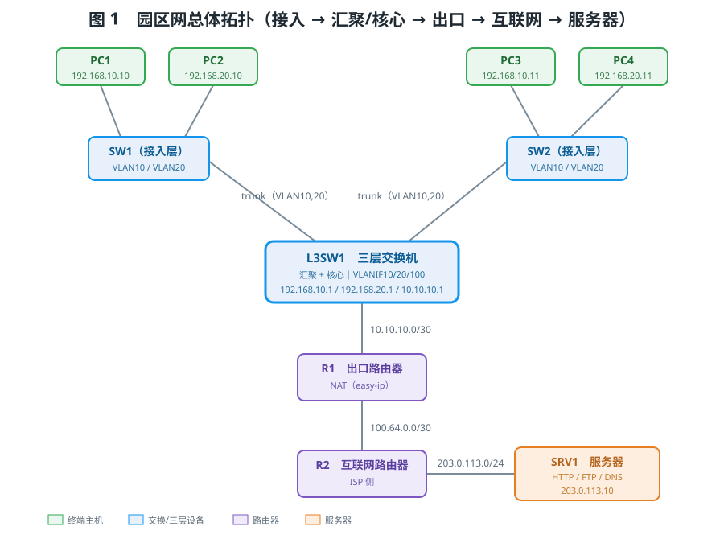
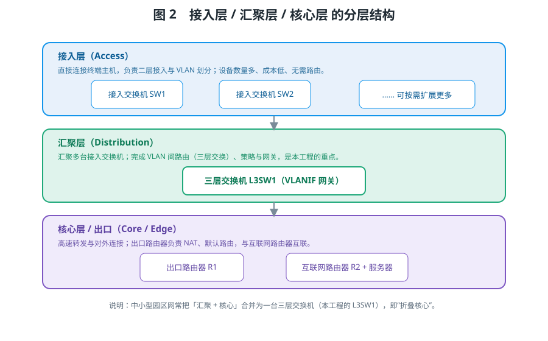
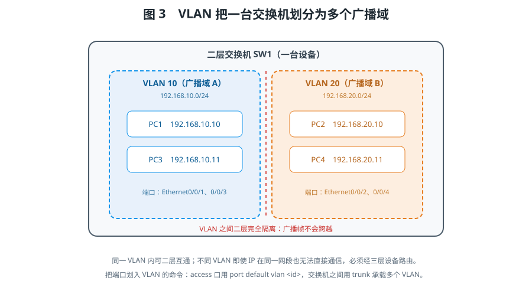
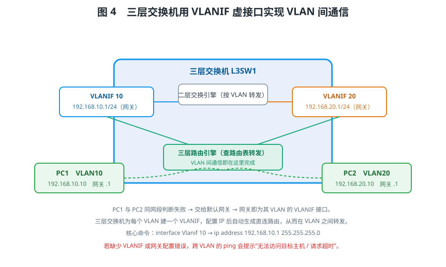
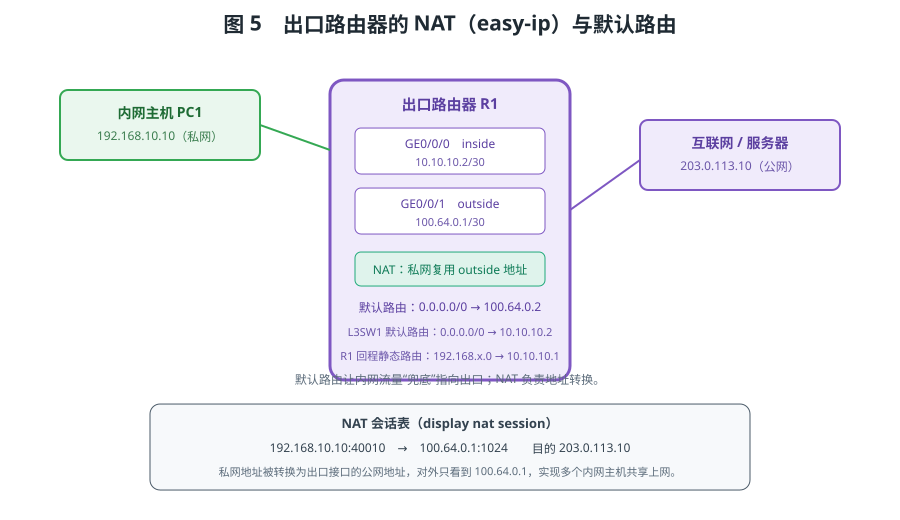
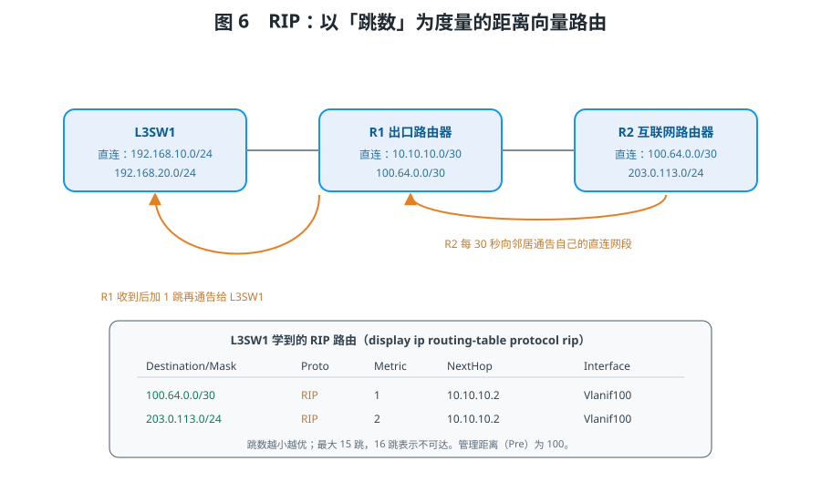
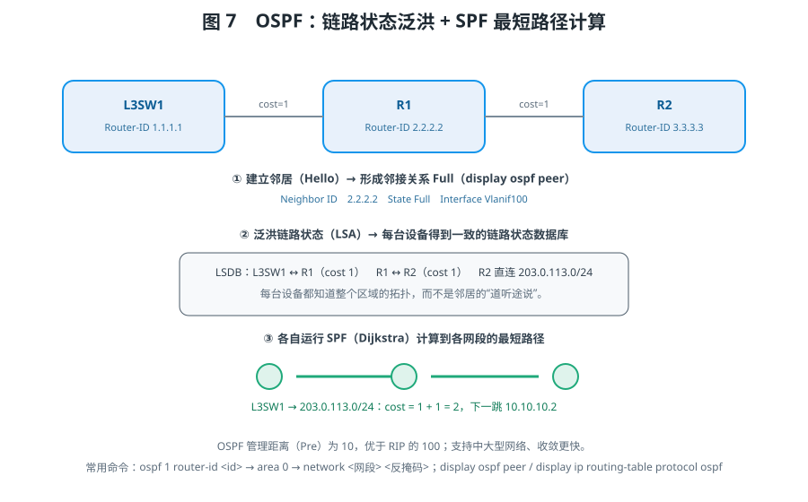
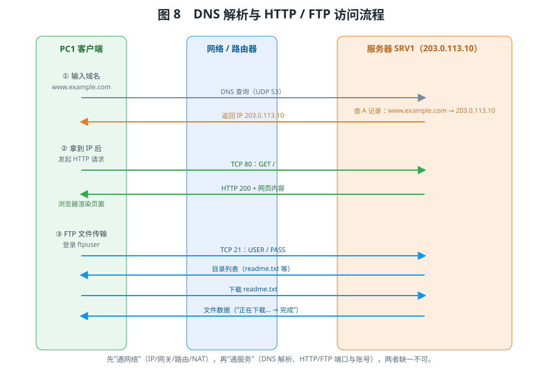

# 组网仿真功能扩展

> 教学文档 · 配套仿真工程《组网仿真功能扩展》
>
> 学习目标：在掌握 IP 地址、网关、ping 命令的基础上，进一步理解**网络分层（接入 / 汇聚 / 核心）**、**三层交换机与 VLAN 间通信**、**动态路由（RIP 与 OSPF）**以及**服务器（HTTP / FTP / DNS）**的工作原理，并能完成一次“多 VLAN + 动态路由 + 出口 NAT + 服务器访问”的完整园区网组网实验。

---

## 一、从“能连上”到“会组网”

在基础组网实验中，我们用一台交换机把几台 PC 连起来，配上同网段的 IP，就能互相 ping 通；再用一台路由器把两个网段连起来，实现跨网段通信。这些都只涉及“小网络”。

真实的企业或校园网络要复杂得多：

- 用户按部门、楼层被划分到不同的 **VLAN**，彼此隔离；
- 不同 VLAN 之间既要能互访，又要受控，需要 **三层交换机** 做 VLAN 间路由；
- 网络规模扩大后，路由器之间的路径不能靠管理员一条条手工配置，需要 **动态路由协议** 自动学习；
- 内网要访问外部网络，需要 **出口路由器 + NAT + 默认路由**；
- 网络里还要提供 **网站、文件、域名解析** 等服务，这就是 **服务器**。

本仿真工程正是围绕这些内容搭建的。其总体拓扑如图 1 所示：4 台 PC 通过两台接入交换机接入，接入交换机用 trunk 上联到一台三层交换机，三层交换机向上连接出口路由器，出口路由器再连接互联网路由器，互联网侧连接一台同时提供 DNS、HTTP、FTP 服务的服务器。



本工程的地址规划如下表，后续所有实验均以此为准：

| 设备 / 接口 | 地址 | 说明 |
| --- | --- | --- |
| PC1 | 192.168.10.10/24 | VLAN 10，网关 192.168.10.1 |
| PC3 | 192.168.10.11/24 | VLAN 10，网关 192.168.10.1 |
| PC2 | 192.168.20.10/24 | VLAN 20，网关 192.168.20.1 |
| PC4 | 192.168.20.11/24 | VLAN 20，网关 192.168.20.1 |
| L3SW1 Vlanif10 | 192.168.10.1/24 | VLAN 10 的网关 |
| L3SW1 Vlanif20 | 192.168.20.1/24 | VLAN 20 的网关 |
| L3SW1 Vlanif100 | 10.10.10.1/30 | 上联出口路由器 |
| R1 GE0/0/0 | 10.10.10.2/30 | inside（内网侧） |
| R1 GE0/0/1 | 100.64.0.1/30 | outside（外网侧） |
| R2 GE0/0/0 | 100.64.0.2/30 | 连接出口路由器 |
| R2 GE0/0/1 | 203.0.113.1/24 | 服务器网段网关 |
| SRV1 | 203.0.113.10/24 | DNS / HTTP / FTP 服务器 |

> 说明：203.0.113.0/24 是专用于文档示例的公网地址段，用它表示“互联网侧”既直观又不会与真实网络冲突。

---

## 二、网络分层：接入层、汇聚层与核心层

大型网络不是“一台交换机接一堆电脑”的扁平结构，而是按职责分层，常见分为三层（图 2）：

1. **接入层（Access）**：直接连接终端主机，负责二层接入、端口划分与 VLAN 归属。接入交换机数量最多、端口密度大、功能相对简单，一般不做路由。本工程中的 **SW1、SW2** 就是接入交换机。
2. **汇聚层（Distribution）**：汇聚多台接入交换机，完成 **VLAN 间路由**、网关、访问策略等三层功能。它是“接入”与“核心”之间的桥梁。本工程中的 **L3SW1（三层交换机）** 承担汇聚层的角色。
3. **核心层 / 出口（Core / Edge）**：负责高速转发和对外连接。中小企业网络常把汇聚与核心合一，称为“折叠核心”，即本工程的 L3SW1。对外的部分是 **出口路由器 R1**，它通过 **互联网路由器 R2** 接入外部网络。



为什么要分层？因为分层把复杂的网络拆成职责清晰的模块：接入层只管“接”，汇聚层负责“转”，核心层负责“快”和“通外部”。这样网络易扩展、易维护、易排错。当我们说“网络不通”时，也可以按“接入 → 汇聚 → 出口 → 服务器”的顺序逐层定位问题。

---

## 三、二层交换与 VLAN

交换机工作在 OSI 第二层（数据链路层），它根据 **MAC 地址** 在端口间转发数据帧。一个交换机默认的所有端口处于同一个 **广播域**：任何一台主机发出的广播帧，都会泛洪到其他所有端口。主机多了之后，广播泛滥会严重消耗带宽与主机 CPU。

**VLAN（虚拟局域网）** 的作用，就是把一台物理交换机在逻辑上切成多个互不相通的广播域。如图 3，同一台交换机上，属于 VLAN 10 的 PC1、PC3 可以互相通信，属于 VLAN 20 的 PC2、PC4 也可以互相通信，但 VLAN 10 与 VLAN 20 之间二层完全隔离——广播帧不会跨越，即使两边的 IP 地址在同一网段也无法直接通信。



交换机端口有两种常见的链路类型：

- **access 口**：只属于一个 VLAN，用于连接终端主机。命令：`port link-type access` → `port default vlan 10`。
- **trunk 口**：可同时承载多个 VLAN 的帧（帧带有 802.1Q 标签），用于交换机之间的上联。命令：`port link-type trunk` → `port trunk allow-pass vlan 10 20`。

因此在本工程中，SW1、SW2 用 access 口接 PC，用 trunk 口上联三层交换机，trunk 上同时允许 VLAN 10 与 VLAN 20 通过。可用 `display vlan`、`display port vlan` 查看端口归属。

交换机内部维护一张 **MAC 地址表**：收到帧时记录“源 MAC—入端口”的对应关系；转发时若表中已有目的 MAC，就从对应端口单播转发，否则在本 VLAN 内其他端口泛洪。这种“学习—转发—泛洪”机制使交换机无需人工配置即可自适应拓扑。trunk 口在发送时给帧打上 802.1Q 标签、接收时按标签还原 VLAN，因此一条物理链路能同时承载多个 VLAN。

> 关键结论：VLAN 把广播域隔开，这是“隔离”的价值，但同时也带来了新问题——不同 VLAN 之间怎么通信？这正是下一节三层交换机的任务。

---

## 四、三层交换机与 VLAN 间通信（重点）

### 4.1 二层交换机为什么做不到

二层交换机不认识 IP 地址，只看 MAC。不同 VLAN 属于不同广播域，交换机不会把一个 VLAN 的帧转发到另一个 VLAN。于是 VLAN 10 的主机无法直接与 VLAN 20 的主机通信。

传统做法是“每个 VLAN 接一个路由器物理接口”。但路由器接口数量有限，VLAN 一多就不够用，成本也高。于是出现了 **三层交换机**：它把“二层交换”和“三层路由”做在同一台设备里，既便宜又高速。

### 4.2 VLANIF 虚接口：VLAN 的网关

三层交换机为每个 VLAN 创建一个 **虚拟三层接口（VLANIF）**，并在上面配置 IP 地址，这个地址就作为该 VLAN 内主机的**默认网关**。如图 4：

- VLANIF 10：192.168.10.1/24，是 VLAN 10 的网关；
- VLANIF 20：192.168.20.1/24，是 VLAN 20 的网关。



三层交换机为每个已配置 IP 且状态 UP 的 VLANIF 自动生成一条 **直连路由**。当 PC1（192.168.10.10）要访问 PC2（192.168.20.10）时，它发现目标不在本网段，就把报文交给默认网关 192.168.10.1（即 VLANIF 10）。三层交换机收到后查路由表，发现 192.168.20.0/24 是直连网段、出接口为 VLANIF 20，于是从 VLAN 20 转发出去，最终到达 PC2。整个过程只经过一台设备，这就是 **VLAN 间路由**。

### 4.3 配置与验证

配置示例（在三层交换机上）：

```
system-view
vlan 10
vlan 20
interface Ethernet0/0/1
 port link-type trunk
 port trunk allow-pass vlan 10 20
interface Vlanif 10
 ip address 192.168.10.1 255.255.255.0
interface Vlanif 20
 ip address 192.168.20.1 255.255.255.0
return
display ip routing-table
```

验证要点：

- 同 VLAN 内（如 PC1 ping PC3，均为 VLAN 10）应能通，属于二层转发；
- 跨 VLAN（PC1 ping PC2）应能通，且只经过一层路由（TTL=127）；
- `display ip routing-table` 应看到 192.168.10.0/24 与 192.168.20.0/24 两条 **Direct（直连）** 路由；
- 如果关闭某个 VLANIF（`shutdown`），对应网段立即不可达，ping 提示“无法访问目标主机”。

### 4.4 一次跨 VLAN 通信的完整过程

以 PC1（192.168.10.10）ping PC2（192.168.20.10）为例，数据大致经过以下步骤：

1. PC1 用子网掩码判断目标不在本网段，决定把报文交给默认网关 192.168.10.1；
2. PC1 通过 ARP 询问网关的 MAC，得到 VLANIF 10 的 MAC，封装成帧发出；
3. 帧进入接入交换机 SW1，在 VLAN 10 内转发，经 trunk 上送到三层交换机；
4. 三层交换机在 VLANIF 10 收到报文，识别目的 IP 为 192.168.20.10；
5. 查路由表，命中直连路由 192.168.20.0/24，出接口为 VLANIF 20；
6. 三层交换机在 VLAN 20 内 ARP 询问 PC2 的 MAC，重新封装帧；
7. 帧经 trunk 下送到 SW2，再由 SW2 转发给 VLAN 20 中的 PC2；
8. PC2 收到后回复，回程数据反向进行，过程完全对称。

整个过程中，**源 MAC、目的 MAC 在每一段链路上都会被重写**，而源 IP、目的 IP 保持不变（未做 NAT 时），这正是“逐跳转发、逐段封装”的体现。TTL 每经过一台三层设备减 1，因此同网段 ping 的 TTL 为 128，跨一层路由后为 127。理解了这条数据流，就能明白为什么“网关配错”“VLANIF 漏配”“trunk 未放行 VLAN”都会导致跨 VLAN 不通。

---

## 五、出口路由器：默认路由与 NAT

园区网内部可以互通后，还要访问外部网络。本工程的出口路由器 R1 有两条链路：一条 inside（GE0/0/0，接三层交换机），一条 outside（GE0/0/1，接互联网路由器 R2）。

**默认路由** 是“兜底路由”。当路由器查不到更精确的匹配时，就把报文交给默认路由的下一跳：

- 三层交换机：`ip route-static 0.0.0.0 0.0.0.0 10.10.10.2`（所有未知目标交给 R1）；
- 出口路由器 R1：`ip route-static 0.0.0.0 0.0.0.0 100.64.0.2`（所有未知目标交给 R2）。

**NAT（网络地址转换）** 解决的是“私网地址不能在公网路由”的问题。内网使用 192.168.x.x 这类私有地址，出口路由器通过 **easy-ip（PAT）** 把内网主机的源地址转换为 outside 接口的地址，并记录一张会话表（图 5）。这样，多台内网主机可以共享一个出口地址访问外部；外部看到的只是出口地址，看不到内网结构。可用 `display nat session` 查看会话。



在仿真中，R1 的 NAT 配置通过「NAT」页签完成：勾选“启用 NAT”，把 GE0/0/0 设为 inside、GE0/0/1 设为 outside。当内网主机成功访问服务器后，再打开 `display nat session`，即可看到“私网地址 → 公网地址”的转换记录。

---

## 六、动态路由：RIP 与 OSPF（重点）

### 6.1 为什么需要动态路由

静态路由需要管理员手工配置每一条路径，网络一多、链路一变就非常繁琐，而且无法自动适应故障。动态路由协议让路由器之间**自动交换路由信息**，实现路由的自动学习、更新与收敛。

### 6.2 RIP：距离向量协议

RIP（Routing Information Protocol）是最经典的动态路由协议，属于 **距离向量（Distance Vector）** 类型。它的特点是：

- **度量是“跳数”**：直连网段为 0 跳，每经过一台路由器加 1；**最大 15 跳**，16 跳表示不可达，因此只适合小型网络。
- **周期性通告**：路由器每隔一段时间把自己的整张路由表告诉邻居；邻居在此基础上“加一跳”后再传播出去，逐渐收敛。
- **管理距离（Pre）为 100**。

为防止路由环路，RIP 还引入了水平分割、毒性逆转等机制：路由器不把某条路由从“学到它的那个接口”再通告回去，从而避免“我告诉你、你又告诉我”的循环。这些机制在小型网络中工作良好，但依然无法突破 15 跳的规模限制。

如图 6，互联网路由器 R2 把自己的直连网段 203.0.113.0/24 通告给 R1（跳数 1），R1 再加一跳通告给三层交换机 L3SW1（跳数 2）。于是 L3SW1 学到了到服务器的 RIP 路由，下一跳是 R1 的接口地址。



配置与查看：

```
system-view
rip
 version 2
 network 192.168.10.0
 network 192.168.20.0
return
display ip routing-table protocol rip
```

需要特别注意：RIP 的邻居必须是**二层相邻且双方都启用了 RIP** 的路由设备；若某一端关闭 RIP，之前学到的路由会在收敛后消失，网络随即中断。

### 6.3 OSPF：链路状态协议

OSPF（Open Shortest Path First）属于 **链路状态（Link State）** 类型，是现代园区网的主流选择：

- **度量是“开销（cost）”**：通常由接口带宽决定，带宽越高 cost 越小；
- **建立邻居 → 泛洪链路状态 → 各自计算**：每台路由器都掌握整个区域的拓扑（链路状态数据库），再用 **SPF（Dijkstra 最短路径优先）算法** 计算到各网段的最短路径（图 7）；
- **支持区域划分**，适合中大型网络，收敛快；
- **管理距离（Pre）为 10**，优于 RIP 的 100。



配置与查看：

```
system-view
ospf 1 router-id 1.1.1.1
 area 0
  network 192.168.10.0 0.0.0.255
  network 192.168.20.0 0.0.0.255
  network 10.10.10.0 0.0.0.3
return
display ospf peer
display ip routing-table protocol ospf
```

其中 `network` 后面的第二个参数是 **反掩码（通配符掩码）**：`0.0.0.255` 对应 /24，`0.0.0.3` 对应 /30。

### 6.4 RIP 与 OSPF 的对比

| 对比项 | RIP | OSPF |
| --- | --- | --- |
| 类型 | 距离向量 | 链路状态 |
| 度量 | 跳数（最大 15） | 链路开销 cost |
| 管理距离 | 100 | 10 |
| 收敛速度 | 慢 | 快 |
| 适用规模 | 小型网络 | 中大型网络 |
| 邻居查看 | `display rip` | `display ospf peer` |

在仿真中可以先启用 RIP，用 `display ip routing-table protocol rip` 观察学到的路由；再关闭 RIP 改用 OSPF，对比两种协议在**度量方式、管理距离、收敛行为**上的差异。当两者同时存在时，同一目标网段会优先选择管理距离更小（更可信）的 OSPF 路由。

### 6.5 动态路由的收敛与故障自适应

动态路由的价值，在链路发生变化时才真正体现。假设 R1 与 R2 之间的链路中断：

- 使用**静态路由**时，R1 仍按原来的下一跳转发，报文被丢弃，必须管理员手工修正；
- 使用 **RIP** 时，R1 收不到 R2 的周期通告，原路由在老化计时器到期后被删除，其余设备也随之撤销这条路径，但收敛较慢；
- 使用 **OSPF** 时，邻居关系断开触发链路状态更新，各设备重新运行 SPF，通常能在数秒内算出新的可用路径。

因此“收敛速度”是衡量动态路由协议的重要指标，OSPF 明显优于 RIP，“无环、快速、可扩展”也是它成为园区网主流的原因。在仿真中，可以关闭某台设备的 RIP/OSPF，或 shutdown 某个接口，观察路由表条目“消失—恢复”的全过程，这比只看静态结果更能理解动态路由的意义。

---

## 七、服务器：HTTP / FTP / DNS（重点）

网络“通”了，只是具备了通信能力；要让用户真正用起来，还需要 **应用层服务**。本工程的服务器 SRV1（203.0.113.10）同时提供三种服务，其访问流程如图 8。



### 7.1 DNS：把域名翻译成 IP

人习惯记域名（如 www.example.com），而网络通信用的是 IP 地址。**DNS（域名系统）** 负责把域名解析为 IP。过程如下：

1. PC 在“TCP/IP 设置”里配置了 DNS 服务器地址；
2. 访问域名时，PC 先向 DNS 服务器发送查询（UDP 53 端口）；
3. DNS 服务器在自己的 **A 记录** 中查找域名对应的 IP，返回给 PC；
4. PC 拿到 IP 后再发起后续连接。

服务器的 DNS 记录在「内容」页签维护，例如：`www.example.com → 203.0.113.10`。可用 PC 命令行 `nslookup www.example.com` 验证，也可用 `ipconfig /displaydns` 查看本机 DNS 缓存、`ipconfig /flushdns` 清空缓存。

> 常见错误：DNS 未配置 → 提示“未配置 DNS 服务器”；域名不存在 → “找不到主机（NXDOMAIN）”；DNS 服务器不可达 → “请求超时”。

### 7.2 HTTP：网页访问

HTTP 是 Web 服务协议，默认使用 **TCP 80 端口**。PC 的「浏览器」页签输入 `http://www.example.com/` 后：先做 DNS 解析得到服务器 IP，再与服务器 80 端口建立连接，发送 `GET /` 请求，服务器返回状态码与网页内容，浏览器渲染出页面。仿真中会先显示“正在连接服务器… / 正在加载页面…”，随后显示服务器主页；若路径不存在，则显示 404。

### 7.3 FTP：文件传输

FTP 是文件传输协议，默认使用 **TCP 21 端口**，需要 **用户名和密码** 认证。PC 的「FTP 客户端」页签输入服务器地址与账号（本工程为 `ftpuser / ftp123`）后，可以：

1. 连接并登录；
2. 查看 **目录列表**（如 `readme.txt`、`data.csv`）；
3. 下载文件，界面会显示“正在下载……”的进度，完成后显示文件的字节数与内容。

### 7.4 服务器的“先通网、再通服务”

访问服务器的失败原因可以分成两层：

- **网络层不通**：IP/掩码/网关错误、VLAN 未配置、路由缺失、接口关闭、NAT 未启用 —— 表现为 ping 不通；
- **应用层不通**：服务未启用、端口不对、账号错误、DNS 记录缺失 —— 表现为“能 ping 通，但打不开网页 / 登录失败”。

掌握这个“两层排查法”，就能快速定位服务器访问故障。

### 7.5 服务器的配置项与观测

服务器的配置分布在四个页签中：

- **网络**：IP 地址、子网掩码、默认网关、DNS 服务器；
- **服务**：分别启用或关闭 DNS、HTTP、FTP 三种服务；
- **内容**：维护 HTTP 主页标题与正文、FTP 文件列表与账号、DNS 的 A 记录；
- **命令行**：提供 `ipconfig`、`display services`、`display dns-records`、`display http`、`display ftp` 等命令查看当前状态。

推荐的验证顺序是：先在外部主机上 **ping 服务器 IP**，确认网络层可达；再用 `nslookup` 确认域名解析；然后用浏览器访问网页；最后用 FTP 客户端登录并下载文件。任何一步失败，都能据此判断问题出在网络层还是应用层。

---

## 八、综合实验：四个操作流程

仿真工程内置了四条操作流程，可由工具栏“请选择操作项目”下拉框选择，并支持**自动演示、单步演示、演练、评估**四种模式。

1. **三层交换机 VLAN 间路由**：完成 VLAN 划分、trunk 上联、VLANIF 网关配置与布线；验证同 VLAN 通、跨 VLAN 通；并做“关闭 VLANIF 再恢复”的故障演练。
2. **RIP 动态路由**：在三层交换机与两台路由器上启用 RIP 并宣告网段，查看 `display ip routing-table protocol rip`；端到端 ping 服务器；并演示“关闭 RIP → 路由消失 → 恢复”。
3. **OSPF 动态路由**：改用 OSPF（单区域 0），查看 `display ospf peer` 与 OSPF 路由，用 `tracert` 观察路径。
4. **HTTP/FTP 服务器与 DNS（出口 NAT）**：配置出口默认路由与 NAT；用 `nslookup` 解析域名；用浏览器访问网页、用 FTP 客户端下载文件；最后用 `display nat session` 查看地址转换。

每条流程都把“配置 → 观测 → 制造故障并恢复”串在一起：先完成配置，再用 ping、`display`、`nslookup` 等观测结果，最后人为制造一次故障并修复，直观体会故障对网络的影响。建议先按顺序完整走一遍，再重点观察每一步命令执行前后设备状态与命令输出的变化。

---

## 九、常见故障与排错

| 现象 | 可能原因 | 排查方法 |
| --- | --- | --- |
| 同 VLAN 不通 | 端口未划入同一 VLAN / 链路未接 | `display vlan`、检查端口指示灯 |
| 跨 VLAN 不通 | 未建 VLANIF / 未配地址 / PC 网关错 | `display ip interface brief`、核对网关 |
| 跨网段 ping 提示“无法访问目标主机” | 网关缺失或不在同一网段 | 检查 PC 默认网关 |
| 内网访问不了服务器 | 缺默认路由 / RIP、OSPF 未收敛 / 接口 shutdown | `display ip routing-table`、`display ospf peer` |
| 能 ping 通但打不开网页 | HTTP 服务未启用 / DNS 解析失败 | 服务器服务状态、`nslookup` |
| 域名无法解析 | DNS 服务器未配置或 A 记录缺失 | `nslookup`、服务器 DNS 记录 |
| 内网主机对外的源地址 | 未启用 NAT | `display nat session` |

排错的基本顺序是：**物理链路 → 二层 VLAN → 三层地址与路由 → 应用服务**，逐层确认，避免胡子眉毛一把抓。

---

## 十、小结与思考题

本工程把“组网”从简单连通推进到了较完整的园区网：

- **分层结构**（接入 / 汇聚 / 核心）让网络职责清晰、易于扩展；
- **三层交换机 + VLANIF** 用一台设备解决了 VLAN 间通信；
- **出口路由器 + 默认路由 + NAT** 打通了内网与外网；
- **RIP / OSPF** 让路由自动学习，分别以“跳数”和“开销”为度量；
- **服务器（DNS / HTTP / FTP）** 把网络能力变成实际的应用服务。

学习路径建议：先弄清“同 VLAN 通、跨 VLAN 通”的二三层转发原理，再理解动态路由为什么能自动学习与适应路径变化，最后把网络配置与服务器服务串成一条完整的访问链路。三部分循序渐进，才能真正掌握一个园区网的运作方式。

思考题：

1. 如果三层交换机上不配置 VLANIF，PC1 能 ping 通同 VLAN 的 PC3 吗？为什么？
2. RIP 与 OSPF 都能学到同一目标网段的路由时，路由器会优先选择哪一条？为什么？
3. 内网 PC 能 ping 通服务器，但浏览器打不开网页，可能是哪些原因？请至少列出三种。
4. 如果不做 NAT，仅配置默认路由，内网主机能否访问互联网？为什么？
5. 两台接入交换机之间的上联口为什么要配成 trunk？只配 access 会出现什么问题？

---

> 提示：学习时建议先选择“单步演示”逐步观察每一步的配置与结果，再用“自动演示”完整看一遍；在“演练”模式下自己动手完成配置，最后用“评估”模式检验掌握情况。
