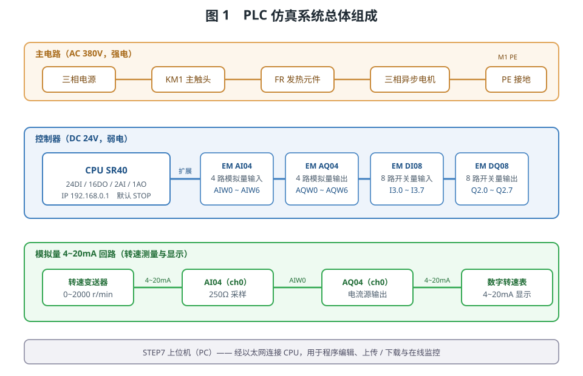
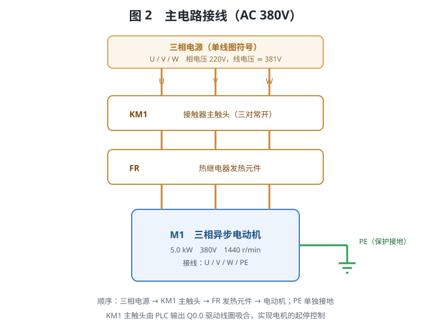
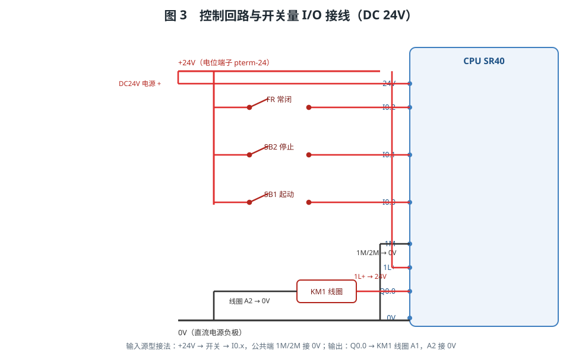
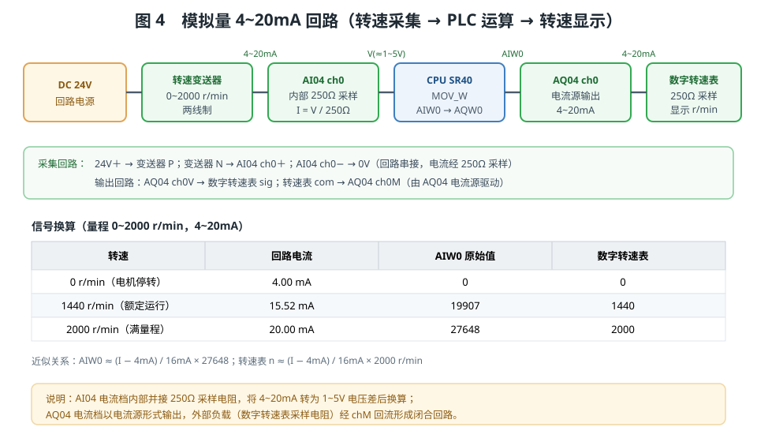
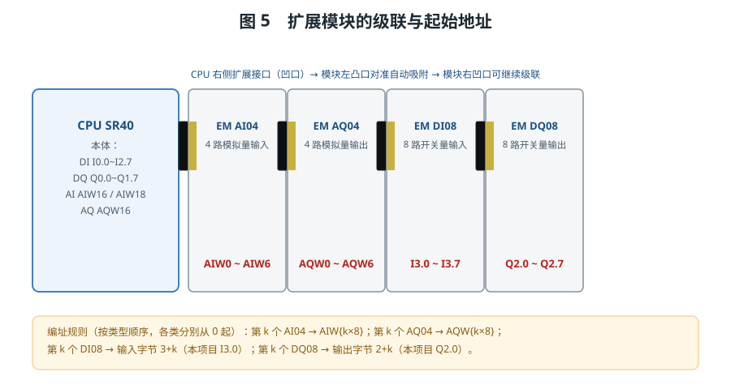
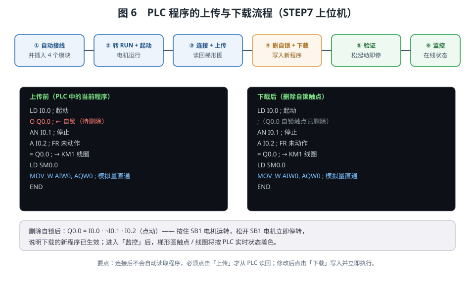

# PLC仿真系统

> 本实验以西门子 S7-200 SMART CPU SR40 为控制核心，配合 4 个扩展模块、一台三相异步电动机、一只转速变送器与一只数字转速表，完成"PLC 模块识别与接线 → 模拟量 4~20mA 测量与显示 → 程序上传与下载 → 在线监控"的完整训练。

## 一、实验目的

1. 认识 PLC 的 CPU 模块与各类扩展模块（模拟量输入/输出、开关量输入/输出），理解"右侧扩展总线、逐级级联"的硬件组态方式。
2. 掌握 PLC 控制电路的接线方法：电源、公共端、数字量输入（源型）、数字量输出、模拟量回路。
3. 理解工业标准的 **4~20mA 电流环** 信号：转速变送器输出 → 模拟量输入模块采集 → PLC 程序换算 → 模拟量输出模块 → 数字转速表显示。
4. 掌握使用 STEP7 上位机对 PLC 进行**连接、上传、下载与在线监控**的方法。

## 二、系统组成



系统分为三部分：

- **主电路（AC 380V，强电）**：三相电源 → 接触器 KM1 主触头 → 热继电器 FR 发热元件 → 三相异步电动机 M1。
- **控制回路（DC 24V，弱电）**：外部直流 24V 电源给 PLC 供电，按钮与热继电器触点接入数字量输入，PLC 输出驱动 KM1 线圈；转速变送器与数字转速表构成 4~20mA 模拟量回路。
- **编程与监控**：上位机（PC 中的 STEP7 软件）经以太网与 CPU 连接，用于程序编辑、上传/下载与在线监控。

## 三、主要元件与地址一览

| 元件 | 型号/说明 | 关键地址 |
|------|-----------|----------|
| CPU 模块 | S7-200 SMART CPU SR40（24DI/16DO/2AI/1AO，默认 STOP，IP 192.168.0.1） | DI `I0.0~I2.7`；DQ `Q0.0~Q1.7`；本体模拟量 `AIW16/AIW18`、`AQW16` |
| 模拟量输入模块 | EM AI04，4 路输入（0 号通道默认 4~20mA） | `AIW0 ~ AIW6` |
| 模拟量输出模块 | EM AQ04，4 路输出 | `AQW0 ~ AQW6` |
| 开关量输入模块 | EM DI08，8 路数字量输入 | `I3.0 ~ I3.7` |
| 开关量输出模块 | EM DQ08，8 路数字量输出（晶体管源型） | `Q2.0 ~ Q2.7` |

> 说明：扩展模块采用"按类型顺序"编址——第 k 个 AI04 从 `AIW{k×8}` 起，第 k 个 AQ04 从 `AQW{k×8}` 起，第 k 个 DI08 占用输入字节 `3+k`、第 k 个 DQ08 占用输出字节 `2+k`。

## 四、主电路接线



主电路的电流路径为：**三相电源 → KM1 主触头 → FR 发热元件 → 电动机**，电动机外壳经 `PE` 端子单独接地。KM1 的主触头由 PLC 输出 `Q0.0` 驱动线圈吸合，从而实现电机的起停控制；FR 发热元件串在主电路中，当电流过大（过载）时其常闭触点断开，把过载信号送入 PLC。

## 五、控制回路与开关量 I/O 接线



1. **电源**：外部直流 24V 电源正极 → CPU 的 `24V` 端子，负极 → `0V` 端子，取代 CPU 内部 24V 传感器电源。
2. **输入公共端**：`1M`、`2M` → `0V`（数字量输入为源型接法）。
3. **数字量输入**（三个开关量）：
   - 热继电器 FR 常闭（95-96）：`+24V` → FR 左端，FR 右端 → `I0.2`
   - 停止按钮 SB2：`+24V` → 左端，右端 → `I0.1`
   - 起动按钮 SB1：`+24V` → 左端，右端 → `I0.0`
4. **数字量输出**：输出负载电源 `1L+` → `24V`；本体 `Q0.0` → KM1 线圈左端 `A1`，线圈右端 `A2` → `0V`。

控制程序（起保停，软件自锁）：

```
LD     I0.0        ; 起动按钮
O      Q0.0        ; 自锁
AN     I0.1        ; 停止按钮
A      I0.2        ; 热继电器未动作（常闭）
=      Q0.0        ; → 接触器 KM1 线圈
END
```

按下起动按钮 SB1 后，`I0.0=1`，输出 `Q0.0` 置位并自锁，KM1 吸合、电机运行；按下停止按钮 SB2 或热继电器动作后，输出断开、电机停转。

## 六、模拟量 4~20mA 回路



本实验用 4~20mA 电流环测量并显示电机转速：

- **转速变送器**采集电机实际转速，量程 0~2000 r/min，两线制输出 4~20mA；
- **EM AI04 的 0 号通道**接收该电流，模块内部并接 250Ω 采样电阻，把电流转换为电压差再换算为原始值送入 `AIW0`；
- **PLC 程序**将 `AIW0` 直接传送到 `AQW0`：`MOV_W AIW0, AQW0`；
- **EM AQ04 的 0 号通道**以电流源形式输出 4~20mA，驱动**数字转速表**（内部 250Ω 采样）显示转速。

信号换算（量程 0~2000 r/min）：

| 转速 | 回路电流 | AIW0 原始值 | 数字转速表 |
|------|----------|-------------|-----------|
| 0 r/min（电机停转） | 4.00 mA | 0 | 0 |
| 1440 r/min（额定运行） | 15.52 mA | 19907 | 1440 |
| 2000 r/min（满量程） | 20.00 mA | 27648 | 2000 |

近似关系为：`AIW0 ≈ (I − 4mA) / 16mA × 27648`，`n ≈ (I − 4mA) / 16mA × 2000 r/min`。

接线要点：
- **采集回路**：`24V+ → 变送器 P`；`变送器 N → AI04 ch0+`；`AI04 ch0− → 0V`。
- **输出回路**：`AQ04 ch0V → 数字转速表 sig`；`转速表 com → AQ04 ch0M`。

## 七、扩展模块的级联与地址



CPU 右侧有扩展接口（凹口），扩展模块左侧为凸口：把模块凸口对准 CPU 的凹口，**自动吸附并连接**；模块右侧同样带有凹口，可继续级联下一块模块。本实验由 CPU 依次级联 AI04 → AQ04 → DI08 → DQ08 共 4 块模块。

级联完成后，各模块获得如下起始地址（详见第三节表格）：
- **DI08 起始地址：`I3.0`**（占用一个输入字节 IB3，即 I3.0~I3.7）
- **DQ08 起始地址：`Q2.0`**（占用一个输出字节 QB2，即 Q2.0~Q2.7）
- **AI04 起始地址：`AIW0`**（4 个通道依次为 AIW0/AIW2/AIW4/AIW6）
- **AQ04 起始地址：`AQW0`**（4 个通道依次为 AQW0/AQW2/AQW4/AQW6）

## 八、操作流程 1：PLC 模块识别及接线

在工具栏的"操作项目"下拉框中选择 **"1. PLC 模块识别及接线"**，可逐步完成：

1. 识别 CPU 模块（SR40）；
2. 识别模拟量输入模块（AI04）；
3. 识别模拟量输出模块（AQ04）；
4. 识别开关量输入模块（DI08）；
5. 识别开关量输出模块（DQ08）；
6. CPU 模块接线：接 24V 电压、`1M` 接 0V、`1L+` 接 24V；
7. 开关量输入接线：`+24V` 接开关左端，右端分别接 FR 常闭（`I0.2`）、停止按钮（`I0.1`）、起动按钮（`I0.0`）；
8. 开关量输出接线：本体 `Q0.0` 接 KM1 线圈左端、`0V` 接 KM1 线圈右端；
9. 模拟量输入接线：24V 电源、转速变送器与 AI04 的输入通道 0 连接；
10. 模拟量输出接线：AQ04 的 0 号通道连接到数字转速表；
11. 将 4 个扩展模块接入扩展总线；
12. 填空练习：填写四个模块的起始地址（答案见第七节）。

## 九、操作流程 2：PLC 程序的上传与下载



选择 **"2. PLC 程序的上传和下载"**，流程如下：

1. **点击自动接线**，并把 4 个扩展模块插入扩展总线；
2. **将 PLC 转入运行状态**（RUN），按下起动按钮起动电机；
3. **打开 STEP7 软件界面**，点击"连接"与 PLC 建立连接，再点击"上传"，从 PLC 读取当前运行程序（显示为梯形图）；
4. **删除梯形图中 Q0.0 自锁触点**，点击"下载"，将新程序写入 PLC；
5. **验证新程序**：按住起动按钮电机运转，松开起动按钮电机立即停转（因自锁已删除），说明新程序已生效；
6. **点击"监控"**，进入在线监控状态，梯形图的触点/线圈将按 PLC 实时状态着色。

> 注意：上位机**连接后不会自动读取程序**，必须点击"上传"才从 PLC 读回；程序修改后必须点击"下载"才写入 PLC 并立即执行。

## 十、数字量与模拟量的区别

在 PLC 系统中，信号按形态分为两类：**数字量（开关量）**与**模拟量**。

- **数字量**只有两种状态：0 或 1，对应"断开/接通""低电平/高电平"。它直接对应 PLC 的输入/输出位（如 `I0.0`、`Q0.0`），无需转换。本实验中的起动按钮、停止按钮、热继电器触点、接触器线圈都属于数字量。
- **模拟量**是连续变化的物理量，例如电压、电流、温度、转速、压力等。PLC 内部只能处理离散的数字，因此需要**模拟量输入模块**把连续的电流/电压信号经 A/D 转换变为整数（原始值 0~27648 等），由 CPU 读入；反之，需要**模拟量输出模块**把 CPU 输出的整数经 D/A 转换还原为连续的电流/电压信号去驱动执行机构或仪表。

在本实验中，数字量部分负责"电机的起停与过载保护"，模拟量部分负责"转速的采集、换算与显示"，两者相互配合，构成一套完整的测控系统。

## 十一、源型接法与输入公共端

S7-200 SMART 的数字量输入支持源型与漏型两种接法：

- **源型接法**（本实验采用）：输入公共端 `1M/2M` 接 0V，输入点经外部开关接 +24V。开关闭合时，输入点被 +24V 拉高，程序读入为 1；
- **漏型接法**：公共端接 +24V，输入点经开关接 0V，开关闭合时输入点被拉低为 0。

无论采用哪种接法，**公共端都必须正确接到对应的电位**，否则输入信号无法形成电流回路，PLC 读不到正确的状态。本实验采用源型接法，因此 `1M` 与 `2M` 均接到 0V，三个开关（FR 常闭、SB2、SB1）的左端接 +24V、右端分别接 `I0.2`、`I0.1`、`I0.0`。

## 十二、PLC 的扫描周期与信号流

PLC 采用**循环扫描**方式工作，每个扫描周期依次完成四个阶段：

1. **输入采样**：把所有输入端子（数字量与模拟量）的状态读入过程映像区 I；
2. **程序执行**：按顺序逐条执行用户程序，进行逻辑运算，运算结果写入过程映像输出 Q；
3. **输出刷新**：把过程映像 Q 的状态送到输出端子，驱动接触器线圈、指示灯等负载；
4. **系统管理与通信**：更新扫描计数、处理通信请求等。

以本实验的模拟量链路为例，一个扫描周期内的信号流为：转速变送器输出 4~20mA → AI04 采样并换算为原始值 → CPU 读入 `AIW0` → 程序执行 `MOV_W AIW0, AQW0` → 刷新输出 `AQW0` → AQ04 输出 4~20mA → 数字转速表显示转速。正因为 PLC 是一遍一遍循环扫描的，程序中的逻辑"自锁"才能在每个周期都被重新计算，从而实现持续输出。

## 十三、为什么采用 4~20mA 电流环

工业现场普遍采用 4~20mA 电流信号，而不是电压信号，主要原因是：

- **抗干扰能力强**：电流信号在长距离传输时不易受电磁干扰和线路电阻压降影响，而电压信号会因线路压降而衰减；
- **便于断线检测**：4mA 对应量程零点，若回路断线则电流为 0（或低于 3.6mA），系统可据此判断故障；若采用 0~20mA，则零点与断线无法区分；
- **两线制供电**：变送器可直接由回路电流供电，只需两根导线，接线简单、成本低。

本实验中，转速变送器为**两线制**：两根线既传输 4~20mA 信号，又为变送器提供工作电源。数字转速表内部并接 250Ω 采样电阻，把 4~20mA 转换为 1~5V 电压后测量显示。

## 十四、调试步骤与常见故障排查

**推荐调试顺序：**

1. 先接线、后上电：按前述接线图完成主电路与控制回路、模拟量回路的接线，再次核对无误后再上电；
2. 检查电源：用万用表测量 PLC 的 `24V` 与 `0V` 端子之间应为 24V；
3. 检查输入：确认 `1M/2M` 已接 0V；按下起动按钮时 `I0.0` 指示灯应点亮；
4. 检查输出：把 PLC 切换到 RUN，程序使 `Q0.0=1` 时 `Q0.0` 指示灯点亮、KM1 吸合；
5. 检查模拟量：确认 AI04 与 AQ04 的 0 号通道模式为 4~20mA，并用上位机监控 `AIW0` 的读数；
6. 联调：起动电机后观察数字转速表的显示是否与实际转速一致。

**常见故障：**

| 现象 | 可能原因 |
|------|----------|
| 输入指示灯不亮 | `1M/2M` 未接 0V；开关未接到 +24V；接线松动 |
| 按起动按钮电机不转 | PLC 处于 STOP；程序未下载；`Q0.0` 至 KM1 线圈接线错误 |
| 模拟量输入无读数（`AIW0=0`） | 通道模式误设为电压档；电流环未串接；AI04 未接入扩展总线 |
| 数字转速表显示 LLLL | 无电流或电流小于 3.6mA（断线）；AQ04 未输出 |
| 电机运转但转速表为 0 | 程序未执行 `MOV_W AIW0, AQW0`；AQ04 未挂接或地址写错 |
| 下载后仍是旧程序 | 未点击"下载"，或下载前未点击"上传"读取、编辑的是空程序 |

## 十五、注意事项

1. 强电与弱电分开走线：主电路（380V）与控制回路（24V）分别接在各自的端子上，避免混淆。
2. 数字量输入为**源型接法**，公共端 `1M/2M` 必须接 0V，否则输入无法被正确识别。
3. 模拟量模块的通道模式要与信号一致：本实验 0 号通道均设置为 **4~20mA**；若误设为电压档，读数将不正确。
4. 电流环需**串接**：变送器、AI04 采样电阻、电源构成闭合回路，任一环节断开都会导致无读数。
5. PLC 默认处于 **STOP** 状态，且电机默认停止；需手动切换到 RUN 并按下起动按钮后电机才会运行。

## 十六、上位机（STEP7）界面说明

双击画布上的上位机屏幕即可打开 STEP7 编程界面，其工具栏主要按钮及用途如下：

| 按钮 | 作用 |
|------|------|
| 查找设备 | 搜索同一网段内的 PLC。直连时发现 1 台；经交换机时可能发现多台，选中其中之一后点击"连接" |
| 连接 / 断开 | 与选中的 PLC 建立或断开在线连接。连接后**不会自动读取程序** |
| 上传 | 从 PLC 读取当前程序并反编译为梯形图（可继续编辑） |
| 程序编辑器 | 打开梯形图编辑区，可增删触点、线圈、定时器、计数器及并联支路 |
| 下载 | 把梯形图编译为语句表（STL）写入 PLC，PLC 立即按新程序执行 |
| 模块信息 | 查看 CPU 及已插入扩展模块的槽位、型号与各通道地址 |
| 监控 | 进入在线监控状态：梯形图触点 / 线圈按 PLC 实时状态着色，并显示 I/Q/M/SM/AIW/AQW/T/C/VW 监控表 |

**梯形图编辑要点：** 一个"网络（Network）"由若干串联触点加一个输出（线圈 / 定时器 / 计数器）组成；需要并联时，点击网络内的"＋并联"插入并联块，或用"＋支路"增加支路、用支路内的"＋"给该支路串联触点。点击任意元件可修改其操作数（如 `I0.0`、`Q0.0`、`AIW0`）与常开/常闭类型。

**在线监控：** 进入监控后程序为只读，触点与线圈将随 PLC 的实际运行状态实时着色（为 1 时高亮），便于观察程序的执行情况；退出监控后方可继续编辑。

## 十七、思考与练习

1. 为什么转速变送器输出 4~20mA 而不是 0~20mA？（提示：断线检测与零点区分）
2. 若把量程改为 0~3000 r/min，`AIW0` 与转速的换算关系应如何变化？
3. 删除自锁触点后，为什么"松开起动按钮电机立即停转"？若希望恢复自锁，应如何修改程序？
4. 设 AI04 位于 CPU 右侧第一个插槽、AQ04 位于第二个插槽，它们 0 号通道的地址分别是多少？若两者互换位置，地址会变化吗？为什么？
5. 结合图 3 说明：若把 `1M` 误接到 `24V`，数字量输入会出现什么现象？
