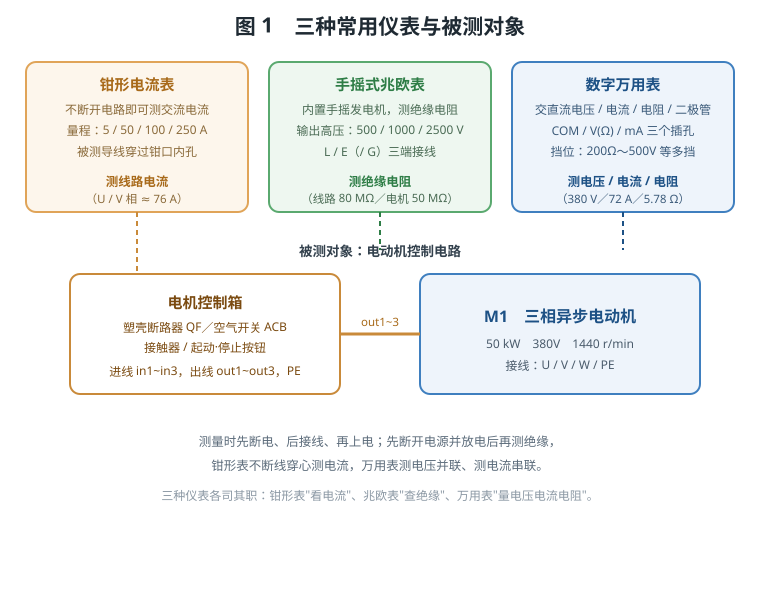
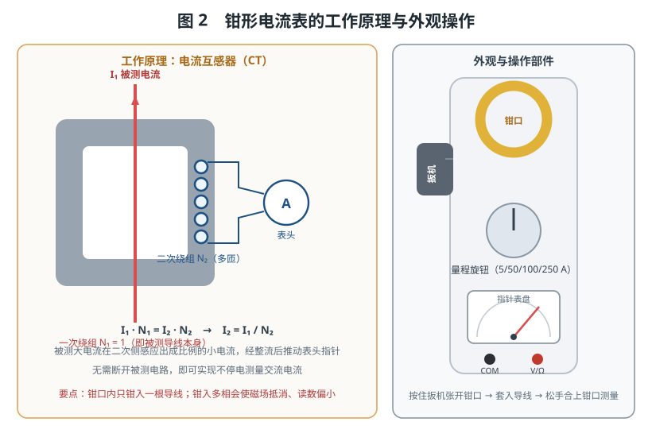
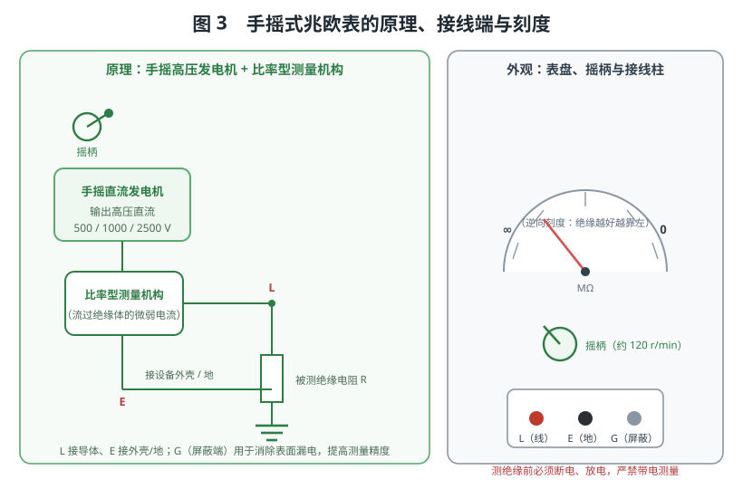
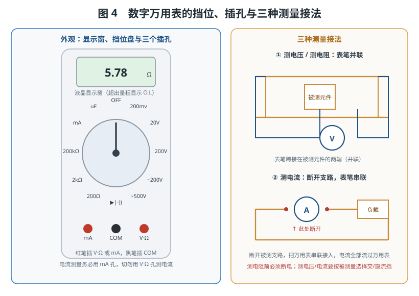
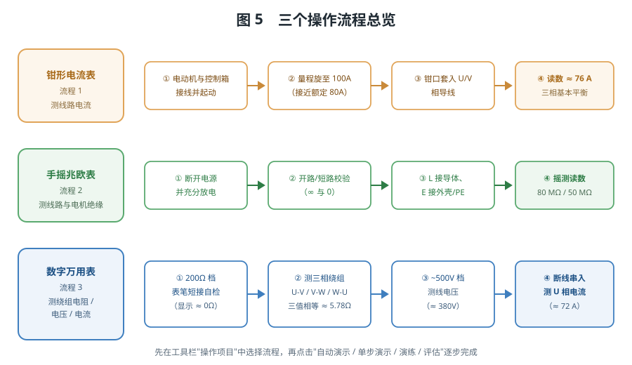

# 常见仪表使用

> 本实验以一台三相异步电动机及其控制箱为被测对象，围绕三种最常见的电工仪表——**钳形电流表**、**手摇式兆欧表**、**数字万用表**，完成"线路电流测量 → 绝缘电阻测量 → 绕组电阻与电压/电流测量"的完整训练，重点掌握三种仪表的功能特点、使用方法与安全注意事项。

## 一、实验目的

1. 认识钳形电流表、兆欧表、数字万用表的外形结构与操作部件，理解各自的适用场合。
2. 掌握钳形电流表利用电流互感器原理**不断开电路**测量交流电流的方法。
3. 掌握兆欧表"开路校验、短路校验、L/E 接线、摇测读数"的规范流程，理解绝缘电阻测量的安全要求。
4. 掌握数字万用表测电阻、测电压、测电流的挡位选择与表笔接线方式（测电压并联、测电流串联）。
5. 学会通过三相绕组电阻是否相等、绝缘电阻是否合格来判断电动机与线路的状态。

## 二、系统组成



仿真场景由两部分构成：

- **被测对象**：电机控制箱（内含塑壳断路器 QF、空气开关 ACB、接触器、起动/停止按钮，对外有进线 `in1~in3`、出线 `out1~out3` 与 `PE` 端子）与三相异步电动机 M1（50 kW、380V、1440 r/min，接线端子 U/V/W/PE）。
- **测量仪表**：钳形电流表、手摇式兆欧表、数字万用表，均可从工具栏"选择仪表"中调出。

三者的"分工"可以用一句话概括：**钳形表看电流、兆欧表查绝缘、万用表量电压电流电阻**。

## 三、钳形电流表

### 3.1 功能与特点

钳形电流表的最大特点是**测量时无需断开被测电路**，只要把导线"夹"进钳口即可读数，因此特别适合在现场对运行中的电机、配电线路做不停电电流测量。它有可开合的钳形铁芯、扳机、量程旋钮与指针表盘。

### 3.2 工作原理



钳形电流表的核心是**电流互感器（CT）**：被测导线穿过钳形铁芯，相当于互感器的一次绕组（N₁=1）；铁芯上绕有匝数很多的二次绕组（N₂）。根据互感关系

```
I₁ · N₁ = I₂ · N₂     →     I₂ = I₁ / N₂
```

一次侧的大电流在二次侧感应出成比例的小电流，经整流后推动表头指针。因此**钳口内只应钳入一根导线**：若同时钳入不同相的两根或三根导线，电流产生的磁场相互抵消，读数会显著偏小甚至为零。

### 3.3 使用方法

1. 估算被测电流大小，把**量程旋钮**旋到合适挡位（本仿真钳形表量程为 5 / 50 / 100 / 250 A）。电动机额定电流接近 80 A，应选 100 A 挡；量程过大读数不准，过小则打表。
2. **按住扳机**张开钳口，让导线从钳口内孔中穿入。
3. **松开扳机**合上钳口，仪表开始测量，待指针稳定后读数。
4. 测量结束后移开钳形表，恢复电路原状。

### 3.4 注意事项

- 钳口要**完全闭合**，接触面保持清洁，否则磁路磁阻增大、读数偏小。
- 只能钳入**一根**导线；钳入多相导线会相互抵消。
- 测量前先用大量程试测，再切换到合适的小量程，防止过载。
- 表盘设有**机械调零**螺钉，使用前应确认指针在零位。

## 四、手摇式兆欧表

### 4.1 功能与特点

兆欧表（俗称摇表、绝缘电阻表）用于测量**电气设备的绝缘电阻**，它自带手摇直流发电机，输出 500 V / 1000 V / 2500 V 的高压直流，能把绝缘体中极其微弱的漏电流检测出来（量程可达上万兆欧）。本仿真采用 2500 V 挡。

### 4.2 工作原理与刻度



手摇发电机产生高压直流，加在被测绝缘体两端，流过的微弱电流由**比率型测量机构**检测并驱动指针。其刻度是**逆向**的（与普通电压表相反）：**左端为 ∞（开路、绝缘良好），右端为 0（短路、绝缘损坏）**，读数与发电机电压无关，这是兆欧表最显著的特征。

兆欧表有 **L（LINE 线路端）、E（EARTH 接地端）、G（GUARD 屏蔽端）** 三个接线柱：测量导体对地绝缘时，L 接导体、E 接设备外壳或地；G 用于消除被测物表面漏电的影响，一般测量可不用。

### 4.3 使用方法

1. **校验仪表**：接线前先做两次自检——L、E 开路时摇动手柄，指针应指向 **∞**；L、E 短接时摇动，指针应指向 **0**。两次都正确说明仪表正常。
2. **接线**：L 接被测导体（如电机 U 相接线柱），E 接外壳 / PE 端子。
3. **摇测**：以约 **120 r/min** 的速度匀速摇动手柄，同时读取指针稳定后的数值，然后停止摇动。
4. **放电拆线**：测量结束、拆线前必须对被测设备**充分放电**，防止残余高压伤人。

### 4.4 注意事项

- **严禁带电测量**：测绝缘前必须断开电源，并验电、放电，否则既损坏仪表又危及人身安全。
- 摇动时要**匀速**，转速过低读数偏低、忽快忽慢读数不稳。
- 测完对容性设备（如电机绕组、电缆）要放电后再拆线。
- 测量时人体不要接触表笔金属部分，防止高压电击。

## 五、数字万用表

### 5.1 功能与特点

数字万用表读数直观、内阻高、量程多，是使用最广泛的通用仪表。它可直接测量**交流/直流电压、交流/直流电流、电阻、二极管、电容**等。本仿真万用表具有 OFF、200mV、20V、200V、~200V、~500V、二极管（▶|-))、200Ω、2kΩ、200kΩ、mA、uF 共十二个挡位。

### 5.2 挡位与插孔



万用表底部有三个插孔：**COM（黑表笔，公共端）、V·Ω（红表笔，电压/电阻/二极管）、mA（红表笔，电流）**。测量时先选对被测量对应的挡位，再把红表笔插到正确的插孔。

### 5.3 三种测量接法

1. **测电阻**：**必须断电**，把表笔跨接在被测元件（或两相绕组）两端，属**并联**测量。仿真中在 200Ω 挡先短接表笔自检（显示约 0Ω），再分别测量电动机 U-V、V-W、W-U 三相绕组电阻，三次读数基本相等（≈ 5.78 Ω）即可判定三相绕组正常。
2. **测电压**：选交流 ~500V 挡，表笔**并联**在被测电路两端，如测量电源进线 U、V 两相之间的线电压（≈ 380 V）。
3. **测电流**：把挡位旋到 mA 挡，**断开被测支路**，将万用表**串联**接入，使被测电流全部流过万用表；若误把表笔并联在电压两端测电流，将造成短路。

在 200Ω 挡短接表笔自检、确认表笔与仪表正常，是每一次测量前都值得养成的习惯。

### 5.4 注意事项

- 测量前先确认**挡位**与**表笔插孔**是否正确，尤其是测电流必须用 mA 孔。
- 测电阻、测二极管**必须断电**；测电流**必须串联**，绝不能并联。
- 显示 **O.L** 表示超出量程或开路（断路），应换大一级量程或检查接线。
- 测交流量要选交流（~）挡，测直流量选直流挡，不可混用。

## 六、三种仪表的对比

| 仪表 | 主要被测对象 | 接线方式 | 典型量程 | 突出特点 |
|------|----------------|-----------|-----------|-----------|
| 钳形电流表 | 运行中线路的交流电流 | 导线穿心（不断线） | 5 / 50 / 100 / 250 A | 不停电测量，只钳一根导线 |
| 手摇式兆欧表 | 设备与线路的绝缘电阻 | L 接导体、E 接外壳/地 | 输出 500/1000/2500 V，0～∞ MΩ | 自带高压源，逆向刻度，测前必须断电放电 |
| 数字万用表 | 电压、电流、电阻、二极管、电容 | 测电压/电阻并联，测电流串联 | 200mV～500V、200Ω～200kΩ、mA、uF | 一表多用，读数直观，需选对挡位与插孔 |

## 七、操作流程总览



在工具栏"操作项目"下拉框中选择对应流程，再点击"自动演示 / 单步演示 / 演练 / 评估"即可逐步完成：

- **流程 1　使用钳形电流表测量线路电流**：电机接线并起动 → 量程旋至 100 A → 钳口套入 U / V 相导线测量 → 读数约 76 A。
- **流程 2　使用手摇式兆欧表测量绝缘**：断开电源 → 开路/短路校验 → L 接被测导体、E 接外壳/PE → 摇动手柄读数（线路对地约 80 MΩ、电动机对地约 50 MΩ）。
- **流程 3　使用万用表测量电阻、交流电压/电流**：200Ω 挡表笔短接自检 → 测 U-V / V-W / W-U 三相绕组电阻 → ~500V 挡测线电压 380 V → 停机断线后串入 mA 挡测 U 相运行电流（约 72 A）。

## 八、仪表使用与安全用电总则

无论使用哪一种仪表，都应遵守下面几条通用规则：

1. **先断电、后接线，再上电**：除钳形电流表可不停电穿心测量外，其余测量都应先将被测电路断电，接好仪表后再上电（测绝缘则应在断电状态下完成）。
2. **验电与放电**：作业前先验电确认无电；测量电容性设备或做完绝缘试验后，必须对被测设备充分放电，防止残余电荷伤人。
3. **选对量程与挡位**：先估算被测量大小，选择合适量程；不确定时先用最大量程试测，再逐步换小。测电压/电流还要分清交流与直流。
4. **检查表笔与钳口**：表笔插孔要插到位，钳口要闭合良好，读数前确认表针（或显示）处于正常状态。
5. **读准、读稳**：指针式仪表要待指针稳定后读数，视线与表盘垂直以减少视差；数字表要等数值稳定后再记录。
6. **断电改接线**：需要改变测量位置或换挡时，应先停止测量、断开表笔，避免带电流插拔造成危险。
7. **读懂数据**：测三相电流应基本平衡，测三相绕组电阻应基本相等，测绝缘电阻应不低于规定值；出现明显偏差或 O.L，往往是断路、短路或接触不良的信号。

## 九、常见问题排查

| 现象 | 可能原因 |
|------|----------|
| 钳形表读数为 0 或明显偏小 | 钳口未闭合；钳入了多相导线；量程选得过大 |
| 钳形表表针打满 | 量程选得过小，应立即换大挡 |
| 兆欧表指针始终指向 0 | L、E 之间短路；或被测绝缘已击穿损坏 |
| 兆欧表指针始终指向 ∞ | L、E 未接好或开路；表笔未接触被测体 |
| 万用表测电阻读数不稳定 / O.L | 未断电；表笔接触不良；量程过小（开路） |
| 万用表测电流时读数异常或跳闸 | 表笔接错（并联测电流造成短路）；未断开支路 |
| 万用表测电压为 0 | 挡位选错（直流/交流）；表笔未接在被测两点 |

## 十、思考与练习

1. 为什么钳形电流表"不断开电路"就能测电流？它依据的是什么原理？
2. 用兆欧表测量三相电动机对地绝缘，为什么测前必须断开电源并放电？
3. 为什么兆欧表的刻度是"左 ∞ 右 0"的逆向刻度？
4. 万用表测电压与测电流的表笔接法有何不同？若把测电流的表笔并联在电源两端会怎样？
5. 测量电动机三相绕组电阻（U-V、V-W、W-U）三次读数基本相等，能说明什么问题？若某两相间读数为 O.L，最可能是哪里出了问题？
