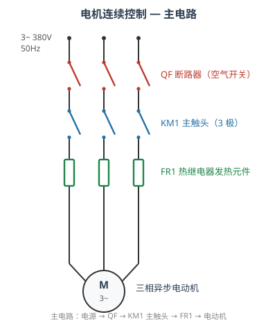
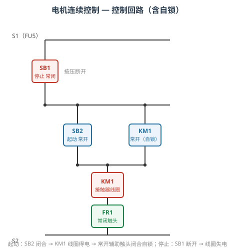
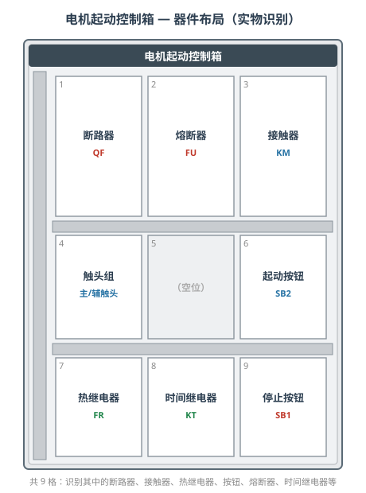

# 电气识图和元器件识别

本实训以**三相异步电动机连续控制（起—保—停）线路**为载体，训练学生读懂电气控制图、识别常用低压电器、理解接触器自锁控制逻辑，并能在电机起动控制箱的实物中对应识别器件。

## 一、实训目标

1. 读懂电机连续控制线路的主电路与控制回路；
2. 识别接触器、断路器、熔断器、热继电器、按钮、控制变压器等低压电器；
3. 解释接触器自锁控制的"起动—保持—停止"逻辑；
4. 在电机控制箱实物图片中识别上述器件；
5. 会用万用表交流电压档测量接触器线圈电压。

## 二、电路组成

### 2.1 主电路

主电路通过电动机的大电流，回路为：

**三相电源（380V/50Hz）→ 断路器 QF → 接触器主触头 KM1 → 热继电器发热元件 FR1 → 三相异步电动机 M**

- **QF 断路器**：作主电路的总开关与短路保护；
- **KM1 主触头**：由接触器线圈控制，实现电动机的通、断；
- **FR1 发热元件**：热继电器的发热元件串入主电路，电动机过载时推动其常闭触头动作，实现过载保护。

### 2.2 控制回路

控制回路通过小电流控制接触器线圈，回路为：

**控制变压器 TC（380/220V）→ FU4 → 停止按钮 SB1（常闭）→〔起动按钮 SB2（常开）∥ KM1 常开辅助触头〕→ KM1 线圈 → FR1 常闭触头 → FU5**

**自锁原理**：按下 SB2，KM1 线圈得电，接触器吸合，主触头闭合使电动机运转；同时 KM1 常开辅助触头闭合，与 SB2 并联。松开 SB2 后，电流经已闭合的常开辅助触头继续供给线圈，实现"松开按钮仍保持运行"。按下 SB1，线圈回路被切断，接触器释放，主触头与自锁触头同时断开，电动机停转。这就是**以弱电控制强电、小控大**的典型控制方式。

## 三、元器件识别要点

| 器件 | 识别特征 | 作用 |
|------|----------|------|
| 接触器线圈 KM1 | 长方形线圈框，两端 A1/A2 | 通电产生电磁力，带动触头动作 |
| 接触器主触头 | 三极、主电路中 | 接通/断开电动机大电流 |
| 常开辅助触头 | 未通电时断开，与 SB2 并联 | 实现自锁 |
| 常闭辅助触头 | 未通电时闭合 | 联锁、互锁 |
| 断路器 QF | 带手柄的开关，三极 | 总开关与短路保护 |
| 熔断器 FU | 细长熔管 | 短路保护 |
| 热继电器发热元件 FR1 | 串于主电路的三根发热元件 | 反映电动机电流，过载保护 |
| 热继电器常闭触头 | 串于控制回路 | 过载时切断线圈回路 |
| 时间继电器 KT | 线圈 + 延时触头 | 延时控制（本线路预留） |
| 起动按钮 SB2 | 常开按钮（绿色） | 发出起动命令 |
| 停止按钮 SB1 | 常闭按钮（红色） | 发出停止命令 |
| 控制变压器 TC | 380V/220V 降压 | 提供控制回路安全电压 |

## 四、三个操作流程

### 项目 1：读懂电气控制图

先由工具栏**自动接线**完成整条线路，随后逐步识别：接触器线圈、主触头、常开辅助触头、断路器、熔断器、热继电器发热元件及其常闭触头、时间继电器线圈、起动按钮、停止按钮、控制变压器。

### 项目 2：解释控制逻辑关系

接线并合上 QF 后：

1. 按**起动按钮 SB2** → KM1 线圈得电 → 主触头闭合（电动机运转）→ 常开辅助触头闭合自锁；
2. 按**停止按钮 SB1** → KM1 线圈失电 → 主触头断开（电动机停转）→ 自锁触头随之断开；
3. 识别常开、常闭辅助触头，完成关于主电路与控制电路逻辑关系的测试题。

### 项目 3：电机控制箱实物识别

在电机起动控制箱实物图中，依次识别断路器、接触器、热继电器、起动按钮、停止按钮、熔断器与时间继电器：

最后**选数字万用表 → 打至 ~500V 交流电压档 → 红表笔接线圈 A2、黑表笔接 A1**，测得线圈电压约为 **220V**，说明线圈已得电；若读数为 0V，则线圈回路存在断路。

## 五、工具栏与演示模式

- **自动接线**：一键完成全部导线连接；
- **起动系统**：接线并合闸；
- **故障设置**：选择故障场景（如线圈端子接触不良）；
- **选择仪表**：调出数字万用表等仪表；
- **自动演示 / 单步演示**：逐步演示操作过程；**演练 / 评估**：由学生自行操作并检测结果。

## 六、考核要点

1. 能指认出图中各低压电器的图形符号；
2. 能说出接触器自锁的实现方式与作用；
3. 能解释按停止按钮后电机停转的原因；
4. 能在实物图中正确识别对应器件；
5. 能用万用表正确测量接触器线圈电压。
