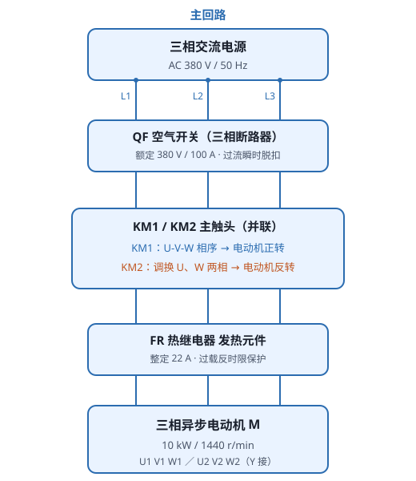
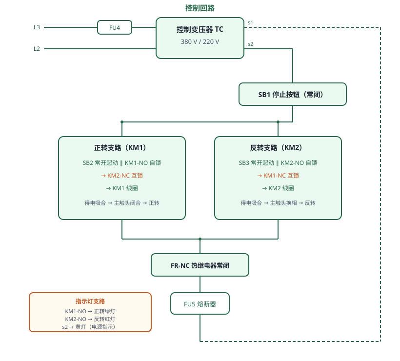

# 电气控制箱故障排除

## 一、实验目的

1. 掌握三相异步电动机**正反转控制电路**的组成与工作原理；
2. 理解**自锁**与**互锁（电气联锁）**的作用；
3. 掌握短路、缺相、断路三类典型故障的**查找方法**（带电测压法、断电测阻法）；
4. 熟悉数字万用表电压档、电阻档的使用与读数判读；
5. 能在电气控制箱上按规范流程完成故障定位与排除。

## 二、电路组成

**主回路**（图 1）：三相交流电源 U/V/W（380V、50Hz）→ 空气开关 **QF** → 并联的 **KM1（正转）/ KM2（反转）** 主触头 → 热继电器 **FR** 发热元件 → 三相异步电动机 M（U1/V1/W1、U2/V2/W2）。KM2 将 U、W 两相调换，从而改变旋转磁场方向，实现电动机反转。

**控制回路**（图 2）：控制变压器 **TC**（380V/220V）一次侧经熔断器 FU4 取自 L3、L2；副边 **s2** → 停止按钮 **SB1** → 正转支路（SB2 常开起动 ∥ KM1-NO 自锁 → KM2-NC 互锁 → KM1 线圈）/ 反转支路（SB3 常开起动 ∥ KM2-NO 自锁 → KM1-NC 互锁 → KM2 线圈）→ 热继电器常闭 **FR-NC** → 熔断器 **FU5** → 回到副边 **s1**。

**指示支路**：KM1 常开触头 + 正转绿灯、KM2 常开触头 + 反转红灯、电源黄灯（白灯芯，点亮呈亮黄），并联于 KM2 线圈下方，供电取自副边 s2、公共回零接 KM2 线圈 a2。

## 三、工作原理

- **正转**：按 SB2 → KM1 线圈得电 → KM1 主触头闭合、常开辅助触头自锁 → 电动机正转；
- **停止**：按 SB1 → KM1 线圈失电 → 自锁解除 → 电动机停止；
- **反转**：按 SB3 → KM2 线圈得电并自锁 → 主触头交换两相 → 电动机反转；
- **互锁**：正转时 KM1 常闭触头断开反转支路，即使按住 SB3，KM2 也不吸合，避免两接触器同时吸合造成**电源相间短路**。

## 四、故障设置与查找方法

在工具栏「故障设置」中选择以下故障，配合「自动演示 / 单步演示 / 演练 / 评估」四种模式教学。

| 故障 | 现象 | 查找方法 |
|------|------|----------|
| 主回路短路（U1、V1 相间短路） | 起动时空气开关 QF 立即脱扣 | 断电后万用表 **R×200** 档测各相间电阻，接近 **0Ω** 即该两相短路 |
| 主回路缺相（KM1 一极接触不良） | 电动机**有声音但不起动** | 带电 **AC 500V** 测主触头入口相间电压判断电源；断电 **R×200** 测各相触头入口—出口电阻，读数 **O.L** 即该相接触不良 |
| 控制回路开路（1、2 号开路点） | 电源指示灯不亮；按 SB2 无反应 | 断电 **R×200** 沿回路测各元件通断，**O.L** 即断点（KM1 线圈 a1、KM1 常开触头 com） |
| 控制回路开路（3 号开路点，FU5 熔断） | 电源指示灯不亮；按 SB2 无反应 | 带电 **AC 500V** 测变压器出口电压确认电源正常；断电 **R×200** 测 FU5、FR 触点，**O.L** 即为断点 |
| 控制回路短路（KM1 线圈短路） | 起动时控制回路熔断器 FU5 熔断 | 测线圈电阻，接近 **0Ω** 即短路 |

### 查找要点

1. **带电测压法**：电路通电，万用表置于交流电压档，沿回路测各元件两端电压——正常导通处电压≈0，**断点两端电压≈电源电压**，可快速定位。
2. **断电测阻法**：断开电源并确认放电后，万用表置于电阻档（R×200）测元件通断——正常应导通（≈0Ω），**显示 O.L（超量程）即断路/接触不良**。
3. **二分法**：在通路中点测量，快速缩小故障范围。

## 五、操作流程（示例）

**流程 2：主回路短路故障排除（断电测阻法）**

1. 自动接线，合上电源开关 QF；
2. 打开故障设置界面，勾选「主回路短路」并应用；
3. 按 SB2 起动电机——QF 立即脱扣，判定主回路短路；
4. KM1 主触头「模拟闭合」，便于断电测阻；
5. 数字万用表 **R×200** 档测主触头进线端各相间电阻，测出接近 0Ω 的两相；
6. 修复短路故障、解除模拟闭合，合上 QF，重新起动电机应正常运行。

**流程 3：主回路缺相故障排除**

1. 自动接线，合上电源开关 QF；
2. 触发主回路缺相故障；
3. 按 SB2 起动——电机有声音但不起动，判定为缺相；
4. 万用表 **AC 500V** 测 KM1 主触头三个入口相间电压，判断电源是否缺相；测完撤销接线；
5. 断开 QF，KM1「模拟闭合」；
6. **R×200** 档测每相触头入口—出口电阻，读数为 **O.L** 表示该相接触不良；测完撤销接线、收起万用表；
7. KM1 模拟闭合复位，修复缺相故障；
8. 合上 QF，起动电机应正常运行。

**流程 4：控制回路断路故障排除**

1. 自动接线，合上电源开关；
2. 触发控制回路 3 号开路故障（FU5 开路）；
3. 观察现象：电源指示灯不亮，按 SB2 无任何反应；
4. **AC 500V** 档测控制变压器出口电源，确认电源正常；撤销接线；
5. 断开 QF，**R×200** 档测熔断器 FU5、FR 辅助触点电阻，O.L 即为断点；撤销接线、收起万用表；
6. 修复控制回路开路故障；
7. 合上 QF，起动电机。

## 六、注意事项

1. 查找带电回路时务必注意**安全用电**，测压法应在教师指导下进行；
2. 断电测阻前必须**断开电源并放电**，防止带电测量损坏仪表；
3. 万用表档位选择要合适：测 380V/220V 交流用 **AC 500V** 档，测小电阻用 **R×200** 档；
4. 读数判读：电阻档显示 **O.L** 表示超出量程（开路）；交流电压档读数应接近额定值（相间约 380V，控制回路约 220V）。
