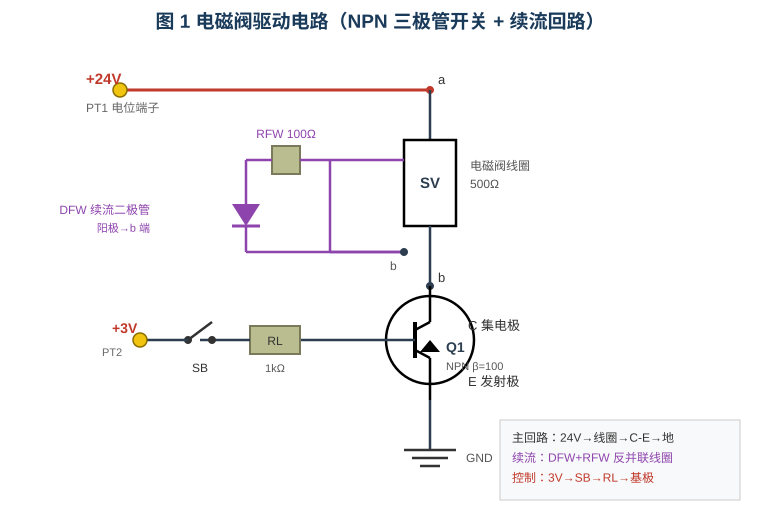
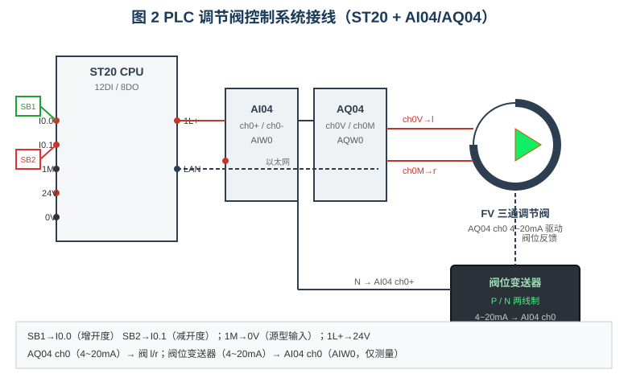
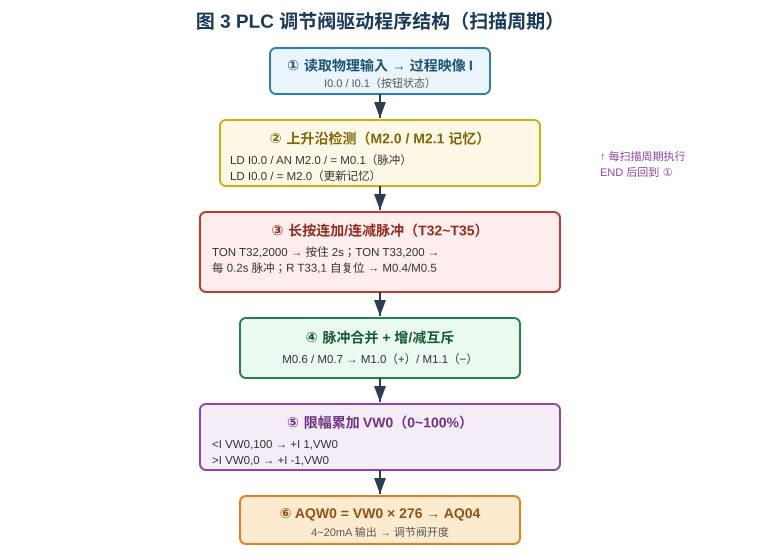
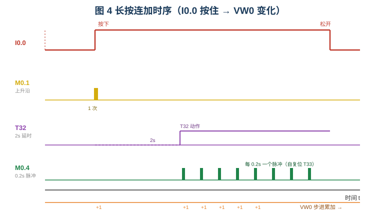
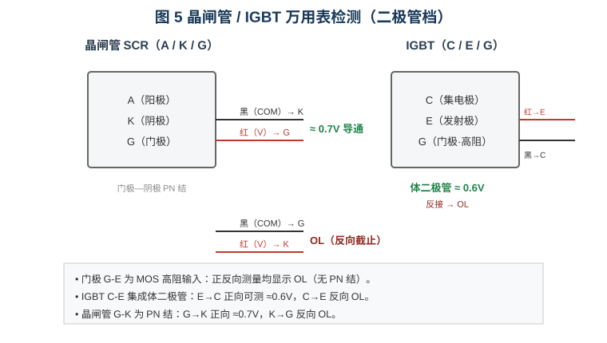

# 电磁阀电路、IGBT、PLC电路的测试

本实验平台包含三个相互独立的测试任务：**电磁阀驱动电路**、**晶闸管/IGBT 器件检测**与 **PLC 调节阀控制电路**。本文重点分析电磁阀驱动电路的工作原理，并逐行解析 PLC 调节阀驱动程序；晶闸管与 IGBT 的测试方法作简要说明。

---

## 一、电磁阀驱动电路的工作原理（重点）

### 1.1 电路组成



电路由三条支路构成：

| 支路 | 元件 | 作用 |
|------|------|------|
| 主回路 | +24V（PT1）→ 电磁阀线圈 SV（500Ω）→ 三极管 Q1 的 C-E → 地 | 提供线圈工作电流 |
| 控制支路 | +3V（PT2）→ 开关 SB → 限流电阻 RL（1kΩ）→ 基极 | 控制三极管通断 |
| 续流回路 | 二极管 DFW + 电阻 RFW（100Ω），反并联在线圈两端 | 吸收线圈断电反电动势 |

### 1.2 三极管作为电子开关

三极管 Q1 为 NPN 管，β=100、Vbe(on)≈0.7V、Vce(sat)≈0.2V。它工作在**截止**与**饱和**两个极端状态，充当无触点开关：

**① 截止状态（SB 断开）**

基极无电流，Ib=0，集电极回路相当于开路：

$$V_{ce} \approx V_{CC} = 24\text{ V}$$

此时线圈两端几乎无电压，电磁阀不动作。用万用表直流 200V 档测 C-E 两点，读数约为 24V，这是判别"管子截止"的直观依据。

**② 饱和状态（SB 闭合）**

基极经 RL 获得电流：

$$I_b = \frac{3 - 0.7}{1000} \approx 2.3\text{ mA}$$

集电极回路电流为：

$$I_c \approx \frac{24 - V_{ce(sat)}}{500} = \frac{24 - 0.2}{500} \approx 47.6\text{ mA}$$

临界饱和所需的最小基极电流 $I_{b(min)} = I_c/\beta = 47.6/100 \approx 0.48\text{ mA}$。由于实际 $I_b=2.3\text{ mA} \gg 0.48\text{ mA}$，管子进入**深度饱和**，Vce 降至约 0.1~0.2V，集电极回路被"接通"。

### 1.3 电磁阀的电流迟滞吸合

电磁阀采用**电流迟滞**判据：

- 线圈电流 **> 30 mA** → 吸合（`isOpen = true`），阀体三角填充变蓝、线圈外框变红；
- 线圈电流 **< 20 mA** → 释放。

饱和时线圈电流约 47.6 mA > 30 mA，电磁阀可靠吸合；30/20 mA 之间的迟滞带避免了临界电流下的抖动。

### 1.4 续流回路的作用（关键）

电磁阀线圈是**感性负载**。当 SB 断开、三极管由导通瞬间截止时，线圈电流被强行切断，电感产生极高的**反向电动势**（$e = -L\frac{di}{dt}$），其极性为"下正上负"，若不处理会击穿三极管。

续流回路由二极管 DFW（阳极接线圈 b 端）+ 电阻 RFW 组成，**反并联**在线圈两端：

- **导通时**：b 端电位低于 a 端，DFW 反偏截止，续流支路不导通，不影响正常工作；
- **关断时**：线圈反电动势使 b 端电位高于 a 端，DFW 正偏导通，线圈储存的磁场能量经 DFW + RFW 形成回路泄放（电流按 $L/R$ 时间常数衰减），把高电压钳位在约 1V，从而**保护三极管不被击穿**。

串入 RFW（100Ω）可限制续流电流、加快能量耗散，避免续流电流过大而延长电磁阀的释放时间。

---

## 二、PLC 调节阀驱动代码逐行分析（重点）

### 2.1 控制任务与系统接线

系统要求：I0.0 每按一次阀位 **+1%**，I0.1 每按一次 **−1%**；按住超过 2s 后，每 0.2s 自动连加/连减 1%；阀位限幅 0~100%，并以 4~20mA 输出到 AQ04 驱动调节阀。



程序整体结构（每个扫描周期顺序执行）：



### 2.2 逐行分析

> 阀位（0~100 的整数）存放于 **VW0**；输出字 **AQW0** 经 AQ04 ch0 转成 4~20mA。

#### （1）首次扫描初始化

```stl
LD     SM0.1          // 首次扫描位为 1
MOV_W  0, VW0         // 阀位初值 = 0
```

`SM0.1` 仅在 CPU 首次扫描时为 1，故该段只在启动瞬间执行一次，把阀位清零；之后每个扫描周期都不再执行。

#### （2）I0.0 上升沿检测

```stl
LD     I0.0           // 读入 I0.0
AN     M2.0           // 与"上一扫描的 I0.0 状态"取反相与
=      M0.1           // M0.1 = 上升沿脉冲（仅 1 个扫描周期）
LD     I0.0
=      M2.0           // 更新记忆：保存本扫描 I0.0 状态
```

第 1~3 条：**只有当本扫描 I0.0=1 且上一扫描 M2.0=0 时**，M0.1 才为 1，即捕捉到"松开→按下"的**上升沿**。第 4~5 条把当前 I0.0 存入 M2.0，供下一扫描比较。

> **注意**：本解释器的 `EU` 指令使用全局共享状态，多路边沿检测会相互干扰；因此程序统一改用"记忆位 + 逻辑相与"的方式实现边沿检测，每路各用一位（M2.0~M2.3），互不影响。

#### （3）I0.1 上升沿检测

```stl
LD     I0.1
AN     M2.1
=      M0.3           // M0.3 = I0.1 上升沿脉冲
LD     I0.1
=      M2.1           // 更新记忆
```

与（2）完全对称，产生减量按钮的上升沿脉冲 M0.3。

#### （4）I0.0 长按连加脉冲

```stl
LD     I0.0
TON    T32, 2000      // I0.0 保持 2s → T32 动作（1ms 时基，2000×1ms=2s）
LD     I0.0
A      T32            // I0.0 仍按住 且 T32 已到
TON    T33, 200       // 计时 200×1ms=0.2s
LD     T33
=      M0.4           // M0.4 = 连加脉冲（每 0.2s 置位一次）
LD     T33
R      T33, 1         // 立即复位 T33 → 下一扫描重新计时，形成 0.2s 循环
```

- `TON T32, 2000`：只要 I0.0 一直为 1，T32 累加到 2000 个 1ms 后动作，代表"按住满 2s"。
- `TON T33, 200`：在 T32 动作后启动，计时 0.2s。
- 关键在 `R T33, 1`：T33 一到位就**立即复位自己**，于是下一扫描重新从 0 开始计时。这样 T33 每隔 0.2s 产生一次"0→1"的跳变，M0.4 便得到**周期性 0.2s 脉冲**，实现按住的连续递增。

#### （5）I0.1 长按连减脉冲

```stl
LD     I0.1
TON    T34, 2000
LD     I0.1
A      T34
TON    T35, 200
LD     T35
=      M0.5
LD     T35
R      T35, 1
```

与（4）对称，用 T34/T35 产生 I0.1 的 0.2s 连减脉冲 M0.5。

长按时序如下：



#### （6）（7）脉冲合并

```stl
LD     M0.1
O      M0.4
=      M0.6           // M0.6 = 增（上升沿 或 长按脉冲）

LD     M0.3
O      M0.5
=      M0.7           // M0.7 = 减（上升沿 或 长按脉冲）
```

把"单次点按的上升沿"与"长按的周期脉冲"合并为统一的增/减信号，后续逻辑只需处理 M0.6 / M0.7。

#### （8）增/减互斥

```stl
LD     M0.6
AN     M0.7
=      M1.0           // 有效增量（增 且 非减）
LD     M0.7
AN     M0.6
=      M1.1           // 有效减量（减 且 非增）
```

若两键同时按下（M0.6 与 M0.7 同为 1），则 M1.0 与 M1.1 都为 0，**互锁**、阀位不变，避免增减速冲突。若要"增优先"，可把 M1.1 的条件改为 `LD M0.7 / AN M0.6`。

#### （9）（10）限幅累加

```stl
LD     M1.0
<I     VW0, 100       // 仅当 VW0 < 100
+I     1, VW0         // 才 +1（到 100 后不再增）

LD     M1.1
>I     VW0, 0         // 仅当 VW0 > 0
+I     -1, VW0        // 才 -1（到 0 后不再减）
```

`<I` / `>I` 为**带符号整数比较**。这两处限幅至关重要：若无判断，阀位到 0 后继续减会变成 −1，AQW0 出现负值，按无符号解释将变成一个巨大的数，导致 AQ04 输出满量程电流、阀门突然跳到 100%。加上 `<I VW0,100` 与 `>I VW0,0` 后，阀位被严格限制在 0~100%。

#### （11）模拟量输出

```stl
LD     SM0.0
MOV_W  VW0, MW10      // MW10 = 阀位%
*I     276, MW10      // MW10 = 阀位 × 276
MOV_W  MW10, AQW0     // 写入 AQ04 ch0
```

S7-200 SMART 模拟量满量程为 27648，对应 0~100% 时系数为 27648/100 = **276**（近似）。例如阀位 50% → AQW0 = 13800 → AQ04 ch0 输出约 **12 mA**（4 + 16×50% = 12mA），调节阀开度即为 50%。`SM0.0` 恒为 1，使该段每个扫描周期都执行。

`END` 结束本次扫描，CPU 随即回到第一步刷新输入，进入下一个扫描周期。

---

## 三、晶闸管与 IGBT 的测试方法（简析）

万用表置于**二极管档**，利用器件内部 PN 结的"单向导电性"判别引脚与好坏。



**晶闸管（SCR，A/K/G）**

- 门极—阴极 G-K 是一个 PN 结。红表笔（+）接 G、黑表笔接 K，正向导通显示约 **0.7V**；反接则显示 **OL**（溢出）。
- A-K 之间在未触发时为高阻（正反向均 OL），说明器件未损坏。

**IGBT（C/E/G）**

- 门极 G 为 MOS 结构、高阻输入：G-E 正反向测量**均为 OL**（测不到 PN 结压降）。
- 集电极—发射极 C-E 集成**体二极管**：红表笔接 E、黑表笔接 C 时可测到约 **0.6V** 的正向压降；红黑反接则为 OL。这是判断 IGBT 好坏的关键特征。
- IGBT 为电压控制器件、无自锁特性，门极电压撤除后即关断。

> 仿真中若把器件故障为"击穿/开路"，上述阻值特征随之改变（击穿→阻值极小，开路→恒为 OL），可用于故障判别训练。

---

## 四、小结

- **电磁阀驱动电路**：NPN 三极管作为开关，饱和时线圈电流约 47.6mA 使电磁阀吸合；反并联的"二极管+电阻"续流回路在关断瞬间吸收线圈反电动势，保护三极管。
- **PLC 调节阀程序**：以 M 位实现上升沿检测、以自复位定时器产生 0.2s 连加脉冲、经合并与互斥后限幅累加 VW0，最后按 ×276 换算输出到 AQW0 驱动调节阀；限幅判断是保证输出不越界的关键。
- **器件检测**：用二极管档利用 PN 结单向导电性，可快速判别晶闸管门极结与 IGBT 体二极管的正常与否。
