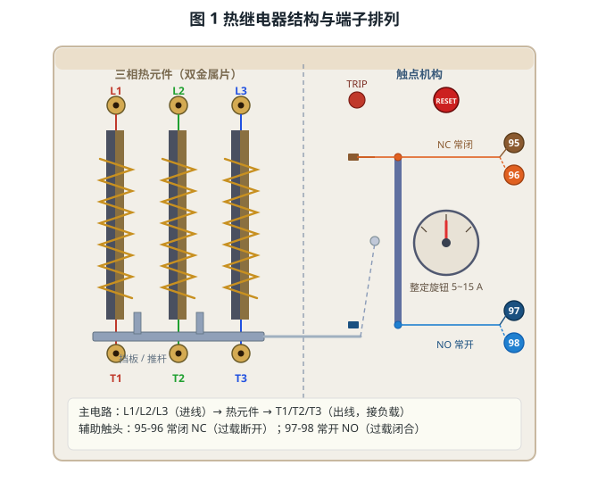
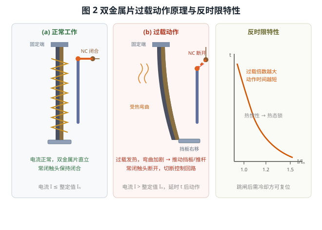
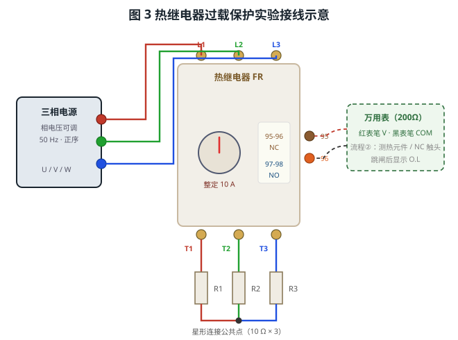
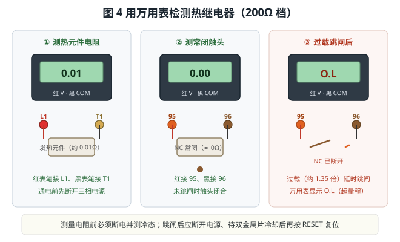

# 热继电器的测试

> 适用对象：**双金属片式热继电器**（三相热元件，位号 FR，整定范围 5~15 A）
> 本实验围绕"热继电器能不能可靠动作、动作值准不准、触头通断是否正常"展开，配套本工程两个自动演示流程，本文操作均可在软件中逐一演示：
> ① 热继电器过载保护操作　② 用万用表测试热继电器

**实验目的**

1. 认识热继电器的组成部件与端子排列；
2. 理解双金属片受热弯曲实现过载保护的原理与**反时限特性**；
3. 掌握热继电器**过载动作值（整定电流）**的测试方法与操作步骤；
4. 学会用万用表检测**热元件**与**常闭/常开触头**的好坏；
5. 掌握跳闸后的复位（RESET）操作与注意事项。

---

## 一、概述

热继电器是一种利用**电流热效应**实现过载保护的自动电器。热元件串接在电动机主电路中，当过载电流通过时，双金属片受热弯曲，经传动机构推动触头动作，**断开控制回路**使接触器释放，从而切断电动机电源。它主要用于电动机的**长期过载（过电流）保护**，具有**反时限特性**——过载倍数越大，动作时间越短。

> 注意：热继电器动作有热惯性，**不能用于短路保护**（短路电流由熔断器或断路器承担），也不能准确反映缺相、欠压等故障。

---

## 二、结构与端子

面板左侧为**三相热元件**（双金属片 + 加热线圈），右侧为**触点机构**（挡板、推杆、触点臂、NC/NO 触头）、**整定旋钮**、**RESET 复位按钮**、**TEST 测试按钮**与 **TRIP 指示灯**，见图 1。

| 端子 | 用途 | 端子 | 用途 |
|------|------|------|------|
| **L1、L2、L3** | 进线（接电源或接触器下端） | **T1、T2、T3** | 出线（接电动机/负载） |
| **95-96（NC）** | 常闭辅助触头，正常时闭合 | **97-98（NO）** | 常开辅助触头，跳脱时闭合 |

> 测试要点：**主电路走 L1/L2/L3 → T1/T2/T3**，热元件串在其中；**95-96 常闭触头**串入控制回路，过载时断开以切断接触器线圈，实现保护。用万用表检测时，就是分别测这两组端子的通断与电阻。

---

## 三、过载保护动作测试

### 3.1 动作原理

三相电流通过加热线圈使**双金属片**受热。双金属片由膨胀系数不同的两层金属压合而成，受热后向膨胀系数小的一侧弯曲；过载时弯曲量增大，推动**挡板与推杆**，经**触点臂**使常闭触头（NC）断开、常开触头（NO）闭合，如图 2。

热继电器呈**反时限**特性（过载倍数 = 实际电流 ÷ 整定电流）：

| 过载倍数 | 动作趋势 |
|---------|---------|
| ≤ 1.0 | 不动作（正常），双金属片仅微量弯曲 |
| 1.0 ~ 1.2 | 缓慢升温，长延时后动作 |
| 1.2 ~ 1.5 | 较快升温并动作 |
| ≥ 1.5 | 迅速动作跳闸 |

**热态锁**：跳闸后双金属片仍处于弯曲（高温）状态，此时按 RESET 不会立即复位，需待其冷却后才能复位——这正体现了热继电器的热惯性。

### 3.2 接线

以过载保护测试为例（见图 3）：三相电源 U/V/W 接热继电器进线 L1/L2/L3；出线 T1/T2/T3 分别接三个负载电阻 R1/R2/R3，三个电阻的另一端**星形连接**（公共点）。

| 序号 | 接线内容 | 线数 |
|------|---------|------|
| 1 | 三相电源 **U/V/W → L1/L2/L3** | 3 |
| 2 | 出线 **T1/T2/T3 → R1/R2/R3**（星形连接） | 5 |

本实验负载电阻 10 Ω/相，整定电流标称 10 A。接线前电源应处于断开状态。

### 3.3 测试步骤（流程①）

1. **接线**：按上表完成 8 根主电路接线，三相电源保持断开。
2. **低电压通电，验证正常状态**：闭合三相电源，相电压 **50 V**，相电流约 **5 A**（小于整定值 10 A）。热继电器保持 **normal**，TRIP 灯不亮，NC 触头闭合。
3. **升压过载，验证动作**：把相电压调到 **135 V**（相电流约 13.5 A，过载系数约 **1.35 倍**）。观察双金属片逐渐弯曲，**延时后跳闸**：TRIP 灯亮、NC 断开、NO 闭合。
4. **断电复位**：断开三相电源，待双金属片冷却后按 **RESET**，NC 恢复闭合，继电器回到 normal。
5. **改变整定值再测**：把整定电流调为 **8 A**、相电压 **100 V**（相电流约 10 A，过载约 **1.25 倍**），再次通电，热继电器经更长延时后再次跳闸——体会动作时间随过载倍数变化。

---

## 四、用万用表检测热继电器（流程②）

断电状态下，用万用表 **200Ω 电阻档**检测热继电器的热元件与触头，判断其是否完好，见图 4。

| 步骤 | 表笔接法 | 正常读数 | 说明 |
|------|---------|---------|------|
| 1 | 红→**L1**，黑→**T1** | 约 **0.01Ω** | 检测该相发热元件是否通路、是否断路 |
| 2 | 红→**95**，黑→**96** | 约 **0Ω** | 未跳闸时 NC 常闭触头应闭合 |
| 3 | 接通主电路并升压至 135 V（约 1.35 倍）使热继电器跳闸，仍测 **95-96** | 显示 **O.L** | NC 已断开，读数超量程，说明保护动作正常 |

> 若测 L1-T1 为 O.L，说明热元件断路或表笔接错端子；若跳闸前测 95-96 即为 O.L，说明常闭触头损坏。测试完成后应断电、冷却、复位。

---

## 五、整定电流的设置

整定电流即热继电器动作的门槛电流，有**面板整定旋钮**与**参数设置界面**两种调整方式。旋钮刻度量程为 0.5~1.5 倍刻度中心值（本机中心 10 A，即 5~15 A）。

> 改变整定值时，**刻度盘固定不动、指针随之转动**到对应刻度。例如由 10 A 改为 8 A，指针转到 8 A 位置。自动演示中，凡涉及参数修改（相电压、整定电流等），都会**调出参数设置界面**，用箭头指向输入框、填入新值，再指向并点击「保存」，完整展示参数调整过程。

---

## 六、常见问题与处理

| 现象 | 可能原因 | 处理方法 |
|------|----------|----------|
| 通电后不动作 | 电流小于整定值；热元件未串入主电路 | 提高电压或负载使电流超过整定值；检查 L/T 接线 |
| 过载后立即跳闸 | 整定值过小；过载倍数过大 | 调大整定电流；减小负载 |
| 按 RESET 不复位 | 双金属片未冷却（热态锁） | 断开电源等待冷却后再复位 |
| 万用表测热元件为 O.L | 表笔接错端子；热元件断路 | 红表笔接 L1、黑表笔接 T1 |
| 跳闸后测 95-96 为 O.L | 过载后 NC 已断开（属正常） | 复位后重新测量 |

---

## 七、思考与练习

1. 热继电器为什么不能代替熔断器作短路保护？
2. 整定电流由 10 A 调到 8 A 后，同一负载（相电流 10 A）的过载倍数由多少变为多少？动作更快还是更慢？
3. 为什么跳闸后不能立即复位？这一特性在实际控制中有什么意义？
4. 用万用表测量跳闸前后 NC（95-96）的电阻，记录数据并说明变化原因。
5. 画出"三相电源—热继电器—电动机"的主电路与控制回路，说明热继电器常闭触头的作用。

---

*本文档依据本工程仿真平台的"热继电器过载保护操作"与"用万用表测试热继电器"两个流程编写，与自动演示一一对应，可作为热继电器结构认知、动作值测试与检测的实训参考资料。*
