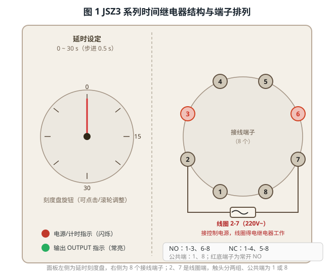
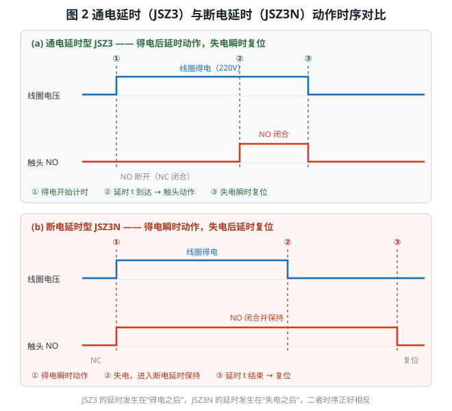
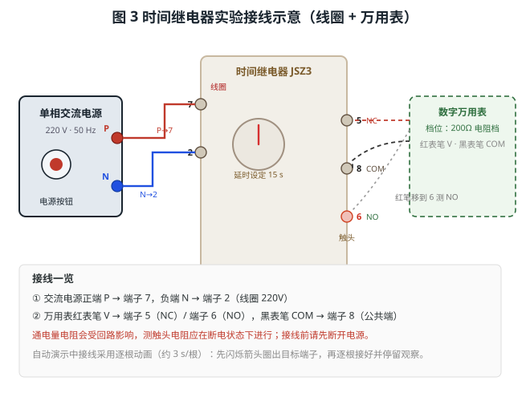
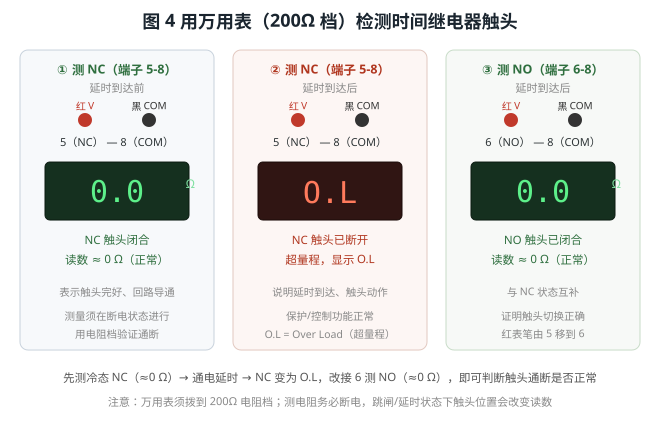

# 时间继电器的测试

> 适用对象：**JSZ3 通电延时型**与 **JSZ3N 断电延时型**时间继电器（延时 0~30 s 可调）
> 本实验围绕"时间继电器能否按设定时间动作、触头通断是否正确"展开，配套本工程三个自动演示流程，本文操作均可在软件中逐一演示：
> ① 通电延时继电器（JSZ3）延时操作　② 用万用表检测时间继电器触头　③ 断电延时继电器（JSZ3N）功能测试

**实验目的**

1. 认识时间继电器的组成部件与端子排列；
2. 理解通电延时与断电延时两种工作方式的动作时序与区别；
3. 掌握时间继电器延时的测试方法与操作步骤；
4. 学会用万用表 200Ω 电阻档检测常闭/常开触头的好坏；
5. 掌握通过参数设置界面精确设定延时时间的方法。

---

## 一、概述

时间继电器是一种**在接收到输入信号（线圈得电或失电）后，经过预设延时时间才使触头动作**的自动控制电器。它不直接通断主电路，而是用延时触头控制接触器、电磁阀等，实现**按时间顺序**的自动控制，广泛用于电动机星三角（Y-△）启动、设备顺序启停、风机延时停机等场合。

按延时的"时机"不同分为两类（见图 2）：

- **通电延时型（JSZ3）**：线圈**得电后延时**触头动作，线圈**失电立即复位**；
- **断电延时型（JSZ3N）**：线圈**得电瞬时动作**，线圈**失电后延时**复位。

---

## 二、结构与端子

面板左侧为**延时刻度盘**（0~30 s 可调），右侧为一圈 **8 个接线端子**，并有"电源/计时"与"输出 OUTPUT"两只指示灯，见图 1。

| 端子 | 用途 | 端子 | 用途 |
|------|------|------|------|
| **2、7** | 线圈（接控制电源） | **1、8** | 两组触头的公共端 |
| **1-3、6-8** | 常开触头 NO | **1-4、5-8** | 常闭触头 NC |

> 要点：**2、7 是线圈**，接上电源继电器才工作（线圈 220 V~）；触头成对使用，**公共端 1 或 8** 分别是两组触头的公共端。JSZ3N 端子定义与 JSZ3 完全相同，区别只在动作时序。

---

## 三、通电延时测试（流程①）

时间继电器的动作时刻由工作方式决定，通电延时型 JSZ3 的时序见图 2：线圈**得电后开始计时**，延时 t 到达才使触头动作；线圈**失电立即复位**。

以 JSZ3 为例，接线见图 3：交流电源**正端 P→端子 7、负端 N→端子 2**（线圈）。

**测试步骤：**

1. **接线**：接通前先确认电源处于断开状态，按上图接好 2/7 两根线圈线。
2. **通电计时**：按下电源面板上的「电源」按钮，线圈得电，面板"电源"指示灯**闪烁**、状态显示"延时中"。
3. **延时到达**：经过设定时间后，**OUTPUT 指示灯由闪烁转为常亮**，触头动作——常开（NO）闭合、常闭（NC）断开，状态显示"输出"。
4. **断电复位**：再次按下电源按钮断开电源，触头**立即复位**（NC 闭合、NO 断开），回到"待机"。
5. **改延时重演**：右键继电器 →「参数设置」，把「延时时间 (s)」由 15 s 改为 **5 s**，保存后重新通电，观察延时明显变短。

---

## 四、用万用表检测触头（流程②）

用数字万用表 **200Ω 电阻档**，先测冷态常闭触头，再在延时到达后观察触头状态变化，见图 4。

| 步骤 | 表笔接法 | 正常读数 | 说明 |
|------|---------|---------|------|
| 1 | 红→**5（NC）**，黑→**8（COM）** | 约 **0 Ω** | 未动作时 NC 常闭触头应闭合 |
| 2 | 接通电源延时到达后，仍测 **5-8** | 显示 **O.L** | NC 已断开，读数超量程 |
| 3 | 把红表笔移到 **6（NO）**，黑仍接 8 | 约 **0 Ω** | NO 已闭合，与 NC 状态互补 |

> 若延时前测 5-8 即为 O.L，说明常闭触头损坏；若 2 号端子未接到线圈，继电器根本不会动作。测电阻务必**断电**进行。

---

## 五、断电延时测试（流程③）

JSZ3N 端子与 JSZ3 相同，区别在动作时序。勾选工具栏**「断电延时」**复选框后，画面显示 JSZ3N 并自动隐藏 JSZ3。

1. **接线通电**：按 P→7、N→2 接好线圈并按下电源按钮，继电器**瞬时输出**，触头立即切换至 NO 位置（不延时）。
2. **断电延时**：再次按电源按钮断电，面板显示"**断电延时中**"、输出灯闪烁，触头**保持**在 NO 位置。
3. **延时结束复位**：经过设定时间后触头才回到 NC 位置，状态恢复"待机"，输出灯熄灭。
4. **改延时重演**：在参数设置界面把延时改为 **8 s**，重新通电 2 s 后再断电，观察完整的断电延时过程。

> 切换说明：勾选「断电延时」后，被隐藏元件的连线会一并移除，重新显示时再恢复，避免出现悬空连线。

---

## 六、延时时间的设置

延时时间有两种调整方式：

1. **面板刻度盘旋钮**：点击 / 滚轮旋转粗调，刻度 0~30 s；
2. **参数设置界面**：右键继电器 →「参数设置」，在"延时时间 (s)"输入框中精确设定（0~30 s，步进 0.5 s）。

> 自动演示中凡涉及参数修改（如由 15 s 改为 5 s），都会**调出参数设置界面**，用箭头指向输入框、填入新值，再指向并点击「保存」，完整展示参数调整过程。

---

## 七、常见问题与处理

| 现象 | 可能原因 | 处理方法 |
|------|----------|----------|
| 线圈通电后不计时 | 线圈未接在 2、7 端；电源未接通 | 检查 2/7 接线与电源按钮状态 |
| 延时到达触头不动作 | 延时时间设置过长；触头未接公共端 | 缩短延时；确认公共端 1 或 8 |
| 万用表测电阻始终 O.L | 触头处于断开状态；表笔接错端子 | 断电确认 NC/NO 状态；接对 5/6 与 8 |
| 断电后触头立即复位 | 使用的是通电延时型 JSZ3 | 需断电延时请切换为 JSZ3N |
| 读数不稳定 | 通电状态下测电阻受回路影响 | 断开电源后再测量电阻 |

---

## 八、思考与练习

1. 为什么线圈必须接在 **2、7** 端？误接到触头端会出现什么现象？
2. 通电延时型与断电延时型的触头动作时刻分别发生在何时？画时序图说明。
3. JSZ3 延时设为 5 s，线圈得电 3 s 后即断电，OUTPUT 灯会亮吗？为什么？
4. 用万用表分别测量延时前后 NC（5-8）与 NO（6-8）的电阻，记录数据并说明变化规律。
5. 在电动机 Y-△ 启动中，时间继电器应选通电延时型还是断电延时型？简述其控制过程。

---

*本文档依据本工程仿真平台的三个操作流程编写，与自动演示一一对应，可作为时间继电器结构认知、延时测试与触头检测的实训参考资料。*
