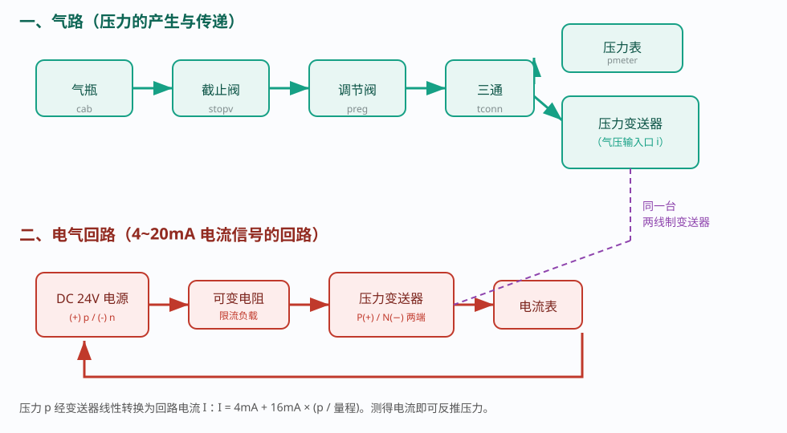
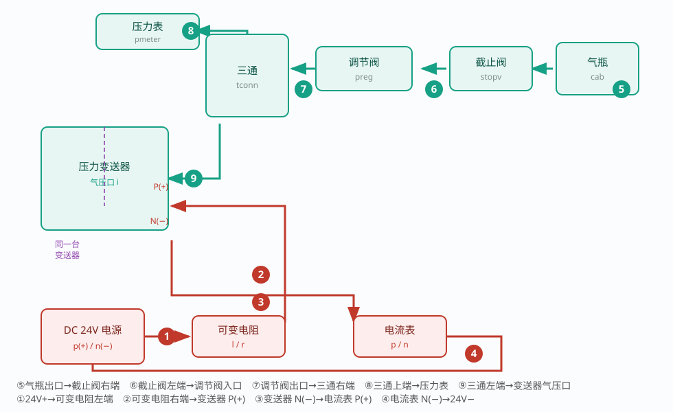
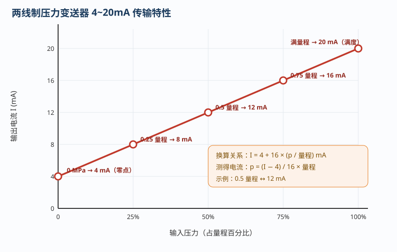
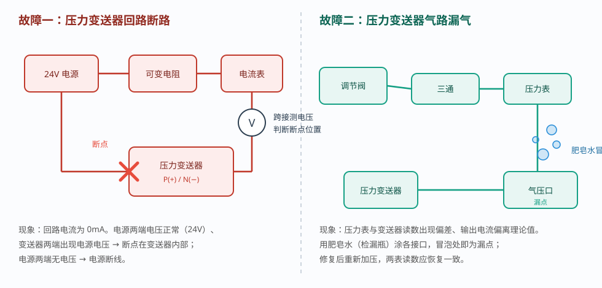

# 压力变送器功能测试

> 适用对象：两线制压力变送器（4~20mA 标准电流信号）
> 配套仿真平台（本工程）含三个自动演示流程，本文所述操作均可在软件中逐一演示：
> ① 压力变送器的功能测试　② 回路断路故障排除　③ 气路漏气故障排除

---

## 一、概述

压力变送器是过程控制中最常用的检测仪表，它把被测**压力**线性转换为**标准电流信号**，送往电流表、显示仪或控制器。工程上普遍采用 **4~20mA 两线制**：供电与信号共用两根导线，4mA 对应量程下限（零点）、20mA 对应量程上限（满度）。

本实验的目标是：**① 认识气路与电气回路 → ② 完成全部接线 → ③ 测出 4/8/12/16/20mA 五个电流点 → ④ 设置并排除回路断路故障 → ⑤ 设置并排除气路漏气故障**。

### 1.1 基本原理

两线制变送器只输出电流，回路电流由变送器内部按压力调节：

```
I = 4mA + 16mA × ( p / 量程 )
```

因此**测出回路电流即可反推压力**：`p = (I − 4) / 16 × 量程`。例如 0.5 倍量程对应 12mA。电流越小（<3.8mA）或越大（>20.5mA）时，变送器 LCD 会显示 `LLLL` / `HHHH` 提示超量程或断线。

### 1.2 安全提示

- 接线、拆装前先**断开 24V 电源**；本仿真为低压直流，但仍应养成先断电、后操作的习惯；
- 气路加压前确认各接口已接牢，避免高压气体冲出；
- 检修时先**泄压、关气源**，再拆检漏点。

---

## 二、系统组成



系统由**气路**和**电气回路**两部分组成，两者通过**同一台两线制变送器**联系。

### 2.1 气路（产生并传递压力）

气瓶（`cab`）提供气源 → 截止阀（`stopv`）通断气源 → 调节阀（`preg`）设定送入压力 → 三通（`tconn`）分为两路 → 压力表（`pmeter`）就地显示、压力变送器（`ptrans`）取样测量。

> 要点：调节阀输出 = min(气瓶压力, 设定压力)。截止阀关闭时无气压，变送器输出 4mA。

### 2.2 电气回路（4~20mA 电流回路）

DC 24V 电源（`dcpower`）正端 → 可变电阻（`varires`，限流负载）→ 变送器 **P(+)** → 变送器 **N(−)** → 电流表（`ampmeter`）→ 电源负端。

> 要点：变送器串在回路中，电流表串联测电流；回路断路则电流为 0。

---

## 三、接线



| 序号 | 接线内容 | 类型 |
|------|---------|------|
| ① | 24V 电源 (+) → 可变电阻左端 | 电气 |
| ② | 可变电阻右端 → 变送器 P(+) | 电气 |
| ③ | 变送器 N(−) → 电流表 P(+) | 电气 |
| ④ | 电流表 N(−) → 24V 电源 (−) | 电气 |
| ⑤ | 气瓶出口 → 截止阀右端 | 气路 |
| ⑥ | 截止阀左端 → 调节阀入口 | 气路 |
| ⑦ | 调节阀出口 → 三通右端 | 气路 |
| ⑧ | 三通上端 → 压力表进气口 | 气路 |
| ⑨ | 三通左端 → 变送器气压口 | 气路 |

> 也可点击工具栏【自动接线】一键完成全部 9 根连线。演示时每接一根线前，都会先用箭头圈出对应端口，再逐根动画接线。

---

## 四、压力变送器的功能测试（流程 1）



流程步骤：

1. 识别压力变送器、调节阀等关键元件；
2. 接好电气回路（①②③④）与气路（⑤⑥⑦⑧⑨）；
3. 按下【电源键】接通 DC 24V；
4. 合上截止阀送气，输入气压为 0 时电流应为 **4mA**；
5. 通过**参数设置界面**把调节阀设定压力依次改为 **0.25 / 0.5 / 0.75 / 1.0 倍量程**，观察电流依次为 **8 / 12 / 16 / 20mA**；
6. 完成电流与压力关系的知识考核。

> 说明：设定压力在“右键 → 参数设置”对话框中修改，演示会完整展示“弹出对话框 → 改参数 → 点击保存”的过程。工具栏【5点步进】可快速在 0.25/0.5/0.75/1.0/0 五点上切换。

---

## 五、回路断路故障排除（流程 2）



**故障现象**：回路断路后电流表指示 0mA，变送器无输出。

**排查步骤**：

1. 接好气路、电路，在【故障设置】中勾选“压力变送器回路断路”并应用（电源断线或变送器内部断线，随机产生）；
2. 合上电源和截止阀，确认电流表为 0mA；
3. 关闭气源，通过【选择仪表】调出数字万用表，置于 **DC 200V** 档；
4. 先测**电源两端**电压：有 24V 说明电源正常，断点在别处；把红、黑表笔移到**变送器 P(+)/N(−)** 两端，若测得接近电源电压，则断点在**变送器内部**；
5. 关闭电源，在【故障设置】中取消勾选并应用以修复故障；
6. 重新接通电源，确认电流恢复为 4mA。

> 注意：判断断点用**电压档**，不可带电用电阻档测量。

---

## 六、气路漏气故障排除（流程 3）

**故障现象**：气路漏气使压力沿程损失，**压力表与变送器读数不一致**，输出电流偏离理论值。

**排查步骤**：

1. 接好气路、电路，在【故障设置】中勾选“压力变送器气路漏气”并应用（变送器接口或压力表接口漏气，随机产生）；
2. 合上电源和截止阀，未加压时电流约 4mA；
3. 把调节阀设定压力调到 **0.5 倍量程**，观察两表读数出现偏差；
4. 用**检漏瓶（肥皂水）**瓶口依次靠近各接口，**冒泡处即为漏点**；
5. 关闭电源和气源；
6. 在【故障设置】中取消勾选并应用，修复漏点；
7. 重新合上电源与气源，确认压力表与变送器读数接近相等、电流恢复约 12mA。

---

## 七、常见现象与处理

| 现象 | 可能原因 | 处理方法 |
|------|---------|---------|
| 电流始终为 0mA | 回路断路（电源或变送器断线） | 用万用表 DC 电压档逐段测量，定位并修复断点 |
| 电流始终为 4mA 不变 | 未送气/截止阀未开；调节阀设定为 0 | 合上截止阀；在参数界面增大设定压力 |
| 电流与实际压力不符 | 气路漏气导致取压偏低 | 用肥皂水检漏，修复后重新加压核对 |
| 变送器显示 `LLLL` | 输入低于量程下限/断线 | 检查气路与回路接线 |
| 变送器显示 `HHHH` | 输入超量程 | 减小调节阀设定压力 |
| 压力表与变送器读数不同 | 气路漏气或仪表未校准 | 检漏修复；必要时重新校准 |

---

## 八、三个流程速查

| 流程 | 内容 | 关键操作 |
|------|------|---------|
| **① 功能测试** | 接线后测 4~20mA | 接线 → 通电源 → 合阀（4mA）→ 改设定压力 0.25/0.5/0.75/1.0（8/12/16/20mA） |
| **② 回路断路** | 判断并排除断路 | 设故障 → 电流 0 → 万用表测电压定点 → 断电修复 → 恢复 4mA |
| **③ 气路漏气** | 判断并排除漏气 | 设故障 → 加压 0.5 量程 → 肥皂水检漏 → 关气修复 → 两表读数一致 |

---

## 九、思考与练习

1. 两线制变送器为什么用 4mA 而不是 0mA 作为零点？
2. 若量程为 0~1MPa，测得回路电流为 16mA，输入压力是多少？
3. 回路断路时，为什么在变送器两端能测到接近电源的电压？
4. 气路漏气为什么会使电流表读数与理论值不符？漏点靠近变送器与靠近压力表，现象有何不同？
5. 若上限改为 0~2MPa，0.5MPa 对应的输出电流是多少？

---

*本文档依据本工程仿真平台的三个操作流程编写，与自动演示一一对应，可作为压力变送器接线、功能测试与故障排除的实训参考资料。*
