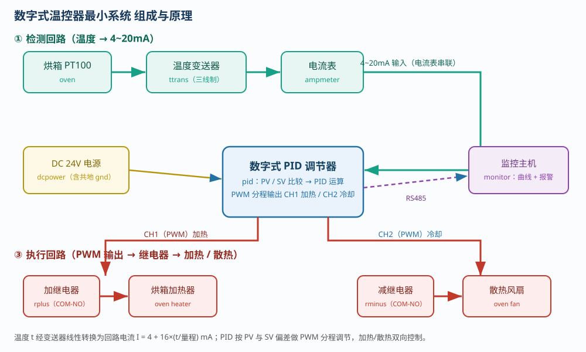
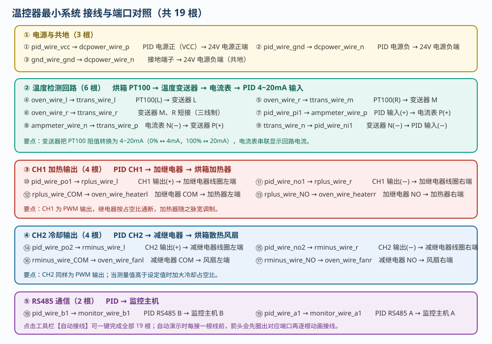
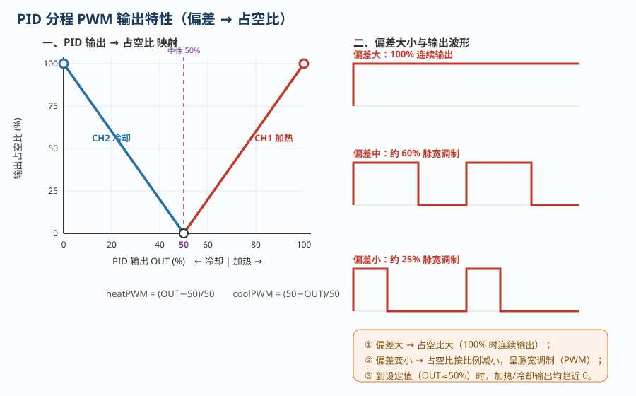

# 温控器最小系统功能测试

> 适用对象：数字式温控仪表（PID 调节器）＋两线制温度变送器（PT100，4~20mA）
> 配套仿真平台（本工程）含三个自动演示流程，本文所述操作均可在软件中逐一演示：
> ① 数字式温控器最小系统运行　② 温控系统阶跃响应　③ 温控系统输入回路断线故障响应

---

## 一、概述

数字式温控器最小系统是过程控制中最典型的**闭环控制系统**：由温度变送器检测被控温度，PID 调节器将测量值 PV 与设定值 SV 比较后按控制规律输出，经继电器控制**加热器**或**散热风扇**，从而把烘箱温度稳定在设定值。

本实验的目标是：**① 认识检测回路与执行回路 → ② 完成全部接线 → ③ 起动系统并投入自动 → ④ 做设定值阶跃、观察加/减继电器动作 → ⑤ 设置并排除输入回路断线故障**。

### 1.1 基本原理

烘箱内的 **PT100** 阻值随温度变化，温度变送器把它线性转换成 **4~20mA** 标准电流：

```
R = 100 + 0.3851 × t(℃)          I = 4mA + 16mA × (t / 量程)
```

PID 输入为 4~20mA（对应测量值 PV）。本系统中 PID 工作于 **PWM（脉宽调制）分程控制**：

```
加热占空比 heatPWM = (OUT − 50%) / 50%      冷却占空比 coolPWM = (50% − OUT) / 50%
```

即 OUT=100% 时加热连续 100% 输出；偏差变小、OUT 向 50% 靠近时，占空比按比例减小，输出为**脉宽调制**的方波；OUT=50% 时加热、冷却均停止。

### 1.2 安全提示

- 接线、插拔前先**断开 24V 电源**，养成先断电、后操作的习惯；
- 烘箱高温，停机后待温度下降再触碰；
- 检修前先**切断加热主回路**，确认加热器已停止工作。

---

## 二、系统组成



系统由**检测回路**、**执行回路**和**监控**三部分组成，以 PID 调节器为核心。

### 2.1 检测回路（温度 → 4~20mA）

烘箱 PT100（`oven`，三线制 l/m/r）→ 温度变送器（`ttrans`）→ 电流表（`ampmeter`）→ PID 4~20mA 输入（`pid` pi1/ni1）。

> 要点：变送器 P(+)/N(−) 为两线制输出端；电流表串联显示回路电流，可据此反推温度。

### 2.2 执行回路（PWM 输出 → 继电器 → 加热/散热）

- 加热支路：PID CH1（po1/no1）→ 加继电器（`rplus`）线圈 → COM-NO 接通 → 烘箱加热器（heater_l/r）；
- 冷却支路：PID CH2（po2/no2）→ 减继电器（`rminus`）线圈 → COM-NO 接通 → 烘箱散热风扇（fan_l/r）。

> 要点：仅当温度偏高（PV>SV）时减继电器才可能吸合；继电器触点把 24V 送到加热器/风扇，占空比越高，平均功率越大。

### 2.3 监控

PID RS485（b1/a1）→ 监控主机（`monitor`）b1/a1。监控主机显示温度趋势曲线与报警：**黄色曲线为 CH1 加热 PWM 波形、蓝色曲线为 CH2 冷却 PWM 波形**。

---

## 三、接线



| 组别 | 根数 | 内容 |
|------|:---:|------|
| ① 电源与共地 | 3 | PID VCC/GND → 24V 电源 p/n；gnd → 电源 n（共地） |
| ② 温度检测 | 6 | PT100 l→ttrans l；oven r→ttrans m/r（短接）；pid pi1→电流表 p；电流表 n→ttrans p；ttrans n→pid ni1 |
| ③ CH1 加热 | 4 | pid po1/no1→加继电器线圈；COM→加热器左；NO→加热器右 |
| ④ CH2 冷却 | 4 | pid po2/no2→减继电器线圈；COM→风扇左；NO→风扇右 |
| ⑤ RS485 | 2 | pid b1/a1 → monitor b1/a1 |

> 也可点击工具栏【自动接线】一键完成全部 19 根。演示时每接一根线前，都会先用箭头圈出**对应端口**，再逐根动画接线。

---

## 四、数字式温控器最小系统运行（流程 1）

1. **识别**烘箱、温度变送器、PID、加减继电器、监控主机、24V 电源与电流表；
2. 按①②③④⑤顺序接好全部 19 根线（或【自动接线】）；
3. 按【电源键】上电，确认 PID 处于**手动 MAN、输出 50% 中位**，并把控制方式设为**分程控制**；
4. 把烘箱**加热器、风扇控制旋钮由“就地”转为“遥控”**；
5. 对监控主机**消音、确认**；
6. 把 PID 切换为**自动 AUTO**，系统自动调节直至 PV 与 SV 偏差小于 10℃。

> 说明：PID 的设定值在“右键 → 参数设置”对话框中修改，演示会完整展示“弹出对话框 → 改参数 → 点击保存”的过程。

---

## 五、温控系统阶跃响应（流程 2）



1. 通过【起动系统】一键接线、上电，使 PID 自动运行、系统稳定；
2. 在参数界面把 **SV 调到 80℃**：温度偏低，OUT 增大 → **加继电器吸合、加热器工作**，温度上升；
3. 在参数界面把 **SV 调到 50℃**：温度偏高，OUT 减小 → **减继电器吸合、散热风扇工作**，温度下降。

> 观察要点：偏差较大时输出为 100% 连续加热；随着温度接近设定值，输出变为**脉宽调制**（黄色/蓝色曲线呈方波），占空比逐渐减小直至温度稳定。

---

## 六、温控系统输入回路断线故障响应（流程 3）

**故障现象**：温度变送器回路断路后回路电流为 0，PID 显示 `LLLL`，误判温度过低而以最大功率加热，最终**系统温度超高**。

**排查步骤**：

1. 起动系统并使之稳定；
2. 在【故障设置】中勾选“温度变送器回路断路”并应用；
3. 观察电流表为 0、PID 显示 `LLLL`；
4. 在监控主机上**消音、确认**报警（“温度变送器输入断路”）；
5. 观察烘箱温度持续升高、超过报警上限；
6. 断开/停止加热，在【故障设置】中取消勾选并应用以**修复故障**；
7. 修复后 PID 测得实际温度超高，**以最大散热功率输出**，系统迅速降温；
8. 完成知识考核。

> 注意：断线属于“低于量程下限”信号，处理时应先**停止加热**再排查，避免温度失控。

---

## 七、常见现象与处理

| 现象 | 可能原因 | 处理方法 |
|------|---------|---------|
| PID 显示 `LLLL`、电流 0mA | 变送器回路断路 | 检查②组接线；在故障界面修复 |
| PID 显示 `HHHH`、电流 >20mA | 变送器接线错误/短路 | 检查 PT100 三线制 l/m/r 接线 |
| 加继电器不吸合 | CH1 未接线；未上电；未转遥控 | 检查③组接线、电源与烘箱旋钮 |
| 继电器频繁通断（脉冲） | 正常 PWM 调节 | 属正常现象，占空比随偏差变化 |
| 温度始终上不去 | 加热器未转遥控/继电器未通 | 检查④熔断、⑤组与烘箱遥控状态 |
| 监控主机报警 | 断线或温度超高 | 消音、确认后按故障流程处理 |

---

## 八、三个流程速查

| 流程 | 内容 | 关键操作 |
|------|------|---------|
| **① 最小系统运行** | 接线并投入自动 | 接线 19 根 → 上电 → PID 手动 50% → 分程 → 烘箱遥控 → 转 AUTO |
| **② 阶跃响应** | 观察加热/散热动作 | 起动系统 → SV=80（加热）→ SV=50（散热） |
| **③ 断线故障** | 判断并排除断线 | 设故障 → 电流 0/`LLLL` → 消音确认 → 超温 → 修复 → 最大冷却降温 |

---

## 九、思考与练习

1. 为什么温度变送器采用 4mA 而不是 0mA 作为零点？断线时 PID 会如何误判？
2. 若量程为 0~100℃，测得回路电流为 12mA，对应温度是多少？
3. PID 的 OUT=75% 时，加热占空比是多少？OUT=25% 时冷却占空比是多少？
4. 为什么偏差较大时输出为 100% 连续，而偏差变小时变为脉宽调制？
5. 若把设定值从 80℃ 直接改为 50℃，先动作的是加继电器还是减继电器？为什么？

---

*本文档依据本工程仿真平台的三个操作流程编写，与自动演示一一对应，可作为数字式温控器接线、参数整定与故障排除的实训参考资料。*
