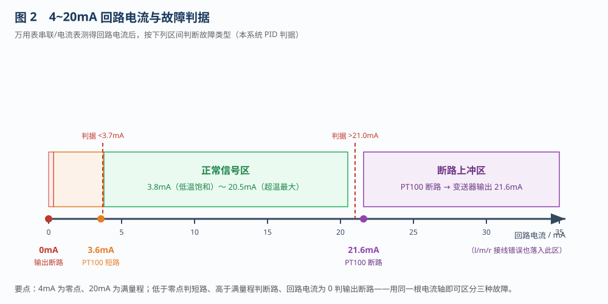
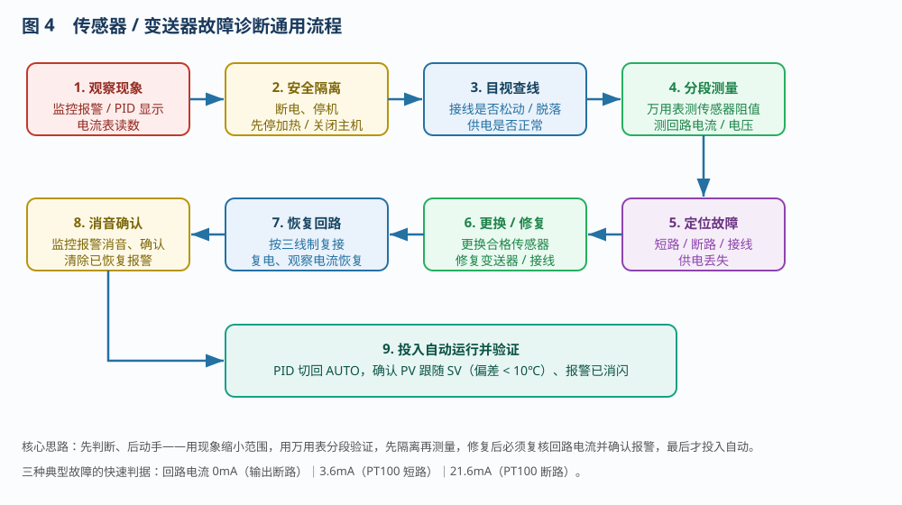
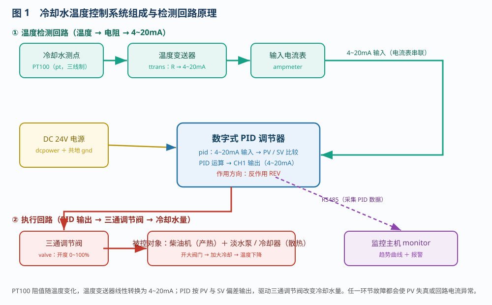
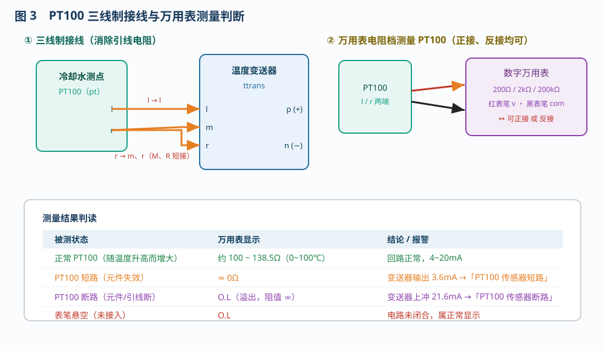

# 常用传感器的故障诊断

> 适用对象：大管轮专业 · 项目 6.1　常用传感器的故障诊断
> 配套仿真平台含四条自动演示流程，本文重点讲解**流程 2 / 3 / 4**（PT100 短路、PT100 断路、温度变送器输出断路），并归纳**传感器、变送器故障诊断与排除的一般方法**。
> 四条流程：① 冷却水温度控制系统运行　② PT100 短路故障排除　③ PT100 断路故障排除　④ 温度变送器输出断路故障排除。

---

## 一、概述

在船舶与工业过程控制中，**温度、压力、流量、液位**等被测量大多先由**传感器**转换为电参量（电阻、电压），再由**变送器**转换成统一的 **4~20mA 标准电流信号**，送往调节器（PID）或监控系统。因此，"传感器 + 变送器"这条**检测回路**一旦故障，调节器拿到的就是错误信息，轻则控制品质变差，重则引起设备损坏（例如温度测点故障导致冷却失控）。

本工程以**柴油机冷却水温度控制系统**为对象：PT100 测冷却水温度 → 温度变送器输出 4~20mA → PID 调节器 → 三通调节阀改变冷却水量 → 稳定冷却水温度。系统为**反作用式（REV）**：温度偏高时开大阀门、加大冷却。

本实验的目标是掌握一套通用的诊断思路：**看现象 → 断电源 → 分段测 → 定故障 → 换元件 → 复核 → 投自动**，并能在软件中完整复现 PT100 短路、PT100 断路与变送器输出断路三种故障的判断与排除过程。

---

## 二、传感器 / 变送器故障诊断的一般方法

### 2.1 先读懂 4~20mA 这根"信号轴"

标准 4~20mA 信号是有"语言"的：**4mA 对应量程下限（零点）、20mA 对应量程上限（满量程）**。围绕这根轴，故障会表现为几段特殊电流：

| 回路电流 | 含义 |
|---------|------|
| 0mA（≈0） | 回路**断路**：变送器输出断线、供电引脚悬空 |
| 3.6mA | 传感器**短路**（阻值 0），输出跌到零点以下 |
| 3.8 ~ 20.5mA | **正常信号区**（本系统低温饱和 ~ 超温最大） |
| 21.6mA | 传感器**断路**（阻值 ∞），变送器输出上冲超出满量程 |

本系统 PID 的判据为：**低于 3.7mA 判短路、高于 21.0mA 判断路、回路电流近乎为 0 判输出断路**。这样，用同一根电流轴就能区分三种故障。

### 2.2 通用诊断步骤（先判断、后动手）

1. **观察现象**：监控主机报警、PID 的 PV 显示（`LLLL` / `HHHH` / 正常）、输入电流表读数，先缩小范围；
2. **安全隔离**：断开 24V 电源、停止加热/主机，严禁带电拆接线；
3. **目视查线**：检查接线端子是否松动、脱落，供电是否正常；
4. **分段测量**：用万用表**测传感器阻值**、**测回路电流/电压**，把"传感器—变送器—回路"逐段分开验证；
5. **定位故障**：判断是短路、断路、接线错误还是供电丢失；
6. **更换/修复**：更换合格的传感器，或修复变送器、接线；
7. **恢复回路**：按三线制复接，复电并观察回路电流恢复正常；
8. **消音确认**：对已恢复的报警消音、确认，清除画面残留报警；
9. **投入自动并验证**：PID 切回 AUTO，确认 PV 跟随 SV（偏差小于 10℃）、报警已消闪。

### 2.3 常见传感器故障类型

- **短路**：元件内部或引线短接，阻值趋于 0；
- **断路**：元件或引线断开，阻值趋于无穷；
- **零点漂移 / 量程偏差**：变送器标定漂移，指示整体偏置或斜率变化（可用标准电阻校验）；
- **接线错误**：三线制未按规定短接、极性接反；
- **供电丢失**：变送器电源引脚悬空——**只要 P、N 任一脚悬空，变送器即不显示、不工作**。

### 2.4 三段分区诊断法

把检测回路分成三段，逐段用万用表验证，是现场最实用的方法：

| 分区 | 测量对象 | 工具与档位 | 正常判据 |
|------|---------|-----------|---------|
| 传感器侧 | PT100 两端/三端电阻 | 万用表 200Ω / 200kΩ 档 | 约 100~138.5Ω（0~100℃） |
| 变送器侧 | 变送器 P、N 供电电压 | 万用表 直流 200V 档 | 约 24V |
| 回路侧 | 4~20mA 回路电流 | 电流表 / 万用表 mA 档 | 随温度在 4~20mA 之间 |

诊断时"从现象出发、向源头倒推"：先看电流表落在哪一段（0 / 偏低 / 正常 / 偏高），再决定去测传感器还是测供电，避免盲目拆线。

> 注意：两线制变送器 **P、N 电源引脚只要有一脚悬空，变送器就不显示、不工作**，此时回路电流为 0，容易被误判为"元件损坏"。因此"测电压确认供电、测电流确认回路"两步缺一不可。

---

## 三、系统组成与检测回路

检测回路为：**PT100（`pt`）→ 温度变送器（`ttrans`）→ 输入电流表（`ampmeter`）→ PID 输入（pi1/ni1）**；控制回路为 **PID 输出（po1/no1）→ 三通调节阀（`valve`）→ 冷却水量**；RS485 把 PID 数据送到监控主机产生趋势曲线与报警。PT100 采用**三线制**（l / m / r），在变送器端 **M、R 短接**，以消除引线电阻的影响。

> 用万用表电阻档测量 PT100 时，**红（v）、黑（com）表笔正接、反接均可**；正常约 100~138.5Ω，短路约 0Ω，断路显示 `O.L`，表笔悬空也显示 `O.L`。

---

## 四、流程 2：PT100 短路故障排除

**故障现象**：PT100 内部短路（阻值降为 0），变送器输出跌到 **3.6mA**（低于 4mA 零点）；PID 判为欠量程，监控主机报**「PT100 传感器短路」**。

**操作与排查（共 11 步）**：

1. 识别 PT100、温度变送器、PID、三通调节阀与监控主机；
2. 一键接好线路并启动系统，使 PID 自动、PV 与 SV 偏差小于 10℃；
3. 在【故障设置】中勾选**「PT100 传感器短路」**并应用（该步骤会停留约 3s，等待报警触发）；
4. 查看监控报警，**消音、确认**；
5. PID 切到**手动 MAN**，阀位控制在 60~70%；
6. **断开温度变送器电源与 PT100 接线**，准备用万用表检测；
7. 万用表置 **200Ω 档**测量 PT100，读数约为 **0Ω**，确认短路；
8. 在【故障设置】中取消勾选并应用（相当于**更换 PT100**），万用表读数恢复到约 100Ω 以上；
9. 移开表笔、万用表置 OFF，**按三线制复接 PT100 并恢复 PID 输入回路**，回路电流恢复大于 4mA，对已恢复的报警消音、确认；
10. 系统切回 **AUTO**，确认偏差小于 10℃、报警已消闪；
11. 完成知识考核。

> 判据要点：**电流低于 3.7mA（本故障为 3.6mA）即判短路**。更换后必须用万用表复核阻值、再复查回路电流，方可投入自动。

---

## 五、流程 3：PT100 断路故障排除

**故障现象**：PT100 元件或引线断路（阻值趋于无穷），变送器输出**上冲至 21.6mA**（高于超温最大输出 20.5mA）；PID 判为超量程，监控主机报**「PT100 传感器断路」**，并**抑制温度过高（HH）报警**，避免与真实超温混淆。

**操作与排查（共 11 步）**：

1. 识别主要部件；
2. 一键启动系统并稳定；
3. 在【故障设置】中勾选**「PT100 传感器断路」**并应用；
4. 查看监控报警，**消音、确认**；
5. PID 切**手动 MAN**，阀位 60~70%；
6. **断开变送器电源与 PT100 接线**；
7. 万用表置 **200kΩ 档**测 PT100，显示 **`O.L`（溢出）**，确认断路；
8. 取消故障并应用（更换 PT100），把万用表转到 **200Ω 档**，读数恢复到约 100Ω 以上；
9. 移开表笔、复接 PT100 与输入回路，电流恢复大于 4mA，消音、确认；
10. 切回 **AUTO** 并确认稳定；
11. 完成知识考核。

> 判据要点：**电流高于 21.0mA（本故障为 21.6mA）即判断路**。断路时若同时报"温度过高"会误导判断，因此系统按"电流超量程"优先判为传感器断路并抑制 HH。

---

## 六、流程 4：温度变送器输出断路故障排除

**故障现象**：变送器供电正常（约 24V），但**输出回路断路**，回路电流为 **0mA**；PID 判为输入开路，监控主机报**「温度变送器输出断路」**。两线制变送器靠回路电流工作，电流为 0 时 PV 失效，PID 会误判温度偏低而加大输出。

**操作与排查（共 11 步）**：

1. 识别温度变送器、电流表、PID 与数字万用表；
2. 一键启动系统并稳定；
3. 在【故障设置】中勾选**「温度变送器输出断路」**并应用；
4. 查看监控报警，**消音、确认**；
5. PID 切**手动 MAN**，阀位 60~70%；
6. 万用表置**直流 200V 档**测变送器电压，约 **24V**，说明**供电正常**（据此排除电源故障）；
7. 观察**输入回路电流表为 0mA**，确认输出回路断路；
8. 断开变送器输出接线，在【故障设置】中取消勾选并应用，**修复断路故障**；
9. 接通变送器电源与信号回路，**电流表恢复大于 4mA**；
10. 系统切回 **AUTO** 并确认稳定；
11. 完成知识考核。

> 判据要点：**回路电流近乎为 0 即判输出断路**。诊断时先"测电压"确认供电、再"看电流"锁定断路，两步即可把"电源故障"与"输出回路故障"区分开。

---

## 七、三种故障对比与快速判据

| 故障 | 传感器阻值 | 回路电流 | 监控报警 | 处理 |
|------|-----------|---------|---------|------|
| PT100 短路 | ≈0Ω | 3.6mA（<3.7） | PT100 传感器短路 | 更换 PT100，复接三线制 |
| PT100 断路 | ∞（O.L） | 21.6mA（>21.0） | PT100 传感器断路（抑制 HH） | 更换 PT100，复接三线制 |
| 变送器输出断路 | 正常 | 0mA | 温度变送器输出断路 | 检查/恢复 4~20mA 回路，或更换变送器 |

> 记忆口诀：**"零断、低短、高断"**——回路电流为 0 是输出断路，低于零点（3.6mA）是传感器短路，高于满量程（21.6mA）是传感器断路。

---

## 八、通用排除方法要点

1. **先断电源、后操作**，严禁带电拆接线；
2. **先测传感器、再测回路**：用万用表电阻档直接判断传感器好坏，是最快的定位手段；
3. **四线制/三线制要规范**：三线制必须把 M、R 短接，否则会引入引线电阻误差；
4. **换件后要复核**：更换传感器后应重新测量阻值、复查回路电流（4~20mA），确认无误再投自动；
5. **报警要闭环**：故障恢复后对监控报警**消音、确认**，避免残留报警影响判断；
6. **区分"真超温"与"测点故障"**：测点断路（电流上冲）与真实温度过高都可能使 PV 偏高，本系统按电流是否超量程来区分。

---

## 九、思考与练习

1. 为什么标准信号用 **4mA** 而不是 0mA 作零点？这样能区分哪些故障？
2. 若量程为 0~100℃，测得回路电流为 12mA，对应温度是多少？
3. PT100 短路、断路时变送器输出分别约为多少 mA？PID 会分别如何误判？
4. 变送器供电电压正常但回路电流为 0，故障在供电侧还是输出回路？如何用万用表两步确认？
5. 为什么表笔悬空时万用表在欧姆/二极管档应显示 `O.L` 而不是 0？

---

*本文档依据本工程仿真平台的操作流程 2 / 3 / 4 编写，与自动演示一一对应，可作为常用传感器、变送器故障诊断与排除的实训参考资料。*
